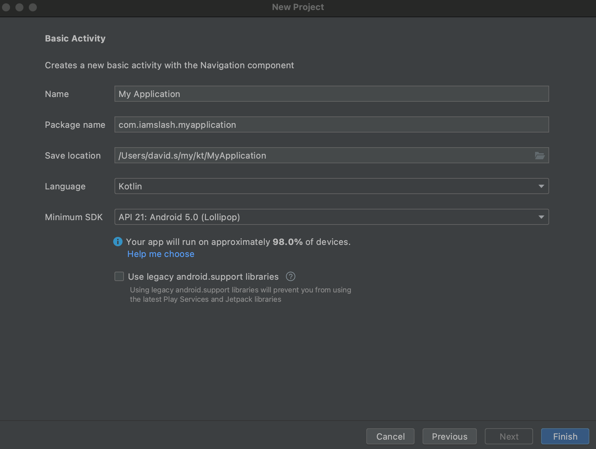
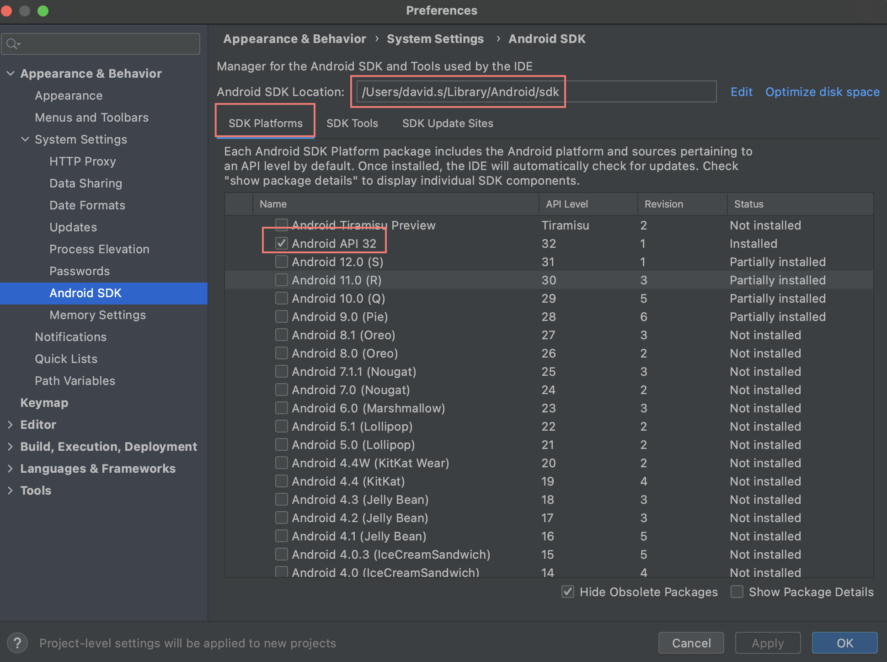
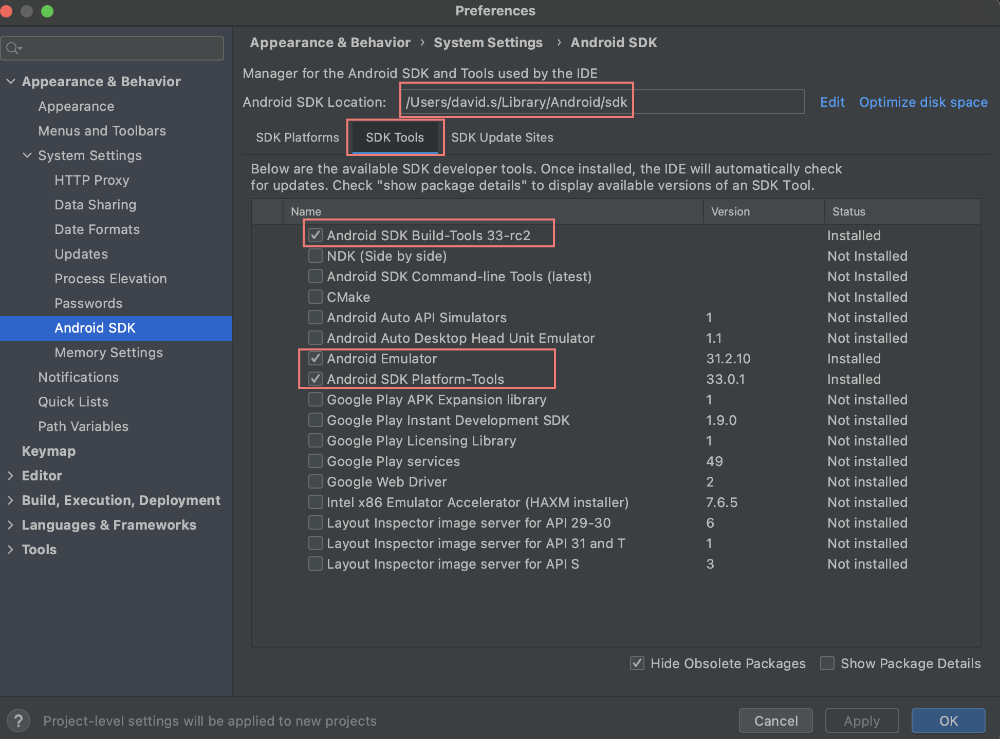
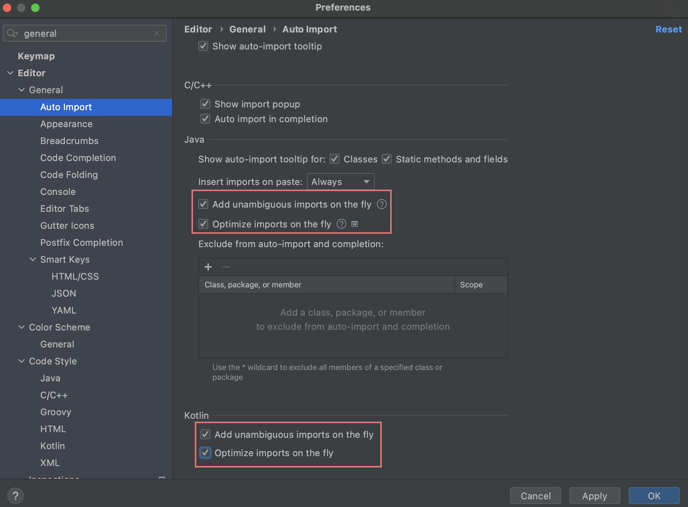
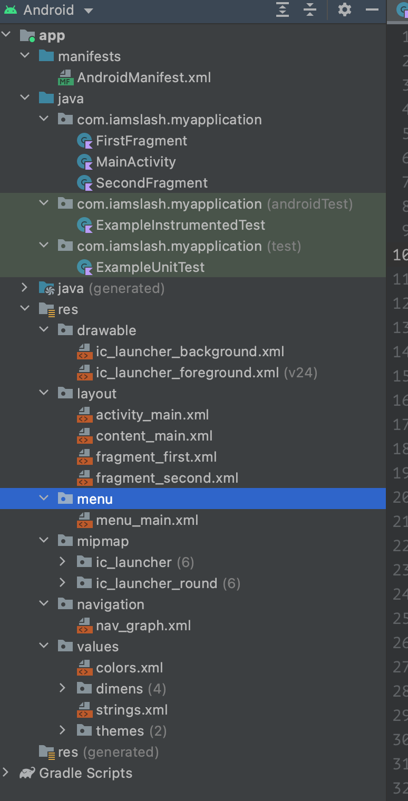

# Create Project



# SDK Manager

SDK Manager 를 띄운다. 

`SDK Platforms` 에서 Android SDK 최신버전이 설치되어 있는지 확인한다.



`SDK Tools` 에서 필요한 Tools 가 설치되어 있는지 확인한다. 



다음은 필수로
설치해야하는 Tools 이다.

| Tool | Description |
|--|--|
| Android SDK Build-Tools 32-rc1 | Tools for building application |
| Android Emulator | Tools for running application |
| Android SDK Platform Tools | adb, fastboot, systrace. etc... |
| Android Emulator Hypervisor Driver for AMD Processors | Hypervisor Driver for AMD |
| Intel x86 Emulator Accelerator (HAXM intaller) | Intel Emulator Accelerator |

# Settings...

`CMD ,` 를 선택하고 `Editor/General/Auto import` 를 연다. Class 를 입력하면
필요한 import statement 를 자동으로 입력해 주도록 설정한다.



# Build and Run

Emulator 로 실행한다. Mac Book 에서 Emulator 는 너무 느리다.

Android 11 부터 Wifi Direct 가 된다고 하지만 잘 안된다.

USB Debugging 이 제일 잘 된다.

# Files



```
$ tree . -L 3
├── app
│   ├── build
│   │   ├── generated
│   │   ├── intermediates
│   │   ├── kotlin
│   │   ├── outputs
│   │   └── tmp
│   ├── build.gradle
│   ├── libs
│   ├── proguard-rules.pro
│   └── src
│       ├── androidTest
│       ├── main
│       └── test
├── build
│   └── kotlin
│       └── sessions
├── build.gradle
├── gradle
│   └── wrapper
│       ├── gradle-wrapper.jar
│       └── gradle-wrapper.properties
├── gradle.properties
├── gradlew
├── gradlew.bat
├── local.properties
└── settings.gradle

$ tree app/src/main
app/src/main
├── AndroidManifest.xml
├── java
│   └── com
│       └── iamslash
│           └── myapplication
│               ├── FirstFragment.kt
│               ├── MainActivity.kt
│               └── SecondFragment.kt
└── res
    ├── drawable
    │   └── ic_launcher_background.xml
    ├── drawable-v24
    │   └── ic_launcher_foreground.xml
    ├── layout
    │   ├── activity_main.xml
    │   ├── content_main.xml
    │   ├── fragment_first.xml
    │   └── fragment_second.xml
    ├── menu
    │   └── menu_main.xml
    ├── mipmap-anydpi-v26
    │   ├── ic_launcher.xml
    │   └── ic_launcher_round.xml
    ├── mipmap-hdpi
    │   ├── ic_launcher.webp
    │   └── ic_launcher_round.webp
    ├── mipmap-mdpi
    │   ├── ic_launcher.webp
    │   └── ic_launcher_round.webp
    ├── mipmap-xhdpi
    │   ├── ic_launcher.webp
    │   └── ic_launcher_round.webp
    ├── mipmap-xxhdpi
    │   ├── ic_launcher.webp
    │   └── ic_launcher_round.webp
    ├── mipmap-xxxhdpi
    │   ├── ic_launcher.webp
    │   └── ic_launcher_round.webp
    ├── navigation
    │   └── nav_graph.xml
    ├── values
    │   ├── colors.xml
    │   ├── dimens.xml
    │   ├── strings.xml
    │   └── themes.xml
    ├── values-land
    │   └── dimens.xml
    ├── values-night
    │   └── themes.xml
    ├── values-w1240dp
    │   └── dimens.xml
    └── values-w600dp
        └── dimens.xml
```

다음은 주요 파일들이다. `app` 디렉토리는 app module 을 의미한다.

| File | Description |
|--|--|
| `app/src/main/AndroidManifest.xml` | Android Manifest File |
| `app/src/main/java` | Kotlin files |
| `app/src/main/res` | Resource files |
| `res/layout/main_activity.xml` | MainActivity UI XML |

# AndroidManifest.xml Dive Deep

```xml
<?xml version="1.0" encoding="utf-8"?>
<manifest xmlns:android="http://schemas.android.com/apk/res/android"
    package="com.iamslash.myapplication">

    <application
        android:allowBackup="true"
        android:icon="@mipmap/ic_launcher"
        android:label="@string/app_name"
        android:roundIcon="@mipmap/ic_launcher_round"
        android:supportsRtl="true"
        android:theme="@style/Theme.MyApplication">
        <activity
            android:name=".MainActivity"
            android:exported="true"
            android:label="@string/app_name"
            android:theme="@style/Theme.MyApplication.NoActionBar">
            <intent-filter>
                <action android:name="android.intent.action.MAIN" />

                <category android:name="android.intent.category.LAUNCHER" />
            </intent-filter>
        </activity>
    </application>

</manifest>
```

# build.gradle Dive Deep

```kotlin
plugins {
    id 'com.android.application'
    id 'org.jetbrains.kotlin.android'
}

android {
    compileSdk 32

    defaultConfig {
        applicationId "com.iamslash.myapplication"
        minSdk 21
        targetSdk 32
        versionCode 1
        versionName "1.0"

        testInstrumentationRunner "androidx.test.runner.AndroidJUnitRunner"
    }

    buildTypes {
        release {
            minifyEnabled false
            proguardFiles getDefaultProguardFile('proguard-android-optimize.txt'), 'proguard-rules.pro'
        }
    }
    compileOptions {
        sourceCompatibility JavaVersion.VERSION_1_8
        targetCompatibility JavaVersion.VERSION_1_8
    }
    kotlinOptions {
        jvmTarget = '1.8'
    }
    buildFeatures {
        viewBinding true
    }
}

dependencies {

    implementation 'androidx.core:core-ktx:1.7.0'
    implementation 'androidx.appcompat:appcompat:1.3.0'
    implementation 'com.google.android.material:material:1.4.0'
    implementation 'androidx.constraintlayout:constraintlayout:2.0.4'
    implementation 'androidx.navigation:navigation-fragment-ktx:2.3.5'
    implementation 'androidx.navigation:navigation-ui-ktx:2.3.5'
    testImplementation 'junit:junit:4.13.2'
    androidTestImplementation 'androidx.test.ext:junit:1.1.3'
    androidTestImplementation 'androidx.test.espresso:espresso-core:3.4.0'
}
```
