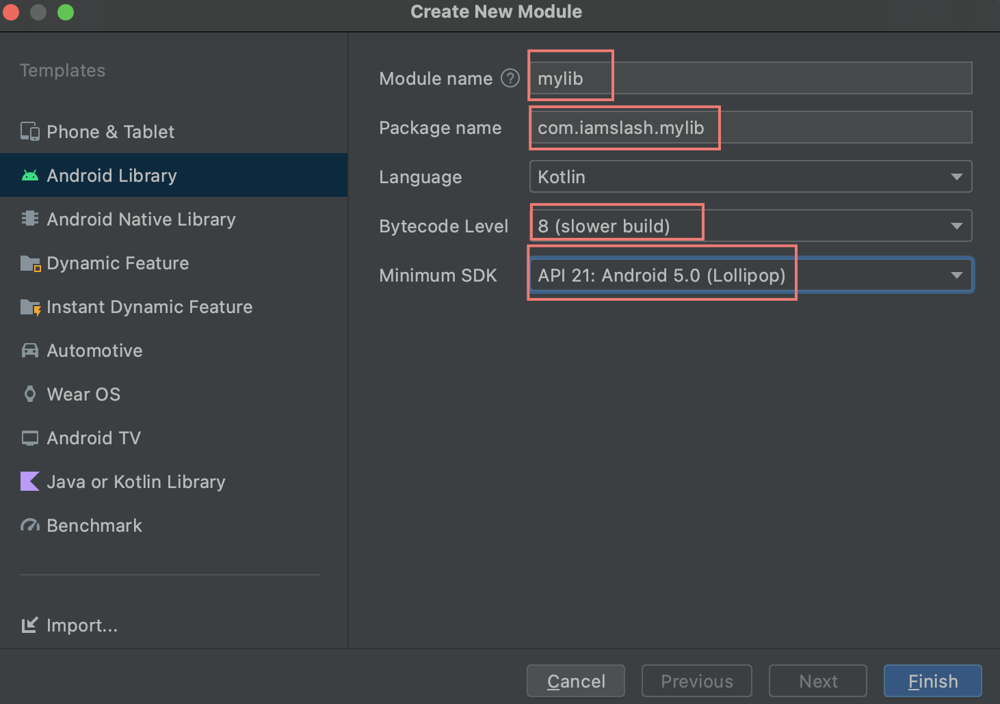

# Abstract

Android Library 를 배포하는 방법은 다음과 같이 3 가지가 있다.

* Local Module
* Local Binary
* Remote Binary

# Materials

* [안드로이드 내가 만든 라이브러리 배포하는법1(로컬)](https://dog-footprint.tistory.com/4?category=857506)
  * [안드로이드 내가 만든 라이브러리 배포하는법2(원격)](https://dog-footprint.tistory.com/5?category=857506)

# The Library Local Module

[Hello World Application Tutorial](androidappdevelopment_helloworld.md) 를 참고하여 Application 을 제작한다.

`File | New | New Module...` 를 선택한다.




주요 파일은 다음과 같다.

```
.
├── build
│   ├── generated
│   ├── intermediates
│   ├── kotlin
│   ├── outputs
│   └── tmp
├── build.gradle
├── consumer-rules.pro
├── libs
├── proguard-rules.pro
└── src
    ├── androidTest
    ├── main
    └── test
```

`app` module 의 build.gradle 에 다음과 같이 `mylib` dependency 를 추가하라.

```groovy
dependencies {
    implementation project(path: ':mylib')

    implementation 'androidx.core:core-ktx:1.7.0'
    implementation 'androidx.appcompat:appcompat:1.3.0'
    implementation 'com.google.android.material:material:1.4.0'
    implementation 'androidx.constraintlayout:constraintlayout:2.0.4'
    implementation 'androidx.navigation:navigation-fragment-ktx:2.3.5'
    implementation 'androidx.navigation:navigation-ui-ktx:2.3.5'
    testImplementation 'junit:junit:4.13.2'
    androidTestImplementation 'androidx.test.ext:junit:1.1.3'
    androidTestImplementation 'androidx.test.espresso:espresso-core:3.4.0'
}
```

`mylib` module 에 다음과 같은 `MyLib.java` 를 추가하라.

```java
package com.iamslash.mylib;

public class MyLib {
    public int add(int a, int b) {
        return a + b;
    }
    public int sub(int a, int b) {
        return a - b;
    }
}
```

`app` module 의 `MainActivity.java` 에서 `MyLib` 을
사용하도록 수정하라.

```java
class MainActivity : AppCompatActivity() {
    //...
    private lateinit var myLib: MyLib

    override fun onCreate(savedInstanceState: Bundle?) {
        //...
        myLib = MyLib()
        println("5 + 3 = " + myLib.add(5, 3))
    }
```

Android Device 를 USB 로 연결하고 실행하라. 잘된다.

# Local Binary Library

`mylib` module 을 별도의 project 로 만들고 build 한다. `jar` 혹은 `aar` 을 `app` module 의 `libs` 에 copy 한다. 그리고 `app` module 의 `build.gradle` 을 다음과 같이 수정한다.

```groovy
implementation files('libs/mylib.aar')
```

# Remote Binary Library

`mylib` 이 `build.gradle` 을 다음과 같이 작성해서 maven repo 에 upload 한다.

WIP...

`app` module 의 `build.gradle` 을 다음과 같이 작성해서 maven repo 로부터 download 한다.

WIP...
