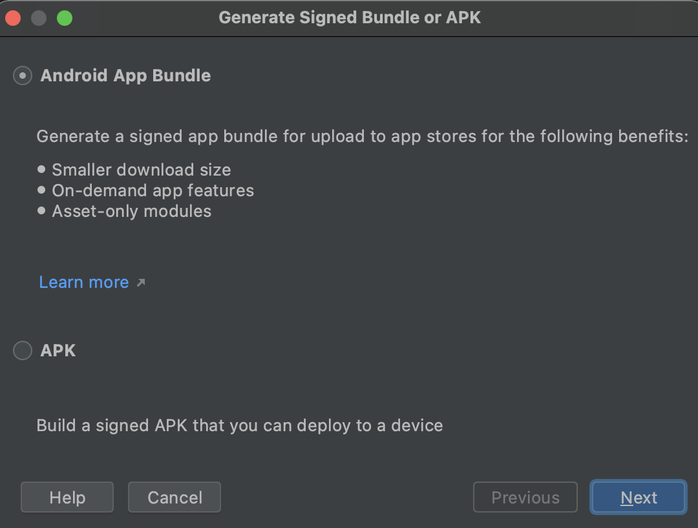
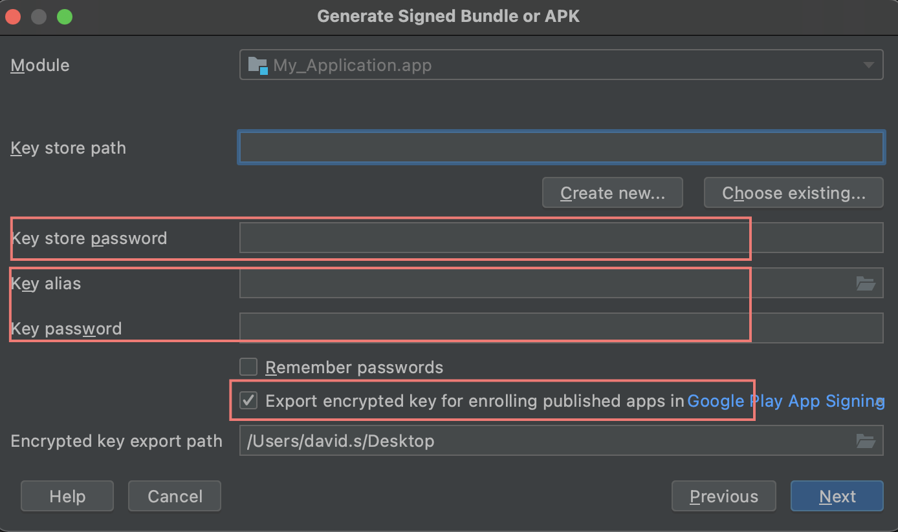
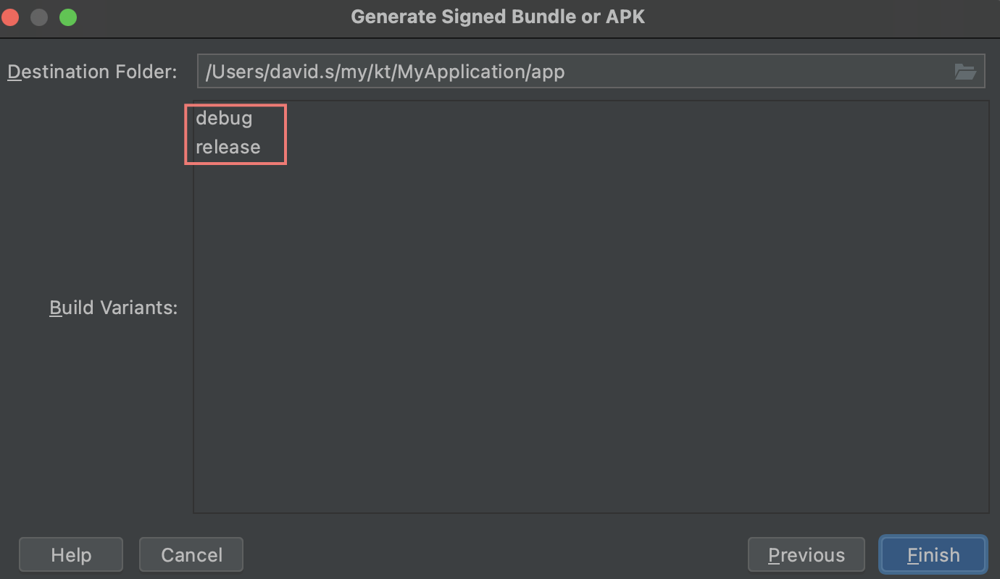

# Export AAB

APK (Android aPplication pacKage) 는 예전에 사용한 distribution file 이다.

AAB (Anroid app bundle) 는 현재 사용하는 distribution file 이다. AAB 가 PlayStore 에 upload 되면 기기에 맞게 최적화된 APK 를 만들어 준다. 사용자는 AAB 에서 필요한 파일만 다운로드 한다.

# Key

업로드할 때 사용하는 **업로드키** 와 출시할 때 사용하는 **앱서명키** 가 있다.

개발자가 하나의 키를 만들어 **업로드키**, **앱서명키** 로 사용할 수 있다. 그러나 그 키를 분실한다면 출시할 수 없게된다.

개발자가 하나의 키를 만들어 **업로드키** 로 사용하고 Play Store 에서 
**앱서명키** 를 만들어 사용할 수 있다. **앱서명키** 는 Play Store 에서 관리되기 때문에 분실할 수 없다. **업로드키** 는 분실하면 다시 만들면 된다.

# AAB 만들기

`Build | Generate Signed Bundle / APK...` 를 선택한다.



`key store password` 는 **업로드키**의 암호를 의미한다. `key alias, key password` 는 **서명키**의 별칭과 암호를 의미한다. `Export encrypted key...` 는 업로드키를 Play Store 에서 관리하길 원할 때 check 한다. 

기존에 생성한 key 를 선택하고 `key store password, key alias, key password` 를 입력한다.



Build Variants 를 선택해서 Build 한다.



# 업로드키, 서명키 만들기

다음과 같이 `keytool` 을 이용하여 command line 으로 만들 수도 있다.

```
$ keytool -genkey -v -keystore iamslash -storepass aaaaaa -alias iamslash -keypass bbbbbb -keyalg RSA -keysize 2048 -validity 10000
```
