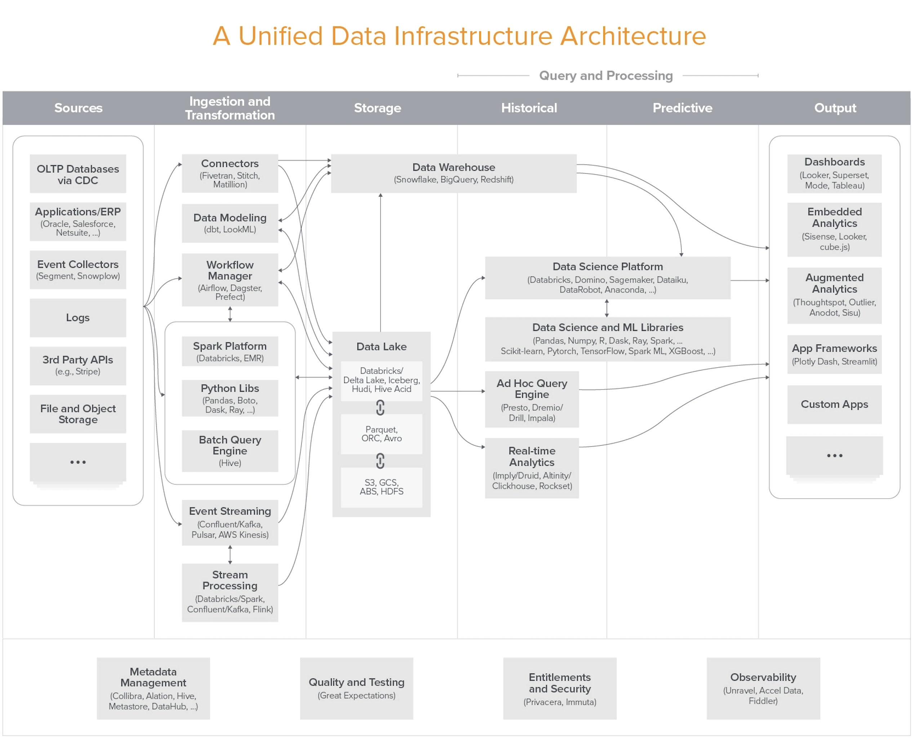

- [Abstract](#abstract)
- [Materials](#materials)
- [Architectures](#architectures)
  - [Layered Architecture](#layered-architecture)
  - [Clean Architecture](#clean-architecture)
  - [Unified Architecture for Data Infrastructure](#unified-architecture-for-data-infrastructure)

----

# Abstract

Architecture 들에 대해 정리한다.

# Materials

* [Explicit Architecture](https://herbertograca.com/2017/11/16/explicit-architecture-01-ddd-hexagonal-onion-clean-cqrs-how-i-put-it-all-together/)

# Architectures

## Layered Architecture 

* [Layered Architecture](https://www.baeldung.com/cs/layered-architecture)
* [토스ㅣSLASH 22 - 지속 성장 가능한 코드를 만들어가는 방법 | youtube](https://www.youtube.com/watch?v=RVO02Z1dLF8)
  * package, layer, module 의 best practice 를 설명함.

----

layer 들로 구성된 architecture 이다. [Clean Architecure](/cleanarchitecture/README.md), [Hexagonal Architecture](/hexagonalarchitecture/README.md) 등등이 있다.

**Advantages**

* 새로운 사람이 파악하기 쉽다. Hand over 가 쉽고 빠르다. 
* 유지보수가 쉽다. 새로운 feature 를 구현할 때 패턴이 명확해서 구현이 쉽고 빠르다.  
* 의존성이 적다. 단 하나의 레이어에만 의존성이 있다. 복잡도가 낮다. 확장이 쉽다.
* 의존성이 적어서 테스트가 쉽다.
* 레이어별로 동시 작업이 가능하다. 생산성이 높다.

**Disadvantages**

* 큰 변경은 어렵다. 하나의 레이어가 크게 바뀐다면 다른 레이어를 바꿔야할 수도 있다.

다음은 Layered Architecture Best Practice 에 해당하는 Project 들이다.

* [패스트캠퍼스 RED - 비즈니스 성공을 위한 Java/Spring 기반 서비스 개발과 MSA 구축 src](https://github.com/gregshiny/example-order)
* [패스트캠퍼스 RED - 비즈니스 성공을 위한 Java/Spring 기반 서비스 개발과 MSA 구축 src](https://github.com/gregshiny/example-gift)
* [wtf | github](https://github.com/benbjohnson/wtf.git)
  * Similar with simplified Hexgonal 

다음은 [패스트캠퍼스 RED - 비즈니스 성공을 위한 Java/Spring 기반 서비스 개발과 MSA 구축 src](https://github.com/gregshiny/example-order) 의 directory structure 이다.

```
src
├── main
│   ├── java
│   │   └── dev
│   │       └── practice
│   │           └── order
│   │               ├── OrderApplication.java
│   │               ├── application
│   │               │   ├── item
│   │               │   │   └── ItemFacade.java
│   │               │   ├── order
│   │               │   │   └── OrderFacade.java
│   │               │   └── partner
│   │               │       └── PartnerFacade.java
│   │               ├── common
│   │               │   ├── exception
│   │               │   │   ├── BaseException.java
│   │               │   │   ├── EntityNotFoundException.java
│   │               │   │   ├── IllegalStatusException.java
│   │               │   │   └── InvalidParamException.java
│   │               │   ├── interceptor
│   │               │   │   └── CommonHttpRequestInterceptor.java
│   │               │   ├── response
│   │               │   │   ├── CommonControllerAdvice.java
│   │               │   │   ├── CommonResponse.java
│   │               │   │   └── ErrorCode.java
│   │               │   └── util
│   │               │       └── TokenGenerator.java
│   │               ├── config
│   │               │   └── JpaAuditingConfiguration.java
│   │               ├── domain
│   │               │   ├── AbstractEntity.java
│   │               │   ├── item
│   │               │   │   ├── Item.java
│   │               │   │   ├── ItemCommand.java
│   │               │   │   ├── ItemInfo.java
│   │               │   │   ├── ItemOptionSeriesFactory.java
│   │               │   │   ├── ItemReader.java
│   │               │   │   ├── ItemService.java
│   │               │   │   ├── ItemServiceImpl.java
│   │               │   │   ├── ItemStore.java
│   │               │   │   ├── option
│   │               │   │   │   ├── ItemOption.java
│   │               │   │   │   └── ItemOptionStore.java
│   │               │   │   └── optiongroup
│   │               │   │       ├── ItemOptionGroup.java
│   │               │   │       └── ItemOptionGroupStore.java
│   │               │   ├── notification
│   │               │   │   └── NotificationService.java
│   │               │   ├── order
│   │               │   │   ├── Order.java
│   │               │   │   ├── OrderCommand.java
│   │               │   │   ├── OrderInfo.java
│   │               │   │   ├── OrderInfoMapper.java
│   │               │   │   ├── OrderItemSeriesFactory.java
│   │               │   │   ├── OrderReader.java
│   │               │   │   ├── OrderService.java
│   │               │   │   ├── OrderServiceImpl.java
│   │               │   │   ├── OrderStore.java
│   │               │   │   ├── fragment
│   │               │   │   │   └── DeliveryFragment.java
│   │               │   │   ├── item
│   │               │   │   │   ├── OrderItem.java
│   │               │   │   │   ├── OrderItemOption.java
│   │               │   │   │   └── OrderItemOptionGroup.java
│   │               │   │   └── payment
│   │               │   │       ├── PayMethod.java
│   │               │   │       ├── PaymentProcessor.java
│   │               │   │       └── validator
│   │               │   │           ├── PayAmountValidator.java
│   │               │   │           ├── PayMethodValidator.java
│   │               │   │           ├── PayStatusValidator.java
│   │               │   │           └── PaymentValidator.java
│   │               │   └── partner
│   │               │       ├── Partner.java
│   │               │       ├── PartnerCommand.java
│   │               │       ├── PartnerInfo.java
│   │               │       ├── PartnerReader.java
│   │               │       ├── PartnerService.java
│   │               │       ├── PartnerServiceImpl.java
│   │               │       └── PartnerStore.java
│   │               ├── infrastructure
│   │               │   ├── NotificationExecutor.java
│   │               │   ├── item
│   │               │   │   ├── ItemOptionSeriesFactoryImpl.java
│   │               │   │   ├── ItemReaderImpl.java
│   │               │   │   ├── ItemRepository.java
│   │               │   │   ├── ItemStoreImpl.java
│   │               │   │   ├── option
│   │               │   │   │   ├── ItemOptionRepository.java
│   │               │   │   │   └── ItemOptionStoreImpl.java
│   │               │   │   └── optiongroup
│   │               │   │       ├── ItemOptionGroupRepository.java
│   │               │   │       └── ItemOptionGroupStoreImpl.java
│   │               │   ├── order
│   │               │   │   ├── OrderItemOptionGroupRepository.java
│   │               │   │   ├── OrderItemOptionRepository.java
│   │               │   │   ├── OrderItemRepository.java
│   │               │   │   ├── OrderItemSeriesFactoryImpl.java
│   │               │   │   ├── OrderReaderImpl.java
│   │               │   │   ├── OrderRepository.java
│   │               │   │   ├── OrderStoreImpl.java
│   │               │   │   └── payment
│   │               │   │       ├── KakaoPayApiCaller.java
│   │               │   │       ├── NaverPayApiCaller.java
│   │               │   │       ├── PaymentApiCaller.java
│   │               │   │       ├── PaymentProcessorImpl.java
│   │               │   │       ├── PgCardApiCaller.java
│   │               │   │       └── TossPayApiCaller.java
│   │               │   └── partner
│   │               │       ├── PartnerReadImpl.java
│   │               │       ├── PartnerRepository.java
│   │               │       └── PartnerStoreImpl.java
│   │               └── interfaces
│   │                   ├── item
│   │                   │   ├── ItemApiController.java
│   │                   │   ├── ItemDto.java
│   │                   │   └── ItemDtoMapper.java
│   │                   ├── order
│   │                   │   ├── OrderApiController.java
│   │                   │   ├── OrderDto.java
│   │                   │   └── OrderDtoMapper.java
│   │                   └── partner
│   │                       ├── PartnerApiController.java
│   │                       └── PartnerDto.java
```

다음은 주요 특징들이다.

* Controller Class 가 HTTP Request Parameters 를 mapping 한 Object 의 Class 를 DTO Class 라고 하자. DTO Class 는 Presentation Layer 에 둔다.
* DTO Class Object 로 변환하는 Converter 를 DTO Mapper Class 라 하자. DTO Mapper Class 는 Presentation Layer 에 둔다. [mapstruct](/mapstruct/README.md) library 를 사용하면 간단한 code 로 mapper 를 구현할 수 있다.
* Domain Layer 로 전달할 Argument Object 의 Class 를 Command Class 라고 하자. 반대로 Domain Layer 에서 Application 로 return 하는 Return Object 의 Class 를 Info Class 라고 하자. Command Class, Info Class 는 Domain Layer 에 둔다.
* Presentation Layer 는 Domain Layer 의 의존성을 갖는다. Mapper Class 에서 Command Class, Info Class 를 참조하기 때문이다.
* Domain Class 는 Pure 하지 않다. `@Entity` 를 부착한다. Domain Class 가 POJO 가 되려면 많은 code 를 만들어야 한다. 피하고 싶다.
* JPA Repository Interface 는 Infrastructure Layer 에 둔다.
* Layer 별로 독립적으로 개발하기 위해 Class 를 Interface, Implementation Class 로 분리한다. (예. OrderService, OrderServieImpl)
* HTTP Response Error 는 CommonResponse 로 추상화 했다. ErrorCode 라는 Enum Class 를 두어 여러가지 error 별로 Class 를 두지 않았다.
* Business Exception Class 들은 ErrorCode 를 소유한다. ErrorCode 의 모음이 하나의 Exception Class 에 대응된다. error code 가 많다고 하더라도 mapping 되는 Exception class 는 적은 것이 더 좋다. 그렇다면 BaseException 만 있어도 되는거 아닌가?

## Clean Architecture

* [Clean Architecure](/cleanarchitecture/README.md)
* [Hexagonal Architecture](/hexagonalarchitecture/README.md)
* [Explicit Architecture](https://herbertograca.com/2017/11/16/explicit-architecture-01-ddd-hexagonal-onion-clean-cqrs-how-i-put-it-all-together/)

## Unified Architecture for Data Infrastructure

* [Emerging Architectures for Modern Data Infrastructure](https://future.a16z.com/emerging-architectures-modern-data-infrastructure/)
* [최신 데이터 인프라 이해하기 @ youtube](https://www.youtube.com/watch?v=g_c742vW8dQ&list=PLL-_zEJctPoJ92HmbGxFv1Pv_ugsggGD2)

----

Data 를 기반으로 의사결정을 하기 위해 Data Infrastructure 가 필요하다 (Data-Driven Decision Making). 아래 그림의 용어들을 모두 이해해 보자.


  