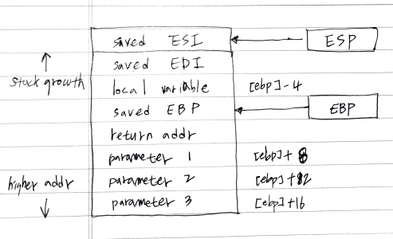

# Abstract

assembly language 에 대해 정리한다.

assembly language 는 intel syntax, AT&T syntax 와 같이 두가지 문법이 있다.
gnu assembler 는 AT&T syntax 를 따른다. nasm assembler 는 Intel syntax 를 따른다.

# Materials

* [x86 AT&T Assembly Guide](https://www.instapaper.com/read/1181098140)
  * AT&T assembly language 튜토리얼
* [x86 Intel Assembly Guide](http://www.cs.virginia.edu/~evans/cs216/guides/x86.html)
  * Intel assembly language 튜토리얼
* [linux assembly code @ kldp](http://doc.kldp.org/KoreanDoc/html/Assembly_Example-KLDP/Assembly_Example-KLDP.html)

# AT&T Basic Usages

## Registers


* general register
  * %eax (%ax, %ah, %al), %ebx (%bx, %bh, %bl), %ecx (%cx, %ch, %cl), %edx (%dx, %dh, %dl), %esi (%si), %edi (%di), %ebp (%bp), %esp (%sp) : 32-bit, 16-bit, 8-bit 레지스터로 사용가능
* section register
  * %cs, %ds, %es, %fs, %gs, %ss
* processor control register
  * %cr0, %cr1, %cr3
* debug register
  * %db0, %db1, %db2, %db3, %db6, %db7
* test register 
  * %tr6, %tr7
* floating point register stack
  * %st => %st(0), %st(1), %st(2), %st(3), %st(4), %st(5), %st(6), %st(7)

## Static Data Regions

```as
/* 전역변수 선언 방법 */
.data		
var:		
  .byte 64	/* Declare a byte, referred to as location var, containing the value 64. */
  .byte 10	/* Declare a byte with no label, containing the value 10. Its location is var + 1. */
x:		
  .short 42	/* Declare a 2-byte value initialized to 42, referred to as location x. */
y:		
  .long 30000    	/* Declare a 4-byte value, referred to as location y, initialized to 30000. */
/* 전역배열 선언 방법 */  
s:		
  .long 1, 2, 3	/* Declare three 4-byte values, initialized to 1, 2, and 3. 
The value at location s + 8 will be 3. */
barr:		
  .zero 10	/* Declare 10 bytes starting at location barr,  initialized to 0. */
str:		
  .string "hello"   	/* Declare 6 bytes starting at the address str initialized to the ASCII character values for hello followed by a nul (0) byte. */
```
## Addressing Memory

```as
/* () 는 dereference operator 와 같음 */
mov (%ebx), %eax	/* Load 4 bytes from the memory address in EBX into EAX. */
mov %ebx, var(,1)	/* Move the contents of EBX into the 4 bytes at memory address var.
(Note, var is a 32-bit constant). */
mov -4(%esi), %eax	/* Move 4 bytes at memory address ESI + (-4) into EAX. */
mov %cl, (%esi,%eax,1)   	/* Move the contents of CL into the byte at address ESI+EAX. */
mov (%esi,%ebx,4), %edx     	/* Move the 4 bytes of data at address ESI+4*EBX into EDX. */
```

다음은 잘못된 예이다.

```as
mov (%ebx,%ecx,-1), %eax	/* Can only add register values. */
mov %ebx, (%eax,%esi,%edi,1)     	/* At most 2 registers in address computation. */
```

## Operation Suffixes

instruction 의 접미사에 따라 목표공간의 크기가 다르다. 예를 들어 `b = byte(1 byte), w = word(2 bytes), l = long(4 bytes)` 이다.

```as
movb $2, (%ebx)	/* Move 2 into the single byte at the address stored in EBX. */
movw $2, (%ebx)	/* Move the 16-bit integer representation of 2 into the 2 bytes starting at the address in EBX. */
movl $2, (%ebx)     	/* Move the 32-bit integer representation of 2 into the 4 bytes starting at the address in EBX. */
```

## Instruction Notations

이어지는 instruction 들은 다음과 같은 표기법을 준수한다.

```as
<reg32>    	Any 32-bit register (%eax, %ebx, %ecx, %edx, %esi, %edi, %esp, or %ebp)
<reg16>	Any 16-bit register (%ax, %bx, %cx, or %dx)
<reg8>	Any 8-bit register (%ah, %bh, %ch, %dh, %al, %bl, %cl, or %dl)
<reg>	Any register
<mem>	A memory address (e.g., (%eax), 4+var(,1), or (%eax,%ebx,1))
<con32>	Any 32-bit immediate
<con16>	Any 16-bit immediate
<con8>	Any 8-bit immediate
<con>	Any 8-, 16-, or 32-bit immediate
```

## Data Move Instructions

* `mov` : move

```as
Syntax
mov <reg>, <reg>
mov <reg>, <mem>
mov <mem>, <reg>
mov <con>, <reg>
mov <con>, <mem>

Examples
mov %ebx, %eax — copy the value in EBX into EAX
movb $5, var(,1) — store the value 5 into the byte at location var
```

* `push` : push on stack

```as
Syntax
push <reg32>
push <mem>
push <con32>

Examples
push %eax — push eax on the stack
push var(,1) — push the 4 bytes at address var onto the stack
```

* `pop` : pop from stack

```as
Syntax
pop <reg32>
pop <mem>

Examples
pop %edi — pop the top element of the stack into EDI.
pop (%ebx) — pop the top element of the stack into memory at the four bytes starting at location EBX.
```

* `lea` : load effective address

컨텐츠를 로딩하지는 않는다???

```
Syntax
lea <mem>, <reg32>
Examples
lea (%ebx,%esi,8), %edi — the quantity EBX+8*ESI is placed in EDI.
lea val(,1), %eax — the value val is placed in EAX.
```

## Arithmetic and Logic Instructions

* `add` : Integer addition

```as
Syntax
add <reg>, <reg>
add <mem>, <reg>
add <reg>, <mem>
add <con>, <reg>
add <con>, <mem>
Examples
add $10, %eax — EAX is set to EAX + 10
addb $10, (%eax) — add 10 to the single byte stored at memory address stored in EAX
```

* `sub` : Integer subtraction

```as
Syntax
sub <reg>, <reg>
sub <mem>, <reg>
sub <reg>, <mem>
sub <con>, <reg>
sub <con>, <mem>
Examples
sub %ah, %al — AL is set to AL - AH
sub $216, %eax — subtract 216 from the value stored in EAX
```

* `inc, dec` : Increment, Decrement

```as
Syntax
inc <reg>
inc <mem>
dec <reg>
dec <mem>

Examples
dec %eax — subtract one from the contents of EAX
incl var(,1) — add one to the 32-bit integer stored at location var
```

* `imul` : Integer multiplication

```as
Syntax
imul <reg32>, <reg32>
imul <mem>, <reg32>
imul <con>, <reg32>, <reg32>
imul <con>, <mem>, <reg32>

Examples
imul (%ebx), %eax — multiply the contents of EAX by the 32-bit contents of the memory at location EBX. Store the result in EAX.
imul $25, %edi, %esi — ESI is set to EDI * 25
```

* `idiv` : Integer division

```as
Syntax
idiv <reg32>
idiv <mem>

Examples

idiv %ebx — divide the contents of EDX:EAX by the contents of EBX. Place the quotient in EAX and the remainder in EDX.
idivw (%ebx) — divide the contents of EDX:EAS by the 32-bit value stored at the memory location in EBX. Place the quotient in EAX and the remainder in EDX.
```

* `and, or, xor` : Bitwise logical and or and exclusive or

```as
Syntax
and <reg>, <reg>
and <mem>, <reg>
and <reg>, <mem>
and <con>, <reg>
and <con>, <mem>
or <reg>, <reg>
or <mem>, <reg>
or <reg>, <mem>
or <con>, <reg>
or <con>, <mem>
xor <reg>, <reg>
xor <mem>, <reg>
xor <reg>, <mem>
xor <con>, <reg>
xor <con>, <mem>
Examples
and $0x0f, %eax — clear all but the last 4 bits of EAX.
xor %edx, %edx — set the contents of EDX to zero.
```

* `not : negate`

```as
Syntax
neg <reg>
neg <mem>

Example
neg %eax — EAX is set to (- EAX)
```

* `shl, shr` : shift left and right

```as
Syntax
shl <con8>, <reg>
shl <con8>, <mem>
shl %cl, <reg>
shl %cl, <mem>

shr <con8>, <reg>
shr <con8>, <mem>
shr %cl, <reg>
shr %cl, <mem>

Examples
shl $1, eax — Multiply the value of EAX by 2 (if the most significant bit is 0)
shr %cl, %ebx — Store in EBX the floor of result of dividing the value of EBX by 2n where n is the value in CL. Caution: for negative integers, it is different from the C semantics of division!
```

## Control Flow Instructions

* `jmp` : jump

```as
Syntax
jmp <label>

Example
jmp begin — Jump to the instruction labeled begin.
```

* `jcondition` : conditional jump

`machine status word` 라는 특별한 레지스터가 있다. 이것은 `cmp` 의 결과를 저장하는데 사용된다. `jcondition` 은 `machine status word` 의 결과에 따라 분기여부를 결정한다.

```as
Syntax
je <label> (jump when equal)
jne <label> (jump when not equal)
jz <label> (jump when last result was zero)
jg <label> (jump when greater than)
jge <label> (jump when greater than or equal to)
jl <label> (jump when less than)
jle <label> (jump when less than or equal to)

Example
cmp %ebx, %eax
jle done
```

* `cmp` : Compare

```as
Syntax
cmp <reg>, <reg>
cmp <mem>, <reg>
cmp <reg>, <mem>
cmp <con>, <reg>

Example
cmpb $10, (%ebx)
jeq loop
```

* `call, ret` : Subroutine call and return

```as
Syntax
call <label>
ret
```

## Calling Convention

함수가 호출될 때 parameter 들을 어떻게 처리하는지에 대한 규약을 calling convention 이라고 하고 `__cdecl, __stdcall, __fastcall` 등이 있다. `__cdecl` 은 함수를 호출한 쪽에서 parameter 들을 해제한다. `__stdcall` 은 호출된 함수 쪽에서 parameter 들을 해제한다. `__fastcall` 은 두개까지의 parameter 들은 ECX, EDX 레지스터에 저장하고 호출된 함수 쪽에서 parameter 들을 해제한다.

다음은 `__cdecl` 의 예이다.

* diagram



* caller code

```as
push (%ebx)    /* Push last parameter first */
push $216      /* Push the second parameter */
push %eax      /* Push first parameter last */

call myFunc    /* Call the function (assume C naming) */

add $12, %esp
```

* callee code

```as
  /* Start the code section */
  .text

  /* Define myFunc as a global (exported) function. */
  .globl myFunc
  .type myFunc, @function
myFunc:

  /* Subroutine Prologue */
  push %ebp      /* Save the old base pointer value. */
  mov %esp, %ebp /* Set the new base pointer value. */
  sub $4, %esp   /* Make room for one 4-byte local variable. */
  push %edi      /* Save the values of registers that the function */
  push %esi      /* will modify. This function uses EDI and ESI. */
  /* (no need to save EBX, EBP, or ESP) */

  /* Subroutine Body */
  mov 8(%ebp), %eax   /* Move value of parameter 1 into EAX. */
  mov 12(%ebp), %esi  /* Move value of parameter 2 into ESI. */
  mov 16(%ebp), %edi  /* Move value of parameter 3 into EDI. */

  mov %edi, -4(%ebp)  /* Move EDI into the local variable. */
  add %esi, -4(%ebp)  /* Add ESI into the local variable. */
  add -4(%ebp), %eax  /* Add the contents of the local variable */
                      /* into EAX (final result). */

  /* Subroutine Epilogue */
  pop %esi       /* Recover register values. */
  pop %edi
  mov %ebp, %esp /* Deallocate the local variable. */
  pop %ebp       /* Restore the caller's base pointer value. */
  ret
```

# AT&T vs Intel

## register names

| AT&T | Intel |
|:-----|:------|
| `%eax` | `eax` |

## operand order

copy from eax to ebx.

| AT&T | Intel |
|:-----|:------|
| `movl %eax, %ebx` | `mov ebx, eax` |

## operand size

`AT&T` 는 

copy word from foo to bx

| AT&T | Intel |
|:-----|:------|
| `movw foo, %bx` | `mov bx, word ptr foo` |
