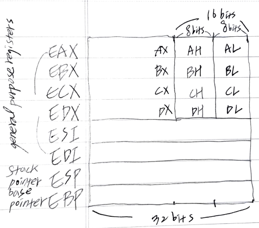

# Abstract

assembly language 에 대해 정리한다.

assembly language 는 intel syntax, AT&T syntax 와 같이 두가지 문법이 있다.
gnu assembler 는 AT&T syntax 를 따른다. nasm assembler 는 Intel syntax 를 따른다.

# Materials

* [x86 AT&T Assembly Guide](https://www.instapaper.com/read/1181098140)
  * AT&T assembly language 튜토리얼
* [x86 Intel Assembly Guide](http://www.cs.virginia.edu/~evans/cs216/guides/x86.html)
  * Intel assembly language 튜토리얼
* [linux assembly code @ kldp](http://doc.kldp.org/KoreanDoc/html/Assembly_Example-KLDP/Assembly_Example-KLDP.html)

# AT&T Basic Usages

## Registers



* general register
  * %eax (%ax, %ah, %al), %ebx (%bx, %bh, %bl), %ecx (%cx, %ch, %cl), %edx (%dx, %dh, %dl), %esi (%si), %edi (%di), %ebp (%bp), %esp (%sp) : 32-bit, 16-bit, 8-bit 레지스터로 사용가능
* section register
  * %cs, %ds, %es, %fs, %gs, %ss
* processor control register
  * %cr0, %cr1, %cr3
* debug register
  * %db0, %db1, %db2, %db3, %db6, %db7
* test register 
  * %tr6, %tr7
* floating point register stack
  * %st => %st(0), %st(1), %st(2), %st(3), %st(4), %st(5), %st(6), %st(7)

## Static Data Regions

```as
.data		
var:		
  .byte 64	/* Declare a byte, referred to as location var, containing the value 64. */
  .byte 10	/* Declare a byte with no label, containing the value 10. Its location is var + 1. */
x:		
  .short 42	/* Declare a 2-byte value initialized to 42, referred to as location x. */
y:		
  .long 30000    	/* Declare a 4-byte value, referred to as location y, initialized to 30000. */
```

```as

s:		
  .long 1, 2, 3	/* Declare three 4-byte values, initialized to 1, 2, and 3. 
The value at location s + 8 will be 3. */
barr:		
  .zero 10	/* Declare 10 bytes starting at location barr,  initialized to 0. */
str:		
  .string "hello"   	/* Declare 6 bytes starting at the address str initialized to the ASCII character values for hello followed by a nul (0) byte. */
```
## Addressing Memory

## Operation Suffixes

## Data Move Instructions

## Arithmetic and Logic Instructions

## Control Flow Instructions

## Calling Convention

# AT&T vs Intel

