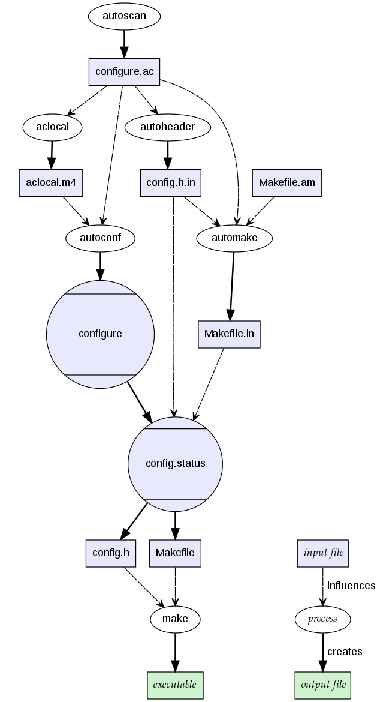

# Abstract

autotools 에 대해 적는다.

# Materials

* [autotools tutorial](https://robots.thoughtbot.com/the-magic-behind-configure-make-make-install)

# Overview



# Tutorial

다음과 같은 a.c 파일을 제작하자.

```c
#include <stdio.h>

int
main(int argc, char* argv[])
{
    printf("Hello world\n");
    return 0;
}
```

먼저 `configure.ac` 를 작성한다. 이것은 `m4sh` 로 작성해야 한다. `m4sh` 는 `m4` macros 와 POSIX shell script 를 의미한다. 다음은 `configure.ac` 의 예이다. 실행파일 이름은 `a`, 버전은 `0.1`, 관리자는 `iamslash@gmail.com` .

```ac
AC_INIT([a.out], [0.1], [iamslash@gmail.com])
AM_INIT_AUTOMAKE
AC_PROG_CC
AC_CONFIG_FILES([Makefile])
AC_OUTPUT
```

다음은 `Makefile.in` 을 작성해야 한다. `Makefile.am` 을 작성해서 `Makefile.in` 을 생성해 보자.

```
AUTOMAKE_OPTIONS = foreign
bin_PROGRAMS = a.out
helloworld_SOURCES = a.c
```

이번에는 `configure, Makefile.in` 을 생성하기 위해 터미널에서 다음과 같이 실행한다.

```
aclocal
autoconf
automake --add-missing
```

관리자는 다음과 같이 실행해서 테스트 한다.

```
./configure
make distcheck # Use Makefile to build and test a tarball to distribute
```

엔드 유저는 다음과 같이 실행해서 설치한다.

```
./configure
make 
make install
```