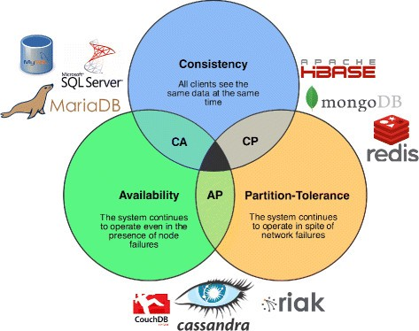

- [Abstract](#abstract)
- [Materials](#materials)
- [Prerequisites](#prerequisites)
  - [Cloud Computing](#cloud-computing)
  - [Storage](#storage)
  - [Cloud Service Types](#cloud-service-types)
  - [Router](#router)
  - [Switch](#switch)
  - [WAF (Web Application Fairewall)](#waf-web-application-fairewall)
  - [XSS (Cross Site Scripting)](#xss-cross-site-scripting)
  - [CSRF (Cross Site Request Forgery)](#csrf-cross-site-request-forgery)
  - [XSS vs CSRF](#xss-vs-csrf)
  - [OSI 7 layer](#osi-7-layer)
  - [TCP/IP Protocol Suite](#tcpip-protocol-suite)
  - [Subnet](#subnet)
  - [CIDR (Classless Inter-Domain Routing)](#cidr-classless-inter-domain-routing)
  - [Private Network](#private-network)
  - [VPN (Virtual Private Network)](#vpn-virtual-private-network)
  - [VPC (Virtual Private Cloud)](#vpc-virtual-private-cloud)
  - [Virtualization](#virtualization)
  - [Devops](#devops)
  - [AWS Region](#aws-region)
  - [AWS Availability Zone](#aws-availability-zone)
  - [Edge Location](#edge-location)
  - [CAP (Consistency Availability Partition tolerance)](#cap-consistency-availability-partition-tolerance)
  - [PACELC (Partitioning Availability Consistency Else Latency Consistency)](#pacelc-partitioning-availability-consistency-else-latency-consistency)
  - [REST (REpresentational State Transfer) API](#rest-representational-state-transfer-api)
  - [MSA (Micro Service Architecture)](#msa-micro-service-architecture)
  - [Apache Hadoop](#apache-hadoop)
  - [HDFS (Hadoop Distributed FileSystem)](#hdfs-hadoop-distributed-filesystem)
  - [MapReduce](#mapreduce)
- [Basic](#basic)
  - [VPC (Virtual Private Cloud)](#vpc-virtual-private-cloud-1)
  - [EC2 (Elastic Compute)](#ec2-elastic-compute)
  - [IAM (Identity and Access Management)](#iam-identity-and-access-management)
  - [CloudFront](#cloudfront)
  - [S3 (Simple Storage Service)](#s3-simple-storage-service)
  - [RDS](#rds)
  - [ElastiCachi](#elasticachi)
  - [Lambda](#lambda)
  - [API Gateway](#api-gateway)
  - [DynamoDB](#dynamodb)
  - [ElasticSearch Service](#elasticsearch-service)
  - [Kinesis](#kinesis)
  - [Route 53](#route-53)
  - [CloudWatch](#cloudwatch)
  - [ELB](#elb)
  - [Elastics Beanstalk](#elastics-beanstalk)
  - [Code Deploy](#code-deploy)
- [Advanced](#advanced)
  - [How to use awscli on Windows](#how-to-use-awscli-on-windows)
- [Best Practices](#best-practices)
  - [Chatting Service](#chatting-service)

----

# Abstract

aws 사용법에 대해 간략히 정리한다.

# Materials

* [AWS Services Overview - September 2016 Webinar Series @ slideshare](https://www.slideshare.net/AmazonWebServices/aws-services-overview-september-2016-webinar-series)
* [AWS @ 생활코딩](https://opentutorials.org/course/2717)
* [44bit](https://www.44bits.io/ko)
  * 클라우드블로그
* [아마존 웹 서비스를 다루는 기술](http://pyrasis.com/aws.html)
  * 오래되었지만 괜찮은 책
* [cloudcraft](https://cloudcraft.co/)
  * aws diagram tool
* [Amazon Web Services 한국 블로그](https://aws.amazon.com/ko/blogs/korea/tag/korea-techtips/)
* [AWS re:Invent 2018 DeepDive series @ youtube](https://www.youtube.com/results?search_query=AWS+re%3AInvent+2018+Deep+Dive)
* [AWS re:Invent 2018 Under the hood series @ youtube](https://www.youtube.com/results?search_query=AWS+re%3AInvent+2018+Under+the+hood)
* [AWS Summit 2019 | AWS 아키텍처 @ youtube](https://www.youtube.com/playlist?list=PLORxAVAC5fUWWpxC5TW10P35GpLBOKWKS)
* [AWS Summit 2019 | 게임 @ youtube](https://www.youtube.com/playlist?list=PLORxAVAC5fUXgqiJJKJ8h8E5BkrFXUS2j)
* [AWS Summit 2019 | AWS 기술트랙 1 @ youtube](https://www.youtube.com/watch?v=KKkK6d8Srik&list=PLORxAVAC5fUUoQB13KiV8ezs7cAfwSagC)
* [AWS Summit 2019 | AWS 기술트랙 2 @ youtube](https://www.youtube.com/watch?v=l7W_urK43aE&list=PLORxAVAC5fUX3c9KwLE9E-qZv7tXk-b3O)
* [AWS Summit 2019 | AWS 기술트랙 3 @ youtube](https://www.youtube.com/watch?v=QFeSXY3cL7Q&list=PLORxAVAC5fUUa8XFFLtB6aK4vgZhTKBLg)
* [AWS Summit 2019 | AWS 기술트랙 4 @ youtube](https://www.youtube.com/watch?v=Sf6j7PPHeeI&list=PLORxAVAC5fUUeaSHb91d5wpDGfR14uNCi)
* [AWS Summit 2019 | AWS 기술트랙 5 @ youtube](https://www.youtube.com/watch?v=nxgGk-PbXf0&list=PLORxAVAC5fUWZGawyaMyz8NepNGqHbHtZ)
* [AWS Summit 2019 @ youtube](https://www.youtube.com/playlist?list=PLORxAVAC5fUWyB6Hsk9ibYJHw97k1h6s9)

# Prerequisites

## Cloud Computing

컴퓨터의 연산을 PC 가 아닌 인터넷 즉 클라우드에서 처리하는 방식이다. 클라우드는 인터넷을 말한다. 드롭박스, 구글 드라이브, MS 윈드라이브 등이 해당한다.

## Storage 

* [SAN의 정의 그리고 NAS와의 차이점](http://www.ciokorea.com/news/37369)

<br/>

* NAS - Network Attatched Storage
  * 표준 이더넷 연결을 통해 네트워크에 부착된 저장장치.
* DAS - Direct Attatched Soorage
  * 머신에 부착된 저장장치
* SAN - Storage Area Network
  * 파이버 연결 채널을 통해 네트워크에 고속으로 부착된 저장장치.
* SAN vs NAS
  * SAN 과 NAS 는 모두 네트워크 기반 스토리지 이다. 그러나 SAN 은 일반적으로 파이버 채널 연결을 이용하고 NAS 는 표준 이더넷 연결을 통해 네트워크에 연결된다. 
  * SAN은 블록 수준에서 데이터를 저장하지만 NAS는 파일 단위로 데이터에 접속한다. 
  * 클라이언트 OS 입장에서 보면, SAN 은 일반적으로 디스크로 나타나며 별도로 구성된 스토리지용 네트워크로 존재한다. 반면 NAS 는 클라이언트 OS 에 파일 서버로 표시된다.
* Unified storage
  * SAN 과 NAS 가 합쳐진 것이다.
  * iSCI (Internet Small Computing System Interface), NFS, SMB 모두를 지원하는 Multiprotocol Storage 이다.

## Cloud Service Types

* [SaaS vs PaaS vs IaaS: What’s The Difference and How To Choose](https://www.bmc.com/blogs/saas-vs-paas-vs-iaas-whats-the-difference-and-how-to-choose/)


<br/>

* On-Premises
  * Netwoking 부터 Appliations 까지 유저가 모두 관리해야 하는 개발 환경
* IaaS (Infrastructure as a service)
  * Networking 부터 Virtualization 까지 유저대신 관리해주는 서비스 이다. 유저는 O/S 부터 Applications 까지 관리한다.
  * DigitalOcean, Linode, Rackspace, Amazon Web Services (AWS), Cisco Metapod, Microsoft Azure, Google Compute Engine (GCE)
* PaaS (Platform as a service)
  * Networking 부터 Runtime 까지 유저대신 관리해주는 서비스 이다. 유저는 Data 부터 Applications 까지 관리한다.
  * AWS Elastic Beanstalk, Windows Azure, Heroku, Force.com, Google App Engine, Apache Stratos, OpenShift
* SaaS (Software as a service)
  * Networking 부터 Applications 까지 유저대신 관리해주는 서비스 이다. 유저는 별도로 관리할 필요가 없다.
  * Google Apps, Dropbox, Salesforce, Cisco WebEx, Concur, GoToMeeting
* FaaS (Function as a service)
  * 유저는 Function 만 제공하면 된다.
  * AWS Lambda 
* CaaS (Container as a service)
  * 유저는 서비스로 제공되는 경량의 가상컨테이너에 서비스를 배포한다.
  * AWS ECS

## Router

* 서로 다른 네트워크에 패킷을 전송하는 장비

## Switch

* 하나의 네트워크에 여러 대의 컴퓨터를 연결하는 장비
  
## WAF (Web Application Fairewall)

* [AWS WAF – 웹 애플리케이션 방화벽](https://aws.amazon.com/ko/waf/)
* [웹방화벽이란?](https://www.pentasecurity.co.kr/resource/%EC%9B%B9%EB%B3%B4%EC%95%88/%EC%9B%B9%EB%B0%A9%ED%99%94%EB%B2%BD%EC%9D%B4%EB%9E%80/)

<br/>
  
* 일반적인 방화벽과 달리 웹 애플리케이션의 보안에 특화된 솔루션이다. 
* 애플리케이션의 가용성에 영향을 주거나, SQL Injection, XSS (Cross Site Scripting) 과 같이 보안을 위협하거나, 리소스를 과도하게 사용하는 웹 공격으로부터 웹 애플리케이션을 보호하는 데 도움이 된다.

## XSS (Cross Site Scripting)

* [웹 해킹 강좌 ⑦ - XSS(Cross Site Scripting) 공격의 개요와 실습 (Web Hacking Tutorial #07) @ youtube](https://www.youtube.com/watch?v=DoN7bkdQBXU)

<br/>

* 웹 게시판에 javascript 를 내용으로 삽입해 놓으면 그 게시물을 사용자가 읽을 때 삽입된 스크립트가 실행되는 공격방법

## CSRF (Cross Site Request Forgery)

* [웹 해킹 강좌 ⑩ - CSRF(Cross Site Request Forgery) 공격 기법 (Web Hacking Tutorial #10) @ youtube](https://www.youtube.com/watch?v=nzoUgKPwn_A)

<br/>

* 특정 사용자의 세션을 탈취하는 데에는 실패하였지만 스크립팅 공격이 통할 때 사용할 수 있는 해킹 기법. 피해자가 스크립트를 보는 것과 동시에 자기도 모르게 특정한 사이트에 어떠한 요청(Request) 데이터를 보낸다.

## XSS vs CSRF

* XSS 는 공격대상이 Client 이고 CRSF 는 공격대상이 Server 이다.
* XSS 는 사이트변조나 백도어를 통해 Client 를 공격한다.
* CSRF 는 요청을 위조하여 사용자의 권한을 이용해 서버를 공격한다.

## OSI 7 layer

)

ISO (International Standard Organization) 에서 개발한 네트워크 모델이다. 컴퓨터 네트워크 프로토콜 디자인과 통신을 계층으로 나누어 설명했다. 1984 년에 ISO 가 ISO 7498, CCITT (ITU-T) 는 X.200 으로 출판하였다.

## TCP/IP Protocol Suite

* [Computer Network | TCP/IP Model @ geeksforgeeks](https://www.geeksforgeeks.org/computer-network-tcpip-model/)


<br/>

1960 년대 말 DARPA (Defense Advanced Research Projects Agency) 가 수행한 연구개발의 산출물로 부터 탄생했다. DARPA 가 개발한 ARPANET 는 NCP (Network Control Program) 라는 프로토콜을 사용했다. 1983 년 TCP/IP 가 이를 대체하며 지금의 인터넷으로 진화했다.

Internet Protocol Suite 는 인터넷에서 컴퓨터들이 서로 정보를 주고 받는데 쓰이는 프로토콜의 모음이다. TCP, IP 가 가장 많이 쓰이기 때문에 TCP/IP Protocol Suite 라고도 한다. 

TCP/IP Protocol Suite 는 OSI 의 7 개 레이어 를 4 개로 줄였다.

## Subnet

IP 의 network 가 논리적으로 분할된 것이다. Subnet 을 만드는 것을 Subnetting 이라고 한다. Subnet 은 Subnet Mask 를 이용하여 만든다. 

Subnet 의 IP address 는 network number 혹은 routing prefix 와 rest field 혹은 host identifier 와 같이 두가지로 나뉘어 진다. 

routing prefix 는 `198.51.100.0/24` 와 같이 CIDR (Classless Inter-Domain Routing) 표기법으로 표현할 수 있다. `198.51.100.0/24` 의 subnet mask 는 `255.255.255.0` 이다.

## CIDR (Classless Inter-Domain Routing)

기존의 IP 주소 할당 방식이었던 네트워크 클래스를 대체하기 위해 IETF (Internet Engineering Task Force) 가 1993년 에 [RFC4632](https://tools.ietf.org/html/rfc4632) 라는 표준으로 개발한 IP 주소 할당 방법이다. 

`198.51.100.0/24` 와 같이 표기한다. `/24` 는 routing prefix 비트의 개수를 의미한다.

## Private Network

Private IP Address 를 사용하는 네트워크이다. IETF (Internet Engineering Task Force) 는 Private IP Address 를 위해 다음과 같은 IPv4 주소를 사용하도록 [RFC1918](https://tools.ietf.org/html/rfc1918) 라는 표준으로 IANA ( Internet Assigned Numbers Authority) 를 지도했다.

| RFC 1918 name | IP address range | Numger of addresses | Largest CIDR block (subnet mask) | Host ID size | Mask bits | Classful description | 
|--|--|--|--|--|--|--|
| 24-bit block | 10.0.0.0 - 10.255.255.255 | 16,777,216 | 10.0.0.0/8 (255.0.0.0) | 24 bits | 8 bits | single class A network |
| 20-bit block | 172.16.0.0 – 172.31.255.255 | 1,048,576 | 172.16.0.0/12 (255.240.0.0) | 20 bits | 12 bits | 16 contiguous class B networks |
| 16-bit block | 192.168.0.0 – 192.168.255.255 | 65,536 | 192.168.0.0/16 (255.255.0.0) | 16 bits | 16 bits | 256 contiguous class C networks |

* 24-bit block 은 `10.x.x.x, 24 / 8 bits` 으로 기억하자.
* 20-bit block 은 `172.x.x.x, 20 / 12 bits` 으로 기억하자.
* 16-bit block 은 `192.168.x.x, 16 / 16 bits` 으로 기억하자.

## VPN (Virtual Private Network)

* [가상 사설망](https://namu.wiki/w/%EA%B0%80%EC%83%81%20%EC%82%AC%EC%84%A4%EB%A7%9D)
* 물리 적으로 여러 곳에 퍼져있는 컴퓨터들을 인터넷 네트워크와 암호화 기술을 이용하여 하나의 네트워크로 구성하는 것

## VPC (Virtual Private Cloud)

* [Amazon VPC란 무엇인가? @ aws](https://docs.aws.amazon.com/ko_kr/vpc/latest/userguide/what-is-amazon-vpc.html)
* [[AWS] 가장쉽게 VPC 개념잡기](https://medium.com/harrythegreat/aws-%EA%B0%80%EC%9E%A5%EC%89%BD%EA%B2%8C-vpc-%EA%B0%9C%EB%85%90%EC%9E%A1%EA%B8%B0-71eef95a7098)

<br/>

* AWS 외부와는 격리된 가상의 사설 클라우드이다. 2011년 8월에 도입되었다. 
* VPC 를 하나 만들기 위해서는 다음과 같은 것들이 필요하다.
  * n 개의 subnet
  * subnet 끼리 통신을 위해 subnet 별 routing table
  * subnet 별 inbound, outbound 방화벽 설정을 위한 Network ACL
  * subnet 별 보안설정을 위한 Security Group
  * subnet 이 public internet 통신을 위한 Internet Gateway
  * DHCP options set

## Virtualization

* [가장 빨리 만나는 Docker 1장 - 1. 가상 머신과 Docker](http://pyrasis.com/book/DockerForTheReallyImpatient/Chapter01/01)
* [전가상화와 반가상화](https://m.blog.naver.com/PostView.nhn?blogId=brickbot&logNo=220413822823&proxyReferer=https%3A%2F%2Fwww.google.com%2F)
virtualization 은 Host Virtualization, Hypervisor Virtualization, Container Virtualization 과 같이 3 가지가 있다.
* [하이퍼바이저](https://blog.naver.com/brickbot/220413523885)

<br/>

* Host Virtualization
  * 하드웨어에 Host O/S 를 설치하고 Host O/S 에 Virtualizaion S/W 를 설치한다. 그리고 Guest O/S 는 Virtualization S/S 에서 실행되는 가상화를 말한다. 가상 환경을 손쉽게 구축할 수 있지만 오버헤드가 굉장히 크다. Hosted Full Virtualization 과 같은 건가??? 
* Hypervisor Virtualization 
  * 하이퍼바이저는 가상화를 관리하는 소프트웨어이다. VMM (Virtuall Machine Monitor) 이라고도 한다. 하드웨어에 하이퍼바이저를 배치해 H/W 와 가상환경을 제어한다. Full Virtualization 과 Para Virtualization 이 있다. KVM 은 Full Virtualization 과 Para Virtualization 에 해당한다.
  * **Full Virtualization**
    * 하이퍼바이저가 Host O/S 에서 실행되는 것을 Hosted Full Virtualization 이라고 한다. VMware, Virtual Box 가 해당한다.
    * 하이퍼바이저가 H/W 에서 실행되는 것을 Native Full Virtualization 이라고 한다. Xen 이 해당한다.
  * **Para Virtualization**
    * Guest OS 를 수정해야 한다. 대신 Full Virtualization 보다 성능이 좋다.
* Container Virtualization
  * 하드웨어에 Host O/S 를 설치하고 Host O/S 에 논리적인 영역 (컨테이너) 을 만들고 애플리케이션과 라이브러리등을 컨테이너 안에 넣어 가상화를 제공하는 것이다.
  * OpenVZ, LSC, Lunix vServer, FreeBSD Fail, Solaris Zones, Docker 등이 해당한다. 

## Devops

* [DevOps is a culture, not a role!](https://medium.com/@neonrocket/devops-is-a-culture-not-a-role-be1bed149b0)

<br/>

개발팀과 운영팀이 서로 소통이 원활히 이루어질 수 있도록 하는 것을 의미한다.


## AWS Region

AWS 는 물리적으로 떨어진 지역에 여러 개의 클라우드 인프라를 운영한다. 이 지역을 region 이라고 한다.

## AWS Availability Zone

하나의 region 은 다시 여러개의 물리적인 Availability Zone 으로 나뉘어 진다. 하나의 region 안에서 서비스를 두개 이상의 Availability Zone 에 배치해 두면 가용성을 확보할 수 있다.

## Edge Location

CDN (Content Delivery Netowrk) 을 이루는 캐시 서버이다. AWS Cloud Front 가 해당한다.

## CAP (Consistency Availability Partition tolerance)

* [CAP Theorem @ medium](https://medium.com/system-design-blog/cap-theorem-1455ce5fc0a0)

<br/>



Brewer's theorem 이라고도 한다. Distributed System 은 Consistency, Availability, Partition tolerance 중 3 가지 모두 만족할 수 없다. 2 가지만을 만족 할 수 있다.

* Consistency
  * 모든 클라이언트는 같은 데이터를 읽는다.
* Availability
  * 서버 노드중 일부가 고장나도 서비스의 지장이 없다.
* Partition tolerance
  * 노드들 끼리 전송하는 네트워크 패킷이 유실되거나 지연되더라도 서비스의 지장이 없다.

## PACELC (Partitioning Availability Consistency Else Latency Consistency)

* [CAP Theorem, 오해와 진실](http://eincs.com/2013/07/misleading-and-truth-of-cap-theorem/)

<br/>


시스템이 Partitioning 상황 즉 네트워크 장애 상황일 때는 Availability 혹은 Consistency 중 하나를 추구하고 일반적인 상황일 때는 Latency 혹은 Consistency 중 하나를 추구하라는 이론이다. 

이것을 다시 한번 풀어보면 이렇다. 네트워크 장애 상황일 때 클라이언트는 일관성은 떨어져도 좋으니 일단 데이터를 받겠다 혹은 일관성있는 데이터 아니면 에러를 받겠다는 말이다. 네트워크 장애가 아닌 보통의 상황일 때 클라이언트는 일관성은 떨어져도 빨리 받겠다 혹은 일관성있는 데이터 아니면 늦게 받겠다는 말이다.

* HBase 는 PC/EC 이다. 네트워크 장애상황일 때 무조건 일관성있는 데이터를 보내고 보통의 상황일 때도 무조건 일관성있는 데이터를 보낸다. 한마디로 일관성 성애자이다.
* Cassandra 는 PA/EL 이다. 일관성은 별로 중요하지 않다. 네트워크 장애상황일 때 일관성은 떨어져도 데이터를 일단 보낸다. 보통의 상황일 때 역시 일관성은 떨어져도 좋으니 일단 빨리 데이터를 보낸다.

## REST (REpresentational State Transfer) API 

* [1) Rest API란? @ edwith](https://www.edwith.org/boostcourse-web/lecture/16740/)

<br/>

2000 년도에 로이 필딩 (Roy Fielding) 의 박사학위 논문에서 최초로 소개되었다. REST 형식의 API 를 말한다.

로이 필딩은 현재 공개된 REST API 라고 불리우는 것은 대부분 REST API 가 아니다라고 말한다. REST API 는 다음과 같은 것들을 포함해야 한다고 한다.

* client-server
* stateless
* cache
* uniform interface
* layered system
* code-on-demand (optional)

HTTP 를 사용하면 uniform interface 를 제외하고는 모두 만족 한다. uniform interface 는 다음을 포함한다.

* 리소스가 URI로 식별되야 합니다.
* 리소스를 생성,수정,추가하고자 할 때 HTTP메시지에 표현을 해서 전송해야 합니다.
* 메시지는 스스로 설명할 수 있어야 합니다. (Self-descriptive message)
* 애플리케이션의 상태는 Hyperlink를 이용해 전이되야 합니다.(HATEOAS)

위의 두가지는 이미 만족하지만 나머지 두가지는 HTTP 로 구현하기 어렵다. 예를 들어 HTTP BODY 에 JSON 을 포함했을 때 HTTP message 스스로 body 의 내용을 설명하기란 어렵다. 그리고 웹 게시판을 사용할 때, 리스트 보기를 보면, 상세보기나 글쓰기로 이동할 수 있는 링크가 있습니다.
상세보기에서는 글 수정이나 글 삭제로 갈 수 있는 링크가 있습니다. 이렇게 웹 페이지를 보면, 웹 페이지 자체에 관련된 링크가 있는것을 알 수 있는데 이를 HATEOAS (Hypermedia As The Engine Of Application State) 라고 한다. HATEOAS 를 API 에서 제공하는 것은 어렵다.

결국 HTTP 는 REST API 의 uniform interface 스타일 중 self-descriptive message, HATEOAS 를 제외하고 대부분의 특징들이 구현되어 있다고 할 수 있다. 그래서 REST API 대신 HTTP API 또는 WEB API 라고 한다.

## MSA (Micro Service Architecture)

하나의 서비스를 느슨하게 연결된 작은 서비스들로 구성하여 구축하는 software development technique 중 하나이다.

모듈화도 되고 여러 팀이 독립적으로 개발할 수도 있고 만은 장점이 있다. 그러나 너무 많은 서비스들의 개수때문에 많은 프로토콜을 구현해야 하고 유지보수가 용이하지 않다.

## Apache Hadoop

* [하둡(Hadoop) 소개 및 기본 구성요소 설명 @ opentutorials](https://opentutorials.org/module/2926/17055)
* [hadoop @ TIL](/hadoop/README.md)

<br/>

대용량 데이터를 분산 처리할 수 있는 자바 기반의 오픈 소스 프레임워크이다. 구글이 논문으로 발표한 GFS(Google File System)과 맵리듀스(MapReduce)를 2005년 더그커팅이 구현한 구현체이다.

## HDFS (Hadoop Distributed FileSystem)

하둡 네트워크에 연결된 기기에 데이터를 저장하는 분산형 파일시스템

## MapReduce

대용량의 데이터 처리를 위한 분산 프로그래밍 모델 및 소프트웨어 프레임워크. 맵리듀스 프레임워크를 이용하면 대규모 분산 컴퓨팅 환경에서 대량의 데이터를 병렬로 분석 가능하다. 프로그래머가 직접 작성하는 맵과 리듀스 라는 두 개의 메소드로 구성된다.

# Basic

## VPC (Virtual Private Cloud)

* [만들면서 배우는 아마존 버추얼 프라이빗 클라우드(Amazon VPC) @ 44BITS](https://www.44bits.io/ko/post/understanding_aws_vpc)

AWS 외부와는 격리된 가상의 사설 클라우드이다. EC2 를 실행하려면 반드시 VPC 가 하나 필요하다. VPC 를 생성하기 위해서는 반드시 다음과 같은 것들을 함께 생성해야 사용이 가능하다.

```
1 VPC
n 서브넷 Subnet
1 라우트 테이블 Route Table
1 네트워크 ACL Network ACL
1 시큐리티 그룹 Security Group
1 인터넷 게이트웨이 Internet Gateway
1 DHCP 옵션셋 DHCP options set
```

## EC2 (Elastic Compute)

OS 가 설치된 machine 이다.

## IAM (Identity and Access Management)

[참고](https://www.44bits.io/ko/post/first_actions_for_setting_secure_account)

사용자와 권한을 담당한다. 주요 항목은 다음과 같다.

* 루트 사용자의 액세스 키 삭제(Delete your root access keys)
* 루트 사용자의 MFA 활성화(Activate MFA on your root account)
* 개별 IAM 사용자 생성(Create individual IAM users)
* 그룹을 사용하여 권한 할당(Use groups to assign permissions)
* IAM 비밀번호 정책 적용(Apply an IAM password policy)

## CloudFront

* [AWS2 - CloudFront @ 생활코딩](https://www.youtube.com/playlist?list=PLuHgQVnccGMDMQ1my6bVT-BPoo0LvnQMa)

CloudFront 는 CDN (Contents Delivery Network) 이다. 예를 들어, 특정 region 의 S3 bucket 을 전세계 유저들이 지연없이 다운 받을 수 있도록 캐싱하는 역할을 한다. 캐싱역할을 하는 엣지서버는 이곳 저곳 설치되어 있다.

## S3 (Simple Storage Service)

* [실전 Amazon S3와 CloudFront로 정적 파일 배포하기 @ aws](https://aws.amazon.com/ko/blogs/korea/amazon-s3-amazon-cloudfront-a-match-made-in-the-cloud/)

주요 command line 은 다음과 같다.

```
aws s3 ls
aws s3 rm
aws s3 mb # make bucket
aws s3 rb # remove bucket
aws s3 cp
aws s3 mv
aws s3 sync
```

## RDS

mySQL 등을 사용할 수 있다.

## ElastiCachi

redis, memcached 를 사용할 수 있다.

## Lambda

* [[AWS]Lambda의 시작 - 'Hello World' 출력하기](https://gun0912.tistory.com/60)
* [AWS Lambda: 가볍게 시작하기](https://hyunseob.github.io/2017/05/27/aws-lambda-easy-start/)

서버설정은 필요 없이 비지니스 로직을 실행할 수 있다. 함수만 작성하면 끝이다. coldstart 문제는 없을까? 
API Gateway 에서 routing 설정을 해야 외부에서 HTTP request 할 수 있다.

## API Gateway

* [[AWS]API Gateway - RESTful API만들기](https://gun0912.tistory.com/63)

HTTP URL 을 routing 할 수 있다. 예를 들어 `HTTP GET /user` 를 수신하면 `Lambda Hello` 혹은 `Lambda World` 등으로 routing 할 수 있다.

## DynamoDB

key value DB 이다.

## ElasticSearch Service

ElasticSearch, logstash, kibana 를 이용할 수 있다.

## Kinesis

kafka 를 이용할 수 있다.

## Route 53

DNS server 이다.

## CloudWatch

## ELB

## Elastics Beanstalk

## Code Deploy

* [AWS 코드 서비스 특집 - 아마존 데브옵스 개발 방법 (윤석찬) :: AWS 월간 웨비나 @ youtube](https://www.youtube.com/watch?v=t6tTyDTpGoY)

# Advanced

## How to use awscli on Windows

* [참고](https://www.44bits.io/ko/post/aws_command_line_interface_basic)

다음과 같이 설치한다.

```
choco install awscli
```

* [키발급 참고](https://www.44bits.io/ko/post/publishing_and_managing_aws_user_access_key)

액세스키, 시크릿키를 발급받는다. 다음과 같이 설정하고 접속한다.

```bash
$ aws configure
AWS Access Key ID [None]: AKIAJEXHUYCTEHM2D3S2A
AWS Secret Access Key [None]: 3BqwEFsOBd3vx11+TOHhI9LVi2
Default region name [None]:ap-northeast-2
Default output format [None]:
```

configure 된 내용은 `~/.aws/config, ~/.aws/credentials` 로 저장된다.

* `~/.aws/config`

```
[default]
region = ap-northeast-2
```

* `~/.aws/credentials`

```
[default]
aws_secret_access_key = AKIAJEXHUYCTEHM2D3S2A
aws_access_key_id = 3BqwEFsOBd3vx11+TOHhI9LVi2
```

# Best Practices

## Chatting Service

* [elasticache-chatapp @ github](https://github.com/aws-samples/elasticache-refarch-chatapp)
  * node.js, redis 를 이용한 채팅 예제

