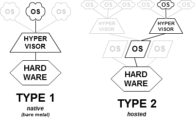

- [Abstract](#abstract)
- [Materials](#materials)
- [References](#references)
  - [Examples](#examples)
  - [Diagrams](#diagrams)
- [Prerequisites](#prerequisites)
  - [Cloud Computing](#cloud-computing)
  - [Storage](#storage)
  - [Cloud Service Types](#cloud-service-types)
  - [Router](#router)
  - [Switch](#switch)
  - [OSI (Open System Interconnection) Reference Model](#osi-open-system-interconnection-reference-model)
  - [TCP/IP Protocol Suite](#tcpip-protocol-suite)
  - [Subnet](#subnet)
  - [CIDR (Classless Inter-Domain Routing)](#cidr-classless-inter-domain-routing)
  - [Private Network](#private-network)
  - [VPN (Virtual Private Network)](#vpn-virtual-private-network)
  - [VPC (Virtual Private Cloud)](#vpc-virtual-private-cloud)
  - [Virtualization](#virtualization)
  - [Devops](#devops)
  - [AWS Region](#aws-region)
  - [AWS Availability Zone](#aws-availability-zone)
  - [Edge Location](#edge-location)
  - [Apache Hadoop](#apache-hadoop)
  - [HDFS (Hadoop Distributed FileSystem)](#hdfs-hadoop-distributed-filesystem)
  - [MapReduce](#mapreduce)
  - [공개키 암호화](#%ea%b3%b5%ea%b0%9c%ed%82%a4-%ec%95%94%ed%98%b8%ed%99%94)
- [Basic](#basic)
  - [VPC (Virtual Private Cloud)](#vpc-virtual-private-cloud-1)
    - [VPC](#vpc)
    - [Subnet](#subnet-1)
    - [Route Table](#route-table)
    - [Network ACL](#network-acl)
    - [Security Group](#security-group)
    - [Internet Gateway](#internet-gateway)
    - [DHCP options set](#dhcp-options-set)
  - [EC2 (Elastic Compute Cloud)](#ec2-elastic-compute-cloud)
    - [How to make a EC2 instance](#how-to-make-a-ec2-instance)
    - [How to scaleup EC2 instance Manually](#how-to-scaleup-ec2-instance-manually)
    - [ELB (Elastic Load Balancer)](#elb-elastic-load-balancer)
    - [How to scaleout EC2 instance Manually](#how-to-scaleout-ec2-instance-manually)
  - [IAM (Identity and Access Management)](#iam-identity-and-access-management)
  - [AWS Auto Scaling](#aws-auto-scaling)
  - [Certificate Manager](#certificate-manager)
  - [S3 (Simple Storage Service)](#s3-simple-storage-service)
  - [CloudFront](#cloudfront)
  - [RDS (Relational Database Service)](#rds-relational-database-service)
  - [SNS (Simple Notification Service)](#sns-simple-notification-service)
  - [SES (Simple Email Service)](#ses-simple-email-service)
  - [ElastiCachi](#elasticachi)
  - [Lambda](#lambda)
  - [API Gateway](#api-gateway)
  - [DynamoDB](#dynamodb)
  - [ElasticSearch Service](#elasticsearch-service)
  - [Kinesis](#kinesis)
  - [Route 53](#route-53)
  - [CloudWatch](#cloudwatch)
  - [Elastics Beanstalk](#elastics-beanstalk)
  - [Cloud Formation](#cloud-formation)
  - [Glacier](#glacier)
  - [CodeCommit](#codecommit)
  - [CodePipeline](#codepipeline)
  - [Code Deploy](#code-deploy)
  - [Storage Gateway](#storage-gateway)
  - [ECS (Elastic Container Service)](#ecs-elastic-container-service)
  - [ECR (Elastic Container Registry)](#ecr-elastic-container-registry)
  - [KMS (Key Management Service)](#kms-key-management-service)
- [Advanced](#advanced)
  - [How to use awscli on Windows](#how-to-use-awscli-on-windows)
- [Best Practices](#best-practices)
  - [Basic Web Service](#basic-web-service)
  - [Basic AWS Auto Scaling](#basic-aws-auto-scaling)
  - [Basic S3](#basic-s3)
  - [Basic RDS](#basic-rds)
  - [Basic VPC Design](#basic-vpc-design)
  - [NAT Gateway, Bastion Host](#nat-gateway-bastion-host)
  - [VPC Peering](#vpc-peering)
  - [Chatting Service](#chatting-service)
- [AWS-CLI](#aws-cli)
  - [Install](#install)
    - [Install awscli on macOS](#install-awscli-on-macos)
  - [Settings](#settings)
  - [S3](#s3)

----

# Abstract

aws 사용법에 대해 간략히 정리한다.

# Materials

* [AWS Services Overview - September 2016 Webinar Series @ slideshare](https://www.slideshare.net/AmazonWebServices/aws-services-overview-september-2016-webinar-series)
  * AWS serices overview
* [AWS @ 생활코딩](https://opentutorials.org/course/2717)
  * AWS 한글 설명
* [44bit](https://www.44bits.io/ko)
  * 클라우드블로그
* [아마존 웹 서비스를 다루는 기술](http://pyrasis.com/aws.html)
  * 오래되었지만 괜찮은 책
* [Amazon Web Services 한국 블로그](https://aws.amazon.com/ko/blogs/korea/tag/korea-techtips/)
* [Amazon Web Services 한국 DeepDive series @ youtube](https://www.youtube.com/user/AWSKorea/search?query=Dive)
* [AWS re:Invent 2018 DeepDive series @ youtube](https://www.youtube.com/results?search_query=AWS+re%3AInvent+2018+Deep+Dive)
* [AWS re:Invent 2018 Under the hood series @ youtube](https://www.youtube.com/results?search_query=AWS+re%3AInvent+2018+Under+the+hood)
* [AWS Summit 2019 | AWS 아키텍처 @ youtube](https://www.youtube.com/playlist?list=PLORxAVAC5fUWWpxC5TW10P35GpLBOKWKS)
* [AWS Summit 2019 | 게임 @ youtube](https://www.youtube.com/playlist?list=PLORxAVAC5fUXgqiJJKJ8h8E5BkrFXUS2j)
* [AWS Summit 2019 | AWS 기술트랙 1 @ youtube](https://www.youtube.com/watch?v=KKkK6d8Srik&list=PLORxAVAC5fUUoQB13KiV8ezs7cAfwSagC)
* [AWS Summit 2019 | AWS 기술트랙 2 @ youtube](https://www.youtube.com/watch?v=l7W_urK43aE&list=PLORxAVAC5fUX3c9KwLE9E-qZv7tXk-b3O)
* [AWS Summit 2019 | AWS 기술트랙 3 @ youtube](https://www.youtube.com/watch?v=QFeSXY3cL7Q&list=PLORxAVAC5fUUa8XFFLtB6aK4vgZhTKBLg)
* [AWS Summit 2019 | AWS 기술트랙 4 @ youtube](https://www.youtube.com/watch?v=Sf6j7PPHeeI&list=PLORxAVAC5fUUeaSHb91d5wpDGfR14uNCi)
* [AWS Summit 2019 | AWS 기술트랙 5 @ youtube](https://www.youtube.com/watch?v=nxgGk-PbXf0&list=PLORxAVAC5fUWZGawyaMyz8NepNGqHbHtZ)
* [AWS Summit 2019 @ youtube](https://www.youtube.com/playlist?list=PLORxAVAC5fUWyB6Hsk9ibYJHw97k1h6s9)

# References

## Examples

* [AWS 아키텍처 센터 @ aws](https://aws.amazon.com/ko/architecture/)
* [AWS examples by visual paradigm](https://online.visual-paradigm.com/diagram-examples/aws-architecture-diagram/?page=5)
  * 약 50 여개의 AWS 예들이 있다.
* [Amazon Web Service Examples Created by the Creately Team](https://creately.com/diagram-community/examples/t/aws-diagram)
  * 약 10 여개의 AWS 예들이 있다.

## Diagrams

* [cloudcraft](https://cloudcraft.co/)
  * 3d diagram
* [visual paradigm](https://online.visual-paradigm.com)
  * general diagram
* [creatly](https://creately.com/)

# Prerequisites

## Cloud Computing

컴퓨터의 연산을 PC 가 아닌 인터넷 즉 클라우드에서 처리하는 방식이다. 클라우드는 인터넷을 말한다. 드롭박스, 구글 드라이브, MS 윈드라이브 등이 해당한다.

## Storage 

* [storage](/storage/RADME.md)

## Cloud Service Types

* [SaaS vs PaaS vs IaaS: What’s The Difference and How To Choose](https://www.bmc.com/blogs/saas-vs-paas-vs-iaas-whats-the-difference-and-how-to-choose/)


<br/>

* On-Premises
  * Netwoking 부터 Appliations 까지 유저가 모두 관리해야 하는 개발 환경
* IaaS (Infrastructure as a service)
  * Networking 부터 Virtualization 까지 유저대신 관리해주는 서비스 이다. 유저는 O/S 부터 Applications 까지 관리한다.
  * DigitalOcean, Linode, Rackspace, Amazon Web Services (AWS), Cisco Metapod, Microsoft Azure, Google Compute Engine (GCE)
* PaaS (Platform as a service)
  * Networking 부터 Runtime 까지 유저대신 관리해주는 서비스 이다. 유저는 Data 부터 Applications 까지 관리한다.
  * AWS Elastic Beanstalk, Windows Azure, Heroku, Force.com, Google App Engine, Apache Stratos, OpenShift
* SaaS (Software as a service)
  * Networking 부터 Applications 까지 유저대신 관리해주는 서비스 이다. 유저는 별도로 관리할 필요가 없다.
  * Google Apps, Dropbox, Salesforce, Cisco WebEx, Concur, GoToMeeting
* FaaS (Function as a service)
  * 유저는 Function 만 제공하면 된다.
  * AWS Lambda 
* CaaS (Container as a service)
  * 유저는 서비스로 제공되는 경량의 가상컨테이너에 서비스를 배포한다.
  * AWS ECS

## Router

* 서로 다른 네트워크에 패킷을 전송하는 장비

## Switch

* 하나의 네트워크에 여러 대의 컴퓨터를 연결하는 장비
  
## OSI (Open System Interconnection) Reference Model

)

ISO (International Standard Organization) 에서 개발한 네트워크 모델이다. 컴퓨터 네트워크 프로토콜 디자인과 통신을 계층으로 나누어 설명했다. 1984 년에 ISO 가 ISO 7498, CCITT (ITU-T) 는 X.200 으로 출판하였다.

## TCP/IP Protocol Suite

* [Computer Network | TCP/IP Model @ geeksforgeeks](https://www.geeksforgeeks.org/computer-network-tcpip-model/)


----

1960 년대 말 DARPA (Defense Advanced Research Projects Agency) 가 수행한 연구개발의 산출물로 부터 탄생했다. DARPA 가 개발한 ARPANET 는 NCP (Network Control Program) 라는 프로토콜을 사용했다. 1983 년 TCP/IP 가 이를 대체하며 지금의 인터넷으로 진화했다.

Internet Protocol Suite 는 인터넷에서 컴퓨터들이 서로 정보를 주고 받는데 쓰이는 프로토콜의 모음이다. TCP, IP 가 가장 많이 쓰이기 때문에 TCP/IP Protocol Suite 라고도 한다. 

TCP/IP Protocol Suite 는 OSI 의 7 개 레이어 를 4 개로 줄였다.

## Subnet

IP 의 network 가 논리적으로 분할된 것이다. Subnet 을 만드는 것을 Subnetting 이라고 한다. Subnet 은 Subnet Mask 를 이용하여 만든다. 

Subnet 의 IP address 는 network number 혹은 routing prefix 와 rest field 혹은 host identifier 와 같이 두가지로 나뉘어 진다. 

routing prefix 는 `198.51.100.0/24` 와 같이 CIDR (Classless Inter-Domain Routing) 표기법으로 표현할 수 있다. `198.51.100.0/24` 의 subnet mask 는 `255.255.255.0` 이다.

## CIDR (Classless Inter-Domain Routing)

기존의 IP 주소 할당 방식이었던 네트워크 클래스를 대체하기 위해 IETF (Internet Engineering Task Force) 가 1993년 에 [RFC4632](https://tools.ietf.org/html/rfc4632) 라는 표준으로 개발한 IP 주소 할당 방법이다. 

`198.51.100.0/24` 와 같이 표기한다. `/24` 는 routing prefix 비트의 개수를 의미한다.

## Private Network

Private IP Address 를 사용하는 네트워크이다. IETF (Internet Engineering Task Force) 는 Private IP Address 를 위해 다음과 같은 IPv4 주소를 사용하도록 [RFC1918](https://tools.ietf.org/html/rfc1918) 라는 표준으로 IANA (Internet Assigned Numbers Authority) 를 지도했다.

| RFC 1918 name | IP address range | Number of addresses | Largest CIDR block (subnet mask) | Host ID size | Mask bits | Classful description | 
|--|--|--|--|--|--|--|
| 24-bit block | 10.0.0.0 - 10.255.255.255 | 16,777,216 | 10.0.0.0/8 (255.0.0.0) | 24 bits | 8 bits | single class A network |
| 20-bit block | 172.16.0.0 – 172.31.255.255 | 1,048,576 | 172.16.0.0/12 (255.240.0.0) | 20 bits | 12 bits | 16 contiguous class B networks |
| 16-bit block | 192.168.0.0 – 192.168.255.255 | 65,536 | 192.168.0.0/16 (255.255.0.0) | 16 bits | 16 bits | 256 contiguous class C networks |

## VPN (Virtual Private Network)

* [가상 사설망](https://namu.wiki/w/%EA%B0%80%EC%83%81%20%EC%82%AC%EC%84%A4%EB%A7%9D)

----

* 물리 적으로 여러 곳에 퍼져있는 컴퓨터들을 인터넷 네트워크와 암호화 기술을 이용하여 하나의 네트워크로 구성하는 것

## VPC (Virtual Private Cloud)

* [Amazon VPC란 무엇인가? @ aws](https://docs.aws.amazon.com/ko_kr/vpc/latest/userguide/what-is-amazon-vpc.html)
* [[AWS] 가장쉽게 VPC 개념잡기](https://medium.com/harrythegreat/aws-%EA%B0%80%EC%9E%A5%EC%89%BD%EA%B2%8C-vpc-%EA%B0%9C%EB%85%90%EC%9E%A1%EA%B8%B0-71eef95a7098)

----

* AWS 외부와는 격리된 가상의 사설 클라우드이다. 2011 년 8 월에 도입되었다. 
* VPC 를 하나 만들기 위해서는 다음과 같은 것들이 필요하다.
  * n 개의 subnet
  * subnet 끼리 통신을 위해 subnet 별 routing table
  * subnet 별 inbound, outbound 방화벽 설정을 위한 Network ACL
  * subnet 별 보안설정을 위한 Security Group
  * subnet 이 public internet 통신을 위한 Internet Gateway
  * DHCP options set

## Virtualization

* [가장 빨리 만나는 Docker 1장 - 1. 가상 머신과 Docker](http://pyrasis.com/book/DockerForTheReallyImpatient/Chapter01/01)
* [전가상화와 반가상화](https://m.blog.naver.com/PostView.nhn?blogId=brickbot&logNo=220413822823&proxyReferer=https%3A%2F%2Fwww.google.com%2F)
* [하이퍼바이저](https://blog.naver.com/brickbot/220413523885)
* [AWS re:Invent 2017: C5 Instances and the Evolution of Amazon EC2 Virtualization (CMP332)](https://www.youtube.com/watch?v=LabltEXk0VQ)
* ['SW와 HW의 분리'··· 하이퍼바이저의 이해](http://www.ciokorea.com/insider/36713)
* [What is a Hypervisor? @ youtube](https://www.youtube.com/watch?v=VtXNIy_noWg)
* [Hypervisors and Virtual Machines Implementation Insights on the x86 Architecture](https://www.usenix.org/system/files/login/articles/105498-Revelle.pdf)
* [Linux AMI 가상화 유형 @ aws](https://docs.aws.amazon.com/ko_kr/AWSEC2/latest/UserGuide/virtualization_types.html)
* [젠서버 구축과 설치를 통해 40계정 리니지2 3D게임 사양 @ youtube](https://www.youtube.com/watch?v=T3lQx-6_23Q)
  * xen 을 설치한 컴퓨터 한대로 리니지 2 클라이언트를 40 대 운용하는 방법 
* [Xen Project Beginners Guide](https://wiki.xenproject.org/wiki/Xen_Project_Beginners_Guide)
  * xen beginner 를 위한 페이지. virtualization 의 기반 이론을 설명한다.
* [AWS EC2 Virtualization 2017: Introducing Nitro](http://www.brendangregg.com/blog/2017-11-29/aws-ec2-virtualization-2017.html)
  * EC2 Virtualization 의 역사를 설명한다. 

----



* Hypervisor Virtualization 
  * 하이퍼바이저는 가상화를 관리하는 소프트웨어이다. VMM (Virtual Machine Monitor) 이라고도 한다. Type 1 (native or bare-metal), Type 2 (hosted) 와 같이 두가지 종류가 있다. 
  * Type 1 Hypervisor
    * H/W 위에 hypervisor 가 바로 설치된다. 
    * Xen, Citrix 의 XenServer, VMware 의 ESX Server, L4 마이크로커널, TRANGO, IBM 의 POWER 하이퍼바이저(PR/SM), 마이크로소프트의 하이퍼-V, 패러럴서버, 썬의 로지컬 도메인 하이퍼바이저 가 해당한다.
    * Xen 의 경우 Guest OS 를 domain 이라고 부른다. 특히 dom0 는 다른 Guest OS 를 컨트롤하는 특별한 domain 이다. 다른 Guest OS 는 domUs 라고 부른다.
    * Xen 의 경우 Type 1 Hypervisor 는 다시 PV (ParaVirtualization) 와 HVM (Hardware Virtualization Machine) 을 지원한다. HVM 은 Full Virtualization 이라고도 한다. 아마 다른 Type 1 Hypervisor 마찬가지 아닐까???
    * **PV (ParaVirtualization)**
      * Guest OS 는 special call 을 호출하여 Hypervisor 를 통해 CPU, Storage, Network 둥의 리소를 효율적으로 접근할 수 있다. 단, Guest OS 는 수정되어야 한다.  
    * **HVM (Hardware Virtualized Machine)**
      * HVM Guest OS 는 수정될 필요는 없다. Hypervisor 는 x86 emulator 를 Guest OS 에게 제공한다. 당연히 이 방법은 H/W 를 직접 접근하는 PV 보다 overhead 가 크다. 그러나 CPU 의 Vertual Technology (Intel VT, AMD-V, etc...)가 활성화 되면 효율적으로 운용할 수 있다. HVM 은 CPU 의 VT extention 이 지원되야 사용할 수 있다.
    * xen 은 PV 와 HVM 을 둘다 지원하기 때문에 성능을 개선하기 위해 둘을 다양하게 섞어서 사용할 수 있다. 예를 들어,  HVM with PV drivers, PVHVM (Paravirtualization on HVM), PVH 등이 가능하다.
  * Type 2 Hypervisor
    * H/W 위에 Host O/S 가 설치되고 Host O/S 위에 hypervisor 가 설치된다. 
    * VMware Server, VMware Workstation, VMware Fusion, QEMU, 마이크로소프트의 버추얼 PC 와 버추얼 서버, Oracle(SUN)의 버추얼박스, SWsoft 의 Parallels Workstation 과 Parallels Desktop 이 해당한다.
* Container Virtualization
  * 하드웨어에 Host O/S 를 설치하고 Host O/S 에 논리적인 영역 (컨테이너) 을 만들고 애플리케이션과 라이브러리등을 컨테이너 안에 넣어 가상화를 제공하는 것이다.
  * OpenVZ, LSC, Lunix vServer, FreeBSD Fail, Solaris Zones, Docker 등이 해당한다. 

## Devops

* [DevOps is a culture, not a role!](https://medium.com/@neonrocket/devops-is-a-culture-not-a-role-be1bed149b0)

----

개발팀과 운영팀이 서로 소통이 원활히 이루어질 수 있도록 하는 것을 의미한다.


## AWS Region

AWS 는 물리적으로 떨어진 지역에 여러 개의 클라우드 인프라를 운영한다. 이 지역을 region 이라고 한다.

## AWS Availability Zone

하나의 region 은 다시 여러개의 물리적인 Availability Zone 으로 나뉘어 진다. 하나의 region 안에서 서비스를 두개 이상의 Availability Zone 에 배치해 두면 가용성을 확보할 수 있다.

## Edge Location

CDN (Content Delivery Netowrk) 을 이루는 캐시 서버이다. AWS Cloud Front 가 해당한다.

## Apache Hadoop

* [하둡(Hadoop) 소개 및 기본 구성요소 설명 @ opentutorials](https://opentutorials.org/module/2926/17055)
* [hadoop @ TIL](/hadoop/README.md)

----

대용량 데이터를 분산 처리할 수 있는 자바 기반의 오픈 소스 프레임워크이다. 구글이 논문으로 발표한 GFS(Google File System)과 맵리듀스(MapReduce) 를 2005년 더그커팅이 제작한 구현체이다.

## HDFS (Hadoop Distributed FileSystem)

하둡 네트워크에 연결된 기기에 데이터를 저장하는 분산형 파일시스템

## MapReduce

대용량의 데이터 처리를 위한 분산 프로그래밍 모델 및 소프트웨어 프레임워크. 맵리듀스 프레임워크를 이용하면 대규모 분산 컴퓨팅 환경에서 대량의 데이터를 병렬로 분석 가능하다. 프로그래머가 직접 작성하는 맵과 리듀스 라는 두 개의 메소드로 구성된다.

## 공개키 암호화

* [crypto](/crypto/README.md)

# Basic

## VPC (Virtual Private Cloud)

* [만들면서 배우는 아마존 버추얼 프라이빗 클라우드(Amazon VPC) @ 44BITS](https://www.44bits.io/ko/post/understanding_aws_vpc)
* [AWS VPC를 디자인해보자(1) - Multi AZ와 Subnet을 활용한 고가용성 @ tistory](https://bluese05.tistory.com/45)
  * VPC, Subnet best practices

----

AWS 외부와는 격리된 가상의 사설 클라우드이다. EC2 를 실행하려면 반드시 VPC 가 하나 필요하다. VPC 는 하나의 region 에 속해야 한다. 그리고 하나의 VPC 는 여러개의 availability zone 을 소유한다. 보통 하나의 VPC 에 두개의 AZ 를 설정하고 하나의 AZ 는 public subnet, private subnet 으로 설정한다.

VPC 를 생성하기 위해서는 반드시 다음과 같은 것들을 함께 생성해야 사용이 가능하다.

```
1 VPC
n 서브넷 Subnet
1 라우트 테이블 Route Table
1 네트워크 ACL Network ACL
1 시큐리티 그룹 Security Group
1 인터넷 게이트웨이 Internet Gateway
1 DHCP 옵션셋 DHCP options set
```

### VPC

하나의 VPC 는 반드시 하나의 Region 에 속한다. 그리고 여러개의 AZ 를 소유할 수 있다. 즉 여러개의 AZ 에 걸쳐있다. 또한 최대 65536 개의 IP 를 할당할 수 있다. 기본 CIDR 블록은 `172.31.0.0/16` 이다. CIDR 블록은 private network 를 참고하여 설정한다. 그러나 하나의 VPC 는 65536 개의 IP 제한이 있으므로 주로 `10.10.0.0/16` 을 사용한다.

### Subnet

EC2 instance 의 네트워크를 설정할 때 반드시 하나의 VPC 와 하나의 Subnet 이 필요하다. VPC 가 논리적인 개념이라면 AZ 는 물리적인 개념이다. Subnet 는 반드시 하나의 AZ 에 포함된다.

### Route Table

Subnet 이 목적지를 찾기 위해 필요하다. 하나의 Route Table 은 VPC 의 여러 개의 Subnet 과 연결할 수 있다.

### Network ACL

하나의 Subnet 앞에서 설정해야하는 Virtual Firewall 이다.

### Security Group

하나의 EC2 instance 앞에서 설정해야 하는 Virtual Firewall 이다.

### Internet Gateway

Route Table 에 Internet Gateway 를 향하는 적절한 규칙을 추가해주면 특정 Subnet 이 인터넷과 연결된다. 그리고 인터넷을 사용하고자 하는 리소스는 반드시 public IP 를 가지고 있어야 한다.

### DHCP options set

???

## EC2 (Elastic Compute Cloud)

* [AWS EC2 @ 생활코딩](https://opentutorials.org/course/2717/11273)
* [더 빠른 게임시스템을 위하여 개선된 서비스들 - 김병수 솔루션즈 아키텍트, AWS :: AWS Summit Seoul 2019 @ slideshare](https://www.slideshare.net/awskorea/aws-aws-summit-seoul-2019-141161806)
* [EC2Instances.info](https://www.ec2instances.info/)
  * EC2 인스턴스 유형별 비교
* [aws 요금](https://aws.amazon.com/ko/ec2/pricing/)  

----

OS 가 설치된 machine 이다. 

### How to make a EC2 instance

* AMI 선택
  * `Ubuntu Server 18.04 LTS (HVM), SSD Volume Type`
* 인스턴스 유형 선택
  * `t2.micro`
  * 범용 : `A1, T3, T3a, T2 M5, M5a, M4`
  * 컴퓨팅 최적화 : `C5, C5n, C4`
  * 메모리 최적화 : `R5, R5a, R4, X1e, X1, u, z1d`  
  * 가속화된 컴퓨팅 : `P3, P2, G3, F1`
  * 스토리지 최적화 : `I3, I3en, D2, H1`
* 인스턴스 구성
  * `{인스턴스개수: 1}`
* 스토리지 추가
  * `8 GiB`
* 태그 추가
  * EC2 instance 의 meta information 이다.
  * `{Key: Name, Value: 웹서버}`
* 보안 그룹 구성
  * `SSH, HTTP, HTTPS` 추가
* 검토

putty 를 이용하여 public DNS 에 SSH 접속할 수 있다. user 는 `ubuntu`. EC2 기본적으로 Dynamic IP 이다. 만약 Static IP 를 사용하고 싶다면 Elastic IP 를 할당받아야 하고 이것은 유로이다. 

### How to scaleup EC2 instance Manually

기존의 EC2 instance 를 A 라 하자. 그리고 미리 만들어 놓은 AMI 를 이용하여 scaleup 한 EC2 instance 를 B 라 하자. A 가 사용하고 있는 Elastic IP 를 Disassociate 하고 이것을 B 에 Associate 한다.

### ELB (Elastic Load Balancer)

* [EC2 Scalability - Scale Out (ELB) @ 생활코딩](https://opentutorials.org/course/2717/11332)

----

EC2 들 앞에서 EC2 들의 로드를 분산한다. ELB 의 유형은 Application Load Balancer 와 Network Load Balancer 와 같이 2 가지가 있다. 기존의 L7, L4 라고 할 수 있다. 

Application Load Balancer 는 다음과 같은 과정으로 생성한다. 대부분의 과정은 EC2 와 상당히 유사하다.

* 로드 밸런서 구성
  * `ultrahigh-elb`
* 보안 설정 구성
* 보안 그룹 구성
* 라우팅 구성
* 대상등록
* 검토

### How to scaleout EC2 instance Manually

먼저 ELB 를 하나 생성하고 두개 이상의 EC2 instance 를 등록한다.

## IAM (Identity and Access Management)

[참고](https://www.44bits.io/ko/post/first_actions_for_setting_secure_account)

사용자와 권한을 담당한다. 주요 항목은 다음과 같다.

* 루트 사용자의 액세스 키 삭제(Delete your root access keys)
* 루트 사용자의 MFA 활성화(Activate MFA on your root account)
* 개별 IAM 사용자 생성(Create individual IAM users)
* 그룹을 사용하여 권한 할당(Use groups to assign permissions)
* IAM 비밀번호 정책 적용(Apply an IAM password policy)

## AWS Auto Scaling

* [EC2 Scalability - Auto Scaling @ 생활코딩](https://opentutorials.org/course/2717/11336)

----

EC2 instance 들을 자동으로 scaling 할 수 있다. Launch Configurations 과 Auto Scaling Groups 두가지를 설정해야 한다.

* Launch Configurations 
  * EC2 Instance 생성할 때와 유사하게 AMI 선택 및 configuration 들을 설정한다.
* Auto Scaling Groups
  * 

## Certificate Manager

* [AWS SSL 적용 방법 @ tistory](https://interconnection.tistory.com/21)

----

SSL/TLS 인증서 관리. ELB 로 HTTPS 를 제공할려면 설정이 필요하다.

## S3 (Simple Storage Service)

* [S3 콘솔을 통한 기본 조작 방법 @ 생활코딩](https://opentutorials.org/course/2717/11379)

----

bucket 은 디스크드라이브와 같다. 주요 command line 은 다음과 같다.

```
aws s3 ls
aws s3 rm
aws s3 mb # make bucket
aws s3 rb # remove bucket
aws s3 cp
aws s3 mv
aws s3 sync
```

## CloudFront

* [실전 Amazon S3와 CloudFront로 정적 파일 배포하기 @ aws](https://aws.amazon.com/ko/blogs/korea/amazon-s3-amazon-cloudfront-a-match-made-in-the-cloud/)
* [AWS2 - CloudFront @ 생활코딩](https://www.youtube.com/playlist?list=PLuHgQVnccGMDMQ1my6bVT-BPoo0LvnQMa)

CloudFront 는 CDN (Contents Delivery Network) 이다. 예를 들어, 특정 region 의 S3 bucket 을 전세계 유저들이 지연없이 다운 받을 수 있도록 캐싱하는 역할을 한다. 캐싱역할을 하는 엣지서버는 이곳 저곳 설치되어 있다.

## RDS (Relational Database Service)

* [RDS 서버 생성](https://opentutorials.org/course/2717/11808)
  * MariaDB 를 생성해 본다.

----

Mysql, MariaDB, PostgreSQL 등등을 런칭할 수 있는 서비스이다.

Multi-AZ Deployment 를 선택하면 여러개의 Availability Zone 에 replica 를 설정할 수 있다. replica 를 통해 가용성을 확보할 수 있을 뿐만 아니라 read operation 의 성능을 개선할 수 있다. free-tier 는 할 수 없다.

Modify Action 을 통해 Scale-up 할 수 있다. 그러나 Multi-AZ Deployment 가 설정되어 있어야 Rolling Scale-up 이 가능하다. 역시 Multi-AZ Deployment 가 설정되어 있어야 Scale-out 을 통해 read replica 를 할 수 있다.

Snapshot 를 만들어서 백업에 사용할 있다. 민감한 작업을 하기전에는 반드시 Snapshot 을 만들어 두자.

## SNS (Simple Notification Service)

???

## SES (Simple Email Service)

???

## ElastiCachi

redis, memcached 를 사용할 수 있다.

## Lambda

* [[AWS]Lambda의 시작 - 'Hello World' 출력하기](https://gun0912.tistory.com/60)
* [AWS Lambda: 가볍게 시작하기](https://hyunseob.github.io/2017/05/27/aws-lambda-easy-start/)

서버설정은 필요 없이 비지니스 로직을 실행할 수 있다. 함수만 작성하면 끝이다. coldstart 문제는 없을까? 
API Gateway 에서 routing 설정을 해야 외부에서 HTTP request 할 수 있다.

## API Gateway

* [[AWS]API Gateway - RESTful API만들기](https://gun0912.tistory.com/63)

HTTP URL 을 routing 할 수 있다. 예를 들어 `HTTP GET /user` 를 수신하면 `Lambda Hello` 혹은 `Lambda World` 등으로 routing 할 수 있다.

## DynamoDB

key value DB 이다.

## ElasticSearch Service

ElasticSearch, logstash, kibana 를 이용할 수 있다.

## Kinesis

kafka 를 이용할 수 있다.

## Route 53

DNS server 이다.

## CloudWatch

???

## Elastics Beanstalk

???

## Cloud Formation

aws 의 resource 들을 미리 정의된 template 를 통해 생성할 수 있는 서비스이다. 예를 들어 내가 디자인한 서비스의 AWS resource 들 즉 ELB, EC2, RDS, ElastiCachde 등을 [yaml](https://github.com/aws-samples/elasticache-refarch-chatapp/blob/master/cloudformation/chatapp.yaml) 파일에 기록할 수 있다. 그리고 그 파일을 실행해서 AWS resources 를 생성할 수 있다.

## Glacier

* [AWS Glacier는 뭐지? - AWS S3 와 Glacier 장단점 비교](https://bluese05.tistory.com/35?category=559701)

----

아카이브 백업 데이터를 주 목적으로 하는 스토리지 서비스이다. S3 와 비슷하지만 서비스의 목적이 다르다. S3 에 비해서 가격이 저렴하다. 그러나 검색 및 삭제를 마음대로 할 수는 없다.

## CodeCommit

* [AWS CodeCommit 어렵지 않아요](https://bluese05.tistory.com/32?category=559701)

----

AWS git repository 서비스이다. 주요 cli 사용법은 다음과 같다.

```bash
apt-get install python-pip
pip install awscli
aws --version
aws configure
apt-get install git
git config --global credential.help '!aws codecommit credential-help $@'
git config --global credential.Usehttppath true
git clone https://git-codecommit.us-east-1.amazonaws.com/v1/repos/myrepo

```

## CodePipeline

## Code Deploy

* [AWS 코드 서비스 특집 - 아마존 데브옵스 개발 방법 (윤석찬) :: AWS 월간 웨비나 @ youtube](https://www.youtube.com/watch?v=t6tTyDTpGoY)

## Storage Gateway

* [AWS Storage Gateway](https://bluese05.tistory.com/24?category=559701)

----

S3 를 iSCSI 방식으로 제공해 준다. S3 를 ISCSI 방식으로 처리하기 위해서는 Gateway Applicance 를 On-premise host 에 설치해야 한다. Gateway Appliance 는 AWS 에서 image 형태로 제공한다. VMware, Hyper-V, AWS EC2 를 지원한다.

## ECS (Elastic Container Service)

* [AWS EC2 Container Service(ECS) (1) - 구조와 특징](https://bluese05.tistory.com/52?category=559701)

----

docker 를 사용할 수 있게 해주는 서비스이다. 특이하게도 EC2 instance 위에서 docker 가 실행된다.

## ECR (Elastic Container Registry)

* [AWS EC2 Container Registry(ECR) 어렵지 않아요](https://bluese05.tistory.com/51?category=559701)

----

dockerhub 와 같다. 주요 사용법은 다음과 같다.

```bash
pip install awscli
aws ecr help
aws configure
aws ecr get-login --region us-east-1
aws login -u AWS -p
docker images
docker tag ubuntu:latest XXXXXXXX.dkr.ecr.us-east-1.amazonaws.com/repo-test:latest
docker images
docker push XXXXXXXX.dkr.ecr.us-east-1.amazonaws.com/repo-test:latest
docker pull XXXXXXXX.dkr.ecr.us-east-1.amazonaws.com/repo-test:latest
```

## KMS (Key Management Service)

* [AWS KMS 어렵지 않아요](https://bluese05.tistory.com/71?category=559701)

----

암호화 복호화 할 때 사용할 key 를 관리하는 서비스이다.

# Advanced

## How to use awscli on Windows

* [참고](https://www.44bits.io/ko/post/aws_command_line_interface_basic)

다음과 같이 설치한다.

```
choco install awscli
```

* [키발급 참고](https://www.44bits.io/ko/post/publishing_and_managing_aws_user_access_key)

액세스키, 시크릿키를 발급받는다. 다음과 같이 설정하고 접속한다.

```bash
$ aws configure
AWS Access Key ID [None]: AKIAJEXHUYCTEHM2D3S2A
AWS Secret Access Key [None]: 3BqwEFsOBd3vx11+TOHhI9LVi2
Default region name [None]:ap-northeast-2
Default output format [None]:
```

configure 된 내용은 `~/.aws/config, ~/.aws/credentials` 로 저장된다.

* `~/.aws/config`

```
[default]
region = ap-northeast-2
```

* `~/.aws/credentials`

```
[default]
aws_secret_access_key = AKIAJEXHUYCTEHM2D3S2A
aws_access_key_id = 3BqwEFsOBd3vx11+TOHhI9LVi2
```

# Best Practices

## Basic Web Service

* [AWS - EC2 12-4 : ELB 적용 @ youtube](https://www.youtube.com/watch?v=T_VFEQPuRjw)
  * ELB 에 하나에 APM EC2 instance 두개를 연결한다. 그리고 부하측정을 위한 AB EC2 instance 하나를 생성한다.

## Basic AWS Auto Scaling

* [EC2 Scalability - Auto Scaling](https://opentutorials.org/course/2717/11336)
  * ELB 에 webapp EC2 instance 를 Auto Scaling 한다. 그리고 부하측정을 위한 AB EC2 instance 를 하나 생성한다. SNS 를 통해 알람을 수신한다.

## Basic S3  

* [Nodejs를 위한 S3 SDK](https://opentutorials.org/course/2717/11797)
  * S3 에 파일을 업로드하는 node.js app 을 제작한다.

## Basic RDS

* [PHP를 위한 RDS](https://opentutorials.org/course/2717/11815)
  * PHP 를 이용하여 RDS 를 접속한다.

## Basic VPC Design

* [만들면서 배우는 아마존 버추얼 프라이빗 클라우드(Amazon VPC)](https://www.44bits.io/ko/post/understanding_aws_vpc)
  * 하나의 VPC 에 두개의 AZ 를 할당한다.
  * 하나의 AZ 는 public, private subnet 을 각각 하나씩 갖는다.
  * webapp EC2 instance 두개를 두개의 AZ 의 public subnet 에 각각 실행한다.
  * RDS instance Master, Slace 를 두개의 AZ 의 private subnet 에 각각 실행한다.

## NAT Gateway, Bastion Host

* [SSH 프로토콜과 Tunneling 이해하기](https://swalloow.github.io/ssh-tunneling)

----

* [AWS VPC를 디자인해보자(3) - NAT Gateway 와 Bastion host](https://bluese05.tistory.com/48)
  * NAT Gateway 를 이용해서 Private Subnet 과 통신해 본다.
  * Bastion host 를 설정하고 SSH Tunneling 을 통해 VPC 외부에서 접속해 보자.
  > * Bastion host public IP : `52.100.1.1`
  > * Target Instance Private IP : `10.10.101.225`
  > * ssh tunneling : `ssh -i key.pem -L 22:10.10.101.225:22 ubuntu@52.100.1.1`
  > * ssh connect : `ssh -i key.pem ubuntu@localhost`

## VPC Peering

* [AWS VPC를 디자인해보자(4) - VPC Peering을 활용한 Multi VPC 사용하기](https://bluese05.tistory.com/49)
  * 서로다른 VPC 를 연결하는 것을 VPC Peering 이라고 한다.

## Chatting Service

* [Amazon ElastiCache(Redis)를 이용한 채팅 애플리케이션 구성 방법](https://aws.amazon.com/ko/blogs/korea/how-to-build-a-chat-application-with-amazon-elasticache-for-redis/)
  * node.js, redis 를 이용한 채팅 예제
  * [src](https://github.com/aws-samples/elasticache-refarch-chatapp)

# AWS-CLI

## Install

### Install awscli on macOS

* [AWS 커맨드라인 인터페이스(awscli) 기초](https://www.44bits.io/ko/post/aws_command_line_interface_basic)

```bash
$ brew install awscli
$ aws --version
```

## Settings

* [AWS 커맨드라인 인터페이스(awscli) 기초](https://www.44bits.io/ko/post/aws_command_line_interface_basic)

```bash
$ aws config
```

## S3

* [AWS CLI에서 상위 수준(s3) 명령 사용](https://docs.aws.amazon.com/ko_kr/cli/latest/userguide/cli-services-s3-commands.html)

```bash
$ aws s3 help
## make a bucket
$ aws s3 mb s3://bucket-name
$ aws s3 ls
$ aws s3 ls s3://bucket-name
$ aws s3 ls s3://bucket-name/path/
## delete a bucket
$ aws s3 rb s3://bucket-name
$ aws s3 rb s3://bucket-name --force
## copy a bucket
#  copy a object to a bucket and grant a read perssion to everyone and grant a full perssion to a account which is connected with user@example.com
$ aws s3 cp file.txt s3://my-bucket/ --grants read=uri=http://acs.amazonaws.com/groups/global/AllUsers full=emailaddress=user@example.com
#  copy a object to a bucket and set storage class
$ aws s3 cp file.txt s3://my-bucket/ --storage-class REDUCED_REDUNDANCY
## sync a bucket
#  sync . with a bucket
$ aws s3 sync . s3://my-bucket/path
```
