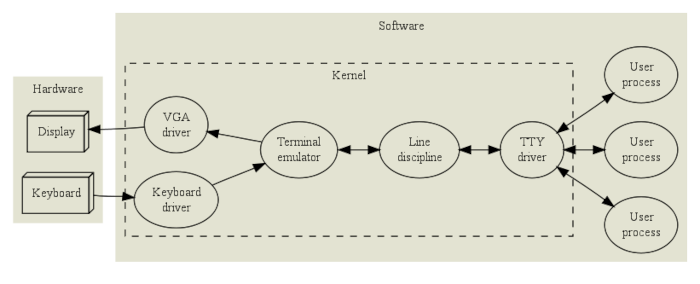

- [Abstract](#abstract)
- [References](#references)
- [Shell Metachars](#shell-metachars)
- [Basic Usages](#basic-usages)
- [Basic Shell Features](#basic-shell-features)
  - [Shell Syntax](#shell-syntax)
    - [Shell Operation](#shell-operation)
    - [Quoting](#quoting)
      - [Escape Character](#escape-character)
      - [Single Quotes](#single-quotes)
      - [Double Quotes](#double-quotes)
      - [ANSI-C Quoting](#ansi-c-quoting)
      - [Locale-Specific Translation](#locale-specific-translation)
    - [Comments](#comments)
  - [Shell Commands](#shell-commands)
    - [Reserved Words](#reserved-words)
    - [Simple Commands](#simple-commands)
    - [Pipelines](#pipelines)
    - [Lists of Commands](#lists-of-commands)
    - [Compound Commands](#compound-commands)
      - [Looping Constructs](#looping-constructs)
      - [Conditional Constructs](#conditional-constructs)
      - [Grouping Commands](#grouping-commands)
    - [Coprocesses](#coprocesses)
    - [GNU Parallel](#gnu-parallel)
  - [Shell Functions](#shell-functions)
  - [Shell Parameters](#shell-parameters)
    - [Positional Parameters](#positional-parameters)
    - [Special Parameters](#special-parameters)
  - [Shell Expansions](#shell-expansions)
    - [Brace Expansion](#brace-expansion)
    - [Tilde Expansion](#tilde-expansion)
    - [Shell Parameter Expansion](#shell-parameter-expansion)
    - [Command Substitution](#command-substitution)
    - [Arithmetic Expansion](#arithmetic-expansion)
    - [Process Substitution](#process-substitution)
    - [Word Splitting](#word-splitting)
    - [Filename Expansion](#filename-expansion)
      - [Pattern Matching](#pattern-matching)
    - [Quote Removal](#quote-removal)
  - [Redirections](#redirections)
    - [Redirecting Input](#redirecting-input)
    - [Redirecting Output](#redirecting-output)
    - [Appending Redirected Output](#appending-redirected-output)
    - [Redirecting Standard Output and Standard Error](#redirecting-standard-output-and-standard-error)
    - [Appending Standard Output and Standard Error](#appending-standard-output-and-standard-error)
    - [Here Documents](#here-documents)
    - [Here Strings](#here-strings)
    - [Duplicating File Descriptors](#duplicating-file-descriptors)
    - [Moving File Descriptors](#moving-file-descriptors)
    - [Opening File Descriptors for Reading and Writing](#opening-file-descriptors-for-reading-and-writing)
  - [Executing Commands](#executing-commands)
    - [Simple Command Expansion](#simple-command-expansion)
    - [Command Search and Execution](#command-search-and-execution)
    - [Command Execution Environment](#command-execution-environment)
    - [Environment](#environment)
    - [Exit Status](#exit-status)
    - [Signals](#signals)
  - [Shell Scripts](#shell-scripts)
- [Shell Builtin Commands](#shell-builtin-commands)
  - [Bourne Shell Builtins](#bourne-shell-builtins)
  - [Bash Builtin Commands](#bash-builtin-commands)
  - [Modifying Shell Behavior](#modifying-shell-behavior)
    - [The Set Builtin](#the-set-builtin)
    - [The Shopt Builtin](#the-shopt-builtin)
  - [Special Builtins](#special-builtins)
- [Shell Variables](#shell-variables)
  - [Bourne Shell Variables](#bourne-shell-variables)
  - [Bash Variables](#bash-variables)
- [Bash Features](#bash-features)
  - [Invoking Bash](#invoking-bash)
  - [Bash Startup Files](#bash-startup-files)
  - [Interactive Shells](#interactive-shells)
    - [What is an Interactive Shell?](#what-is-an-interactive-shell)
    - [Is this Shell Interactive?](#is-this-shell-interactive)
    - [Interactive Shell Behavior](#interactive-shell-behavior)
  - [Bash Conditional Expressions](#bash-conditional-expressions)
  - [Shell Arithmetic](#shell-arithmetic)
  - [Aliases](#aliases)
  - [Arrays](#arrays)
  - [The Directory Stack](#the-directory-stack)
    - [Directory Stack Builtins](#directory-stack-builtins)
  - [Controlling the Prompt](#controlling-the-prompt)
  - [The Restricted Shell](#the-restricted-shell)
  - [Bash POSIX Mode](#bash-posix-mode)
  - [Shell Compatibility Mode](#shell-compatibility-mode)
- [Job Control](#job-control)
  - [Job Control Basics](#job-control-basics)
  - [Job Control Builtins](#job-control-builtins)
  - [Job Control Variables](#job-control-variables)
- [Command Line Editing](#command-line-editing)
  - [Introduction to Line Editing](#introduction-to-line-editing)
  - [Readline Interaction](#readline-interaction)
    - [Readline Bare Essentials](#readline-bare-essentials)
    - [Readline Movement Commands](#readline-movement-commands)
    - [Readline Killing Commands](#readline-killing-commands)
    - [Readline Arguments](#readline-arguments)
    - [Searching for Commands in the History](#searching-for-commands-in-the-history)
  - [Readline Init File](#readline-init-file)
    - [Readline Init File Syntax](#readline-init-file-syntax)
    - [Conditional Init Constructs](#conditional-init-constructs)
    - [Sample Init File](#sample-init-file)
  - [Bindable Readline Commands](#bindable-readline-commands)
    - [Commands For Moving](#commands-for-moving)
    - [Commands For Manipulating The History](#commands-for-manipulating-the-history)
    - [Commands For Changing Text](#commands-for-changing-text)
    - [Killing And Yanking](#killing-and-yanking)
    - [Specifying Numeric Arguments](#specifying-numeric-arguments)
    - [Letting Readline Type For You](#letting-readline-type-for-you)
    - [Keyboard Macros](#keyboard-macros)
    - [Some Miscellaneous Commands](#some-miscellaneous-commands)
  - [Readline vi Mode](#readline-vi-mode)
  - [Programmable Completion](#programmable-completion)
  - [Programmable Completion Builtins](#programmable-completion-builtins)
  - [A Programmable Completion Example](#a-programmable-completion-example)
- [Using History Interactively](#using-history-interactively)
  - [Bash History Facilities](#bash-history-facilities)
  - [Bash History Builtins](#bash-history-builtins)
  - [History Expansion](#history-expansion)
    - [Event Designators](#event-designators)
    - [Word Designators](#word-designators)
    - [Modifiers](#modifiers)
- [Installing Bash](#installing-bash)
  - [Basic Installation](#basic-installation)
  - [Compilers and Options](#compilers-and-options)
  - [Compiling For Multiple Architectures](#compiling-for-multiple-architectures)
  - [Installation Names](#installation-names)
  - [Specifying the System Type](#specifying-the-system-type)
  - [Sharing Defaults](#sharing-defaults)
  - [Operation Controls](#operation-controls)
  - [Optional Features](#optional-features)
- [Job Control Advanced](#job-control-advanced)
  - [Job Control](#job-control-1)
    - [Job Id and Job specification](#job-id-and-job-specification)
    - [Session and Job](#session-and-job)
    - [Jobspec vs Pid](#jobspec-vs-pid)
    - [Job Control Builtins](#job-control-builtins-1)
    - [Job Control Keys](#job-control-keys)
    - [Input and Output](#input-and-output)
    - [Background job 은 subshell 에서 실행된다.](#background-job-은-subshell-에서-실행된다)
    - [Script 파일 실행 중에 background 로 실행](#script-파일-실행-중에-background-로-실행)
    - [Shell 이 종료되면 background job 은 어떻게 되는가?](#shell-이-종료되면-background-job-은-어떻게-되는가)
  - [Session and Process Group](#session-and-process-group)
    - [조회하고 신호보내기](#조회하고-신호보내기)
    - [실행중인 스크립트를 종료하는 방법](#실행중인-스크립트를-종료하는-방법)
    - [새로운 sid 로 실행하기](#새로운-sid-로-실행하기)
    - [pgid 를 변경하여 child process 를 실행](#pgid-를-변경하여-child-process-를-실행)
  - [Process State Codes](#process-state-codes)
  - [TTY](#tty)
    - [입출력 장치 사용의 구분](#입출력-장치-사용의-구분)
    - [Controlling Terminal](#controlling-terminal)
    - [`/dev/tty`](#devtty)
    - [Configuring TTY device](#configuring-tty-device)
    - [Reset Command](#reset-command)
    - [Control Keys](#control-keys)
    - [End of file](#end-of-file)
    - [Race condition](#race-condition)
    - [SIGHUP Signal](#sighup-signal)
  - [Mutual Exclusion](#mutual-exclusion)
    - [flock](#flock)
    - [flock 의 직접 명령 실행](#flock-의-직접-명령-실행)
    - [Lock propagation](#lock-propagation)
    - [Lock, lockfile](#lock-lockfile)
- [Signals](#signals-1)
  - [Signal List](#signal-list)
  - [kill](#kill)
  - [Trap](#trap)
- [Short Cuts](#short-cuts)
- [Problems](#problems)
- [Style Guide](#style-guide)


-------------------------------------------------------------------------------

# Abstract

[bash reference manual |
gnu](https://www.gnu.org/software/bash/manual/bash.html) 을 읽고 정리한다.

# References

* [GitHub Enterprise Backup Utilities | github](https://github.com/github/backup-utils)
  * source code 를 참고할 만 하다. 
* [Bash script](https://mug896.github.io/bash-shell/index.html)
  * 한글 가이드
* [bash reference manual | gnu](https://www.gnu.org/software/bash/manual/bash.html)
* [Advanced Bash-Scripting Guide](http://www.tldp.org/LDP/abs/html/index.html)
* [bash repo](https://savannah.gnu.org/git/?group=bash)

# Shell Metachars

metachars 는 command 와 다르게 처리되기 때문에 command line 에 포함하는 경우
escape 하거나 quote 해서 사용해야 한다.

```sh
(    )    `    |    &    ;        # Command substitution
&&   ||                           # AND, OR 
<    >    >>                      # Redirection 
*    ?    [     ]                 # Glob 
"    '                            # Quote 
\    $      
=    +=                            
```

# Basic Usages

```bash
$ bash  # From zsh

# help (shell builtin)
# Display helpful information about builtin commands.
$ help  
$ help echo
# Display the possible completions depending on the options.
$ help compgen
# Run a shell builtin. 
$ help builtin

# type (shell builtin)
# For each NAME, indicate how it would be interpreted 
# if used as a command name.
$ help type  # bash-builtin
$ type ssh
ssh is /usr/bin/ssh
$ type caller
caller is a shell builtin
$ type time
time is a shell keyword
$ type compgen
compgen is a shell builtin
$ type builtin
builtin is a shell builtin

# command (shell builtin)
# Runs COMMAND with ARGS ignoring shell functions.
# Check whether the command is installed.
$ command -v git-lfs
/usr/local/bin/git-lfs

# compgen (shell builtin)
# Display the possible completions depending on the options.
# Show keywords
$ compgen -k | column
if              elif            esac            while           done            time            !               coproc
then            fi              for             until           in              {               [[
else            case            select          do              function        }               ]]

# Show builtins
$ compgen -b | column
.               caller          dirs            false           kill            pwd             source          ulimit
:               cd              disown          fc              let             read            suspend         umask
[               command         echo            fg              local           readarray       test            unalias
alias           compgen         enable          getopts         logout          readonly        times           unset
bg              complete        eval            hash            mapfile         return          trap            wait
bind            compopt         exec            help            popd            set             true
break           continue        exit            history         printf          shift           type
builtin         declare         export          jobs            pushd           shopt           typeset

# File name can be anything except "NUL, /" on linux
$ echo "hello world" > [[]].txt

# '-' can be stdin for input
$ echo hello world | cat -
# '-' can be stdout for output
$ echo hello world | cat a.txt -
$ seq 10 | paste - - -

# > 
# Redirect the stdout of a command to a file. 
# Overwrite the file if it already exists.
$ echo "foo" > a.txt

# <
# Redirect file contents to stdin of command.
$ cat < a.txt

# >>
# Redirect and append stdout of a command to a file
$ echo "foo" >> a.txt

# 2>
# Redirect the stderr of a command to a file
$ echo "foo" 2> a.txt
$ abc 2> a.txt || cat a.txt
bash: abc: command not found

# 2>>
# redirect and append the stderr of a command to a file
$ echo "foo" 2>> a.txt

# &>
# redirect stdout, stderr of a command to a file
$ echo "foo" &> a.txt
$ abc &> a.txt || cat a.txt
bash: abc: command not found

# 1>&2
# Redirect stdout of a command to stderr
foo=$(echo "foo" 1>&2)
$ echo $foo

# 2>&1
# Redirect stderr of a command to stdout
$ foo > /dev/null
bash: foo: command not found
$ foo > /dev/null 2>&1
$ foo 2> /dev/null

# |
# Redirect stdout of first command to stdin of other command
$ ls -al | grep foo

# $
$ foo="hello world"
$ echo $foo

# ``
# Command substitution
$ echo `date`

# $()
# The alternative form of command substitution
$ echo $(date)

# &&, ||
# Execute several commands
#
# If 1st command result is true, run 2nd command.
# If 1st command result is false, done.
$ make && make install           
# If 1st command result is true, done.
# If 1st command result is false, run 2nd command.
$ echo "hello" || echo "world"   

# ;
# Execute several commands on a line
$ false; echo "foo"

# ''
# Full quoting (single quoting)
# 'STRING' preserves all special characters within STRING. 
# This is a stronger form of quoting than "STRING".
$ echo '$USER'
$USER
$ echo "$USER"
davidsun

# ""
# Partial quoting (double quoting)
# "STRING" preserves (from interpretation) 
# most of the special characters within STRING.
# except "$, `, \"
$ echo "foo"
$ echo "$USER"
$ echo "Now is $(date)"
Now is 2023년 7월 25일 화요일 17시 04분 33초 KST
$ echo "Now is `date`"
Now is 2023년 7월 25일 화요일 17시 04분 33초 KST

# "''"
$ bash -c "/bin/echo foo 'bar'"
foo bar

# \" \$foo
$ bash -c "/bin/echo '{ \"user\" : \"$USER\" }'"
{ "user" : "david.s" }
$ echo "\$foo \" \`"
$foo " `

# $
# Variable substitution
$ msg="bar"
$ echo "foo $msg"

# ${}
# Parameter substitution
# The status of variable can be unset, NUL, set.
# :- for unset, NUL
# -  for unset
#
# foo is unset
$ unset foo 
$ echo ${foo:-"aaa"}
aaa
$ echo ${foo-"aaa"}
aaa
# foo is NUL
$ foo= 
$ echo ${foo:-"aaa"}
aaa
$ echo ${foo-"aaa"}

# \
# Represent a command in several lines
$ echo "foo"
$ echo \
  "foo"

# Brace expansion
# {1..10}
# 
$ echo {1..10}
# {string1,string2}
#
$ cp {foo.txt,bar.txt} a/

# Looping constructs
# until, while, for, break, continue
$ until test-commands; do consequent-commands; done
$ while test-commands; do consequent-commands; done
$ for name [ [in [words …] ] ; ] do commands; done
$ for (( expr1 ; expr2 ; expr3 )) ; do commands ; done

# while..do..done
while true
do
  echo "foo"
  sleep 1
done
while true; do echo "foo"; sleep 1; done

# for..do..done
for i in {1..10}
do 
  echo ${i}
done
for i in {1..10}; do echo ${i}; done

for (( i=0; i < 10; i++ ))
do
  echo ${i}
done
for (( i=0; i<10; i++ )); do echo $i; done

NUM=(1 2 3)
for i in ${NUM[@]}
do
  echo ${i}
done
for i in ${NUM[@]}; do echo ${i}; done

# Conditional consructs:
#   if, case, select, ((...)), [[...]]

# if
# comparison of numbers
# -eq, -ne, -gt, -ge, -lt, -le
# comparison of strings
# =(==), !=, -z(null), -n(not null)
if [ $a -eq $b ]; then
  echo $a
fi

# Grouping commands : (), {}
# (command line) : command line execute on subshell environment.
$ ( while true; do echo `date`; sleep 1; done )
$ pstree
# {command line} : command line execute on same shell environment.
$ { while true; do echo `date`; sleep 1; done }
$ pstree

# The status of variable can be unset, null, not-null.
# unset state
$ declare A
$ local A
# null state
$ A=
$ A=""
$ A=''
# not-null state
$ A=" "
$ A="hello"
$ A=123

# function 은 command 들을 그룹화 하는 방법이다. 그룹의 이름을 사용하면 
# 그룹안의 commands를 실행할 수 있다.
# name () compound-command [ redirections ]
$ H() { echo "hello"; }; H; echo "world";
# function name [()] compound-command [ redirections ]
$ function H() { echo "hello"; }; H; echo "world";

# '*', '?', '[]' 과 같은 glob characters 을 이용하여 filename, case, 
# parameter expansion, [[]] expression 등에서 pattern matching 이 
# 가능하다.
# filename
$ ls *.[ch]
# [[]] expression
$ [[ $A = *.tar.gz ]]; echo $?
$ [[ $A = *dog\ cat* ]]; echo $?

# shell file 의 첫줄에서 스크립트를 실행할 command line 을 
# shabang line 이라고 한다. 옵션은 하나로 제한된다.
#!/bin/bash
#!/bin/sed -f
#!/usr/bin/awk -f
#!/usr/bin/perl -T

# env 는 PATH 환경변수에서 python 을 찾아보고 있다면 실행한다.
# python 이 어디에 설치되어 있던 PATH 환경변수에서 검색만 되면
# 실행할 수 있다. 시스템에 종속적이지 않다.
# execvp() 로 program name 을 실행한다.
# execvp() 는 프로그램을 PATH 에서 검색하여 실행한다.
# https://github.com/coreutils/coreutils/blob/master/src/env.c
#!/usr/bin/env python

# <<<
# Redirect a string to stdin of a command
$ cat <<< "I am $USER"

# <<EOF EOF
# Redirect several lines to stdin of a command
$ cat > a.txt <<EOF
I am the man.
HOST is ${HOSTNAME}
USER is ${USER}
EOF

# export
$ export foo=bar

# printf
$ Message1="foo"
$ Message2="bar
$ printf "%s %s \n" $Message1 $Message2

# sed
$ sed -i "s/foo/bar/g" a.txt
```

# Basic Shell Features

## Shell Syntax
### Shell Operation

shell 이 command 를 읽고 실행하는 과정은 다음과 같다.

* commands 및 arguments 를 읽어 들인다.
* 읽어 들인 commands 를 quoting 과 동시에 metacharaters 를 구분자로 words 와
  operators 로 쪼갠다. 이때 alias expansion 이 수행된다.
* 토큰들을 읽어서 simple, compound commands 를 구성한다.
* 다양한 shell expansion 이 수행되고 expanded tokens 는 파일이름, 커맨드, 인자로
  구성된다.
* redirection 을 수행하고 redirection operators 와 operands 를 argument list
  에서 제거한다.
* command 를 실행한다.
* 필요한 경우 command 가 실행 완료될 때까지 기다리고 exit status 를 수집한다.

### Quoting
#### Escape Character

The escape character (`\`) is used to remove the special meaning of the character
immediately after it.

```bash
$ echo "This is a quote: \""
This is a quote: "
```

#### Single Quotes

Single quotes (`'`) preserve the literal value of each character within the
quotes.

```bash
$ echo 'Hello, $USER!'
Hello, $USER!
```

#### Double Quotes

Double quotes (`"`) preserve the literal value of all characters within the
quotes, except for `$`, `` , and `\`.

```bash
$ echo "Hello, $USER!"
Hello, <username>!
```
#### ANSI-C Quoting

Using `$''` allows interpreting certain escaped characters according to the
ANSI-C standard.

```bash
$ echo $'Hello,\nWorld!'
Hello,
World!
```

#### Locale-Specific Translation

Using `$""` allows translating strings according to the current locale settings.

```bash
# assuming a Spanish locale
$ echo $"Hello, World!"
¡Hola, Mundo!
```
### Comments

Comments start with the `#` character and continue until the end of the line.

```bash
# This is a comment
echo "This is not a comment"
```

## Shell Commands

### Reserved Words

There are reserved words such as `if`, `then`, `else`, `elif`, `fi`, `case`,
`esac`, `for`, `select`, `while`, `until`, `do`, `done`, `in`, `function`.

```bash
if [ $USER == "root" ]; then
  echo "You are the root user"
fi
```

### Simple Commands

A simple command is a sequence of words separated by spaces or tabs.

```bash
$ ls -l
```
### Pipelines

A **pipeline** is a sequence of commands separated by the `|` operator. The output
of the first command is passed as input to the second command.

```
$ ls -l | grep ".txt"
```

### Lists of Commands

Lists of commands are sequences of commands that are executed sequentially,
possibly separated by the `;`, `&`, `&&`, or `||` operators.

```bash
$ echo "Hello,"; echo " World!"
```

### Compound Commands

#### Looping Constructs

There are several looping constructs: `for`, `while`, `until`.

```bash
for i in {1..3}; do
  echo "$i"
done
```

#### Conditional Constructs

Several conditional constructs, like the `if`, `else`, `elif` branches, and
`case` statements.

```bash
number=5
if [ $number -eq 3 ]; then
  echo "Number is 3"
elif [ $number -eq 5 ]; then
  echo "Number is 5"
else
  echo "Number is not 3 or 5"
fi
```

#### Grouping Commands

Grouping commands can be done with `{}` or `()`.

* `{}` execute commands in same shell.
* `()` execute commands in sub shell.

```bash
$ { echo "Hello,"; echo " World!"; }
```

### Coprocesses

Coprocesses are a form of parallel execution, allowing a script to execute
commands in the background and communicate with them via named pipes.

```bash
coproc { sleep 2; echo "Hello from a coprocess!"; }
read -r line <&"${COPROC[0]}"
echo "Received: $line"
```

### GNU Parallel

GNU Parallel allows executing commands in parallel, making use of multiple CPU
cores to speed up execution.

```bash
$ parallel 'echo {}' ::: 1 2 3 4
```

## Shell Functions

Functions, once defined, act like commands that can be called with or without
arguments.

```bash
# Functions are declared using this syntax:
fname () compound-command [ redirections ]
function fname [()] compound-command [ redirections ]
```

```bash
greet() {
  echo "Hello, $1!"
}

greet "World"
```

## Shell Parameters

### Positional Parameters

Positional Parameters are numbered variables that store command line arguments,
represented by `$n`, where `n` is the position of the arguments.

```bash
#!/bin/bash
echo "First argument: $1"
echo "Second argument: $2"
echo "Third argument: $3"

# Input: ./script.sh apple banana cherry
# Output:
# First argument: apple
# Second argument: banana
# Third argument: cherry
```

### Special Parameters

Special Parameters are special characters used to represent specific shell
values or elements.

```bash
$*: All positional parameters, represented as a single string
$@: All positional parameters, represented as separate strings
$#: Number of arguments passed
$$: Process ID of the current shell
$!: Process ID of the last command executed
$?: Exit status of the last command executed
```

## Shell Expansions

Shell Expansions are transformations applied to shell commands and allow complex
operations in the command line.

### Brace Expansion

Brace Expansion generates multiple text strings by iterating over the provided
values.

```bash
mkdir test_{01..03} 
# Creates test_01, test_02, test_03.
```

### Tilde Expansion

Tilde Expansion substitutes the tilde (`~`) with the value of the home directory.

```bash
cd ~/Downloads 
# Navigates to the user's Downloads folder.
```

### Shell Parameter Expansion

Shell Parameter Expansion substitutes parameter values with their equivalent
values.

`${parameter:-word}`: If parameter is unset or null, this expansion returns the
value of word. Otherwise, it returns the value of parameter.

```bash
VAR=
DEFAULT="hello"
echo ${VAR:-$DEFAULT}  # Output: hello
VAR="world"
echo ${VAR:-$DEFAULT}  # Output: world
```

`${parameter-word}`: If parameter is unset, this expansion returns the
value of word. Otherwise, it returns the value of parameter.

```bash
VAR=
DEFAULT="hello"
echo ${VAR-$DEFAULT}  # Output:
VAR="world"
echo ${VAR-$DEFAULT}  # Output: world
```

`${parameter:=word}`: If parameter is unset or null, this expansion assigns the
value of word to parameter and returns the value.

```bash
VAR=
DEFAULT="hello"
echo ${VAR:=$DEFAULT}  # Output: hello
echo $VAR              # Output: hello
```

`${parameter:+word}`: If parameter is set, then this expansion returns the value
of word. Otherwise, it returns an empty string.

```bash
VAR="world"
SUFFIX="!"
echo ${VAR:+$SUFFIX}   # Output: !
VAR=
echo ${VAR:+$SUFFIX}   # Output: (empty)
```

`${#parameter}`: Returns the length of the string value of parameter.

```bash
VAR="hello"
echo ${#VAR}           # Output: 5
```

`${parameter%pattern}`: Removes the shortest suffix matching pattern from the
value of parameter.

```bash
FILENAME="file.txt"
echo ${FILENAME%.*}    # Output: file
```

`${parameter%%pattern}`: Removes the longest suffix matching pattern from the
value of parameter.

```bash
FILENAME="file.tar.gz"
echo ${FILENAME%%.*}   # Output: file
```

`${parameter#pattern}`: Removes the shortest prefix matching pattern from the
value of parameter.

```bash
PATH="/usr/local/bin"
echo ${PATH#*/}        # Output: usr/local/bin
```

`${parameter##pattern}`: Removes the longest prefix matching pattern from the
value of parameter.

```bash
PATH="/usr/local/bin"
echo ${PATH##*/}       # Output: bin
```

`${parameter/pattern/string}`: Replaces the first occurrence of pattern with
string in the value of parameter.

```bash
VAR="hello world"
echo ${VAR/world/universe}  # Output: hello universe
```

`${parameter//pattern/string}`: Replaces all occurrences of pattern with string
in the value of parameter.

```bash
VAR="hello world world"
echo ${VAR//world/universe}  # Output: hello universe universe
```

### Command Substitution

Command Substitution substitutes the output of a command into its enclosing
command. `$()`

```bash
# This will print "Today is" followed by the current date.
echo "Today is $(date)" 
```

### Arithmetic Expansion

Arithmetic Expansion substitutes an arithmetic expression with its result.

```bash
This will output 10.
echo $((5 + 5)) 
```

### Process Substitution

Process Substitution runs a command in a subshell and provides its input/output
as a file.

```bash
# This compares the files with their sorted versions.
diff <(sort file1.txt) <(sort file2.txt) 
```

### Word Splitting

`IFS (Internal Field Separator)` is an environment variable in Unix-like systems
that specifies a delimiter used by the shell for word splitting and to split the
results of variable expansions and command substitutions into separate fields.

**Word splitting** is the process by which the shell takes the results of
expansions, like **parameter expansions** and **command substitutions**, and
splits them into "words" or separate arguments based on the characters present
in the `IFS` variable.

By default, `IFS` is set to a `space`, `tab`, and `newline` (`' \t\n'`). This
means that if any of these characters are present in the result of an expansion,
the shell will split the result into separate words or arguments.

```bash
#!/bin/bash
STRING="This is a test"

# Default IFS behavior:
echo "With default IFS:"
for word in $STRING; do
  echo "Word: $word"
done
# Output:
# With default IFS:
# Word: This
# Word: is
# Word: a
# Word: test

# Changing the IFS:
IFS='i'

echo "With modified IFS:"
for word in $STRING; do
  echo "Word: $word"
done
# Output:
# With modified IFS:
# Word: Th
# Word: s
# Word: s a test
```

### Filename Expansion

Filename Expansion or globbing matches filenames using wildcards.

#### Pattern Matching

Pattern Matching is used within Filename Expansion to match specific file types.

```bash
*.txt: Matches all .txt files.
file?.txt: Matches file1.txt, fileA.txt, etc.
```

### Quote Removal

Quote Removal removes quotations around arguments, allowing the shell to
interpret them correctly.

```bash
# This sets VAR to Hello, World! without the quotes.
VAR="Hello, World!" 
```

## Redirections

Redirections are used to change the input/output destinations of commands in
bash.

### Redirecting Input

To redirect input from a file to a command, use `<` followed by the filename.

```bash
sort < input.txt
```

### Redirecting Output

To redirect the output of a command to a file, use `>` followed by the filename.

Example:

```bash
ls > list.txt
```

### Appending Redirected Output

To append the output of a command to a file, use >> followed by the filename.

```bash
echo "Appended line" >> file.txt
```

### Redirecting Standard Output and Standard Error

To redirect both standard output and standard error to a file, use `&>` followed
by the filename.

```bash
command &> output_and_errors.txt
```

### Appending Standard Output and Standard Error

To append both standard output and standard error to a file, use `&>>` followed
by the filename.

```
command &>> output_and_errors.txt
```

### Here Documents

Here documents allow input to be provided for a command directly within the
command itself.

```bash
cat << EOF
This is a line of text.
Another line of text.
EOF
```

### Here Strings

Here strings are used to provide a string as input to a command.

```bash
tr '[:lower:]' '[:upper:]' <<< "hello world"
```

### Duplicating File Descriptors

To duplicate a file descriptor, use `>&`.

```bash
# This command duplicates file descriptor 3 to standard output (file descriptor 1).
command 3>&1
```

### Moving File Descriptors

To move a file descriptor, use `<&`.

```bash
# This command moves file descriptor 3 to standard output (file descriptor 1).
command 3<&1
```

### Opening File Descriptors for Reading and Writing

To open a file descriptor for reading and writing, use `<>`.

```bash
exec 3<> file.txt
```

## Executing Commands

### Simple Command Expansion

Command expansion allows the output of a command to be used as an argument in
another command.

```bash
echo "Today is $(date)"
```

### Command Search and Execution

When a command is executed, bash searches for the command in **built-ins**,
**functions**, and **external commands** in directories specified in the `$PATH`
variable.

```bash
$ echo $PATH
```

### Command Execution Environment

The command execution environment includes the command, arguments, environment
variables, and file descriptors.

```bash
$ env | sort
```

### Environment

The environment consists of **environment variables** and **shell settings**.

```bash
# This command exports the MY_VARIABLE environment variable with the value "my_value".
$ export MY_VARIABLE=my_value
```

### Exit Status

Exit status is the numerical value of the result of a command's execution. A
successful command exits with the status code `0`, and a failed execution exits
with a non-zero status code.

```bash
command
echo $?
```

### Signals

Signals are a way to send events to running processes. Common signals include
`SIGHUP`, `SIGINT`, `SIGKILL`, and `SIGTERM`.

```bash
# The above command sends a SIGTERM signal to the process 
# with the specified process_id, requesting it to terminate gracefully.
$ kill -SIGTERM process_id
```

## Shell Scripts

A **shell script** is a text file containing a series of commands that are
executed by the command-line interpreter, in this case, the bash shell. Shell
scripts can be used for automation of tasks, creating custom functions, and
simplifying repetitive actions.

```bash
# hello_world.sh
#!/bin/bash
echo "Hello, World!"

$ chmod +x hello_world.sh
$ ./hello_world.sh
```

# Shell Builtin Commands

Shell builtin commands are commands that are built directly into the shell
itself, providing various functions and constructs that can be used in scripts
and interactive shells.

## Bourne Shell Builtins

Bourne shell builtins are built-in commands that are carried over from the
original Unix shell, the Bourne shell (sh). Examples include `cd`, `echo`, `exit`,
`printf`, and `test`.

```bash
cd /path/to/directory
echo "Current directory: $(pwd)"
```

## Bash Builtin Commands

Bash builtin commands are commands specifically designed for the Bash shell.
They extend the functionality of the Bourne shell builtins, providing additional
features and constructs. Examples include `declare`, `mapfile`, `read`,
`select`, and `time`.

```bash
declare -i num=5
num=num+10
echo "The value of num is $num"
```

## Modifying Shell Behavior

There are built-in commands that can be used to modify the behavior of the Bash
shell.

### The Set Builtin

`set` is a builtin command that can be used to set or unset options that change
the shell's behavior. It can also be used to set positional parameters.

```bash
set -e
# The script will exit if any command returns a non-zero status.
mkdir non_existent_directory
```

### The Shopt Builtin

`shopt` is a builtin command to set or unset various shell options. It is
similar to `set`, but it is used for more specific shell behavior settings.

```bash
shopt -s cdspell
# The shell will attempt to correct minor spelling errors 
# in directory names when using the cd command.
cd /non/exitsent/diractory
```

## Special Builtins

Special builtins are a set of built-in commands defined by the POSIX standard.
They are similar to other built-ins, but their exit status and variables located
outside any function or script in which they are called can be affected by these
commands. Examples include `break`, `return`, `shift`, and `unset`.

```bash
for i in {1..5}; do
  if [ "$i" == "3" ]; then
    break
  fi
  echo "Number: $i"
done

# Output:
# Number: 1
# Number: 2
```

# Shell Variables

Shell variables are used to store information in a shell script or command-line
session. They can be used for various purposes, such as storing values,
referring to file paths, or configuring shell options.

## Bourne Shell Variables

These are variables specific to the Bourne shell (`sh`). These variables are
generally available in Bash as well, for compatibility reasons.

```bash
PATH="/usr/local/sbin:/usr/local/bin:/usr/sbin:/usr/bin:/sbin:/bin"
export PATH
```

## Bash Variables

These are variables specific to the Bash shell. They can provide various
functionalities or information to the script.

```bash
PS1='\[\033[01;32m\]\u@\h\[\033[00m\]:\[\033[01;34m\]\w\[\033[00m\]\$ '
```

# Bash Features

Bash has various features that enhance its capabilities as a shell.

## Invoking Bash

Invoking Bash involves starting a new instance of the shell, which can execute
scripts or commands interactively.

```bash
bash script.sh
```

## Bash Startup Files

These files are executed when a new Bash session starts. Common startup files
are `~/.bash_profile`, `~/.bashrc`, and `/etc/profile`.

```bash
# ~/.bashrc
alias ll='ls -lah'
```

## Interactive Shells

An interactive shell is a shell that allows interaction with the user, usually
by typing commands.

### What is an Interactive Shell?

An interactive shell allows you to run commands and see their output
immediately.

```bash
$ echo "Hello, World!"
Hello, World!
```

### Is this Shell Interactive?

To check if the current shell is interactive, you can test the value of the
special variable `$-`.

```bash
# If the output contains the letter i, then it is an interactive shell.
$ echo $-
himBH
```

### Interactive Shell Behavior

Interactive shells provide features like **command history**, **tab completion**, and
**aliases**.

```bash
$ history
1 ls
2 cd ..
```

## Bash Conditional Expressions

Conditional expressions are used in bash to decide the execution flow of a
script or command.

```bash
if [ "$USER" = "root" ]; then
  echo "You are root."
else
  echo "You are not root."
fi
```

## Shell Arithmetic

Bash supports arithmetic operations using `$(())` or `$[]`.

```bash
$ echo $((5 * 3))
15
```

## Aliases

Aliases are shorthand commands that are created by mapping a string to a
command.

```bash
$ alias ll='ls -la'
$ alias ll
$ type ll
```

## Arrays

Arrays are variables that hold multiple values in Bash.

```bash
$ fruits=("apple" "banana" "cherry")

$ echo ${fruits[0]} 
# Output: apple

$ echo ${fruits[@]} 
# Output: apple banana cherry
```

## The Directory Stack

The directory stack is a list of directories in Bash that can be navigated using
`pushd`, `popd`, and `dirs`.

### Directory Stack Builtins

`pushd`, `popd`, and `dirs` are built-in commands that help manipulate and
navigate the directory stack.

```bash
$ pushd /etc
$ dirs
/etc ~/mydir
```

## Controlling the Prompt

The shell prompt can be customized using variables like `PS1` and escape
sequences.

```bash
PS1='\[\033[01;32m\]\u@\h\[\033[00m\]:\[\033[01;34m\]\w\[\033[00m\]\$ '
```

## The Restricted Shell

A restricted shell is a shell that has limited capabilities to restrict the
user's actions.

```bash
$ rbash
```

## Bash POSIX Mode

Bash can be run in POSIX mode to be compatible with the POSIX standard for better portability.

```
$ bash --posix
```

## Shell Compatibility Mode

Bash can be invoked in compatibility mode to emulate the behavior of other
shells, like sh.

```bash
$ bash --sh
```

# Job Control

Job control allows users to manage multiple processes (jobs) running
concurrently.

## Job Control Basics

Job control basics include placing a process in the foreground or background,
stopping a process, and resuming a stopped process. You can use the following
commands:

* `&`: To run a process in the background.
* `CTRL+Z`: To stop a currently running foreground process.
* `jobs`: To view the list of currently running jobs.
* `fg JOBID`: To bring a background job to the foreground.
* `bg JOBID`: To continue a stopped job in the background.

```bash
$ sleep 30 &
[1] 12345
$ jobs
[1]+ Running sleep 30 &
$ fg 1
```

## Job Control Builtins

These are built-in commands in Bash for controlling job processes:

* `bg`: Resume a stopped job in the background.
* `fg`: Move a background job to the foreground.
* `jobs`: Display the list of currently active jobs.
* `kill`: Terminate a process by its job ID or process ID.
* `wait`: Wait for a background process to finish before proceeding.

```
$ sleep 30 &
[1] 12345
$ jobs
[1]+ Running sleep 30 &
$ kill %1
[1]+ Terminated sleep 30
```

## Job Control Variables

These variables provide information about the job control processes in Bash:

* `$!`: Process ID of the last background command.
* `$?`: Exit status of the most recently executed command.
* `$$`: Process ID of the current shell.

```bash
$ sleep 10 &
[1] 12345
$ echo $!
12345
```

# Command Line Editing

## Introduction to Line Editing

Line editing in bash enables users to navigate and modify the text on the
command line using keyboard shortcuts. Bash uses the Readline library for this
functionality.

## Readline Interaction

Readline manages the user's input and provides many useful shortcuts. There are
two modes: Emacs (default) and vi mode, both with their respective key bindings.

### Readline Bare Essentials

Basic commands to navigate the command line:

* `Control + A`: Move to the beginning of the line
* `Control + E`: Move to the end of the line
* `Control + B`: Move backward one character
* `Control + F`: Move forward one character
* `Control + W`: Delete previous word
* `Control + K`: Delete from the current cursor position to the end of the line
* `Control + U`: Delete from the current cursor position to the beginning of the line

### Readline Movement Commands

* `Alt + B`: Move backward one word
* `Alt + F`: Move forward one word
* `Control + XX`: Toggle between current and previous cursor positions

### Readline Killing Commands

Killing refers to cutting text, which can later be pasted (yanked) elsewhere.

* `Control + K`: Kill from cursor position to end of line
* `Control + U`: Kill from cursor position to beginning of line
* `Alt + D`: Kill from cursor position to end of current word
* `Alt + Backspace`: Kill from cursor position to beginning of current word

### Readline Arguments

Some commands accept numeric arguments for more precise control. You can input a
numeric argument by pressing Alt (or Escape) and then typing the number.

* `Alt + 3 Control + B`: Move backward three characters
* `Alt + 3 Control + K`: Kill the next three characters

### Searching for Commands in the History

* `Control + R`: Search for a previously executed command by typing its partial
  string

## Readline Init File

The readline init file (`~/.inputrc` or `/etc/inputrc`) provides custom
configurations for readline keybindings and settings.

### Readline Init File Syntax

The syntax includes:

* Set and unset commands for options (e.g., `set enable-meta on`)
* Keybinding commands (e.g., `"\C-x\C-r": re-read-init-file` for Control + X,
  Control + R to reload the init file)

### Conditional Init Constructs

Conditional constructs allow you to specify different settings for different
programs or terminal types.

```bash
$if Bash
$endif
```

### Sample Init File

```bash
# ~/.inputrc
set enable-meta on
set bell-style visible
\C-x\C-r: re-read-init-file
$if Bash
  "\C-x\C-e": edit-and-execute-command
$endif
```

## Bindable Readline Commands

Bash and the Readline library provide many commands that can be bound to keys
for customizing your workflow. The full list can be found in the [Bash Reference
Manual](https://www.gnu.org/software/bash/manual/html_node/Bindable-Readline-Commands.html).

### Commands For Moving
### Commands For Manipulating The History
### Commands For Changing Text
### Killing And Yanking
### Specifying Numeric Arguments
### Letting Readline Type For You
### Keyboard Macros
### Some Miscellaneous Commands

## Readline vi Mode

By default, Readline uses Emacs mode, but you can enable vi mode by putting `set
editing-mode vi` in your `inputrc` or entering `set -o vi` in the command line.
In vi mode, you can use vi keybindings to navigate and edit the command line.

## Programmable Completion

Bash provides powerful, programmable completion features. You can customize the
behavior of the Tab key to complete command names, file names, and other
arguments depending on the context.

## Programmable Completion Builtins

* `complete`: Specify completion behavior for a specific command
* `compgen`: Generate completion matches
* `compopt`: Modify completion options for a specific command

## A Programmable Completion Example

A simple example to autocomplete filenames with a custom command (`mycat`):

```bash
_my_catz() {
  local cur
  COMPREPLY=()
  cur=${COMP_WORDS[COMP_CWORD]}
  COMPREPLY=( $(compgen -f -- $cur) )
  return 0
}
complete -F _my_catz mycat
```

Save this script in a file (e.g., `completion_example.sh`) and source it in your
`~/.bashrc` file (`source /path/to/completion_example.sh`).

# Using History Interactively

## Bash History Facilities

Bash history is a powerful tool that keeps track of commands you've executed in
the terminal. This feature provides the ability to work with previous commands.
You can configure the command history with variables such as `HISTSIZE` (the
number of commands to remember) and `HISTFILESIZE` (maximum number of lines in
the history file). You can navigate through command history using arrow keys or
search it by pressing `Ctrl+R`.

```bash
# Set HISTSIZE to remember the last 1000 commands
HISTSIZE=1000
```

## Bash History Builtins

Bash provides built-in commands to interact with the command history:

* `history`: Displays the command history.
* `fc`: Lists, edits, or re-executes commands previously entered.
* `!`: Re-executes a previous command by its number or partial string.

```bash
# Display last 10 commands:
history 10
```

## History Expansion

### Event Designators

* `!`: Start a history substitution.
* `!n`: Refer to command line n.
* `!-n`: Refer to the command n lines back.
* `!!`: Refer to the previous command.

### Word Designators

Word designators allow selecting specific words from the event. Some common
designators are:

* `0`: Zeroth word (usually represents the command).
* `n`: The nth word.
* `$`: The last word.
* `%`: The word matched by the most recent !?string? search.

```bash
# Re-execute the second argument of the last command:
!$ !^
```

### Modifiers

Modifiers alter the events or word designators. Some common modifiers are:

* `h`: Remove a file name leaving only the head.
* `t`: Remove all but the tail (file name).
* `r`: Remove suffix (excluding the dot).

```bash
# Re-run the last executed ls command, 
# removing the file extension from files:
!!:r
```

# Installing Bash

## Basic Installation

To install Bash, you need to download the source code, extract it, and then
complete the following steps:

* `cd` to the directory containing the source code.
* Run `./configure`.
* Run `make`.
* Optionally, run `make tests`.
* Run `make install`.

```bash
tar -xvf bash-x.y.tar.gz
cd bash-x.y
./configure
make
make tests
make install
```

## Compilers and Options

Some variables are used to specify different compilers and compiler options:

* `CC`: The C compiler.
* `CFLAGS`: Options for the C compiler.
* `LDFLAGS`: Options used when linking.
* `CPPFLAGS`: Options used when running the C preprocessor.

```bash
./configure CC=gcc-9 CFLAGS="-O2 -march=native" LDFLAGS="-L/usr/local/lib" CPPFLAGS="-I/usr/local/include"
```

## Compiling For Multiple Architectures

To compile Bash for multiple architectures, create a build directory for each
architecture, run `configure` from the specific architecture directory, and use
the `--host` and `--build` options to specify target and build platforms.

```bash
mkdir build-x86_64
cd build-x86_64
../configure --build=x86_64-pc-linux-gnu --host=x86_64-pc-linux-gnu
make
```

## Installation Names

You can use the `--program-prefix`, `--program-suffix`, and
`--program-transform-name` options when running `configure` to customize the
installation names.

```bash
./configure --program-prefix=my_ --program-suffix=_v1
```

## Specifying the System Type

Configure tries to guess the correct system type, but you can also use the
`--build`, `--host`, and `--target` options to specify the system type.

```bash
./configure --build=i686-pc-linux-gnu --host=arm-linux-gnueabihf
```

## Sharing Defaults

The file `config.site` in the `share` subdirectory of the local directory can be
used to set site-wide defaults.

```bash
./configure --prefix=/usr/local --with-config-file=config.site
```

## Operation Controls

Some operation control options for configure includes:

* `--cache-file=FILE`: Save and use results of previous tests.
* `--srcdir=DIR`: Find the source code in DIR.
* `--quiet`: Do not print any messages.

```bash
./configure --cache-file=config.cache --srcdir=../bash-x.y --quiet
```

## Optional Features

Some optional features can be enabled or disabled using `configure` options, like `--enable-debug`, `--enable-readline`, and `--enable-mem-scramble`.

```bash
./configure --enable-debug --disable-readline
```

# Job Control Advanced

## Job Control

### Job Id and Job specification

```
$ wget http://a.b.com/a.txt &
[3] 1999
```

Job 은 Process 들의 모음 즉 Process Group 을 표현한다. job id 는 `3` 이고
process id 는 `1999` 이다. job 에 signal 을 보내고 싶다면 job spec `%3` 을
사용해야 한다. 

```console
$ kill -9 %3
```

### Session and Job

다음과 같이 command line 을 실행해 보자.

```bash
$ cat
hello
hello
^Z
[1]+  Stopped       cat
$ ls | sort
```

다음은 session, job, process 들의 상태를 그림으로 표현한 것이다. [The TTY
demystified](https://www.linusakesson.net/programming/tty/) 참고


다음은 tty driver (`/dev/pts/0`) 의 상태이다.

```
Size: 45x13
Controlling process group: (101)
Foreground process group: (103)
UART configuration (ignored, since this is an xterm):
  Baud rate, parity, word length and much more.
Line discipline configuration:
  cooked/raw mode, linefeed correction,
  meaning of interrupt characters etc.
Line discipline state:
  edit buffer (currently empty),
  cursor position within buffer etc.
```

다음은 `pipe0` 의 상태이다.

```
Readable end (connected to PID 104 as file descriptor 0)
Writable end (connected to PID 103 as file descriptor 1)
Buffer
```

### Jobspec vs Pid

pid 는 특정 프로세스를 의미하지만 job spec 은 파이프로 연결된 모든 프로세스를 의미한다.

```bash
$ sleep 100 | sleep 100 | sleep 100 &
[1] 65
$ jobs %1
[1]+  Running                 sleep 100 | sleep 100 | sleep 100 &
$ ps axjf
 PPID   PID  PGID   SID TTY      TPGID STAT   UID   TIME COMMAND
    0    15    15    15 pts/1       66 Ss       0   0:00 /bin/bash
   15    63    63    15 pts/1       66 S        0   0:00  \_ sleep 100
   15    64    63    15 pts/1       66 S        0   0:00  \_ sleep 100
   15    65    63    15 pts/1       66 S        0   0:00  \_ sleep 100
   15    66    66    15 pts/1       66 R+       0   0:00  \_ ps axjf
    0     1     1     1 pts/0        1 Ss+      0   0:00 /bin/bash
```

### Job Control Builtins

* `jobs`
  * `jobs` 현재 job table 목록을 보여준다.
  * `jobs -l` show job table with process id
  * `%+` job spec which means current job
  * `%-` job spec which means previous job
  * `jobs -p` show just process id which is representative.
* `fg [jobspec]`
  * make it foreground job.
* `bg [jobspec ...]`
  * make it background job.
* `suspend`
  * stop until get the `SIGCONT` signal.
  * `suspend -f` login shell 에서 사용할 수 없지만 oevrride 가 가능하다.
* `disown [-h] [-ar] [jobspec ...]`
  * do not make it stop. just remove from job table.
  * `shopt -s huponexit` 가 설정되어 있는 경우 login shell 에서 exit 할 때 `SIGHUP` 시그널에 의해 job 종료되는 것을 막을 수 있다. 
  * `-h` 옵션도 동일한 역할을 하지만 job 이 job table 에 남아있기 때문에 control 할 수 있다.
* `wait`
  * `wait [-n] [jobspec or pid ...]`
  * background job 이 종료될 때까지 기다린다. child 프로세스만 wait 할 수 있다.

### Job Control Keys

* `Ctrl c`
  * send the `SIGINT` signal to foreground job.
* `Ctrl z`
  * send the `SIGTSTP` signal (suspend) to foreground job and make the
    background job the foreground job.

### Input and Output

* Input
  * 입력은 foreground job 에서만 가능합니다. background job 에서 입력을 받게되면
    `SIGTTIN` 신호가 전달되어 suspend 된다.
* Output
  * 출력은 현재 session 에서 실행되고 있는 모든 job 들이 공유한다. `stty tostop`
    을 사용하면 background job 에서 출력이 발생했을 때 suspend 시킬 수 있다.

### Background job 은 subshell 에서 실행된다.

```console
$ AA=100; echo $$ $BASHPID;
15 15
$ { AA=200; echo $$ $BASHPID; } &
[1] 70
$ 15 70

[1]+  Done                    { AA=200; echo $$ $BASHPID; }
$ echo $AA
100
```

### Script 파일 실행 중에 background 로 실행

스크립트 파일을 실행 도중에 background 로 명령을 실행하면 실행되는 명령은 job
table 에 나타나지 않고 stdin 은 `/dev/null` 에 연결된다. parent process 에
해당하는 스크립트 파일이 면저 종료하면 PPID 가 init 으로 바뀌어 실행을
계속하므로 daemon 으로 만들 수 있다.

### Shell 이 종료되면 background job 은 어떻게 되는가?

* prompt 에서 exit 나 logout 으로 종료하는 경우 
  * background job 이 stopped 인 경우 
    * prompt 에 job 이 종료되었다고 알려준다.
  * background job 이 running 인 경우
    * ppid 가 init 으로 바뀐다.
    * login shell 인 경우 `shopt -s huponexit` 가 설정되었다면 logout 했을 때
      모든 running background job 들이 `SIGHUP` 을 수신하고 종료한다.
* 윈도우에서 terminal program 을 종료하거나 시스템이 종료되는 경우
  * remote login 에서 네트웍, 모뎀 연결이 끊기거나 interactive shell 에 `kill
    -HUP` 신호를 주는 경우도 해당한다.
  * shell 의 stopped, running job 들이 모두 `SIGHUP` 을 받고 종료한다.

## Session and Process Group

터미널을 열면 shell 이 실행된다. shell pid 는 sid (session id) 이면서 session
leader 이다. 이후 자손 process 들은 모두 같은 sid 를 갖는다. shell script 가
실행되면 process group 이 만들어진다. script pid 가 pgid (process group id) 가
되며 process group leader 가 된다. 새로 생성되는 프로세스는 parent process 의
pgid 를 상속한다. 따라서 이후 script 에서 실행되는 process 들은 모두 같은 pid 를
갖는다.

`|` 를 통해 여러 명령을 실행하는 경우도 process group 이 만들어진다. 이때 첫번째
명령의 pid 가 pgid, process group leader 가 된다.

### 조회하고 신호보내기

```bash
$ ps jf
 PPID   PID  PGID   SID TTY      TPGID STAT   UID   TIME COMMAND
    0    15    15    15 pts/1       83 Ss       0   0:00 /bin/bash
   15    83    83    15 pts/1       83 R+       0   0:00  \_ ps jf
    0     1     1     1 pts/0        1 Ss+      0   0:00 /bin/bash

$ ps fo user,ppid,pid,pgid,sid,comm
USER      PPID   PID  PGID   SID COMMAND
root         0    15    15    15 bash
root        15    84    84    15  \_ ps
root         0     1     1     1 bash
```

### 실행중인 스크립트를 종료하는 방법

script 를 종료하고 싶다면 jobspec 혹은 pgid 를 이용하여 process group 에 signal
을 보낸다. `Ctrl c` 는 process group 에 signal 을 보내는 방법이다.

### 새로운 sid 로 실행하기

script 를 background 로 실행할 때 `setsid` 를 이용하면 새로운 `sid`, `pgid` 가
할당되고 `ppid` 도 `init` 으로 바뀐다. `sid` 가 바뀌기 때문에 controlling
terminal 에서 분리되고 `/dev/tty` 도 사용하지 못한다. `ppid` 가 `init` 이 되기
때문에 script 를 daemon 으로 만들 수 있다.

```bash
$ setsid a.sh > /dev/null 2>&1 < /dev/null
```

### pgid 를 변경하여 child process 를 실행

script 를 `a.sh -> b.sh -> c.sh -> d.sh` 순서로 d.sh 에서 sleep 상태에 있다고
하자. `Ctrl c` 를 누를 경우 tty driver 에 의해 `SIGINT` 신호가 foreground
process group 에 전달되어 4 개의 프로세스는 모두 종료한다. 만약, b.sh 에서 c.sh
를 실행할 때 `pgid` 를 변경하면 `c.sh`, `d.sh` 만 종료하고 `a.sh`, `b.sh` 는
실행되게 할 수 있다.

shell 에서 `setsid` 를 사용하여 sid, pgid 를 변경할 수 있지만 `setpgid` 는 없다.
그러나 `set -o monitor` 옵션을 설정하여 다른 pgid 를 갖게 할 수 있다.

* `b.sh`

```bash
#!/bin/bash
..
set -o monitor
source c.sh
...
```

## Process State Codes

```bash
$ ps ax
```


| symbol | description                                                            |
| ------ | ---------------------------------------------------------------------- |
| `D`    | uninterruptible sleep (usually IO)                                     |
| `R`    | running or runnable (on run queue)                                     |
| `S`    | interruptible sleep (waiting for an event to complete)                 |
| `T`    | stopped, either by a job control signal or because it is being traced. |
| `t`    | stopped by debugger during the tracing                                 |
| `X`    | dead (should never be seen)                                            |
| `Z`    | defunct ("zombie") process, terminated but not reaped by its parent.   |

additional information with BSD format 

| symbol | description                                                   |
| ------ | ------------------------------------------------------------- |
| `<`    | high-priority (not nice to other users)                       |
| `N`    | low-priority (nice to other users)                            |
| `L`    | has pages locked into memory (for real-time and custom IO)    |
| `s`    | is a session leader                                           |
| `|`    | is multi-threaded (using CLONE_THREAD, like NPTL pthreads do) |
| `+`    | is in the foreground process group.                           |

## TTY

> * [The TTY demystified](http://www.linusakesson.net/programming/tty/)
> * [TTY @ mug896](https://mug896.github.io/bash-shell/tty.html)

`tty` 는 **T**ele**TY**pewriter를 의미한다. 터미널을 의미하는 단어이다. 1869 년
타자기와 비슷하게 생긴 Teletype Writer 라는 장치가 있었다. 일종의 터미널이다.
telex 라는 network 에 연결되어 있었다고 한다. 1970 년대에 비디오 장치가 달린
VT-100 이라는 터미널이 개발되었다. 지금은 physical teletype 혹은 video terminal
을 사용하지 않지만 linux kernel 안에 그 개념들이 숨어있다.

### 입출력 장치 사용의 구분

> 외부 터미널 장치 연결


VT100 과 같은 외부 터미널 장치가 시리얼 라인을 통해 연결되는 경우이다. `getty`
process 가 background 에서 line 을 모니터링하고 있다가 터미널 접속을 발견하면
login prompt 를 보여준다. `/dev/ttyS[number]` 파일이 사용된다. `UART driver` 는
bytes 를 전송하고 parity check 혹은 flow control 을 수행한다. `Line discipline`
라는 layer 를 두어서 `UART driver` 를 여러 다른 장치로 사용할 수 있다.
baskspace, erase word, clear line, reprint 같은 line editing 기능을 standard
line discipline 을 통해 제공한다.


`TTY driver`  는 session management 즉 job control 기능을 한다. `Ctrl z` 를
누르면 running job 을 suspend 시키고 user input 은 foreground job 에만 전달한다.
background job 이 입력을 받으면 SIGTTIN 신호를 보내 suspend 시킨다.

> Linux Virtual Console



OS 에서 제공하는 virtual console 이다. `Ctrl - Alt - F1 ~ F6` 으로 전환한다.
kernal 에서 terminal 을 emulation 한다. `외부 터미널 장치 연결` 과 비교해서
이해하자. `/dev/tty[num]` 파일을 사용한다. Line discipline, TTY driver 의 기능은
위와같고 역시 백그라운드 `getty` 프로세스에의해 login prompt 가 제공된다.
`/dev/tty[번호]` 파일이 사용된다.

> Pseudo TTY (xterm, gnome-terminal, telnet, ssh, etc...)
  
  

앞서 언급한 Linux Virtual Console 에서는 커널에서 터미널을 emulation 했다면, TTY
driver 가 제공하는 session management 기능과 Line Discipline 을 그대로
사용하면서 사용자 프로그램에서 터미널을 emulation 하는것이 `PTY (Pseudo TTY)`
입니다.

`PTY` 는 `master/slave` 로 이루어 진다. `/dev/ptmx` 파일을 open 하면 pseudo
terminal master 에 해당하는 file descriptor 가 생성되고 pseudo terminal slave
(PTS) 에 해당하는 device 가 `/dev/pts/` 디렉토리에 생성된다. `ptm` 과 `pts` 가
open 되면 `/dev/pts/[번호]` 는 실제 터미널과 같은 인터페이스를 프로세스에
제공합니다.

`ptm` 에 write 한 data 는 `pts` 의 input 으로 `pts` 에 write 한 data 는 `ptm` 의
input 으로 사용된다. kernel 이 처리하는 layer 가 중간에 들어간 named pipe 와
비슷하다.

xterm 을 실행하거나 외부에서 ssh client 가 접속하면 `/dev/pts/` 에 device 파일이
새로 생성된다.


위의 그림은 xterm 을 실행한 경우를 나타낸다. xterm 에서 ls 를 입력하면 `ptm ->
line discipline -> pts` 를 거쳐서 bash shell (user process) 에 전달되고 ls 의
결과가 `pts -> line discipline -> ptm` 을 통해서 xterm 에 전달되면 xterm 은
terminal 과 같이 화면에 표시한다.


위의 그림은 telnet 을 실행하여 Server 의 telnetd 에 접속한 경우를 나타낸다.
터미널에서 ls 명령을 실행하면 telnet 명령의 입력으로 들어가고 네트웍을 거쳐
telnetd 에 전달되면 `ptm`, `pts` 를 거쳐 bash 프로세스에 전달된다. 명령의
실행결과는 다시 `pts`, `ptm` 을 거쳐서 telnetd 에 전달되고 네트웍을 거쳐 telnet
명령에 전달되면 터미널로 출력하게 된다.


위의 그림은 ssh 를 실행하여 Server 의 sshd 에 접속한 경우를 나타낸다. [Console &
TTY Driver](http://jake.dothome.co.kr/tty/) 참고

### Controlling Terminal


Controlling Terminal 은 session leader 에 의해 할당되며 보통 `/dev/tty*` 혹은
`/dev/pts/*` 와 같은 terminal device 를 의미한다. 

PID 와 SID 가 같은 프로세스를 session leader 라고 한다. session leader 만이
controlling terminal 을 획득할 수 있다. session leader 를 controlling process
라고도 한다. 하나의 session 은 하나의 controlling terminal 만 가질 수 있다. 

세션은 하나의 foreground process group 과 여러개의 background process groups 로
구성된다. `Ctrl-c` 를 누르면 `SIGINT` 신호가 foreground process group 에
전달된다. modem (or network) 연결이 끊기면 `SIGHUP` 신호가 session leader 에
전달되고 session leader 는 같은 SID 를 갖는 프로세스들에게 전달한다.

`$ ps x` 명령을 실행하였을때 두번째 TTY 컬럼에 나오는 내용이 controlling
terminal (ctty) 이다. ctty 를 갖지 않는 프로세스는 `?` 로 표시 됩니다.


### `/dev/tty`

`/dev/tty` 는 특수한 파일이고 process 의 controlling terminal 과 같다. 현재 ctty
가 `/dev/pts/12` 이라면 `/dev/tty` 도` /dev/pts/12` 와 같다고 할 수 있습니다

### Configuring TTY device

`tty` 명령으로 현재 shell 의 tty device 를 조회할수 있고, `stty` 명령을 이용해
설정값을 변경할수 있다.

```bash
# show current tty
$ tty
/dev/pts/1

# set tty config
$ ssty -a
speed 38400 baud; rows 26; columns 190; line = 0;
intr = ^C; quit = ^\; erase = ^?; kill = ^U; eof = ^D; eol = <undef>; eol2 = <undef>; swtch = <undef>; start = ^Q; stop = ^S; susp = ^Z; rprnt = ^R; werase = ^W; lnext = ^V; discard = ^O;
min = 1; time = 0;
-parenb -parodd -cmspar cs8 -hupcl -cstopb cread -clocal -crtscts
-ignbrk -brkint -ignpar -parmrk -inpck -istrip -inlcr -igncr icrnl ixon -ixoff -iuclc -ixany -imaxbel -iutf8
opost -olcuc -ocrnl onlcr -onocr -onlret -ofill -ofdel nl0 cr0 tab0 bs0 vt0 ff0
isig icanon iexten echo echoe echok -echonl -noflsh -xcase -tostop -echoprt echoctl echoke -flusho -extproc
```

"`-`" prefix 는 off 를 의미한다.

| attribute       | description                                                                                                                                              |
| --------------- | -------------------------------------------------------------------------------------------------------------------------------------------------------- |
| `speed`         | UART parameters 이다. pseudo terminal 에서는 필요없다.                                                                                                            |
| `rows, columns` | terminal 의 행열의 크기이다. 창을 변화하면 foreground job 에 SIGWINCH 를 보낸다. 그리고 값이 변화한다.                                                                               |
| `line`          | line discipline 값이다. 0 은 line editing 을 제공하는 standard line discipline 이다.                                                                                |
| `intr = ^C`     | foreground job 에 SIGINT 를 보내는 shortcut 이다.                                                                                                               |
| `icanon`        | line sdscipline 이다. canonical mode 를 의미한다. canonical mode 는 backspace 로 수정하고 enter 를 누르면 라인을 단위로 데이터전송을 한다. vi 는 command mode 가 non-canonical mode 와 같다. |

자세한 것은 `man tty` 를 읽어보자.

### Reset Command

프로그램이 비정상 종료하여 터미널 설정이 정상적으로 복구되지 않았을 경우에는
`reset` command 를 이용하여 초기화할 수 있다. reset 명령은 다음과 같은 역할을
수행한다.

* Set Cooked and Echo modes to on
* Turn off cbreak and Raw modes
* Turn on new-line translation
* Restore special characters to a sensible state.
* Any special character that is found to be NULL or -1 is reset to its default
  value.

### Control Keys

| attribute   | description                                          |
| ----------- | ---------------------------------------------------- |
| `^M`        | Enter |
| `^C`        | Send a SIGINT to foreground job|
| `^D`        | End of file                                          |
| `^\`        | Send a SIGQUIT to foreground job and create core dump |
| `^S`        | pause screen output                                  |
| `^Q`        | resume screen output                                 |
| `DEL or ^?` | erase last character                                 |
| `^U`        | delete line to left                                  |
| `^Z`        | send SIGTSTP to foreground job and make it suspended |

### End of file

`read` function 은 0 byte 를 읽으면 모두 읽었다고 판단하고 종료한다. 0 byte 가
곧 `end of file` 이다. `Ctrl-D` 가 곧 EOF 를 의미한다.

### Race condition

두개의 프로세스가 stdout, stderr 에 출력을 수행한다면 race condition 이
발생한다. 다음은 `f()` 의 첫번째 `echo` 가 두번째 `echo` 와 경합을 벌여서
빨간색을 출력하는 경우이다.

```bash
f() {
  { echo 111; date; echo 222; } &
  { echo -en "\e[31m"; sleep 1; echo -en "\e[m"; } >&2
}
```

### SIGHUP Signal

terminal 이 없어졌다는 것을 의미한다. 터미널이 존재하지 않으면 명령을 입력할
수도, 결과를 출력할 수도 없다. remote login 에서 넷트웍, 모뎀 연결이 끊기거나
또는 사용자가 터미널 프로그램을 종료시키면 shell 에 `SIGHUP` 신호가 전달된다.
interactive shell 이 `SIGHUP` 을 수신하면 stopped, running job 들도 `SIGHUP` 을
수신한다.

## Mutual Exclusion

두 process 가 하나의 자원을 가지고 경쟁을 하게 되면 문제가 발생한다. 다음과 같이
lock 파일을 이용하여 race condition 을 해결해 보자.

```bash
#!/bin/bash

lockfile=/var/lock/$(basename "$0")

if [ -f "$lockfile" ]; then                          
    exit 1
fi                        

touch "$lockfile"
trap 'rm -f "$lockfile"' EXIT
...
```

그러나 파일을 확인하고 생성하는 과정이 분리되어 있다. 하나의 transaction 으로
묶여 있지 않다. 다음과 같이 mkdir 을 이용해서 해결해보자.

```bash
#!/bin/bash

lockfile=/var/lock/$(basename "$0")

if ! mkdir "$lockfile" 2> /dev/null; then 
    exit 1
fi                        

trap 'rmdir "$lockfile"' EXIT
...
```

다음은 `set -C` 을 이용하여 해결한 예이다.

```bash
#!/bin/bash

lockfile=/var/lock/$(basename "$0")
if ! (set -C; : > "$lockfile") 2> /dev/null; then
    exit 1
fi
trap 'rm -f "$lockfile"' EXIT
...
```

### flock

`flock` 을 이용하면 하나의 블록을 하나의 transaction 으로 묶을 수 있다.

```bash
#!/bin/bash

lockfile=$0
tasks_file=tasks.txt

read_task_id() { ... ;}
delete_task_id() { ... ;}
do_task() { ... ;}

# this is a critical section because of file descriptor 9
get_task_id ()  
{  
    flock 9     # lock with file descriptor
    local task_id
    task_id=$(read_task_id);     # 1. read task id

    if [ -n "$task_id" ]; then   # 2. if task id exists
        delete_task_id           #    delete it 
        echo "$task_id"          #    echo
    else
        echo 0                   # 3. if task id does not exist echo 0
    fi

} 9< "$lockfile"  # make a file for lock

while true; do
    task_id=$(get_task_id)
    [ "$task_id" -eq 0 ] && break
    do_task "$task_id" 
done
```

위의 `get_task_id` 는 아래와 같다.

```bash
get_task_id ()
{
    exec 9< "$lockfile"
    flock 9
    ...
} 

```

`flock -u 9` 을 이용하여 lock 을 해제할 수도 있다.

```bash
get_task_id_ ()
{
    flock 9
    ...
    flock -u 9
    ...
} 9< "$lockfile"  # make a file for lock
```

이제 앞서 언급했던 `mkdir`를 이용하여 critical section 을 구현한 것을 다음과 같이 flock 을 이용하여 구현해 보자. `flock -n 9` 은 다른 프로세스가 이미 lock 을 가지고 있는 경우 바로 fail return 한다.

```bash
#!/bin/bash

lockfile=$0

exec 9< "$lockfile"
flock -n 9 || { echo already in use; exit 1 ;}
...
```

### flock 의 직접 명령 실행

기존의 함수를 수정하지 않고 flock 으로 critical section 을 구현해 보자.

```bash
$ export -f func1
$ flock /var/lock/mylock -c 'func1 11 22 33'
```

기존의 스크립트를 수정하지 않고 flock 으로 critical section 을 구현해 보자.

```bash
flock -n /var/lock/mylock ./script.sh
```

### Lock propagation

`flock -o` 을 사용하면 `server.sh` 가 실행될 때 lock 을 소유하지 않는다.

```bash
flock -n -o /var/lock/mylock ./server.sh
```

### Lock, lockfile

`flock` 는 반드시 file descriptor 가 필요하다.

```bash
# use /tmp as a lockfile
flock [option] /tmp command ...       

# use /dev/null as a lockfile
exec 9> /dev/null                    
flock 9

# use self script as a lockfile
exec 9< "$0"
flock 9

# this will make a critical section when use in the first line of the script
[ "${FLOCKER}" != "$0" ] && exec env FLOCKER=$0 flock -n "$0" "$0" "$@" || :
```

# Signals

## Signal List

```bash
# list the signal names
$ kill -l
 1) SIGHUP       2) SIGINT       3) SIGQUIT      4) SIGILL       5) SIGTRAP
 2) SIGABRT      7) SIGBUS       8) SIGFPE       9) SIGKILL     10) SIGUSR1
1)  SIGSEGV     12) SIGUSR2     13) SIGPIPE     14) SIGALRM     15) SIGTERM
2)  SIGSTKFLT   17) SIGCHLD     18) SIGCONT     19) SIGSTOP     20) SIGTSTP
3)  SIGTTIN     22) SIGTTOU     23) SIGURG      24) SIGXCPU     25) SIGXFSZ
4)  SIGVTALRM   27) SIGPROF     28) SIGWINCH    29) SIGIO       30) SIGPWR
5)  SIGSYS      34) SIGRTMIN    35) SIGRTMIN+1  36) SIGRTMIN+2  37) SIGRTMIN+3
6)  SIGRTMIN+4  39) SIGRTMIN+5  40) SIGRTMIN+6  41) SIGRTMIN+7  42) SIGRTMIN+8
7)  SIGRTMIN+9  44) SIGRTMIN+10 45) SIGRTMIN+11 46) SIGRTMIN+12 47) SIGRTMIN+13
8)  SIGRTMIN+14 49) SIGRTMIN+15 50) SIGRTMAX-14 51) SIGRTMAX-13 52) SIGRTMAX-12
9)  SIGRTMAX-11 54) SIGRTMAX-10 55) SIGRTMAX-9  56) SIGRTMAX-8  57) SIGRTMAX-7
10) SIGRTMAX-6  59) SIGRTMAX-5  60) SIGRTMAX-4  61) SIGRTMAX-3  62) SIGRTMAX-2
11) SIGRTMAX-1  64) SIGRTMAX
```

## kill

다음은 `kill`을 이용하여 `SIGTERM`을 보내는 방법이다.

```bash
$ kill -TERM 1111
$ kill -SIGTERM 1111
$ kill -s TERM 1111
$ kill -s SIGTERM 1111
$ kill -15 1111
$ kill -n 15 1111
$ kill 1111
```

`-` 를 이용하면 process group 에 signal을 보낼 수 있다.

```bash
$ kill -TERM -1111
$ kill -- -1111
```

`kill -0` 은 process 가 살아있고 signal 을 보낼 수 있는지 검사한다.

```bash
# 1111 프로세스는 존재할 때
$ kill -0 1111; echo $?
0
# 1111 프로세스는 존재하지 않을때
$ kill -0 1111; echo $?
1
# 0 process에게 signal을 보낼 권한이 없다.
$ kill -9 1; echo $?
1
```

자신의 그룹에 속한 모든 프로세스를 종료해보자.

```bash
$ kill -TERM 0
$ kill 0
$ kill -INT 0
```

## Trap

signal handler 를 등록하자.

```bash
$ trap 'myhandler' INT
$ myhandler() { ...;}
# default handler로 reset하자.
$ trap INT
$ trap - INT
# signal을 ignore하자.
$ trap '' INT
```

`SIGKILL`, `SIGSTOP`, `SIGCONT`는 trap 으로 handler 를 등록할 수 없다. default
handler 만 사용 가능하다.

process 가 정상종료될 때 handler 를 등록하려면 `HUP, INT, QUIT, TERM` 등의
signal 을 trap 해야 한다. 그러나 `EXIT` 라는 pseudo signal 을 하나만 등록해도
동일한 기능을 한다. 다음은 pseudo signal 의 목록이다.

| Signal | Description                               |
| ------ | ----------------------------------------- |
| EXIT   | shell 이 exit 할때 발생. ( subshell 에도 적용 가능 ) |
| ERR    | 명령이 0 이 아닌 값을 리턴할 경우 발생.                  |
| DEBUG  | 명령 실행전에 매번 발생.                            |
| RETURN | 함수에서 리턴할때, source 한 파일에서 리턴할때 발생.         |

```bash 
$ trap 'myhandler' HUP INT QUIT TERM
$ myhandler() { ...;}
```

# Short Cuts

* [Bash Shortcuts For Maximum Productivity](https://skorks.com/2009/09/bash-shortcuts-for-maximum-productivity/)

----

* Command Editing

| shortcut |action |
| - | - |
| `CTRL + a` | move to the beginning of the line |
| `CTRL + e` | move to the end of the line |
| `CTRL + k`                    | clear the characters on the line after the current cursor position                   |
| `CTRL + u`                    | clear the entire line                                                                |
| `CTRL + w`                    | delete the word in front of the cursor                                               |
| `CTRL + y`                    | paste word or text that was cut using one of the deletion shortcuts after the cursor |
| `CTRL + xx`                   | move between start of command line and current cursor position                       |
| `CTRL + [left arrow], ALT-b`  | move one word backward                                                               |
| `CTRL + [right arrow], ALT-f` | move one word forward                                                                |
| `Alt + d`                     | delete the word after the cursor                                                     |
| `Alt + c`                     | capitalize to end of word starting at cursor                                         |
| `Alt + u`                     | make uppercase from cursor to end of word                                            |
| `Alt + l`                     | make lowercase from cursor to end of word                                            |
| `Alt + t`                     | swap current word with previous                                                      |
| `CTRL + f`                    | move forward one character                                                           |
| `CTRL + b`                    | move backward one character                                                          |
| `CTRL + d`                    | delete character under the cursor                                                    |
| `CTRL + h`                    | delete character before the cursor                                                   |
| `CTRL + t`                    | swap character under cursor with the previous one                                    |

* Command Recall

| shortcut   | action                                    |
| ---------- | ----------------------------------------- |
| `CTRL + r` | search history                            |
| `CTRL + g` | escape from search mode                   |
| `CTRL + p` | previous command in history               |
| `CTRL + n` | next command in history                   |
| `ALT  + .` | use the last word of the previous command |
| `CTRL + -` | undo the last change                      |

* Command Control

| shortcut   | action                               |
| ---------- | ------------------------------------ |
| `CTRL + l` | clear the screen                     |
| `CTRL + s` | stops the output to the screen       |
| `CTRL + q` | reenable the screen                  |
| `CTRL + c` | terminate current foreground process |
| `CTRL + z` | suspend  current foreground process  |

* Bash Bang(!) Commands

| shortcut  | action                                                    |
| --------- | --------------------------------------------------------- |
| `!!`      | run last command                                          |
| `!blah`   | run the most recent command that starts with ‘blah’       |
| `!blah:p` | print out the command that `!blah` would run              |
| `!$`      | the last word of the previous command (same as `Alt + .`) |
| `!$:p`    | print out the word that !$ would substitute               |
| `!*`      | the previous command except for the last word             |
| `!*:p`    | print out what `!*` would substitute                      |

# Problems

* [Word Frequency](https://leetcode.com/problems/word-frequency/description/)

```bash
cat words.txt | tr -s ' ' '\n' | sort | uniq -c | sort -r | awk '{ print $2, $1}'
```

* [Transpose File](https://leetcode.com/problems/transpose-file/description/)

```bash
awk '
{ 
    for (i = 1; i <= NF; i++) {
        if (NR == 1) {
            s[i] = $i;
        } else {
            s[i] = s[i] " " $i;
        }
    }
}
END {
    for (i = 1; s[i] != ""; ++i) {
        print s[i];
    }
}' file.txt
```

# Style Guide

* [Shell Style Guide | google](https://google.github.io/styleguide/shellguide.html)
