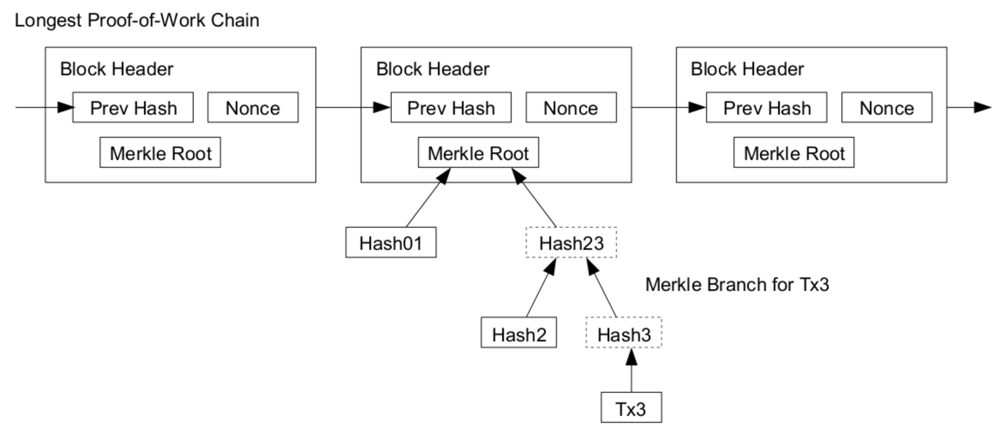

<!-- markdown-toc start - Don't edit this section. Run M-x markdown-toc-refresh-toc -->

**Table of Contents**
- [Abstract](#abstract)
- [References](#references)
- [Materials](#materials)
- [Fundamentals](#fundamentals)
  - [Overview](#overview)
  - [Block Structure](#block-structure)
  - [Transaction Structure](#transaction-structure)
  - [UTXO (Unspent Transaction Outputs)](#utxo-unspent-transaction-outputs)
  - [Wallet Application](#wallet-application)
  - [BitCoin Scripts](#bitcoin-scripts)
  - [Digital Signatures](#digital-signatures)
  - [Peer Discovery](#peer-discovery)
  - [POW (Proof of Work)](#pow-proof-of-work)
  - [Consensus algorithm](#consensus-algorithm)
  - [Hard Fork](#hard-fork)
  - [Simplified payment verification](#simplified-payment-verification)
  - [ETC](#etc)
- [Questions](#questions)
- [Code Tour](#code-tour)

<!-- markdown-toc end -->

-------------------------------------------------------------------------------

# Abstract

bitcoin에 대해 정리한다.

# References

* [자바스크립트로 블록체인 만들기(블록체인, 파트 1) @ youbue](https://www.youtube.com/watch?v=zVqczFZr124&list=RDCMUCnxrdFPXJMeHru_b4Q_vTPQ&start_radio=1&rv=zVqczFZr124&t=648)
  * JavaScript 로 Block Chain 을 만들어본다.
  * [src](https://github.com/Savjee/SavjeeCoin)
  * [Implementing Proof-of-Work in Javascript (Blockchain, part 2) @ youtube](https://www.youtube.com/watch?v=HneatE69814&list=RDCMUCnxrdFPXJMeHru_b4Q_vTPQ&index=2)
  * [Mining rewards & transactions - Blockchain in Javascript (part 3) @ youtube](https://www.youtube.com/watch?v=fRV6cGXVQ4I)
  * [Signing transactions - Blockchain in Javascript (part 4) @ youtube](https://www.youtube.com/watch?v=kWQ84S13-hw)
  * [Angular frontend - Blockchain in Javascript (part 5) @ youtube](https://www.youtube.com/watch?v=AQV0WNpE_3g)
* [How does bitcoin work (internals)](https://medium.com/ascentic-technology/how-does-bitcoin-work-internals-c2450793a0db)
  * bitcoin 의 under the hood 를 잘 설명한 글
* [block explorer](https://blockexplorer.com/)
  * bitcoin의 block을 구경할 수 있다.
* [bitcoin reference implementation](https://github.com/bitcoin/bitcoin)
  * bitcoin 구현체

# Materials

* [crypto reading list](https://github.com/JumpCrypto/crypto-reading-list)
  * A curated list for getting up to speed on crypto and decentralized networks.
* [awsome blockchain @ github](https://github.com/yunho0130/awesome-blockchain-kor/tree/master/whitepapers)
  * 모두를 위한 블록체인
* [Ever wonder how Bitcoin (and other cryptocurrencies) actually work?](https://www.youtube.com/watch?v=bBC-nXj3Ng4)
  * bitcoin internals 30분 요약 
* [Bitcoin: A Peer-to-Peer Electronic Cash System - Satoshi Nakamoto](https://bitcoin.org/bitcoin.pdf)
* [Mastering Bitcoin](https://github.com/bitcoinbook/bitcoinbook/blob/develop/book.asciidoc)
  * 최고의 책
* [bitcoin guide](https://bitcoin.org/en/developer-guide#p2p-network)
  * 최고의 가이드 메뉴얼
* [gitcoin reference](https://bitcoin.org/en/developer-reference)
  * 최고의 레퍼런스 메뉴얼
  
# Fundamentals

## Overview

Block Chain 은 Block 들이 서로 연결된 Chain 을 말한다. 최초 Block 은 Genesis Block 이라고 한다. Block 은 Header, Body 로 구성되어 있고 Block Header 의 모양은 다음과 같다. [Block Header @ bitcoin](https://developer.bitcoin.org/reference/block_chain.html#block-headers)

| Bytes | Name | Data Type |
|-------:|:---|:---|
| 4 | version | `int32_t` |
| 32 | prev block header hash | `char[32]` |
| 32 | merkle root hash | `char[32]` |
| 4 | time | `uint32_t` |
| 4 | nBits | `uint32_t` |
| 4 | nonce | `uint32_t` |

Block 의 Body 는 Transaction 들의 모음으로 구성되어 있다.

Block Header 의 길이는 80 Bytes 이다. 다음은 Block Header 의 예이다.

```
02000000 ........................... Block version: 2

b6ff0b1b1680a2862a30ca44d346d9e8
910d334beb48ca0c0000000000000000 ... Hash of previous block's header
9d10aa52ee949386ca9385695f04ede2
70dda20810decd12bc9b048aaab31471 ... Merkle root

24d95a54 ........................... [Unix time][unix epoch time]: 1415239972
30c31b18 ........................... Target: 0x1bc330 * 256**(0x18-3)
fe9f0864 ........................... Nonce
```

[Block 540617](https://www.blockchain.com/btc/block/0000000000000000000ebb857fd5389cb27b963c6d4e7852efb5a11ceac62ee8) 는 Height 가 `540617` 인 Block 의 Header, Body 이다. Height 는 Genesis Block 으로 부터의 거리이다. 

Miner 는 Mining Application 을 다운로드하여 실행하는 사람을 말한다. Minig Application 은 지금까지 만들어진 Block Chain 에 새로운 Block 을 생성하여 연결하려는 노력을 한다. 새롭게 만들어진 Block 이 다른 Miner 들에 의해 인정되면 bitcoin 으로 보상을 받는다. 보통 Block 은 10 분마다 하나씩 생성된다고 한다.

A 유저가 B 유저에게 송금하면 Transaction 이 하나 발생한다. 그리고 그 것은 unconfirmed transaction pool 에 보내진다. 이것을 [mem pool](https://www.blockchain.com/btc/unconfirmed-transactions) 이라고도 한다. Mining Application 은 [mem pool](https://www.blockchain.com/btc/unconfirmed-transactions) 에서 Transactions 을 가져와 새로운 Block 제작을 시도한다. [mem pool](https://www.blockchain.com/btc/unconfirmed-transactions) 은 centralized 인가???

새로운 Block 을 생성하려면 Block 의 Nonce 를 제대로 생성해야 한다. Block Header 의 Hash 가 nBits 보다 작거나 같아야 한다. Block Header Hash 는 Block 의 Header 를 기반으로 생성한다. 이때 Block Header 에서 nonce 를 제외하고 다른 값들은 모두 고정이다. 따라서 nonce 를 바꿔가면서 제대로 된 Block Header Hash 를 생성해야 한다. 이것은 CPU Bound Job 이고 전기를 많이 소모한다. `nBits` 는 어떻게 정해지는 거지???

A 유저가 B 유저에게 송금할 때 Transaction Fee 가 발생한다. 이것을 Gas Price 라고 한다. 그 Transaction 을 인증한 Miner 에게 지불된다. 지불되는 내역은 또 다른 Transaction 이 되어 다음 Block 에 포함된다.

## Block Structure

Serialized Block 은 다음과 같이 구성된다. [Serialized Blocks @ bitcoin](https://developer.bitcoin.org/reference/block_chain.html#serialized-blocks) 참고.

| Bytes | Name | Data Type |
| ---:|:----|-----|
| 80 | Block Header | `block_header` |
| varies | txn_count | `compactSize uint` |
| varies | txns | `raw transaction` |

Serialized Block 의 크기는 1MB 이하여야 한다. 1MB 를 넘어서면 Invalid Block 이다.

다음은 Block Chain 을 나타낸 그림이다.



## Transaction Structure

다음은 Serialized Transaction 이다. [Raw Transaction Format @ bitcoin](https://developer.bitcoin.org/reference/transactions.html#raw-transaction-format)

| Bytes | Name | Data Type |
| ---:|:----|-----|
| 4 | version | `int32_t` |
| varies | tx_in count | `compactSize uint` |
| varies | tx_in | `txIn` |
| varies | tx_out count | `compactSize uint` |
| varies | tx_out | `txOut` |
| 4 | lock_time | `uint32_t` |

다음은 Serialized txIn 이다. (non-coinbase) 

| Bytes | Name | Data Type |
| ---:|:----|-----|
| 36 | previous_output | `outpoint` |
| varies | script bytes | `compactSize uint` |
| varies | signature script | `char[]` |
| 4 | sequence | `uint32_t` |

다음은 Serialized Outpoint 이다. Outpoint 는 previous_output 과 같다.

| Bytes | Name | Data Type |
| ---:|:----|-----|
| 32 | hash | `char[32]` |
| 4 | index | `uint32_t` |

다음은 Serialized txOut 이다. 

| Bytes | Name | Data Type |
| ---:|:----|-----|
| 8 | value | `int64_t` |
| `1+` | pk_script bytes | `compactSize uint` |
| varies | pk_script | char[] |

다음은 

```
01000000 ................................... Version

01 ......................................... Number of inputs
|
| 7b1eabe0209b1fe794124575ef807057
| c77ada2138ae4fa8d6c4de0398a14f3f ......... Outpoint TXID
| 00000000 ................................. Outpoint index number
|
| 49 ....................................... Bytes in sig. script: 73
| | 48 ..................................... Push 72 bytes as data
| | | 30450221008949f0cb400094ad2b5eb3
| | | 99d59d01c14d73d8fe6e96df1a7150de
| | | b388ab8935022079656090d7f6bac4c9
| | | a94e0aad311a4268e082a725f8aeae05
| | | 73fb12ff866a5f01 ..................... [Secp256k1][secp256k1] signature
|
| ffffffff ................................. Sequence number: UINT32_MAX

01 ......................................... Number of outputs
| f0ca052a01000000 ......................... Satoshis (49.99990000 BTC)
|
| 19 ....................................... Bytes in pubkey script: 25
| | 76 ..................................... OP_DUP
| | a9 ..................................... OP_HASH160
| | 14 ..................................... Push 20 bytes as data
| | | cbc20a7664f2f69e5355aa427045bc15
| | | e7c6c772 ............................. PubKey hash
| | 88 ..................................... OP_EQUALVERIFY
| | ac ..................................... OP_CHECKSIG

00000000 ................................... locktime: 0 (a block height)
```

## UTXO (Unspent Transaction Outputs)

B 라는 유저가 A 라는 유저로부터 bitcoin 을 받고 아직 쓰지 않았다면 그것은 UTXO(Unspect Transaction Outputs) 이다. 이후 B 유저는 UTXO 의 일부를 다른 유저에게 보낼 수 있다.

Wallet Application 은 UTXO 를 모아서 balance 를 보여준다.

## Wallet Application

Wallet Application 은 지갑기능을 구현한 Application 이다. 유저가 지갑을 하나
만들면 public, private key 가 만들어진다. A 유저는 B 유저에게 bt 를 보낼 때
그 Transaction 을 B 유저의 publick key 로 sign 해서 보낸다. B 유저는 자신의
private key 로 그 Transaction 을 복호화할 수 있다.

## BitCoin Scripts

Bitcoin Script 는 Stack Based Script 이다. 
보안을 이유로 Loop 이 없기 때문에 Turing Complete 하지 못하다.
Transaction Input Script, Output Script 를 BitCoin Script 로 작성한다.

## Digital Signatures

A 유저는 개인키(secret key)와 공개키(public key)를 생성한다. A 유저는
자신이 거래한 내역을 장부에 적을 때 거래의 내용(message)과 함께
서명(signature)을 기재한다. 서명은 다음과 같이 거래의 내용과 개인키를
이용하여 생성한다.

```
Sign(message, secret key) = signature
```

A 유저의 거래 내역이 참인지 거짓인지 검증할 때는 다음과 같이 거래의
내역(message), 서명(signature), 공개키(public key)를 이용해서 결과가
True인지 확인한다.

```
Verify(message, signature, public key) = True / False
```

## Peer Discovery

bitcoin node들의 리스트는 DNS seed에게서 얻는다. DNS seed는 bitcoin
core에 hard code되어 있다.

[CConnman::ThreadDNSAddressSeed](https://github.com/bitcoin/bitcoin/blob/master/src/net.cpp#L1592)

```cpp
void CConnman::ThreadDNSAddressSeed()
{
...
}
```

## POW (Proof of Work)

제대로된 nonce 를 생성하는 과정이다. 즉, Block Header Hash 가 nBits 보다 작거나 같을 때의 nonce 를 찾는 일을 말한다. CPU bound job 이다.

## Consensus algorithm

길이가 제일 긴 블록체인을 따라 새로운 블록을 추가하는 것은 모든
노드들의 51% 동의를 얻는 것과 같은 의미 일까?

## Hard Fork

* [블록체인 비호환 변경 a.k.a 하드 포크](https://tv.kakao.com/channel/3693125/cliplink/423595997)

----

block chain repo 를 수정하여 새로운 logic 으로 block 을 생성하는 것을 말한다. 

특정 block (hard-fork block) 부터
새로운 logic 으로 block 을 생성한다. hard-fork block 이전까지 block 은
예전 logic 으로 block 을 생성한다.

예를 들어 gas fee 를 새롭게 변경하는 경우가 해당된다.

## Simplified payment verification

커피숍에서 커피를 한잔 먹고 BTC로 결제하면 그 결제 트랜잭션은 어떤 방법으로
보장될까?

## ETC

모든 bitcoin 은 21,000,000 bitcoin 이다. 2020 년 6 월까지 18,300,000 bitcoin 이
채굴되었다.

Block reward 는 4 년마다 절반씩 감소한다. 첫 Block reward 는 50 bt 였다. 2020 년 6월
Block reward 는 6.25 bt 이다.

마지막 bitcoin 은 2140 년 쯤 채굴될 것으로 예상된다.

Satoshi Nakamoto 는 980,000 bt 를 가지고 있다.

BitCoint 를 채굴하는 것은 CPU bound job 이기 때문에 점점 더 어려워 진다. Mining pool 이라는 것이
만들어졌다. Miner 들이 자신의 Mining Machine 을 등록하고 Machine 의 Resource 를 공유하는 것이다.
BT 가 채굴되면 Resource 를 공유한 miner 들에게 분배된다. [BTC.com](https://btc.com/) 과 [Slush Pool](https://slushpool.com/en/home/) 이 유명하다.

# Questions

* `nBits` 는 어떻게 정해지는 건가?
* unconfirmed transactions 을 얻어오는 과정은? centralized server 가 있는건가?
* broad cast 할 Mining Application 들의 IP 는 어떻게 알지?

# Code Tour

* [bitcoin code tour](bitcoin_codetour.md)
