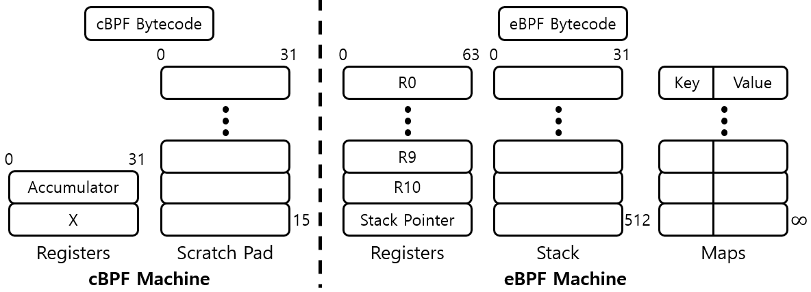

# Abstract

BPF (Berkeley Packet Filter) 는 패킷 필터로 패킷을 분석하고 필터링하는데 사용되는 In-Kernel Virtual Machine 이다. 1992 년에 만들어 졌다. BSD 에서 처음 도입했다. Linux 도 도입했다.

BPF code 를 만들면 Kernel 을 compile 하지 않고 실행할 수 있다.

eBPF (Extended BPF) 는 BPF 를 확장한 것이다. Virtual Machine 의 Register 개수를 늘리고 Stack 과 Map 을 도입했다. [Linux BPF (Berkeley Packet Filter)](https://ssup2.github.io/theory_analysis/Linux_BPF/) 참고.

BPF, eBPF 를 구분하지 않고 모두 BPF 라고 부르는 것 같다.

# Materials

* [eBPF](https://ebpf.io/what-is-ebpf/)
* [BPF, eBPF](https://hyeyoo.com/133)
* [Linux BPF (Berkeley Packet Filter)](https://ssup2.github.io/theory_analysis/Linux_BPF/)

# Basic

## Syscall Hook

이런 code 를 만들면 `execve` 가 호출될 때 마다 hooking 이 가능하다. Kernel 을 compile 하지 않고 code 를 실행할 수 있다니 멋지다.
