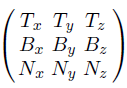
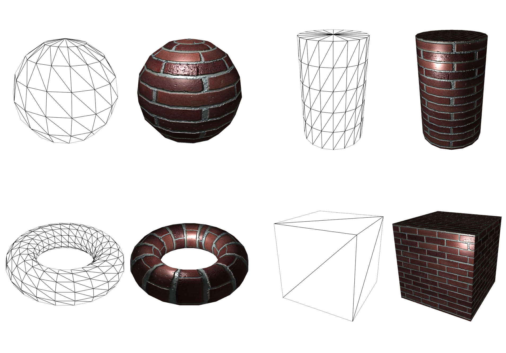

# Abstract

- 범프 매핑은 표면을 울퉁불퉁하게 표현하는 방법이다. height field,
  normal mapping, parallax mapping, displacement mapping등이 있다.

# normal mapping

특정 mesh의 vertex들은 다음과 같은 tangent space를 가지고 있다. 


tangent space위의 normal vector (x, y, z)를 tangent space normal
이라고 하자. 이것을 normal map texture에 저장해야 한다. vertex normal
vector는 tangent space의 z-axis와 같다. normal map texture가 DXT5인
경우 z는 저장하지 않는다. tangent normal vector는 크기가 1이므로 x와
y를 이용하여 구할 수 있기 때문이다. 실제로 unity3d의 unityCG.cginc를
살펴보면 UnpackNormal이 다음과 같이 DXT5의 경우 별도로 구현되어 있다.

```c
inline fixed3 UnpackNormalDXT5nm (fixed4 packednormal)
{
    fixed3 normal;
    normal.xy = packednormal.wy * 2 - 1;
    normal.z = sqrt(1 - saturate(dot(normal.xy, normal.xy)));
    return normal;
}
...
inline fixed3 UnpackNormal(fixed4 packednormal)
{
#if defined(UNITY_NO_DXT5nm)
    return packednormal.xyz * 2 - 1;
#else
    return UnpackNormalDXT5nm(packednormal);
#endif
}
```

한편 x, y, z는 각각 [-1, 1]이다. texture의 R, G, B는 [0,
1]이다. 따라서 다음과 같이 보정해 주자. `R = x*0.5 + 0.5`, `G =
y*0.5 + 0.5`, `B = z*0.5 + 0.5`. R, G, B로부터 x, y, z를 구하려면
다음과 같이 거꾸로 계산하자. `x = 2R - 1`, `y = 2R - 1`, `z = 2B - 1`.
보통 z의 값보다 x, y의 값이 작기 때문에 normal map texture는 푸른 빛을
띄게 된다.

normal map texture를 렌더링할때를 생각해 보자. 특정 vertex에 대해
tangent normal vector는 tangent space에서 정의된 것이다.
fragment processing단계에서 컬러 값을 얻어 내려면 light vector와
내적을 산출해야 한다. 하지만 light vector는 world space에서
정의된다. 따라서 light vector를 tangent space로 기저변환(basis change)
하거나 tangent normal vector를 world space로 기저변환(basis change)
해야 한다. 아래 구현은 tangent normal vector를 world space로 기저변환
하였다. 기저변환을 위해 다음과 같은 TBN 행렬을 사용한다.

기저변환은 world space에서 view space로 transformation할때
이미 사용되었다.



normal mapping은 다음그림의 sphere와 toruso와 같이 테두리 부분이
적용안되는 문제가 있다. 이것은 displacement mapping으로 해결 가능하다.



다음은 normal mapping을 unity3d shader lab으로 구현한 것이다.
[참고](https://github.com/ryukbk/mobile_game_math_unity)

```c
Shader "Custom/NormalMap" {
	Properties {
		_Color ("Diffuse Color", Color) = (1,1,1,1)
		_SpecularColor ("Specular Color", Color) = (1,1,1,1)
		_SpecularExponent ("Specular Exponent", Float) = 10
		_NormalMap ("Normal Map", 2D) = "bump" {}
	}
	SubShader {
		Pass {
		Tags { "LightMode" = "ForwardBase" }
			
		GLSLPROGRAM
	        #include "UnityCG.glslinc"
	        #if !defined _Object2World
	        #define _Object2World unity_ObjectToWorld
	        #endif

	        uniform vec4 _LightColor0;

	        uniform vec4 _Color;
	        uniform vec4 _SpecularColor;
	        uniform float _SpecularExponent;
	        
	        uniform sampler2D _NormalMap;
		uniform vec4 _NormalMap_ST;

	        #ifdef VERTEX
	        out vec4 normalMapCoord;
	        out vec4 glVertexWorld;
	        out mat3 tbn;
	        
	        attribute vec4 Tangent;
	        
	        void main() {	            
	            glVertexWorld = _Object2World * gl_Vertex;

		    vec3 n = normalize((_Object2World * vec4(gl_Normal, 0.0)).xyz);
		    vec3 t = normalize((_Object2World * vec4(Tangent.xyz, 0.0)).xyz);
		    vec3 b = normalize(cross(n, t) * Tangent.w);
		    tbn = mat3(t, b, n);
		    normalMapCoord = gl_MultiTexCoord0;

                    gl_Position = gl_ModelViewProjectionMatrix * gl_Vertex;
	        }
	        #endif

	        #ifdef FRAGMENT
	        in vec4 normalMapCoord;
	        in vec4 glVertexWorld;
	        in mat3 tbn;

	        vec3 unpackNormalDXT5nm(vec4 packednormal) {
		    vec3 normal;
		    normal.xy = packednormal.wy * 2.0 - 1.0;
		    normal.z = sqrt(1.0 - saturate(dot(normal.xy, normal.xy)));
		    return normal;
		}

		vec3 unpackNormal(vec4 packednormal) {
		#if defined(UNITY_NO_DXT5nm)
		    return packednormal.xyz * 2.0 - 1.0;
		#else
		    return unpackNormalDXT5nm(packednormal);
		#endif
		}

	        void main() {
	            vec4 packedNormal = texture2D(_NormalMap, _NormalMap_ST.xy * normalMapCoord.xy + _NormalMap_ST.zw);            
	            vec3 tangentSpaceVector = unpackNormal(packedNormal);
		    vec3 surfaceNormal = normalize(tbn * tangentSpaceVector);

	            vec3 ambientLight = gl_LightModel.ambient.xyz * vec3(_Color);
		    vec3 lightDirectionNormal = normalize(_WorldSpaceLightPos0.xyz);
	            vec3 diffuseReflection = _LightColor0.xyz * _Color.xyz * max(0.0, dot(surfaceNormal, lightDirectionNormal));
                    vec3 viewDirectionNormal = normalize((vec4(_WorldSpaceCameraPos, 1.0) - glVertexWorld).xyz);
		    vec3 specularReflection = _LightColor0.xyz * _SpecularColor.xyz
					* pow(max(0.0, dot(reflect(-lightDirectionNormal, surfaceNormal), viewDirectionNormal)), _SpecularExponent);                      
	        
	            gl_FragColor = vec4(ambientLight + diffuseReflection + specularReflection, 1.0);
	        }
	        #endif

	        ENDGLSL
         }
	} 
	//FallBack "Diffuse"
}
```

# Height Field

# parallax mapping

# displacement mapping
