- [Abstract](#abstract)
- [Materials](#materials)
- [Install with Docker](#install-with-docker)
- [Basics](#basics)
  - [Features](#features)
    - [Internal Data structure](#internal-data-structure)
    - [Partitioner](#partitioner)
    - [Data Consistency](#data-consistency)
    - [Data Replication](#data-replication)
    - [Snitch](#snitch)
    - [How to write data](#how-to-write-data)
    - [How to read data](#how-to-read-data)
    - [How to delete data](#how-to-delete-data)
    - [How to update data](#how-to-update-data)
    - [Light-weight transaction](#light-weight-transaction)
    - [Secondary Index](#secondary-index)
    - [Secondary Index](#secondary-index-1)
    - [Batch](#batch)
    - [Collection](#collection)
  - [Good Pattern](#good-pattern)
    - [Time Sequencial Data](#time-sequencial-data)
    - [Denormalize](#denormalize)
    - [Paging](#paging)
      - [Paging Columns of One Partition](#paging-columns-of-one-partition)
        - [Paging Columns of Multiple Partitions](#paging-columns-of-multiple-partitions)
  - [Anti Pattern](#anti-pattern)
    - [Unbounded Data](#unbounded-data)
    - [Secondary Index](#secondary-index-2)
    - [Delete Data](#delete-data)
    - [Memory Overflow](#memory-overflow)
  - [Data Types](#data-types)
  - [Primary, Partition, Composite, Clustering key](#primary-partition-composite-clustering-key)
  - [Useful Queries](#useful-queries)
  - [Basic Schema Design](#basic-schema-design)
  - [Twitter Examples](#twitter-examples)

----

# Abstract

Cassandra's write performance is good. But it donen't support Join, Transaction RDBMS supports. It is perfect for write heavy jobs. For example, Messages, Logs by time. Cassandra's update performcne is bad. If you want to update records many times, consider to use MongoDB, dynamoDB.

# Materials

* [Apache Cassandra Documentation](https://cassandra.apache.org/doc/latest/)
  * This is mandatory.
* [Learn Cassandra](https://teddyma.gitbooks.io/learncassandra/content/index.html)
  * 개발자 입장에서 Cassandra 를 정리
* [Understanding How CQL3 Maps to Cassandra's Internal Data Structure @ slideshare](https://www.slideshare.net/DataStax/understanding-how-cql3-maps-to-cassandras-internal-data-structure)
  * Cassandra 의 data 구조를 설명
* [Cassnadra 의 기본 특징 정리](https://nicewoong.github.io/development/2018/02/11/cassandra-feature/)
* [Apache Cassandra 톺아보기 - 1편](https://meetup.toast.com/posts/58)
  * [Apache Cassandra 톺아보기 - 2편](https://meetup.toast.com/posts/60)
  * [Apache Cassandra 톺아보기 - 3편](https://meetup.toast.com/posts/65)
* [How To Install Cassandra and Run a Single-Node Cluster on Ubuntu 14.04 @ digitalocean](https://www.digitalocean.com/community/tutorials/how-to-install-cassandra-and-run-a-single-node-cluster-on-ubuntu-14-04)

# Install with Docker

* [cassandra @ docker-hub](https://hub.docker.com/_/cassandra)

```console
$ docker run --rm --name my-cassandra -d cassandra

$ docker exec -it my-cassandra bash
> cqlsh

cqlsh> help

Documented shell commands:
===========================
CAPTURE  CLS          COPY  DESCRIBE  EXPAND  LOGIN   SERIAL  SOURCE   UNICODE
CLEAR    CONSISTENCY  DESC  EXIT      HELP    PAGING  SHOW    TRACING

CQL help topics:
================
AGGREGATES               CREATE_KEYSPACE           DROP_TRIGGER      TEXT
ALTER_KEYSPACE           CREATE_MATERIALIZED_VIEW  DROP_TYPE         TIME
ALTER_MATERIALIZED_VIEW  CREATE_ROLE               DROP_USER         TIMESTAMP
ALTER_TABLE              CREATE_TABLE              FUNCTIONS         TRUNCATE
ALTER_TYPE               CREATE_TRIGGER            GRANT             TYPES
ALTER_USER               CREATE_TYPE               INSERT            UPDATE
APPLY                    CREATE_USER               INSERT_JSON       USE
ASCII                    DATE                      INT               UUID
BATCH                    DELETE                    JSON
BEGIN                    DROP_AGGREGATE            KEYWORDS
BLOB                     DROP_COLUMNFAMILY         LIST_PERMISSIONS
BOOLEAN                  DROP_FUNCTION             LIST_ROLES
COUNTER                  DROP_INDEX                LIST_USERS
CREATE_AGGREGATE         DROP_KEYSPACE             PERMISSIONS
CREATE_COLUMNFAMILY      DROP_MATERIALIZED_VIEW    REVOKE
CREATE_FUNCTION          DROP_ROLE                 SELECT
CREATE_INDEX             DROP_TABLE                SELECT_JSON
```

# Basics

## Features

### Internal Data structure

[Understanding How CQL3 Maps to Cassandra's Internal Data Structure](https://www.slideshare.net/DataStax/understanding-how-cql3-maps-to-cassandras-internal-data-structure)

-----

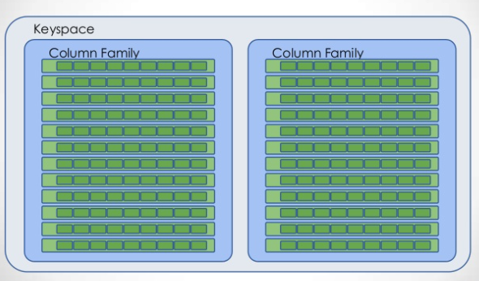

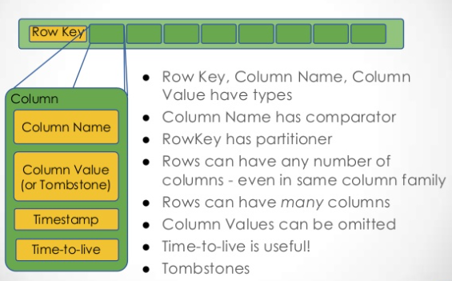

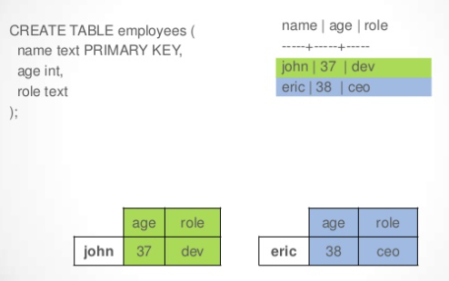

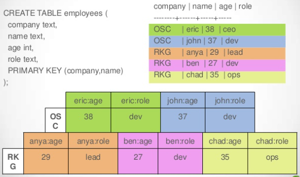

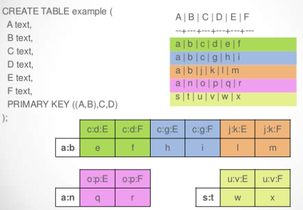

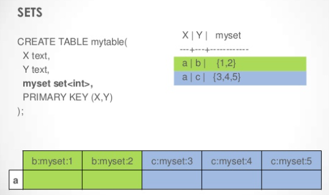

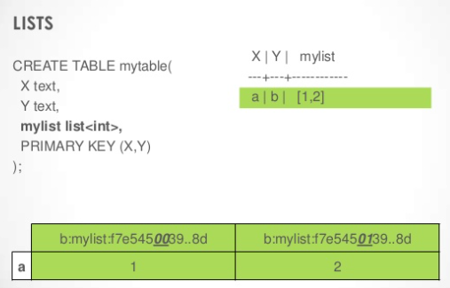

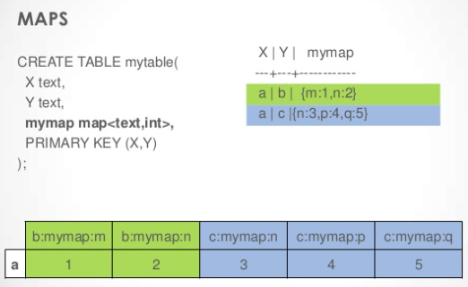

* Partition Key 덕분에 Row 를 빠르게 찾을 수 있다.
* Row 를 찾고나서 Col 을 빠르게 scan 할 수 있다. 정렬되어 있으니까?
* Row 를 scan 하지는 않는다.
* Set, List, Map 과 같이 3 종류의 Collection 을 지원한다. 
* Collection 은 Primary Key 가 될 수 없다.

### Partitioner

Partitioner is a module which transform "Row key" to "token". There are 3 partitioners such as "RandomPartitioner, Murmur3Partitioner, ByteOrderedPartitioner".

`ByteOrderedPartitioner` can make hot spot situation.


`RandomPartiioner` convert "Row Key" to "token" using "MD5".

`Murmur3Partitioner` convert "Row Key" to "token" using "Murmur5".

### Data Consistency

* [Switching snitches @ datastax](https://docs.datastax.com/en/archived/cassandra/3.0/cassandra/operations/opsSwitchSnitch.html)
* [Data consistency @ datastax](https://docs.datastax.com/en/archived/cassandra/3.0/cassandra/dml/dmlDataConsistencyTOC.html)

-----

몇개의 Replication 을 통해서 어느 정도 수준의 데이터 일관성을 확보할 것인지 설정할 수 있다.

### Data Replication

Keyspace 를 생성할 때 Replication 의 배치전략, 복제개수, 위치등을 결정할 수 있다. 

### Snitch

`/opt/cassandra/conf/cassandra.yaml` 의 snitch 설정을 통해서 다수의 Data Center 설정등을 할 수 있다.

### How to write data

* [Understanding How CQL3 Maps to Cassandra's Internal Data Structure](https://www.slideshare.net/DataStax/understanding-how-cql3-maps-to-cassandras-internal-data-structure)

-----

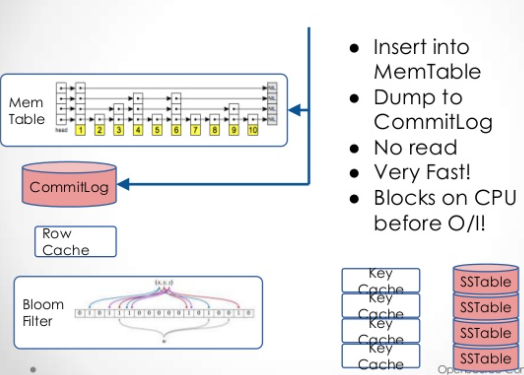

-----

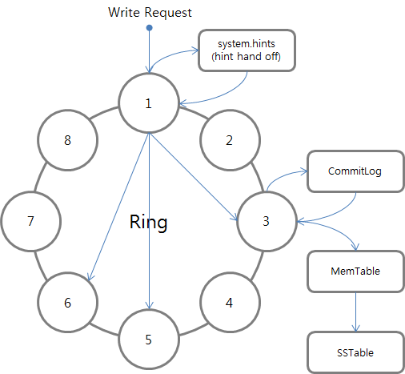

* Client 는 임의의 Cassandra node 에게 Write request 한다. 이때 Write request 를 수신한 node 를 Coordinator 라고 한다. Coordinator 를 통해 data 를 write 할 node 를 Target Node 하고 하자.
* Coordinator 는 수신한 data 의 Row key 를 token 으로 변환하고 어떤 node 에 data 를 write 해야 하는지 판단한다. 그리고 Query 에 저장된 Consistency level 에 따라 몇 개의 node 에 write 할지 참고하여 data 를 write 할 node 들의 status 를 확인한다. 
* 이때 특정한 node 의 status 가 정상이 아니라면 consistency level 에 따라 coordinator 의 `hint hand off` 라는 local 의 임시 저장공간에 write 할 data 를 저장한다.
  * `hint and off` 덕분에 Coordinator 는 비정상이었던 target node 의 상태가 정상으로 회복되면 write request 를 다시 보낼 수 있다.
  * 그러나 `hint hand off` 에 저장하고 coordinator 가 죽어버리면 방법이 없다.
* Coordinator 는 `hint and off` 에 data 를 backup 하고 Cassandra 의 topology 를 확인하여 어느 데이터 센터의 어느 렉에 있는 노드에 먼저 접근할 것인지 결정한다. 그리고 그 node 에 write request 한다.


* Target node 는 Coordinator 로 부터 write request 를 수신하면 `CommitLog` 라는 local disk 에 저장한다. 
* Target node 는 `MemTable` 이라는 memory 에 data 를 write 하고 response 를 Coordinator 에게 보낸다.
* Target node 는 `MemTable` 에 data 가 충분히 쌓이면 `SSTable` 이라는 local disk 에 data 를 flush 한다.
  * `SSTable` 은 immutable 하고 sequential 하다.
  * Cassandra 는 다수의 `SSTable` 을 정기적으로 Compaction 한다. 예를 들어 n 개의 `SSTable` 에 `a` 라는 데이터가 여러개 존재한다면 Compaction 할 때 가장 최신의 버전으로 merge 한다.

### How to read data

[Understanding How CQL3 Maps to Cassandra's Internal Data Structure](https://www.slideshare.net/DataStax/understanding-how-cql3-maps-to-cassandras-internal-data-structure)


-----

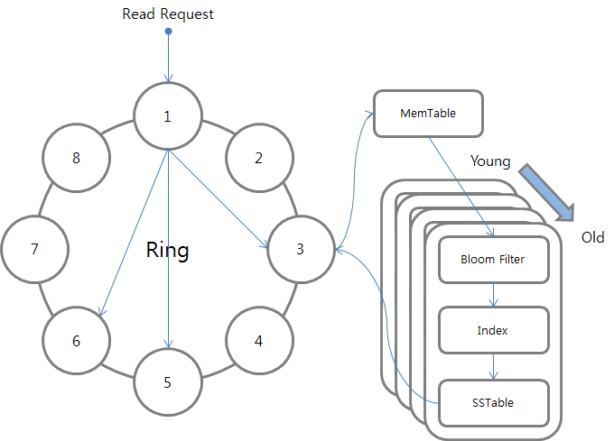

* Client 는 임의의 Cassandra node 에게 read request 한다. 이때 read request 를 수신한 node 를 Coordinator 라고 한다. data 를 read 할 node 를 Target Node 라고 하자.
* Coordinator 는 수신한 data 의 Row key 를 token 으로 변환하고 어떤 node 에 data 를 read 해야 하는지 판단한다. 그리고 Query 에 저장된 Consistency level 에 따라 몇 개의 Replication 을 확인할지 결정한다. 그리고 data 가 있는 가장 가까운 node 에 data request 를 보내고 그 다음 가까운 node 들에게는 data digest request 를 보낸다.
* Coordinator 는 이렇게 가져온 data response 와 data digest response 를 참고하여 data 가 일치하지 않으면 일치하지 않는 node 들로 부터 full data 를 가져와서 그들 중 가장 최신 버전의 data 를 client 에게 보낸다. 
  * 그리고 그 data 를 이용하여 target node 들의 data 를 보정한다.

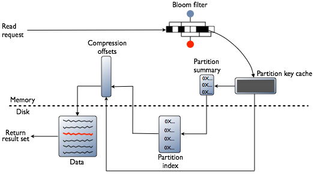

* Target node 는 read request 를 수신하면 가장 먼저 `MemTable` 을 확인한다. 
* 만약 없다면 `SSTable` 을 확인해야 한다. 그러나 그 전에 `SStable` 과 짝을 이루는 `Bloom Filter` 와 `Index` 를 먼저 확인 한다.
  * `Bloom Filter` 는 확률적 자료구조이다. 데이터가 없는 걸 있다고 거짓말 할 수 있지만 있는 걸 없다고 거짓말 하지는 못한다.
  * `Bloom Filter` 가 있다고 하면 `SSTable` 에 반드시 데이터가 있음을 의미한다???
* `Bloom Filter` 를 통해 `SSTable` 에 data 가 있다는 것을 알았다면 메모리에 저장되어 있는 `Summary Index` 를 통해 disk 에 저장되어 있는 원본 index 를 확인하여 `SSTable` 의 data 위치에 대한 offset 을 알게된다. 그리고 `SSTable` 에서 원하는 data 를 가져올 수 있다.
  * 이러한 과정은 최근에 생성된 `SSTable` 부터 차례대로 이루어진다.

### How to delete data

* Cassandra 는 delete 을 바로 수행하지 않는다. 모든 data 는 `Tombstone` 이라는 marker 를 갖는다. delete request 를 수신하면 그 data 의 `Tombstone` 에 marking 을 하고 주기적인 `Garbage Collection` 이나 `SSTable` 의 compaction 등이 발생할 때 data 를 삭제한다.

### How to update data

* Cassandra 는 update request 를 수신하면 `delete` process 를 수행하고 `write` process 를 수행한다.

### Light-weight transaction

* [Using lightweight transactions](https://docs.datastax.com/en/cql-oss/3.3/cql/cql_using/useInsertLWT.html)

-----

INSERT and UPDATE statements using the IF clause support lightweight transactions, also known as Compare and Set (CAS)

```sql
-- Insert a new cyclist with their id.
cqlsh> INSERT INTO cycling.cyclist_name (id, lastname, firstname)
  VALUES (4647f6d3-7bd2-4085-8d6c-1229351b5498, 'KNETEMANN', 'Roxxane')
  IF NOT EXISTS;
--Perform a CAS operation against a row that does exist by adding the predicate for the operation at the end of the query. For example, reset Roxane Knetemann's firstname because of a spelling error.
cqlsh> UPDATE cycling.cyclist_name
  SET firstname = ‘Roxane’
  WHERE id = 4647f6d3-7bd2-4085-8d6c-1229351b5498
  IF firstname = ‘Roxxane’;
```

### Secondary Index


### Secondary Index

Secondary Index 는 Cassandra 7.0 이후 등장했다. Partition Key, Clustering Key 에 해당이 안되는 column 에 대해 검색방법이 없었다. 그러나 denormalization 을 활용해 이 문제를 해결했다.

```sql
cqlsh> SELECT * FROM iamslash.person WHERE description = 'foo';
InvalidRequest: Error from server: code=2200 [Invalid query] message="Cannot execute this query as it might involve data filtering and thus may have unpredictable performance. If you want to execute this query despite the performance unpredictability, use ALLOW FILTERING"
```

Secondary Index 를 다음과 같이 생성하면 검색을 할 수 있다.

```sql
cqlsh> CREATE INDEX description_idx ON iamslash.person (description);
cqlsh> SELECT * FROM iamslash.person WHERE description = 'foo';

 code | location | description | sequence
------+----------+-------------+----------

(0 rows)
```

그러나 `>` 와 같은 Range Query 는 동작하지 않는다. 여전히 denormalization 이 유용할 때가 있다.

### Batch

* [BATCH @ cassandra](https://docs.datastax.com/en/dse/6.0/cql/cql/cql_reference/cql_commands/cqlBatch.html)

-----

Combines multiple data modification language (DML) statements (such as INSERT, UPDATE, and DELETE) to achieve atomicity and isolation when targeting a single partition, or only atomicity when targeting multiple partitions.

```sql
BEGIN BATCH USING TIMESTAMP 1481124356754405

  INSERT INTO cycling.cyclist_expenses (
    cyclist_name, expense_id, amount, description, paid
  ) VALUES (
    'Vera ADRIAN', 2, 13.44, 'Lunch', true
  );
  
  INSERT INTO cycling.cyclist_expenses (
    cyclist_name, expense_id, amount, description, paid
  ) VALUES (
    'Vera ADRIAN', 3, 25.00, 'Dinner', true
  );

APPLY BATCH;
```

### Collection

* [Creating collections @ cassandra](https://docs.datastax.com/en/cql-oss/3.3/cql/cql_using/useCollections.html)

----

Cassandra 는 set, list, map 과 같이 3 가지의 collection data type 을 지원한다.

```sql
cqlsh> CREATE TABLE cycling.cyclist_career_teams ( 
  id UUID PRIMARY KEY, 
  lastname text, 
  teams set<text> );

cqlsh> CREATE TABLE cycling.upcoming_calendar ( 
  year int, 
  month int, 
  events list<text>, 
  PRIMARY KEY ( year, month) );  

cqlsh> CREATE TABLE cycling.cyclist_teams ( 
  id UUID PRIMARY KEY, 
  lastname text, 
  firstname text, 
  teams map<int,text> );  
```


## Good Pattern

### Time Sequencial Data

Partition Key 에 time bound 를 포함해야 hotspot node 가 발생하지 않는다. `serverId` 를 Partition Key 로 정하면 hotspot node 가 발생한다. 그러나 `serverId` 에 1 시간 단위의 `timebound` 를 삽입하면 data 가 node 별로 골고루 분산된다.

```sql
 CREATE TABLE iamslash.user ( 
   serverId TEXT, 
   timebound INT, 
   timestamp INT, 
   data TEXT, 
   PRIMARY KEY( (serverId, timebound), timestamp ) );
 INSERT INTO iamslash.user ( serverId, timebound, timestamp, data ) VALUES ( 'server_1', 1455192000, 1455194927, '{ "userNumber" : 100, "serverStatus" : "STABLE" }' );
 INSERT INTO iamslash.user ( serverId, timebound, timestamp, data ) VALUES ( 'server_1', 1455192000, 1455195227, '{ "userNumber" : 105, "serverStatus" : "STABLE" }' );
 INSERT INTO iamslash.user ( serverId, timebound, timestamp, data ) VALUES ( 'server_1', 1455192000, 1455195527, '{ "userNumber" : 100, "serverStatus" : "STABLE" }' );
 INSERT INTO iamslash.user ( serverId, timebound, timestamp, data ) VALUES ( 'server_1', 1455195600, 1455195827, '{ "userNumber" : 95, "serverStatus" : "STABLE" }' );
 SELECT * FROM iamslash.user;
```

timebound 를 활용하여 검색을 효율적으로 할 수 있다.

```sql
-- server_1 서버의 2016년 2월 11일 오후 9시부터 오후 10시 이전까지의 기록
cqlsh> SELECT * FROM iamslash.user WHERE serverId='server_1' AND timeboundery = 1455192000;

-- server_1 서버의 2016년 2월 11일 오후 9시부터 오후 9시 50분 이전까지의 기록
cqlsh> SELECT * FROM iamslash.user WHERE serverId='server_1' AND timeboundery = 1455192000 AND timestamp < 1455195000;
```

### Denormalize

Cassandra 는 Join 을 지원하지 않는다. 그러나 Denormalization 을 활용하면 해결할 수 있다.

예를 들어 다음과 같은 경우 name 을 기준으로 job 을 읽어오는 것은 가능하지만 job 을 기준으로 name 을 읽어오는 것은 불가능하다.

```sql
cqlsh> CREATE TABLE iamslash.worker ( 
name TEXT PRIMARY KEY , 
job TEXT
);
```

다음과 같은 job table 을 만들면 job 을 기준으로 name 을 읽어올 수 있다.

```sql
cqlsh> CREATE TABLE iamslash.job ( 
job TEXT PRIMARY KEY , 
name TEXT 
);
```

### Paging

Cassandra 는 `Keyspace -> Table -> Row -> Column` 과 같은 계층구조를 갖는다. Column 은 여러 node 들에 걸쳐있는 data 를 paging 하는 것은 쉽지않다. 

하나의 Parition 에 대한 Column 은 정렬되어 있다. 따라서 다음과 같은 제한적인 상황의 paging 은 가능하다.

* Paging Columns of One Partition 
* Paging Columns of Multiple Partitions with prefix

#### Paging Columns of One Partition 

두번재 이상의 페이지들을 읽어올 때 항상 첫번째 페이지부터 읽어야 한다는 단점이 있다. 한편, MySQL 이라면 OFFSET 을 이용하여 손쉽게 특정 페이지를 읽어올 수 있다.

```sql
cqlsh> CREATE KEYSPACE iamslash WITH replication = {
  'class': 'SimpleStrategy', 
  'replication_factor' : 3};

cqlsh> CREATE TABLE iamslash.user ( 
   class TEXT , 
   name TEXT, 
   description TEXT, 
   PRIMARY KEY (class,  name) );

cqlsh> INSERT INTO iamslash.user ( class, name, description ) VALUES ( 'junior', 'aron', 'developer' );
cqlsh> INSERT INTO iamslash.user ( class, name, description ) VALUES ( 'junior', 'baker', 'developer' );
 ...
cqlsh> INSERT INTO iamslash.user ( class, name, description ) VALUES ( 'junior', 'zena', 'developer' );
 SELECT * FROM iamslash.user;

-- select first page with LIMIT
cqlsh> SELECT * FROM iamslash.user WHERE class = 'junior' LIMIT 5;

-- select next page with LIMIT and name condition
cqlsh> SELECT * FROM iamslash.user WHERE class = 'junior' AND name > 'elen' LIMIT 5;
```

##### Paging Columns of Multiple Partitions

`TOKEN()` 함수를 이용하여 여러 Partitions 에서 수집한 data 를 paging 할 수 있다.


```sql
cqlsh> CREATE KEYSPACE iamslash WITH replication = {
  'class': 'SimpleStrategy', 
  'replication_factor' : 3};

cqlsh> CREATE TABLE iamslash.user ( name TEXT, class TEXT ,description TEXT, PRIMARY KEY (name, class) );
cqlsh> INSERT INTO iamslash.user ( name, class, description ) VALUES ( 'aron', 'junior', 'developer' );
cqlsh> INSERT INTO iamslash.user ( name, class, description ) VALUES ( 'baker', 'junior', 'developer' );
 ...
cqlsh> INSERT INTO iamslash.user ( name, class, description ) VALUES ( 'zena', 'junior', 'developer' );

-- fail to query
cqlsh> SELECT * FROM iamslash.user WHERE name > 'elen' LIMIT 5;

-- select next page with TOKEN()
cqlsh> SELECT * FROM iamslash.user WHERE token(name) > token('elen') LIMIT 5;
```

순서가 정렬되어 있지는 않지만 여러 Partitions 의 data 를 paging 했다.

Prefix 를 활용하면 정렬된 순서의 data 를 paging 할 수 있다. 특정 Prefix 안에서는 remain 값으로 데이터가 정렬되어 저장되는 것을 이용한다. 그러나 hotspot 현상을 발생시킬 수 있다.

```sql
cqlsh> CREATE KEYSPACE iamslash WITH replication = {
  'class': 'SimpleStrategy', 
  'replication_factor' : 3};

cqlsh> CREATE TABLE iamslash.user ( 
  prefix text, 
  remain text, 
  name text, 
  description text PRIMARY KEY ( prefix, body,) );

cqlsh> INSERT INTO iamslash.user ( prefix , remain , name, class, description ) VALUES ( 'a', 'ron', 'aron', 'junior', 'developer' );
cqlsh>  INSERT INTO iamslash.user ( prefix , remain , name, class, description ) VALUES ( 'b', 'aker', 'baker', 'junior', 'developer' );
 ...
cqlsh>  INSERT INTO iamslash.user ( prefix , remain , name, class, description ) VALUES ( 'z', 'ena', 'zena', 'junior', 'developer' );
 SELECT * FROM iamslash.user ;
```

## Anti Pattern

### Unbounded Data

timebound 와 같은 경계를 Partition Key 에 포함시켜서 hotspot 을 막아야 한다.

### Secondary Index

Secondary Index 는 매우 신중히 사용되어야 한다.

예를 들어 다음과 같은 경우를 살펴보자.

```sql
cqlsh> CREATE KEYSPACE iamslash WITH replication = {
  'class': 'SimpleStrategy', 
  'replication_factor' : 3};

cqlsh> CREATE TABLE iamslash.user (
    id TEXT PRIMARY KEY,
    name TEXT,
    location TEXT
 );
cqlsh> CREATE INDEX user_idx ON iamslash.user (location);

cqlsh> INSERT INTO iamslash.user (id, name, location) VALUES ( 'test_id_1', 'duron', 'seoul');
cqlsh> INSERT INTO iamslash.user (id, name, location) VALUES ( 'test_id_2', 'frank', 'busan');
cqlsh> INSERT INTO iamslash.user (id, name, location) VALUES ( 'test_id_3', 'jack', 'seoul'); 
cqlsh> SELECT * FROM iamslash.user;
```

저장된 데이터의 모양은 다음과 같다.

```
 RowKey: busan
 => (name=test_id_2:, value=)
 -------------------
 RowKey: seoul
 => (name=test_id_1:, value=)
 => (name=test_id_3:, value=)
```

location 을 RowKey 로 하는 자료구조가 만들어 졌다. Secondary Index 로 지정되지 않았다면 location 은 정렬되어 저장될 것이다. rage query 역시 가능하다. 그러나 Secondary Index 로 지정된 column 은 range query 가 불가능하다. `=` 혹은 `contains` 만 가능하다.

만약 `location` 이 `seoul` 인 data 가 굉장히 많다면 검색을 실행할 때 모든 node 들이 바빠질 것이다???

### Delete Data

Cassandra 의 모든 row data 는 tombstone 이라는 marker field 를 가지고 있다. tombstone 이 check 되면 시간이 지나 SSTable 들의 compaction 이 진행될 때 데이터가 삭제된다.

장애가 발생한 node 가 복구되어 ring 에 다시 삽입될 때 지워진 data 가 복구될 수 있다. 복구된 node 만 checked tombstone data 를 가지고 있는 경우 다른 node 들이 복사해 갈 것이다.

`conf/cassandra.yaml` 의 `gc_grace_seconds` 보다 복구가 먼저 수행되도록 해야 한다.

또한 read 를 수행할 때 삭제된 data 역시 읽기 때문에 비효율적이다. 삭제된 데이터는 tombstone 만 check 되었을 뿐 검색의 대상이 된다.

### Memory Overflow

Cassandra 는 Keyspace 와 Table 에 대한 Metadata 를 JVM 메모리에 올려놓는다. 이것은 분산되지 않고, Ring 을 구성하는 모든 node 들이 동일하게 가지고 있다???

## Data Types

* [CQL data types](https://docs.datastax.com/en/cql-oss/3.x/cql/cql_reference/cql_data_types_c.html)

-----

* `text` is a alias for `varchar.`

## Primary, Partition, Composite, Clustering key

[[cassandra] 키의 종류 - primary key, partition key, clustering key, composite(compound) key, composite partition key, secondary index](https://knight76.tistory.com/entry/cassandra-%ED%82%A4%EC%9D%98-%EC%A2%85%EB%A5%98-primary-key-partition-key-clustering-key-compositecompound-key-composite-partition-key)

----

* Primary Key
  * RDBMS 의 Primary Key 와 비슷하다. row data 를 unique 하게 해준다.
    ```
    CREATE TABLE iamslash.person ( 
      code text, 
      location text, 
      sequence text, 
      description text, 
      PRIMARY KEY (code, location)
    );
    ```
  * `PRIMARY KEY(col1, col2, col3)` 와 같이 사용한다. 한개 이상의 col 이 필요하다.
* Partition Key
  * Primary Key 의 첫번째 col 즉, 첫번째 Key 를 의미한다. row data 를 어떤 node 에 저장할지 결정한다.
* Composite (Compound) Key
  * Partition Key 가 두개 이상일 때 Composite Key 라고 부른다.
  * `PRIMARY KEY((col1, col2), col3)`
* Clustering Key
  * Primary Key 의 첫번째 col 즉, Parition Key 를 제외한 나머지 Key 를 Clustering Key 라고 한다.
    ```
    CREATE TABLE hotel.hotels_by_poi (
    poi_name text,
    hotel_id text,
    name text,
    phone text,
    address frozen<address>,
    PRIMARY KEY ((poi_name), hotel_id) )
    WITH comment = ‘Q1. Find hotels near given poi’
    AND CLUSTERING ORDER BY (hotel_id ASC) ;
    ```
  * `WITH CLUSTERING ORDER BY (hotel_id ASC)` 와 같이 사용한다.

## Useful Queries 

* [Cassandra @ tutorialpoint](https://www.tutorialspoint.com/cassandra/index.htm)
* [Understanding How CQL3 Maps to Cassandra's Internal Data Structure](https://www.slideshare.net/DataStax/understanding-how-cql3-maps-to-cassandras-internal-data-structure)

----

```sql
-- Create keyspace
> CREATE KEYSPACE iamslash WITH replication = {
  'class': 'SimpleStrategy', 
  'replication_factor' : 3};

-- Describe cluster
> DESCRIBE cluster;

-- Describe keyspaces;
> DESCRIBE keyspaces;

--  Describe tables;
> DESCRIBE tables;

--  Create a table
CREATE TABLE iamslash.person ( 
    code text, 
    location text, 
    sequence text, 
    description text, 
    PRIMARY KEY (code, location)
);

-- Describe a table
> DESCRIBE iamslash.person;

-- Insert data
INSERT INTO iamslash.person (code, location, sequence, description ) VALUES ('N1', 'Seoul', 'first', 'AA');
INSERT INTO iamslash.person (code, location, sequence, description ) VALUES ('N1', 'Gangnam', 'second', 'BB');
INSERT INTO iamslash.person (code, location, sequence, description ) VALUES ('N2', 'Seongnam', 'third', 'CC');
INSERT INTO iamslash.person (code, location, sequence, description ) VALUES ('N2', 'Pangyo', 'fourth', 'DD');
INSERT INTO iamslash.person (code, location, sequence, description ) VALUES ('N2', 'Jungja', 'fifth', 'EE');

INSERT INTO iamslash.person (code, location, sequence, description ) VALUES ('N3', 'Songpa', 'seventh', 'FF');

-- Select data
> select * from iamslash.person;

-- Update data
> update iamslash.person SET sequence='sixth' WHERE code='N3' AND location='Songpa';
> select * from iamslash.person;

-- Delete a column (Range delettions)
>  Delete sequence FROM iamslash.person WHERE code='N3' AND location='Songpa';
> select * from iamslash.person;

-- Delete a row
> Delete FROM iamslash.person WHERE code='N3';
```

## Basic Schema Design

* [Basic Rules of Cassandra Data Modeling](https://www.datastax.com/blog/2015/02/basic-rules-cassandra-data-modeling)
* [Data Modeling in Cassandra @ baeldung](https://www.baeldung.com/cassandra-data-modeling)
* [Data Modeling @ Cassandra](https://cassandra.apache.org/doc/latest/data_modeling/index.html)

This is a hotel keyspace.

```sql
CREATE KEYSPACE hotel WITH replication =
  {‘class’: ‘SimpleStrategy’, ‘replication_factor’ : 3};

CREATE TYPE hotel.address (
  street text,
  city text,
  state_or_province text,
  postal_code text,
  country text );

CREATE TABLE hotel.hotels_by_poi (
  poi_name text,
  hotel_id text,
  name text,
  phone text,
  address frozen<address>,
  PRIMARY KEY ((poi_name), hotel_id) )
  WITH comment = ‘Q1. Find hotels near given poi’
  AND CLUSTERING ORDER BY (hotel_id ASC) ;

CREATE TABLE hotel.hotels (
  id text PRIMARY KEY,
  name text,
  phone text,
  address frozen<address>,
  pois set )
  WITH comment = ‘Q2. Find information about a hotel’;

CREATE TABLE hotel.pois_by_hotel (
  poi_name text,
  hotel_id text,
  description text,
  PRIMARY KEY ((hotel_id), poi_name) )
  WITH comment = Q3. Find pois near a hotel’;

CREATE TABLE hotel.available_rooms_by_hotel_date (
  hotel_id text,
  date date,
  room_number smallint,
  is_available boolean,
  PRIMARY KEY ((hotel_id), date, room_number) )
  WITH comment = ‘Q4. Find available rooms by hotel date’;

CREATE TABLE hotel.amenities_by_room (
  hotel_id text,
  room_number smallint,
  amenity_name text,
  description text,
  PRIMARY KEY ((hotel_id, room_number), amenity_name) )
  WITH comment = ‘Q5. Find amenities for a room’;
```

This is a reservation keyspace

```sql
CREATE KEYSPACE reservation WITH replication = {‘class’:
  ‘SimpleStrategy’, ‘replication_factor’ : 3};

CREATE TYPE reservation.address (
  street text,
  city text,
  state_or_province text,
  postal_code text,
  country text );

CREATE TABLE reservation.reservations_by_confirmation (
  confirm_number text,
  hotel_id text,
  start_date date,
  end_date date,
  room_number smallint,
  guest_id uuid,
  PRIMARY KEY (confirm_number) )
  WITH comment = ‘Q6. Find reservations by confirmation number’;

CREATE TABLE reservation.reservations_by_hotel_date (
  hotel_id text,
  start_date date,
  end_date date,
  room_number smallint,
  confirm_number text,
  guest_id uuid,
  PRIMARY KEY ((hotel_id, start_date), room_number) )
  WITH comment = ‘Q7. Find reservations by hotel and date’;

CREATE TABLE reservation.reservations_by_guest (
  guest_last_name text,
  hotel_id text,
  start_date date,
  end_date date,
  room_number smallint,
  confirm_number text,
  guest_id uuid,
  PRIMARY KEY ((guest_last_name), hotel_id) )
  WITH comment = ‘Q8. Find reservations by guest name’;

CREATE TABLE reservation.guests (
  guest_id uuid PRIMARY KEY,
  first_name text,
  last_name text,
  title text,
  emails set,
  phone_numbers list,
  addresses map<text, frozen<address>,
  confirm_number text )
  WITH comment = ‘Q9. Find guest by ID’;
```

## Twitter Examples

* [Twissandra @ github](https://github.com/twissandra/twissandra)

-----

```sql
CREATE TABLE users (
    username text PRIMARY KEY,
    password text
)

CREATE TABLE friends (
    username text,
    friend text,
    since timestamp,
    PRIMARY KEY (username, friend)
)

CREATE TABLE followers (
    username text,
    follower text,
    since timestamp,
    PRIMARY KEY (username, follower)
)

CREATE TABLE tweets (
    tweet_id uuid PRIMARY KEY,
    username text,
    body text
)

CREATE TABLE userline (
    username text,
    time timeuuid,
    tweet_id uuid,
    PRIMARY KEY (username, time)
) WITH CLUSTERING ORDER BY (time DESC)

CREATE TABLE timeline (
    username text,
    time timeuuid,
    tweet_id uuid,
    PRIMARY KEY (username, time)
) WITH CLUSTERING ORDER BY (time DESC)
```
