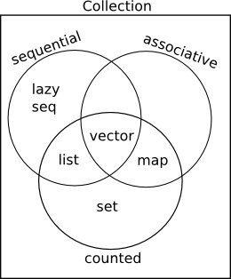

# Abstract

clojure에 대해 정리한다.

# Contents

- [Abstract](#abstract)
- [Contents](#contents)
- [Material](#material)
- [References](#references)
- [Environment](#environment)
  - [Windows10](#windows10)
  - [macosx](#macosx)
- [Basic Usages](#basic-usages)
  - [Collections compared c++ container](#collections-compared-c-container)
  - [Collections](#collections)
  - [data types](#data-types)
  - [Packages](#packages)
  - [Destructuring](#destructuring)
  - [implementing interfaces and protocols](#implementing-interfaces-and-protocols)
  - [Collections](#collections-1)
  - [Polymorphism](#polymorphism)
  - [Concurrency](#concurrency)
  - [Macro](#macro)
  
# Material

* [Clojure 병행성 @ github](https://github.com/eunmin/clojure-study/wiki/%5B%ED%94%84%EB%A1%9C%EA%B7%B8%EB%9E%98%EB%B0%8D-%ED%81%B4%EB%A1%9C%EC%A0%80%5D-6%EC%9E%A5-%EB%B3%91%ED%96%89%EC%84%B1)
* [Clojure Programming](www.clojurebook.com/)
  * Clojure의 internal을 가장 잘 설명한 책이다.
* [reagent](https://reagent-project.github.io/)
  * minimal interface between clojurescript and react
* [reframe](https://github.com/Day8/re-frame)
  * a framework for writing SPAs in clojurescript
* [debux](https://github.com/philoskim/debux)
  * clojure, clojurescript 디버깅 툴
* [클로저 Ring으로 하는 웹개발](https://hatemogi.gitbooks.io/ring/content/%EC%8B%9C%EC%9E%91%ED%95%98%EA%B8%B0.html)
* [clojure in y minutes](https://learnxinyminutes.com/docs/ko-kr/clojure-kr/)
* [초보자를 위한 클로저](https://eunmin.gitbooks.io/clojure-for-beginners/content/)
* [clojure design pattern](http://clojure.or.kr/docs/clojure-and-gof-design-patterns.html)
  * GOF design pattern을 clojure에서 이렇게 쉽게 할 수 있다.
* [4clojure](http://clojure.or.kr/docs/clojure-and-gof-design-patterns.html#mediator)
  * clojure를 문제를 풀면서 학습해보자.
* [clojure examples](https://kimh.github.io/clojure-by-example)
* [clojure for java developer](https://github.com/mbonaci/clojure)
* [brave clojure](https://www.braveclojure.com/clojure-for-the-brave-and-true/)
* [Clojure for Java Programmers Part 2 - Rich Hickey @ youtube](https://www.youtube.com/watch?v=hb3rurFxrZ8)
* [Clojure Koans](https://github.com/functional-koans/clojure-koans)
  * interactive learning clojure
* [datomic tutorial](https://github.com/Datomic/day-of-datomic/tree/master/tutorial)
  * datamic 은 clojure 로 만든 database 이다.
* [datomic doc](http://docs.datomic.com/)
* [datomic intro @ github](https://github.com/philoskim/datomic-intro)

# References

* [cursive userguide](https://cursive-ide.com/userguide/)
  * jetbrain의 cursive plugin
* [repl.it](https://repl.it/language/clojure)
  * clojure repl on the web
* [clojure doc](https://clojuredocs.org/)
* [clojure cheatsheet](https://clojure.org/api/cheatsheet)

# Environment

## Windows10

* leiningen 
  * [leiningen.org](https://leiningen.org/#install) 에서 lein.bat를 d:\local\bin에 다운받고 다음을 실행한다. 

```
lein.bat self-install
```

* intelliJ
  * install Cursive plugin
  
## macosx

* leiningen

```bash
brew install leiningen
```

* intelliJ
  * install Cursive plugin


# Basic Usages

## Collections compared c++ container

## Collections

## data types

String

```cojure
"Hello world"
```

Boolean

```clojure
true
false
```

Character

```clojure
\c
\u0045 ;; unicode char 45 E
```

Keywords

```clojure
:foo
:bar
```

Number

```clojure
11N ;; BigInteger
11  ;; long
0.1M ;; BigDecimal
```

Ratio

```clojure
11/7
```

Symbol

```clojure
foo-bar
```

nil

```clojure
nil
```

Regular expressions

```clojure
#"\d"
```

## Packages

:import

```clojure
(:import java.util.List)
(:import [java.util ArrayList HashMap])
(ns a.foo
  (:import [java.util Date])
```

:require

```clojure
(:require [a.b :refere [:all]])
(:require [a.b :as c))
(c/a-function 5)
(:require [a.b :as c :refer [d-funcion]])
```

## Destructuring

Sequential destructuring

```clojure
(let [[f s] [1 2]] f) ;; 1
(let [[f s t] [1 2 3]] [f t]) ;; [1 3]
(let [[f] [1 2]] f) ;; 1
(let [[f s t] [1 2]] t) ;; nil
(let [[f & t] [1 2]] t) ;; (2)
(let [[f & t] [1 2 3]] t) ;; (2 3)
(let [[f & [_ t]] [1 2 3]] [f t]) ;; [1 3]
```

Associative destructuring

```clojure
(let [{a-value :a c-value :c} {:a 5 :b 6 :c 7}] a-value) ;; 5
(let [{a-value :a c-value :c} {:a 5 :b 6 :c 7}] c-value) ;; 7
(let [{:keys [a c]} {:a 5 :b 6 :c 7}] c) ;; 7
(let [{:syms [a c]} {'a 5 :b 6 'c 7}] c) ;; 7
(let [{:strs [a c]} {:a 5 :b 6 :c 7 "a" 9}] [a c]) ;; [9 nil]
(let [{:strs [a c] :or {c 42}} {:a 5 :b 6 :c 7 "a" 9}] [a c]) ;; [9 42]
```
## implementing interfaces and protocols

```clojure
(import '(javax.swing JFrame Jlabel JTextField JButton)
        '(java.awt.event ActionListener)
        '(java.awt GridLayout))
(defn sample []
  (let [frame (JFrame. "Hello")
      sample-button (JButton. "Hello")]
    (.addActionListener
      sample-button
      (reify ActionListener
          (actionPerformed
           [_ evt]
           (println "Hello World"))))
    (doto frame
      (.add sample-button)
      (.setSize 100 40)
      (.setVisible true))))
```


## Collections

clojure의 collection은 크게 sequential, associative, counted와 같이
세가지 분류로 구분 할 수 있다. set은 sorted set, hash set으로 map은
sorted map, hash map으로 구성된다.



vector

```clojure
[1 2 3 4 5]
```

list

```clojure
(1 2 3 4 5)
```

hash map

```clojure
{:one 1 :two 2}
(hash-map :one 1 :two 2)
```

sorted map

```clojure
(sorted-map :one 1 :two 2) ;; {:one 1, :two 2)
(sorted-map-by > 1 :one 5 :five 3 :three) ;; {5 :five, 3 :three, 1 :one}
```

hash set

```clojure
#{1 2 3 4 5}
```

sorted set

```clojure
(doseq [x (->> (sorted-set :b :c :d)
               (map name))]
    (println x))
;; b
;; c
;; d
```

union, difference, and intersection

```clojure
(def a #{:a :b :c :d :e})
(def b #{:a :d :h :i :j :k})
(require '[clojure.set :as s])
(s/union a b) ;; #{:e :k :c :j :h :b :d :i :a}
(s/difference a b) ;; #{:e :c :b}
(s/intersection a b) ;; #{:d :a}
```

## Polymorphism

multimethod

```clojure
(defn avg [& coll]
  (/ (apply + coll) (count coll)))
(defn get-race [& ages]
  (if (> (apply avg ages) 120)
    :timelord
    :human))
(defmulti travel get-race)
(defmethod travel :timelord [& ages]
  (str (count ages) " timelords travelling by tardis"))
(defmethod travel :human [& ages]
  (str (count ages) " human travelling by car"))
(travel 2000 1000 100 200)
;; "4 timelords travelling by tardis"
(travel 70 20 100 40)
;; "4 humans travelling by car
```

protocol

```clojure
(defprotocol Shape
  "This is a protocol for shapes"
  (perimeter [this] "Calculate the perimeter of this shape")
  (area [this] "Calculate the area of this shape"))
```

record

```clojure
(defrecord Square [side]
  Shape
  (perimeter [{:keys [side]}] (* 4 side))
  (area [{:keys [side]}] (* side side)))
(Square. 5)
```

## Concurrency

identity and state

identity는 state를 가리키고 있다. state는 항상 변할 수 있다. state가
변할때 마다 그때 그때의 state는 별도의 존재들이다.

promise

이미 값이 채워졌다면 역참조할때 바로 값을 얻어올 수 있다. 그러나 값이
채워져있지 않다면 값이 채워질때까지 블록되어 기다린다. promise는
캐싱된다. 값은 dliver를 이용하여 채운다.

```clojure
(in-ns 'clojure-concurrency.core)
(def p (promise))
(start-thread
  #(do
    (deref p)
    (println "Hello World")))
(deliver p 5)
```

future

promise와 비슷하지만 항상 다른 thread에서 동작한다는 큰 차이가 있다.
thread pool에서 가용 thread하나를 선택하여 실행한다. 만약 가용
thread가 없다면 기다릴 수 있기 때문에 주의가 필요하다.

```clojure
(def f (future 
          (Thread/sleep 20000) "Hello World"))
(println @f)
```

STM (software transaction memory) and ref

ref-set을 이용해 ref를 변경 할 수 있다. 이때 dosync를 반드시 이용하여
transaction을 만들어 내야 한다. 그렇지 않으면
java.lang.IllegalStateException 가 발생한다.

STM은 DATABASE의 transaction과 비슷하게 다음과 같은 특성을 갖는다.

* atomicity(원자성) : 하나의 트랜잭션에서 여러개의 ref를 갱신하는 경우 동시에 갱신되는 것이 보장된다.
* consistency(일관성) : ref는 validation function(유효성 확인 함수)를 가질 수 있는데 이 함수중 하나가 실패해도 rollback된다.
* isolation(고립성) : 실행중인 트랜잭션의 부분적 내용은 다른 트랜잭션에서 접근 할 수 없다.
* no durability(영구성) : DB는 disk에 저장가능하지만 clojure는 그렇지 않다.

```clojure
(def account (ref 20000))
(dosync (ref-set account 10))
(deref account)

(defn test []
  (dotimes [n 5]
    (println n @account)
    (Thread/sleep 2000))
  (ref-set account 90))
  
(future (dosync (test)))
(Thread/sleep 1000)
(dosync (ref-set account 5))
```

atom

ref와 비슷하게 동기화를 보장하지만 transaction은 발생하지 않기 때문에
훨씬 가볍다.

```clojure
(def a (atom "Foo, Bar, Baz"))
(deref a)
```

agent

ref, atom과 비슷하게 동기화를 보장하지만 thread pool의 가용 thread에서
별도로 동작한다. 일을 시키고 잃어버리고 싶을때 사용한다. 즉 비동기
태스크에 적당하다.

```clojure
(def counter (agent 0))
(send counter inc)
```

## Macro

defmacro

```clojure
(def a 150)
(defmacro my-if [tset positive negative]
  '(if test positive negative))
(my-if (> a 200)
  (println "Bigger than 200")
  (println "Smaller than 200"))
```

macroexpand-1

```clojure
(def a 150)
(defmacro my-if [test positive negative]
  '(if test positive negative))
(macroexpand-1
  '(my-if (> a 200)
     (println "Bigger than 200")
     (println "Smaller than 200")))
;; (if test positive negative)
```

