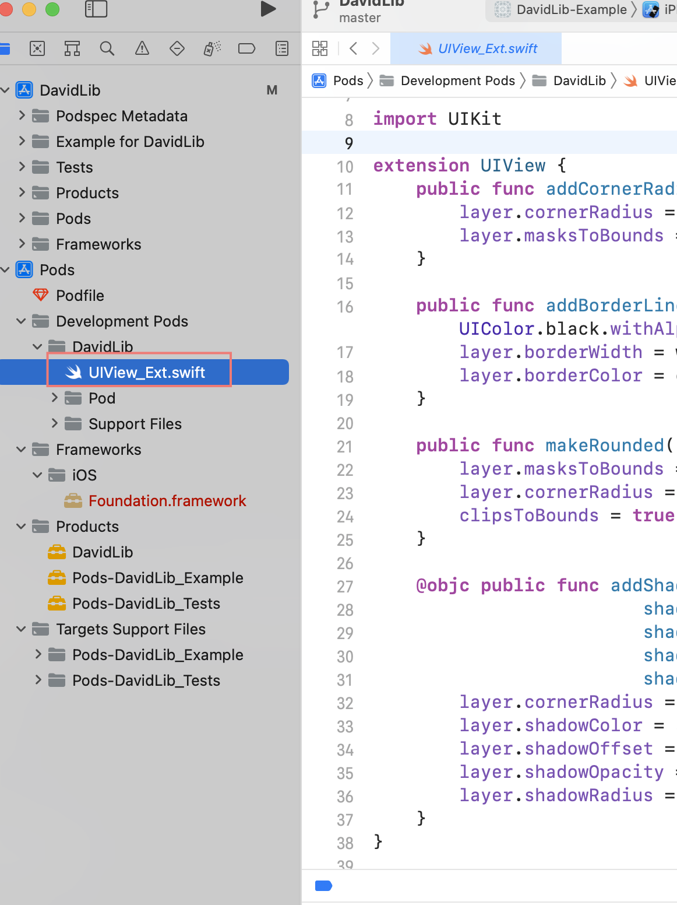

- [Abstract](#abstract)
- [Materials](#materials)
- [Basic](#basic)
  - [Install](#install)
  - [Using Pod Application Create](#using-pod-application-create)
  - [Using Pod Lib Create](#using-pod-lib-create)
  - [Create podspec file](#create-podspec-file)

----

# Abstract

CocoaPods is a dependency manager for Swift and Objective-C Cocoa projects. 

# Materials

* [CocoaPods Guides](https://guides.cocoapods.org/)
* [An Introduction to CocoaPods (Route 85) | youtube](https://www.youtube.com/watch?v=iEAjvNRdZa0)
  * 명쾌하게 cocoapods 사용방법을 설명한다.

# Basic

## Install

```bash
$ sudo gem install cocoapods
$ pod setup
$ pod search AFNetwork
```

## Using Pod Application Create

xcode 로 `testHello.xcodeproject` 를 생성한다.

다음과 같이 `Podfile` 을 생성한다.

```bash
$ pod init

$ vim Podfile
platform :ios, '8.0'
use_frameworks!

target 'testHello' do
  pod 'AFNetworking', '~> 2.6'
  pod 'ORStackView', '~> 3.0'
end

$ tree .
.
├── Podfile
├── testHello
│   ├── AppDelegate.swift
│   ├── Assets.xcassets
│   │   ├── AccentColor.colorset
│   │   │   └── Contents.json
│   │   ├── AppIcon.appiconset
│   │   │   └── Contents.json
│   │   └── Contents.json
│   ├── Base.lproj
│   │   ├── LaunchScreen.storyboard
│   │   └── Main.storyboard
│   ├── Info.plist
│   ├── SceneDelegate.swift
│   └── ViewController.swift
└── testHello.xcodeproj
    ├── project.pbxproj
    ├── project.xcworkspace
    │   ├── contents.xcworkspacedata
    │   ├── xcshareddata
    │   │   └── IDEWorkspaceChecks.plist
    │   └── xcuserdata
    │       └── david.s.xcuserdatad
    │           └── UserInterfaceState.xcuserstate
    └── xcuserdata
        └── david.s.xcuserdatad
            └── xcschemes
                └── xcschememanagement.plist
```

다음과 같이 dependencies 를 설치한다.

```bash
# Install dependencies
$ pod install

# Open your application workspace file
$ open App.xcworkspace

$ tree .
.
├── Podfile
├── Podfile.lock
├── Pods
│   ├── AFNetworking
│   │   ├── AFNetworking
│   │   │   ├── AFHTTPRequestOperation.h
│   │   │   ├── AFHTTPRequestOperation.m
│   │   │   ├── AFHTTPRequestOperationManager.h
│   │   │   ├── AFHTTPRequestOperationManager.m
│   │   │   ├── AFHTTPSessionManager.h
│   │   │   ├── AFHTTPSessionManager.m
│   │   │   ├── AFNetworkReachabilityManager.h
│   │   │   ├── AFNetworkReachabilityManager.m
│   │   │   ├── AFNetworking.h
│   │   │   ├── AFSecurityPolicy.h
│   │   │   ├── AFSecurityPolicy.m
│   │   │   ├── AFURLConnectionOperation.h
│   │   │   ├── AFURLConnectionOperation.m
│   │   │   ├── AFURLRequestSerialization.h
│   │   │   ├── AFURLRequestSerialization.m
│   │   │   ├── AFURLResponseSerialization.h
│   │   │   ├── AFURLResponseSerialization.m
│   │   │   ├── AFURLSessionManager.h
│   │   │   └── AFURLSessionManager.m
│   │   ├── LICENSE
│   │   ├── README.md
│   │   └── UIKit+AFNetworking
│   │       ├── AFNetworkActivityIndicatorManager.h
│   │       ├── AFNetworkActivityIndicatorManager.m
│   │       ├── UIActivityIndicatorView+AFNetworking.h
│   │       ├── UIActivityIndicatorView+AFNetworking.m
│   │       ├── UIAlertView+AFNetworking.h
│   │       ├── UIAlertView+AFNetworking.m
│   │       ├── UIButton+AFNetworking.h
│   │       ├── UIButton+AFNetworking.m
│   │       ├── UIImage+AFNetworking.h
│   │       ├── UIImageView+AFNetworking.h
│   │       ├── UIImageView+AFNetworking.m
│   │       ├── UIKit+AFNetworking.h
│   │       ├── UIProgressView+AFNetworking.h
│   │       ├── UIProgressView+AFNetworking.m
│   │       ├── UIRefreshControl+AFNetworking.h
│   │       ├── UIRefreshControl+AFNetworking.m
│   │       ├── UIWebView+AFNetworking.h
│   │       └── UIWebView+AFNetworking.m
│   ├── FLKAutoLayout
│   │   ├── FLKAutoLayout
│   │   │   ├── FLKAutoLayoutPredicateList.h
│   │   │   ├── FLKAutoLayoutPredicateList.m
│   │   │   ├── NSLayoutConstraint+FLKAutoLayoutDebug.h
│   │   │   ├── NSLayoutConstraint+FLKAutoLayoutDebug.m
│   │   │   ├── UIView+FLKAutoLayout.h
│   │   │   ├── UIView+FLKAutoLayout.m
│   │   │   ├── UIView+FLKAutoLayoutDebug.h
│   │   │   ├── UIView+FLKAutoLayoutDebug.m
│   │   │   ├── UIView+FLKAutoLayoutPredicate.h
│   │   │   └── UIView+FLKAutoLayoutPredicate.m
│   │   ├── LICENSE
│   │   └── README.md
│   ├── Headers
│   ├── Local\ Podspecs
│   ├── Manifest.lock
│   ├── ORStackView
│   │   ├── Classes
│   │   │   └── ios
│   │   │       ├── ORSplitStackView.h
│   │   │       ├── ORSplitStackView.m
│   │   │       ├── ORStackScrollView.h
│   │   │       ├── ORStackScrollView.m
│   │   │       ├── ORStackView.h
│   │   │       ├── ORStackView.m
│   │   │       ├── ORStackViewController.h
│   │   │       ├── ORStackViewController.m
│   │   │       ├── ORTagBasedAutoStackView.h
│   │   │       ├── ORTagBasedAutoStackView.m
│   │   │       └── private
│   │   │           ├── ORStackView+Private.h
│   │   │           └── ORStackView+Private.m
│   │   ├── LICENSE
│   │   └── README.md
│   ├── Pods.xcodeproj
│   │   ├── project.pbxproj
│   │   └── xcuserdata
│   │       └── david.s.xcuserdatad
│   │           └── xcschemes
│   │               ├── AFNetworking.xcscheme
│   │               ├── FLKAutoLayout.xcscheme
│   │               ├── ORStackView.xcscheme
│   │               ├── Pods-testHello.xcscheme
│   │               └── xcschememanagement.plist
│   └── Target\ Support\ Files
│       ├── AFNetworking
│       │   ├── AFNetworking-Info.plist
│       │   ├── AFNetworking-dummy.m
│       │   ├── AFNetworking-prefix.pch
│       │   ├── AFNetworking-umbrella.h
│       │   ├── AFNetworking.debug.xcconfig
│       │   ├── AFNetworking.modulemap
│       │   └── AFNetworking.release.xcconfig
│       ├── FLKAutoLayout
│       │   ├── FLKAutoLayout-Info.plist
│       │   ├── FLKAutoLayout-dummy.m
│       │   ├── FLKAutoLayout-prefix.pch
│       │   ├── FLKAutoLayout-umbrella.h
│       │   ├── FLKAutoLayout.debug.xcconfig
│       │   ├── FLKAutoLayout.modulemap
│       │   └── FLKAutoLayout.release.xcconfig
│       ├── ORStackView
│       │   ├── ORStackView-Info.plist
│       │   ├── ORStackView-dummy.m
│       │   ├── ORStackView-prefix.pch
│       │   ├── ORStackView-umbrella.h
│       │   ├── ORStackView.debug.xcconfig
│       │   ├── ORStackView.modulemap
│       │   └── ORStackView.release.xcconfig
│       └── Pods-testHello
│           ├── Pods-testHello-Info.plist
│           ├── Pods-testHello-acknowledgements.markdown
│           ├── Pods-testHello-acknowledgements.plist
│           ├── Pods-testHello-dummy.m
│           ├── Pods-testHello-frameworks-Debug-input-files.xcfilelist
│           ├── Pods-testHello-frameworks-Debug-output-files.xcfilelist
│           ├── Pods-testHello-frameworks-Release-input-files.xcfilelist
│           ├── Pods-testHello-frameworks-Release-output-files.xcfilelist
│           ├── Pods-testHello-frameworks.sh
│           ├── Pods-testHello-umbrella.h
│           ├── Pods-testHello.debug.xcconfig
│           ├── Pods-testHello.modulemap
│           └── Pods-testHello.release.xcconfig
├── testHello
│   ├── AppDelegate.swift
│   ├── Assets.xcassets
│   │   ├── AccentColor.colorset
│   │   │   └── Contents.json
│   │   ├── AppIcon.appiconset
│   │   │   └── Contents.json
│   │   └── Contents.json
│   ├── Base.lproj
│   │   ├── LaunchScreen.storyboard
│   │   └── Main.storyboard
│   ├── Info.plist
│   ├── SceneDelegate.swift
│   └── ViewController.swift
├── testHello.xcodeproj
│   ├── project.pbxproj
│   ├── project.xcworkspace
│   │   ├── contents.xcworkspacedata
│   │   ├── xcshareddata
│   │   │   └── IDEWorkspaceChecks.plist
│   │   └── xcuserdata
│   │       └── david.s.xcuserdatad
│   │           └── UserInterfaceState.xcuserstate
│   └── xcuserdata
│       └── david.s.xcuserdatad
│           └── xcschemes
│               └── xcschememanagement.plist
└── testHello.xcworkspace
    ├── contents.xcworkspacedata
    ├── xcshareddata
    │   └── IDEWorkspaceChecks.plist
    └── xcuserdata
        └── david.s.xcuserdatad
            └── UserInterfaceState.xcuserstate

$ open testHello.xcworkspace
```

`testHello.xcodeproj` 말고 `Pods.xcodeproj` 가 생성되었다. 이 것은 library 들을 위한 project 이다. 또한 `testHello.xcworkspace` 파일도 생성되었다. 이것은 `testHello.xcodeproj, Pods.xcodeproj` 를 포함한 workspace file 이다. library 도 함께 build 하려면 `testHello.xcworkspace` 를 build 해야 한다.

다음과 같이 header file 을 import 하고 library 를 사용하는 code 를 작성한다.

Import your dependencies.

```swift
#import <Reachability/Reachability.h>
```

## Using Pod Lib Create

> * [Using Pod Lib Create](https://guides.cocoapods.org/making/using-pod-lib-create.html)
> * [How to Create a Public CocoaPods Library](https://betterprogramming.pub/how-to-create-a-public-cocoapods-library-23e9c8f773f8)

```bash
# Use default template from https://github.com/CocoaPods/pod-template.git
$ pod lib create DavidLib
Cloning `https://github.com/CocoaPods/pod-template.git` into `DavidLib`.
> iOS
> Swift
> yes
> None
> No
# After this xcode project will be opened.

$ tree DavidLib -L 2
DavidLib
├── DavidLib
│   ├── Assets
│   └── Classes
├── DavidLib.podspec
├── Example
│   ├── DavidLib
│   ├── DavidLib.xcodeproj
│   ├── DavidLib.xcworkspace
│   ├── Podfile
│   ├── Podfile.lock
│   ├── Pods
│   └── Tests
├── LICENSE
├── README.md
└── _Pods.xcodeproj -> Example/Pods/Pods.xcodeproj
```

주요 파일은 다음과 같다.

| File | Description |
|--|--|
| `DavidLib/Assets` | Assets of DavidLib |
| `DavidLib/Classes` | Classes of DavidLib |
| `DavidLib.podspec` | the Podspec for your Library. [Podspec Syntax Reference](https://guides.cocoapods.org/syntax/podspec.html) | 
| `Example` | Example application of DavidLib |
| `_Pods.xcproject` | a symlink to your Pod's project for Carthage support | 
| `Example/DavidLib.xcodeproj` | Example application 의 xcode project file |
| `Example/Pods/Pods.xcodeproj` | Example application's dependency xcode project file |
| `Example/DavidLib.xcworkspace` | xcode workspace file |

`$ pod lib create DavidLib` 를 실행하고 나서 demo application 을 선택하지
않더라도 `Example/DavidLib.xcodeproj, Example/Pods/Pods.xcodeproj,
Example/DavidLib.xcworkspace` 는 생성된다. demo application 이 없다면 test 할 수 없다. 반드시 선택하자.

다음은 demo application 을 선택했을 때 추가되는 파일들이다.

```
│   ├── DavidLib
│   │   ├── AppDelegate.swift
│   │   ├── Base.lproj
│   │   │   ├── LaunchScreen.xib
│   │   │   └── Main.storyboard
│   │   ├── Images.xcassets
│   │   │   └── AppIcon.appiconset
│   │   │       └── Contents.json
│   │   ├── Info.plist
│   │   └── ViewController.swift
```

이제 `UIView_Ext.swift` 를 project 에 추가해 보자. project root 에 만들어 졌다. 이 것을 `DavidLib/Classes` 로 옮기고 다음과 같이 실행하여 xcode 에 적용하자.

```bash
$ cd Example
$ pod install
```



`DavidLib/Classes/UIView_Ext.swift` 를 다음과 같이 수정하자.

```swift
import UIKit

extension UIView {
    public func addCornerRadius(_ radius: CGFloat = 16) {
        layer.cornerRadius = radius
        layer.masksToBounds = true
    }

    public func addBorderLine(width: CGFloat = 1, color: UIColor = UIColor.black.withAlphaComponent(0.1)) {
        layer.borderWidth = width
        layer.borderColor = color.cgColor
    }

    public func makeRounded() {
        layer.masksToBounds = false
        layer.cornerRadius = self.frame.height / 2
        clipsToBounds = true
    }

    @objc public func addShadow(cornerRadius: CGFloat = 16,
                         shadowColor: UIColor = UIColor.black,
                         shadowOffset: CGSize = CGSize(width: 0, height: 4),
                         shadowOpacity: Float = 0.1,
                         shadowRadius: CGFloat = 6) {
        layer.cornerRadius = cornerRadius
        layer.shadowColor = shadowColor.cgColor
        layer.shadowOffset = shadowOffset
        layer.shadowOpacity = shadowOpacity
        layer.shadowRadius = shadowRadius
    }
}
```

`Example/DavidLib/ViewController.swift` 를 다음과 같이 수정하자. `import DavidLib` 을 꼭 해야 한다.

```swift
import UIKit
import DavidLib

class ViewController: UIViewController {

    @IBOutlet var mainView: UIView!
    
    override func viewDidLoad() {
        super.viewDidLoad()
        // Do any additional setup after loading the view, typically from a nib.
        mainView.backgroundColor = .green
        mainView.addShadow()
        mainView.addCornerRadius()
    }

    override func didReceiveMemoryWarning() {
        super.didReceiveMemoryWarning()
        // Dispose of any resources that can be recreated.
    }
}
```

`CMD R` 을 누르면 Build & Run 한다. 초록색 view 가 보이면 정상이다.

`DavidLib.podspec` 을 다음과 같이 수정한다.

```ruby
Pod::Spec.new do |s|
  s.name             = 'DavidLib'
  s.version          = '0.0.1'
  s.summary          = 'A short description of DavidLib.'
  s.description      = 'A long description of DavidLib.'
  s.homepage         = 'https://github.com/iamslash/DavidLib'
  s.license          = { :type => 'MIT', :file => 'LICENSE' }
  s.author           = { 'iamslash' => 'iamslash@gmail.com' }
  s.source           = { :git => 'https://github.com/iamslash/DavidLib.git', :tag => s.version.to_s }
  s.ios.deployment_target = '9.0'
  s.source_files = 'DavidLib/Classes/**/*'
end
```

다음과 같이 github 에 push 한다. GitHub 에서 release item 도 만들어야 한다.

```bash
$ git add .
$ git commit -m "first commit"
# v0.0.1 는 pod lib lint 에서 허락안해줌
$ git tag -a 0.0.1 -m "Version 0.0.1"
$ git branch -M main
$ git remote add origin git@github.com:iamslash/DavidLib.git
$ git push -u origin main
$ git push origin --tags
```

이제 cocoapods 에 push 한다.

```bash
# No network
$ pod lib lint # pod lib lint --allow-warning
# Use network
# GitHub 에 제대로 push 되어 있지 않으면 Unknown Error 발생한다. error message 가 전혀 도움 안됨. 
$ pod spec lint # pod spec lint --allow-warning

# Just once. Check the email and click the link
$ pod trunk register iamslash@gmail.com "David Sun"

$ pod trunk push --allow-warnings
```

## Create podspec file

podspec 파일을 별도로 만들 수 있다.

```bash
$ pod spec create Peanut
$ edit Peanut.podspec
$ pod spec lint Peanut.podspec
```
