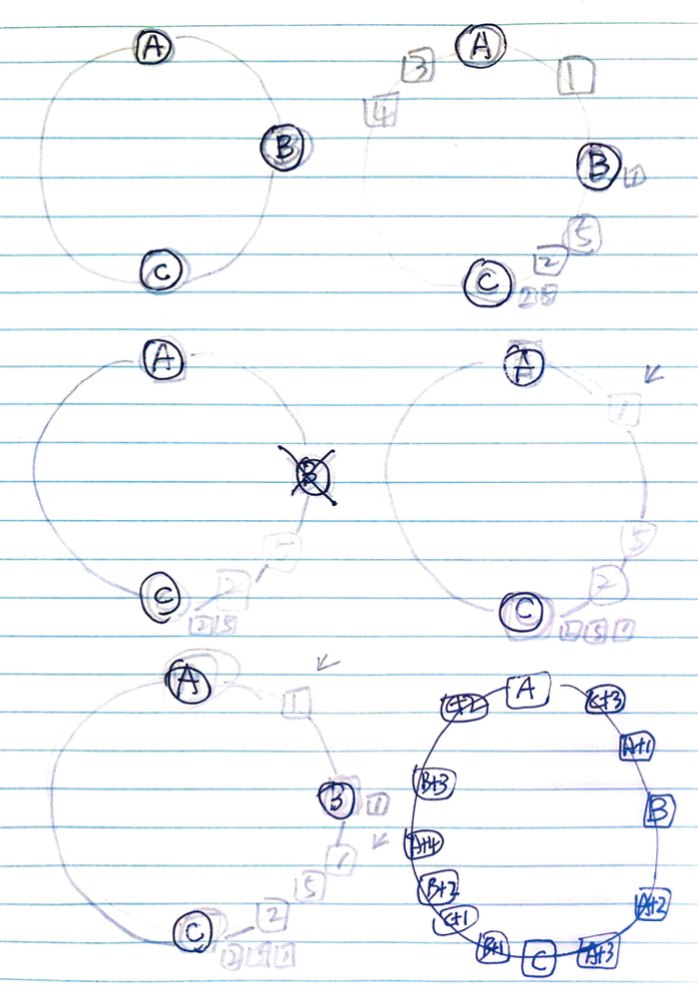

# Abstract

key 가 주어졌을 때 hash ring 에 적절히 hash 가 되도록 하는 방법이다. hash ring 에 5 개의 서버 A, B, C, D, E 가 있을 때 임의의 서버가 장애가 발생하고 복구되더라도 데이터의 이동을 최소화 할 수 있다. sharding 과 같은 partitioning 전략을 도입할 때 필수이다.

# Materials

* [A Fast, Minimal Memory, Consistent Hash Algorithm @ arxiv ](https://arxiv.org/pdf/1406.2294.pdf)
  * consistent hash 를 5 줄로 구현한 논문 

# Basic



위의 그림과 같이 server A, B, C 가 있다. 그리고 키 1, 2, 3, 4, 5 를 server 에 배치해 보자. A 는 3, 4 가 할당되고 B 는 1 이 할당되고 C 는 2, 5 가 할당된다.

만약 B 가 장애가 발생하면 B 가 가지고 있던 1 은 유실된다. 그리고 클라이언트가 1 을 요청했을 때 C 에 1 이 할당된다. 따라서 C 는 1, 2, 5 를 가지고 있다.

B 가 복구되고 클라이언트가 1 을 요청하면 B 에 할당된다. 이 때 C 역시 예전의 1 을 가지고 있다는 것을 유의해야 한다. 이것은 expire time 을 이용하여 예전의 1 이 소멸되도록 해야 한다.

이렇게 consistent hash 를 이용하여 key 를 할당하면 일부 서버가 장애가 발생하더라도 데이터의 이동을 최소화할 수 있다.

만약 B 가 죽으면 C 에게 너무 부담이 크지 않을까? 그래서 A 의 영역을 A, A+1, A+2, A+3 와 같이 분산한다. key 는 여러 서버에 고르게 할당될 것이다.

# Implementation

* [Karger Consistent hash](https://www.joinc.co.kr/w/man/12/hash/consistent)

----

```c
int32_t JumpConsistentHash(uint64_t key, int32_t num_buckets) {
   int64_t b = 1,   j = 0;
   while (j < num_buckets) {
        b = j;
        key = key * 2862933555777941757ULL + 1;
        j = (b + 1) * (double(1LL << 31) / double((key >> 33) + 1));
    }
    return b;
}
```

* `key` 는 할당하기 위한 값이다.
* `number_bucket` 은 `key` 를 할당할 bucket 의 개수이다.
* `b` 는 이전 bucket 의 위치이다. 곧 key 를 당할 bucket 위치이다.
* `j` 는 새로운 bucket 위치이다. `b` 에서 jump 하여 `j` 에 도착했을 때 `j < num_bucket` 이면 한번 더 jump 하여 `b` 를 갱신한다. `j >= num_bucket` 이면 `b` 가 답이다.
* `key = key * 2862933555777941757ULL + 1` 에서 key 는 overflow 가 발생할 것이다. 따라서 `double(key >> 33)` 은 random value 를 얻어올 수 있다.

아래는 위의 코드를 파악하기 위해 일부 수정했다.

```c
// 64 = 33 + 31
int32_t JumpConsistentHash(uint64_t key, int32_t num_buckets) {
  int64_t b = 1, j = 0;
  while (j < num_buckets) {
    b = j;
    uint64_t rnd = key * 2862933555777941757ULL + 1;
    double   da  = double(1LL << 31);   // 2^32
    double   db  = double((rnd >> 33) + 1); // 1 <= db <= 2^32
    double   dc  = (da / db);           // 1 <= dc <= 2^32
    j = (b + 1) * dc;

    printf("key: %2llu, b: %-2lld, j: %-14lld, da: %14.2lf, db: %14.2lf, dc: %14.2lf\n",
           key, b, j, da, db, dc);
  }
  return b;
}

int main() {  
  for (int i = 0; i < 5; ++i)
    JumpConsistentHash(i, 4);  
  return 0;
}
// key:  0, b: 0 , j: 2147483648    , da:  2147483648.00, db:           1.00, dc:  2147483648.00
// key:  1, b: 0 , j: 6             , da:  2147483648.00, db:   333289332.00, dc:           6.44
// key:  2, b: 0 , j: 3             , da:  2147483648.00, db:   666578663.00, dc:           3.22
// key:  2, b: 3 , j: 12            , da:  2147483648.00, db:   666578663.00, dc:           3.22
// key:  3, b: 0 , j: 2             , da:  2147483648.00, db:   999867994.00, dc:           2.15
// key:  3, b: 2 , j: 6             , da:  2147483648.00, db:   999867994.00, dc:           2.15
// key:  4, b: 0 , j: 1             , da:  2147483648.00, db:  1333157326.00, dc:           1.61
// key:  4, b: 1 , j: 3             , da:  2147483648.00, db:  1333157326.00, dc:           1.61
// key:  4, b: 3 , j: 6             , da:  2147483648.00, db:  1333157326.00, dc:           1.61
```

* 아래는 modulo 연산으로 간단히 구현해 보았다. 책임 못짐.

```cpp
//  fails: failed bucket
// return: bucket number
int32_t ModuloConsistentHash(uint64_t key, int32_t num_buckets, set<int>& fails) {
  if (buckets == fails.size())
    return -1;
  int32_t r = key % num_buckets;
  while (fails.count(r))
    r = (r + 1) % num_buckets;
  retur r;
}
```  
