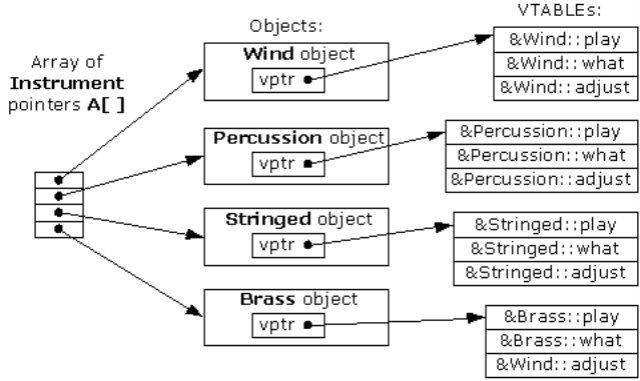

- [Abstract](#abstract)
- [Materials](#materials)
- [Basic](#basic)
  - [virtual function](#virtual-function)
  - [vector vs deque vs list](#vector-vs-deque-vs-list)
  - [vector](#vector)
    - [pros](#pros)
    - [cons](#cons)
  - [deque (double ended queue)](#deque-double-ended-queue)
    - [pros](#pros)
    - [cons](#cons)
  - [list](#list)
    - [pros](#pros)
    - [cons](#cons)
  - [How to choose a container](#how-to-choose-a-container)
- [Advanced](#advanced)
  - [Compiler Generated Code](#compiler-generated-code)
  - [Disallow the use of compiler generated functions](#disallow-the-use-of-compiler-generated-functions)
  - [Declare a destructor virtual in polymorphic base classes](#declare-a-destructor-virtual-in-polymorphic-base-classes)
  - [Never call virtual functions in constructor or destructor](#never-call-virtual-functions-in-constructor-or-destructor)
  - [Named Parameter Idiom](#named-parameter-idiom)
  - [new delete](#new-delete)
  - [casting](#casting)
  - [const](#const)
  - [lvalue and rvalue](#lvalue-and-rvalue)
  - [ADL(Argument Dependent Lookup)](#adlargument-dependent-lookup)
  - [typename vs class in template](#typename-vs-class-in-template)
- [STL](#stl)
  - [Major Headers](#major-headers)
  - [vector](#vector)
  - [deque](#deque)
  - [list](#list)
  - [set, multiset](#set-multiset)
  - [map, multimap](#map-multimap)
  - [unordered container](#unordered-container)
  - [Associative Array](#associative-array)
  - [array](#array)
  - [Container Adaptor](#container-adaptor)
  - [Iterators](#iterators)
  - [Iterator Adaptor (Predefined Iterator)](#iterator-adaptor-predefined-iterator)
  - [Functors (Function Objects)](#functors-function-objects)
  - [Object Slicing](#object-slicing)
  - [Sorting](#sorting)
  - [Algorithms](#algorithms)
  - [Algorithms For Sorted Data](#algorithms-for-sorted-data)
  - [Algorithms For Non-Modifying](#algorithms-for-non-modifying)
  - [Algorithms For Modifying](#algorithms-for-modifying)
  - [Algorithms for Equality, Equivalance](#algorithms-for-equality-equivalance)
  - [Algorithm vs Member Function](#algorithm-vs-member-function)
  - [Modifying In A Container](#modifying-in-a-container)
  - [Removing In A Container](#removing-in-a-container)
  - [shared_ptr](#sharedptr)
  - [weak_ptr](#weakptr)
  - [unique_ptr](#uniqueptr)
- [C++11](#c11)
  - [nullptr](#nullptr)
  - [enum class](#enum-class)
  - [static_assert](#staticassert)
  - [Delegating Contructor](#delegating-contructor)
  - [override](#override)
  - [final](#final)
  - [default](#default)
  - [delete](#delete)
  - [constexpr](#constexpr)
  - [String Literals](#string-literals)
  - [User Defined Literals](#user-defined-literals)
  - [auto](#auto)
  - [range based for](#range-based-for)
  - [initializer lists](#initializer-lists)
  - [Uniform Initialization](#uniform-initialization)
  - [in-class member initializers](#in-class-member-initializers)
  - [tuple](#tuple)
  - [advanced STL container](#advanced-stl-container)
  - [lambda](#lambda)
  - [move semantics](#move-semantics)
  - [Value Categories](#value-categories)
  - [r-value reference](#r-value-reference)
  - [Perfect Forwarding](#perfect-forwarding)
  - [move constructor](#move-constructor)
  - [array](#array)
  - [timer](#timer)
  - [regex](#regex)
  - [random](#random)
  - [thread](#thread)
  - [to_string](#tostring)
  - [convert string](#convert-string)
  - [Variadic Template](#variadic-template)
  - [Template Alias](#template-alias)
  - [decltype](#decltype)
  - [chrono](#chrono)
- [Concurrent Programming](#concurrent-programming)
- [C++ Unit Test](#c-unit-test)
- [Boost Library](#boost-library)

-----

# Abstract

c++에 대해 정리한다.

# Materials

- [c++ programming](http://boqian.weebly.com/c-programming.html)
  - boqian의 동영상 강좌
- [혼자 연구하는 c/c++](http://soen.kr/)
  - 김상형님의 강좌
- [프로그래밍 대회: C++11 이야기 @ slideshare](https://www.slideshare.net/JongwookChoi/c11-draft?ref=https://www.acmicpc.net/blog/view/46)
- [c++ language](http://en.cppreference.com/w/cpp/language)
- [cplusplus.com](https://www.cplusplus.com)
- [c++11FAQ](http://pl.pusan.ac.kr/~woogyun/cpp11/C++11FAQ_ko.html)

# Basic

## virtual function



virtual function 은 vptr, vtable 에 의해 구현된다. 다음과 같이 `Instrument, Wind, Percussion, Stringed, Brass` 를 정의해 보자.

```cpp
class Instrument {
public:
  virtual void play() {

  }
  virtual void what() {

  }
  virtual void adjust() {

  }
};

class Wind : public Instrument {
public:
  virtual void play() {

  }
  virtual void what() {

  }
  virtual void adjust() {

  }
}

class Percussion : public Instrument {
public:
  virtual void play() {

  }
  virtual void what() {

  }
  virtual void adjust() {

  }
}
class Stringed : public Instrument {
public:
  virtual void play() {

  }
  virtual void what() {

  }
  virtual void adjust() {

  }
}

class Brass : public Instrument {
public:
  virtual void play() {

  }
  virtual void what() {

  }
  virtual void adjust() {

  }
}
```

각각의 child class 들의 object 들은 `vptr, vtable` 을 갖는다.

## vector vs deque vs list

|     | vector | deque | list |
|:---:|:---:|:---:|:---:|
| 인덱스접근 | o | o | x |
| 확장방법 | 전체재할당 | chunk 추가할당 | 불필요 |
| 중간삽입 | O(n) | O(n) | O(1)|

## vector

### pros

- 동적으로 확장 및 축소가 가능하다. dynamic array로 구현되어 있다.
  재할당 방식이다. 메모리가 연속으로 할당되어 있어 포인터 연산이 가능하다.
- index로 접근 가능하다. O(1)

### cons

- 끝이 아닌 위치에 삽입 및 제거시 성능이 떨어진다.
- 동적으로 확장 및 축소할때 전체를 재할당 하므로 비용이 크다.

## deque (double ended queue)

### pros

- index로 접근 가능하다. O(1)
- 끝이 아닌 위치에 삽입 및 제거시 성능이 좋다. O(1)
- 동적으로 확장 될때 일정한 크기만큼 chuck가 하나 더 할당되는 방식이다.
  저장 원소가 많거나 원소의 크기가 클때 즉 메모리 할당이 큰 경우 
  vector에 비해 확장 비용이 적다.

### cons

- 메모리가 연속으로 할당되어 있지 않아 vector와 달리 포인터 연산이 불가능하다.

## list

### pros

- vector, deque와 달리 임의의 위치에 삽입 및 제거시 성능이 좋다. O(1)

### cons

- index로 접근 불가능하다. 

## How to choose a container

[C++ Containers Cheat Sheet](http://homepages.e3.net.nz/~djm/cppcontainers.html)


# Advanced

## Compiler Generated Code

compiler 는 경우에 따라 `Copy constructor, Copy Assignment Operator, Destructor, Default Constructor` 를 생성해 준다.

```cpp
/*
Compiler silently writes 4 functions if they are not explicitly declared:
1. Copy constructor.
2. Copy Assignment Operator.
3. Destructor.
4. Default constructor (only if there is no constructor declared).
*/

class dog {};

/* equivalent to */

class dog {
	public:
		dog(const dog& rhs) {...};   // Member by member initialization

		dog& operator=(const dog& rhs) {...}; // Member by member copying

		dog() {...};  // 1. Call base class's default constructor; 
		              // 2. Call data member's default constructor.

		~dog() {...}; // 1. Call base class's destructor; 
		              // 2. Call data member's destructor.
}
/*
Note:
1. They are public and inline.
2. They are generated only if they are needed.
*/
```

## Disallow the use of compiler generated functions

`delete` 을 이용하여 컴파일러가 코드를 생성하지 못하도록 할 수 있다.

```cpp
class dog {
   public:
   dog(const dog& ) = delete; // Prevent copy constructor from being used.
                              // Useful when dog holds unsharable resource.
}
```

## Declare a destructor virtual in polymorphic base classes

`destructor` 를 `virtual` 로 다형성을 실현할 수 있다. 예를 들어서 `yellowdog` 클래스가 `dog` 을 상속받는다고 하자. `yellowdog` 의 `destructor` 가 호출되게 하려면 어떻게 해야할까? `virtual destructor` 를 사용하거나 `shared_ptr` 을 사용한다.

```cpp
/* Problem */
class yellowdog : public dog {
};

dog* dogFactory::createDog() {
	dog* pd = new yellowdog();
	return pd;
}

int main() {
	dog* pd = dogFactory::createDog();
	...
	delete pd;  // Only dog's destructor is invoked, not yellowdog's.
}

/*
Solution: 
*/
class dog {
      virtual ~dog() {...}
}

/* 
Note: All classes in STL have no virtual destructor, so be careful inheriting 
from them.
*/


/*
When we should use virtual destructor:
Any class with virtual functions should have a virtual destructor.

When not to use virtual destructor:
1. Size of the class needs to be small;
2. Size of the class needs to be precise, e.g. passing an object from C++ to C.
*/


/* Solution 2: 
 *    using shared_prt
 */

class Dog {
public:
   ~Dog() {  cout << "Dog is destroyed"; }
};

class Yellowdog : public Dog {
public:
   ~Yellowdog() {cout << "Yellow dog destroyed." <<endl; }
};


class DogFactory {
public:
   //static Dog* createYellowDog() { return (new Yellowdog()); }
   static shared_ptr<Dog> createYellowDog() { 
      return shared_ptr<Yellowdog>(new Yellowdog()); 
   }
   //static unique_ptr<Dog> createYellowDog() {
   //   return unique_ptr<Yellowdog>(new Yellowdog());
   //}

};

int main() {

   //Dog* pd = DogFactory::createYellowDog();
   shared_ptr<Dog> pd = DogFactory::createYellowDog();
   //unique_ptr<Dog> pd = DogFactory::createYellowDog();
   
   //delete pd;
   
	return 0;
}
/*Note: you cannot use unique_ptr for this purpose */
```

## Never call virtual functions in constructor or destructor

`Constructor` 혹은 `Destructor` 에서 `virtual function` 을 호출하지 말자. 객체의 생명주기에 따라 호출이 안될 수 있기 때문이다.

```cpp
class dog {
 public:
  string m_name;
  dog(string name) {m_name = name;  bark();}
  virtual void bark() { cout<< "Woof, I am just a dog " << m_name << endl;}
};

class yellowdog : public dog {
 public:
  yellowdog(string name) : dog(string name) {...}
  virtual void bark() { cout << "Woof, I am a yellow dog " << m_name << endl; }
};

int main ()
{
  yellowdog mydog("Bob");
}

OUTPUT:
Woof, I am just a dog Bob.

/*
During the construction, all virtual function works like non-virtual function.

Why?
Base class's constructor run before derived class's constructor. So at the 
time of bark(), the yellowlog is not constructed yet.

Why Java behaves differently?

There is a fundamental difference in how Java and C++ defines an object's Life time.
Java: All members are null initialized before constructor runs. Life starts before constructor.
C++: Constructor is supposed to initialize members. Life starts after constructor is finished.

Calling down to parts of an object that haven not yet initialized is inherently dangerous.
*/


/*
solution 1:
*/
class dog {
 public:
  ...
  dog(string name, string color) { 
    m_name = name; 
    bark(color);
  }
  void bark(string str) { 
    cout<< "Woof, I am "<< str << " dog " << m_name << endl;
  }
};

class yellowdog : public dog {
 public:
  yellowdog(string name) : dog(name, "yellow") {}
};

int main ()
{
  yellowdog mydog("Bob");
}

OUTPUT:
Woof, I am yellow dog Bob

/*
solution 2:
*/
class dog {
 public:
  ...
  dog(string name, string woof) {
    m_name = name; 
    bark(woof);
  }
  dog(string name) {
    m_name = name; 
    bark( getMyColor() );
  }
  void bark(string str) { 
    cout<< "Woof, I am "<< str << "private:"; 
  }
 private:
  static string getMyColor() {
    return "just a";
  } 
};

class yellowdog : public dog {
 public:
  yellowdog(string name) : dog(name, getMyColor()) {}
 private:
  static string getMyColor() {
    return "yellow";
  }  //Why static?
};

int main ()
{
  yellowdog mydog("Bob");
}
OUTPUT:
Woof, I am yellow dog Bob
```

## Named Parameter Idiom

python 처럼 named parameter 를 흉내내보자.

```cpp

class OpenFile {
 public:
  OpenFile(
    string filename, 
    bool readonly=true, 
    bool appendWhenWriting=false, 
    int blockSize=256, 
    bool unbuffered=true, 
    bool exclusiveAccess=false);
}

OpenFile pf = OpenFile("foo.txt", true, false, 1024, true, true);
// Inconvenient to use
// Unreadable
// Inflexible

// What's ideal is:
OpenFile pf = OpenFile(.filename("foo.txt"), .blockSize(1024) );

/* Solution */
class OpenFile {
public:
  OpenFile(std::string const& filename);
  OpenFile& readonly()  { readonly_ = true; return *this; }
  OpenFile& createIfNotExist() { createIfNotExist_ = true; return *this; }
  OpenFile& blockSize(unsigned nbytes) { blockSize_ = nbytes; return *this; }
  ...
};

OpenFile f = OpenFile("foo.txt")
           .readonly()
           .createIfNotExist()
           .appendWhenWriting()
           .blockSize(1024)
           .unbuffered()
           .exclusiveAccess();

OpenFile f = OpenFile("foo.txt").blockSize(1024);
```

## new delete

다음은 `new` 와 `delete` 의 underhood 이다.

```cpp
   dog* pd = new dog();
/* 
 * Step 1. operator new is called to allocate memory.
 * Step 2. dog's constructor is called to create dog.
 * Step 3. if step 2 throws an exception, call operator delete to free the 
 *         memory allocated in step 1.
 */
   delete pd;
/* 
 * Step 1. dog's destructor is called.
 * Step 2. operator delete is called to free the memory.
 */
```

다음은 `global` `operator new` 의 구현이다. 

```cpp
/*
 * This is how the operator new may look like if you re-implement it:
 *
 * Note: new handler is a function invoked when operator new failed to allocate 
 * memory.
 *   set_new_handler() installs a new handler and returns current new handler.
 */
void* operator new(std::size_t size) throw(std::bad_alloc) {
   while (true) {
      void* pMem = malloc(size);   // Allocate memory
      if (pMem) 
         return pMem;              // Return the memory if successful

      std::new_handler Handler = std::set_new_handler(0);  // Get new handler
      std::set_new_handler(Handler);

      if (Handler)
         (*Handler)();            // Invoke new handler
      else
         throw bad_alloc();       // If new handler is null, throw exception
   }
}
```

다음은 `class` `operator new` 의 구현이다.

```cpp
/* 
 * Member Operator new
 */
class dog {
   ...
   public:
   static void* operator new(std::size_t size) throw(std::bad_alloc) 
   {
      if (size == sizeof(dog))
         customNewForDog(size);
      else
         ::operator new(size);
   }
   ...
};

class yellowdog : public dog {
   int age;
   static void* operator new(std::size_t size) throw(std::bad_alloc) 
};

int main() {
   yellowdog* py= new yellowdog();
}
```

다음은 `class` `operator delete` 의 구현이다.

```cpp
/* Similarly for operator delete */
class dog {
   static void operator delete(void* pMemory) throw() {
      cout << "Bo is deleting a dog, \n";
      customDeleteForDog();
      free(pMemory);
   }
   ~dog() {};
};

class yellowdog : public dog {
   static void operator delete(void* pMemory) throw() {
      cout << "Bo is deleting a yellowdog, \n";
      customDeleteForYellowDog();
      free(pMemory);
   }
};

int main() {
   dog* pd = new yellowdog();
   delete pd;
}

// See any problem?
//
//
// How about a virtual static operator delete?
//
//
// Solution:
//   virtual ~dog() {}
```

우리는 다음과 같은 이유로 `new, delete` 을 customizing 한다.

```cpp
/*
 * Why do we want to customize new/delete
 *
 * 1. Usage error detection: 
 *    - Memory leak detection/garbage collection. 
 *    - Array index overrun/underrun.
 * 2. Improve efficiency:
 *    a. Clustering related objects to reduce page fault.
 *    b. Fixed size allocation (good for application with many small objects).
 *    c. Align similar size objects to same places to reduce fragmentation.
 * 3. Perform additional tasks:
 *    a. Fill the deallocated memory with 0's - security.
 *    b. Collect usage statistics.
 */

/*
 * Writing a GOOD memory manager is HARD!
 *
 * Before writing your own version of new/delete, consider:
 *
 * 1. Tweak your compiler toward your needs;
 * 2. Search for memory management library, E.g. Pool library from Boost.
 */
```

## casting

type conversion 은  `implicit type conversion` 과 `explicit type conversion` 과 같이 두가지가 있다. 이 중 `explicit type conversion` 이 곧 `casting` 에 해당된다.

`casting` 은 `static_cast, dynamic_cast, const_cast, reinterpret_cast` 와 같이 네가지가 있다.

```cpp
/*
 * 1. static_cast
 */
int i = 9;
float f = static_cast<float>(i);  // convert object from one type to another
dog d1 = static_cast<dog>(string("Bob"));  // Type conversion needs to be defined.
dog* pd = static_cast<dog*>(new yellowdog()); // convert pointer/reference from one type 
                                              // to a related type (down/up cast)

/*
 * 2. dynamic_cast 
 */
dog* pd = new yellowdog();
yellowdog py = dynamic_cast<yellowdog*>(pd); 
// a. It convert pointer/reference from one type to a related type (down cast)
// b. run-time type check.  If succeed, py==pd; if fail, py==0;
// c. It requires the 2 types to be polymorphic (have virtual function).

/*
 * 3. const_cast
 */                                        // only works on pointer/reference
const char* str = "Hello, world.";         // Only works on same type
char* modifiable = const_cast<char*>(str); // cast away constness of the object 
                                           // being pointed to

/*
 * 4. reinterpret_cast
 */
long p = 51110980;                   
dog* dd = reinterpret_cast<dog*>(p);  // re-interpret the bits of the object pointed to
// The ultimate cast that can cast one pointer to any other type of pointer.

/*
 * C-Style Casting:  
 */
short a = 2000;
int i = (int)a;  // c-like cast notation
int j = int(a);   // functional notation
//   A mixture of static_cast, const_cast and reinterpret_cast
```

## const

기본적인 `const` 사용법은 다음과 같다.

```cpp
int i = 1;
const int* p1 = &i; // data is const, pointer is not
int* const p2 = &i; // pointer is const, data is not
const int* const p3; // data and pointer are both const
int const *p4 = &i; // data is const, pointer is not
// left const of *, data is const
// right const of *, pointer is const
```

`const` 를 `parameters, return value, function` 에 사용해 보자.

```cpp
class Dog {
   int age;
   string name;
public:
   Dog() { age = 3; name = "dummy"; }
   
   // const parameters
   void setAge(const int& a) { age = a; }
   void setAge(int& a) { age = a; }
   
   // Const return value
   const string& getName() {return name;}
   
   // const function
   void printDogName() const { cout << name << "const" << endl; }
   void printDogName() { cout << getName() << " non-const" << endl; }
};

int main() {
   Dog d;
   d.printDogName();
   
   const Dog d2;
   d2.printDogName();
   
}
```

`const function` 이라도 `mutable` 이 사용된 멤버변수를 수정할 수 있다.

```cpp
class BigArray {
   vector<int> v; // huge vector
   mutable int accessCounter;
   
   int* v2; // another int array

public:
   int getItem(int index) const {
      accessCounter++;
      return v[index];
   }
   
    void setV2Item(int index, int x)  {
      *(v2+index) = x;
   }
    
   // Quiz:
   const int*const fun(const int*const& p)const;
 };

 int main(){
    BigArray b;
 }
```

## lvalue and rvalue

`lvalue` 는 메모리 위치를 가지고 있는 `expression` 이다. 따라서 다른 `value` 에 의해 가르켜 지거나 수정될 수 있다. `rvalue` 는 `lvalue` 가 아닌 `expression` 이다. 임시적으로 생성된 것이어서 다른 `value` 에 의해 가르켜 질 수 없고 수정될 수도 없다. `c++11` 은 `rvalue reference` 를 새롭게 소개하고 있다. 

다음은 `lvalue` 의 예이다.

```cpp
int i;        // i is a lvalue
int* p = &i;  // i's address is identifiable
i = 2;    // Memory content is modified

class dog;
dog d1;   // lvalue of user defined type (class)

         // Most variables in C++ code are lvalues
```

다음은 `rvalue` 의 예이다.

```cpp
//Rvalue Examples:
int x = 2;        // 2 is an rvalue
int x = i+2;      // (i+2) is an rvalue
int* p = &(i+2);  // Error
i+2 = 4;     // Error
2 = i;       // Error

dog d1;
d1 = dog();  // dog() is rvalue of user defined type (class)

int sum(int x, int y) { return x+y; }
int i = sum(3, 4);  // sum(3, 4) is rvalue

//Rvalues: 2, i+2, dog(), sum(3,4), x+y
//Lvalues: x, i, d1, p
```

`lvalue reference` 는 `lvalue` 만 가르킬 수 있다. 그러나 예외적으로 `const lvalue reference` 의 경우 `rvalue` 를 가르킬 수 있다. 다음은 `lvalue reference` 의 예이다.

```cpp
//Reference (or lvalue reference):
int i;
int& r = i;

int& r = 5;      // Error

//Exception: Constant lvalue reference can be assign a rvalue;
const int& r = 5;   //

int square(int& x) { return x*x; }
square(i);   //  OK
square(40);  //  Error

//Workaround:
int square(const int& x) { return x*x; }  // square(40) and square(i) work
```

`lvalue` 는 `rvalue` 를 만들 때 `rvalue` 는 `lvalue` 를 만들 때 사용될 수 있다.

```cpp
/*
 * lvalue can be used to create an rvalue
 */
int i = 1;
int x = i + 2; 

int x = i;

/*
 * rvalue can be used to create an lvalue
 */
int v[3];
*(v+2) = 4;
```

function 혹은 operator 가 항상 `rvalue` 만을 리턴하지는 않는다.

```cpp
/*
 * Misconception 1: function or operator always yields rvalues.
 */
int x = i + 3;  
int y = sum(3,4);

int myglobal ;
int& foo() {
   return myglobal;
}
foo() = 50;

// A more common example:
array[3] = 50;  // Operator [] almost always generates lvalue
```

`lvalue` 가 항상 수정될 수는 없다.

```cpp
/*
 * Misconception 2: lvalues are modifiable.
 *
 * C language: lvalue means "value suitable for left-hand-side of assignment"
 */
const int c = 1;  // c is a lvalue
c = 2;   // Error, c is not modifiable.
```

`rvalue` 도 수정될 수 있다.

```cpp
/*
 * Misconception 3: rvalues are not modifiable.
 */
i + 3 = 6;    // Error
sum(3,4) = 7; // Error

// It is not true for user defined type (class)
class dog;
dog().bark();  // bark() may change the state of the dog object.
```

## ADL(Argument Dependent Lookup)

함수 `g(x)` 를 호출할 때 인자 `x` 의 타입을 고려하여 적당한 함수 `g` 를 찾는 것을 ADL 이라고 한다.

```cpp
// Example 1:
namespace A
{
   struct X {};
   void g( X ) { cout << " calling A::g() \n"; }
}

void g( X ) { cout << " calling A::g() \n"; }

int main() {
   A::X x1;
   g(x1);   // Koenig Lookup, or Argument Dependent Lookup (ADL)
}

//Notes:
//1. Remove A:: from A::g(x);
//2. Add a global g(A::X);
// Argument Dependent Lookup (ADL)


/*
 *  Name Lookup Sequence
 *
 *  With namespaces:
 *  current scope => next enclosed scope => ... => global scope 
 *
 *  To override the sequence:
 *  1. Qualifier or using declaration
 *  2. Koenig lookup
 *
 *  With classes:
 *  current class scope => parent scope => ... => global scope
 *
 *  To override the sequence:
 *   - Qualifier or using declaration
 *
 *
 *  Name hiding
 */
```

## typename vs class in template

보통은 `typename` 과 `class` 를 교환해서 사용할 수 있다.

```cpp
template<typename T>
T square(T x) {
   return x*x;
}

template<class T>
T square(T x) {
   return x*x;
}
```

`T::A *aObj;` 과 같은 표현을 살펴보자. 컴파일러는 `*` 을 곱연산자로 해석한다. `T::A` 의 `A` 가 static member 가 아닌 type 이라는 것을 컴파일러에게 알려주기 위해 `typename` 이라는 키워드를 만들었다.

```cpp
template <class T>
class Demonstration {
public:
void method() {
  T::A *aObj; // oops …
  // …
};

template <class T>
class Demonstration {
public:
void method() {
  typename T::A* a6; // declare pointer to T’s A
  // …
};

```

# STL

## Major Headers

```cpp
#include <vector>
#include <deque>
#include <list>
#include <set>   // set and multiset
#include <map>   // map and multimap
#include <unordered_set>  // unordered set/multiset
#include <unordered_map>  // unordered map/multimap
#include <iterator>
#include <algorithm>
#include <numeric>    // some numeric algorithm
#include <functional>
```

## vector

```cpp

vector<int> vec;   // vec.size() == 0
vec.push_back(4);
vec.push_back(1);
vec.push_back(8);  // vec: {4, 1, 8};    vec.size() == 3

// Vector specific operations:
cout << vec[2];     // 8  (no range check)
cout << vec.at(2);  // 8  (throw range_error exception of out of range)

for (int i; i < vec.size(); i++) 
   cout << vec[i] << " ";

for (list<int>::iterator itr = vec.begin(); itr!= vec.end(); ++itr)
   cout << *itr << " ";  

for (it : vec)    // C++ 11
   cout << it << " ";

// Vector is a dynamically allocated contiguous array in memory
int* p = &vec[0];   p[2] = 6;

// Common member functions of all containers.
// vec: {4, 1, 8}
if (vec.empty()) { cout << "Not possible.\n"; }

cout << vec.size();   // 3

vector<int> vec2(vec);  // Copy constructor, vec2: {4, 1, 8}

vec.clear();    // Remove all items in vec;   vec.size() == 0

vec2.swap(vec);   // vec2 becomes empty, and vec has 3 items.

// Notes: No penalty of abstraction, very efficient.

/* Properties of Vector:
 * 1. fast insert/remove at the end: O(1)
 * 2. slow insert/remove at the begining or in the middle: O(n)
 * 3. slow search: O(n)
 */

```

## deque

```cpp

deque<int> deq = { 4, 6, 7 };
deq.push_front(2);  // deq: {2, 4, 6, 7}
deq.push_back(3);   // deq: {2, 4, 6, 7, 3}

// Deque has similar interface with vector
cout << deq[1];  // 4


/* Properties:
 * 1. fast insert/remove at the begining and the end;
 * 2. slow insert/remove in the middle: O(n)
 * 3. slow search: O(n)
 */
```

## list

```cpp
list<int> mylist = {5, 2, 9 }; 
mylist.push_back(6);  // mylist: { 5, 2, 9, 6}
mylist.push_front(4); // mylist: { 4, 5, 2, 9, 6}

   
list<int>::iterator itr = find(mylist.begin(), mylist.end(), 2); // itr -> 2
mylist.insert(itr, 8);   // mylist: {4, 5, 8, 2, 9, 6}  
                         // O(1), faster than vector/deque
itr++;                   // itr -> 9
mylist.erase(itr);       // mylist: {4, 8, 5, 2, 6}   O(1)

/* Properties:
 * 1. fast insert/remove at any place: O(1)
 * 2. slow search: O(n)
 * 3. no random access, no [] operator.
 */

mylist1.splice(itr, mylist2, itr_a, itr_b );   // O(1)
```

## set, multiset

```cpp
  set<int> myset;
  myset.insert(3);    // myset: {3}
  myset.insert(1);    // myset: {1, 3}
  myset.insert(7);    // myset: {1, 3, 7},  O(log(n))

  set<int>::iterator it;
  it = myset.find(7);  // O(log(n)), it points to 7
                  // Sequence containers don't even have find() member function
  pair<set<int>::iterator, bool> ret;
  ret = myset.insert(3);  // no new element inserted
  if (ret.second==false) 
     it=ret.first;       // "it" now points to element 3

  myset.insert(it, 9);  // myset:  {1, 3, 7, 9}   O(log(n)) => O(1)
                         // it points to 3
  myset.erase(it);         // myset:  {1, 7, 9}

  myset.erase(7);   // myset:  {1, 9}
     // Note: none of the sequence containers provide this kind of erase.

// multiset is a set that allows duplicated items
multiset<int> myset;

// set/multiset: value of the elements cannot be modified
*it = 10;  // *it is read-only

/* Properties:
 * 1. Fast search: O(log(n))
 * 2. Traversing is slow (compared to vector & deque)
 * 3. No random access, no [] operator.
 */
```

## map, multimap

```cpp
map<char,int> mymap;
mymap.insert ( pair<char,int>('a',100) );
mymap.insert ( make_pair('z',200) );

map<char,int>::iterator it = mymap.begin();
mymap.insert(it, pair<char,int>('b',300));  // "it" is a hint

it = mymap.find('z');  // O(log(n))

// showing contents:
for ( it=mymap.begin() ; it != mymap.end(); it++ )
  cout << (*it).first << " => " << (*it).second << endl;

// multimap is a map that allows duplicated keys
multimap<char,int> mymap;

// map/multimap: 
//  -- keys cannot be modified
//     type of *it:   pair<const char, int>
     (*it).first = 'd';  // Error

// Associative Containers: set, multiset, map, multimap
//
// What does "Associative" mean?
```

## unordered container

```cpp
  unordered_set<string> myset = { "red","green","blue" };
  unordered_set<string>::const_iterator itr = myset.find ("green"); // O(1)
  if (itr != myset.end())   // Important check 
     cout << *itr << endl;
  myset.insert("yellow");  // O(1)

  vector<string> vec = {"purple", "pink"};
  myset.insert(vec.begin(), vec.end());

// Hash table specific APIs:
  cout << "load_factor = " << myset.load_factor() << endl;
  string x = "red";
  cout << x << " is in bucket #" << myset.bucket(x) << endl;
  cout << "Total bucket #" << myset.bucket_count() << endl;

/* Properties of Unordered Containers:
 * 1. Fastest search/insert at any place: O(1)
 *     Associative Container takes O(log(n))
 *     vector, deque takes O(n)
 *     list takes O(1) to insert, O(n) to search
 * 2. Unorderd set/multiset: element value cannot be changed.
 *    Unorderd map/multimap: element key cannot be changed.
 */  
```

## Associative Array

```cpp
unordered_map<char, string> day = {{'S',"Sunday"}, {'M',"Monday"}};

cout << day['S'] << endl;    // No range check
cout << day.at('S') << endl; // Has range check

vector<int> vec = {1, 2, 3};
vec[5] = 5;   // Compile Error

day['W'] = "Wednesday";  // Inserting {'W', "Wednesday}
day.insert(make_pair('F', "Friday"));  // Inserting {'F', "Friday"}

day.insert(make_pair('M', "MONDAY"));  // Fail to modify, it's an unordered_map
day['M'] = "MONDAY";                   // Succeed to modify

void foo(const unordered_map<char, string>& m) {
   //m['S'] = "SUNDAY";
   //cout << m['S'] << endl;
   auto itr = m.find('S');
   if (itr != m.end())
      cout << *itr << endl;
}
foo(day);

//   cout << m['S'] << endl;
//   auto itr = m.find('S');
//   if (itr != m.end() )
//      cout << itr->second << endl;

//Notes about Associative Array: 
//1. Search time: unordered_map, O(1); map, O(log(n));
//2. Unordered_map may degrade to O(n);
//3. Can't use multimap and unordered_multimap, they don't have [] operator.
```

## array

```cpp
int a[3] = {3, 4, 5};
array<int, 3> a = {3, 4, 5};
a.begin();
a.end();
a.size();
a.swap();
array<int, 4> b = {3, 4, 5};
```

## Container Adaptor

```cpp
/*
 * Container Adaptor
 *  - Provide a restricted interface to meet special needs
 *  - Implemented with fundamental container classes
 *
 *  1. stack:  LIFO, push(), pop(), top()
 *
 *  2. queue:  FIFO, push(), pop(), front(), back() 
 *
 *  3. priority queue: first item always has the greatest priority
 *                   push(), pop(), top()
 */
```

## Iterators

```cpp
// 1. Random Access Iterator:  vector, deque, array
vector<int> itr;
itr = itr + 5;  // advance itr by 5
itr = itr - 4;  
if (itr2 > itr1) ...
++itr;   // faster than itr++
--itr;

// 2. Bidirectional Iterator: list, set/multiset, map/multimap
list<int> itr;
++itr;
--itr;

// 3. Forward Iterator: forward_list
forward_list<int> itr;
++itr;

// Unordered containers provide "at least" forward iterators.

// 4. Input Iterator: read and process values while iterating forward.
int x = *itr;

// 5. Output Iterator: output values while iterating forward.
*itr = 100;

// Every container has a iterator and a const_iterator
set<int>::iterator itr;
set<int>::const_iterator citr;  // Read_only access to container elements

set<int> myset = {2,4,5,1,9};
for (citr = myset.begin(); citr != myset.end(); ++citr) {
   cout << *citr << endl;
   //*citr = 3;
}
for_each(myset.cbegin(), myset.cend(), MyFunction);  // Only in C++ 11

// Iterator Functions:
advance(itr, 5);       // Move itr forward 5 spots.   itr += 5;
distance(itr1, itr2);  // Measure the distance between itr1 and itr2

// Two ways to declare a reverse iterator
reverse_iterator<vector<int>::iterator> ritr;
vector<int>::reverse_iterator ritr;


// Traversing with reverse iterator
vector<int> vec = {4,5,6,7};
reverse_iterator<vector<int>::iterator> ritr;
for (ritr = vec.rbegin(); ritr != vec.rend(); ritr++)
   cout << *ritr << endl;   // prints: 7 6 5 4

/*
 * Reverse Iterator and Iterator 
 */   

vector<int>::iterator itr;
vector<int>::reverse_iterator ritr;

ritr = vector<int>::reverse_iterator(itr);

itr = vector<int>::iterator(ritr);  // Compile Error
itr = ritr.base();  

// C++ Standard: base() returns current iterator
// 

vector<int> vec = {1,2,3,4,5};
vector<int>::reverse_iterator ritr = find(vec.rbegin(), vec.rend(), 3);

cout << (*ritr) << endl;   // 3

vector<int>::iterator itr = ritr.base();  

cout << (*itr) << endl;   // 4 

vec = {1,2,3,4,5};
ritr = find(vec.rbegin(), vec.rend(), 3);

//Inserting
vec.insert(ritr, 9);         // vec: {1,2,3,9,4,5}
// or
vec.insert(ritr.base(), 9);  // vec: {1,2,3,9,4,5}

vec = {1,2,3,4,5};
ritr = find(vec.rbegin(), vec.rend(), 3);

// Erasing
vec.erase(ritr);    // vec: {1,2,4,5}  
// or
vec.erase(ritr.base());    // vec: {1,2,3,5}  
```

## Iterator Adaptor (Predefined Iterator)

```cpp

/* Iterator Adaptor (Predefined Iterator)
 *  - A special, more powerful iterator
 * 1. Insert iterator
 * 2. Stream iterator
 * 3. Reverse iterator
 * 4. Move iterator (C++ 11)
 */

// 1. Insert Iterator:
vector<int> vec1 = {4,5};
vector<int> vec2 = {12, 14, 16, 18};
vector<int>::iterator it = find(vec2.begin(), vec2.end(), 16);
insert_iterator< vector<int> > i_itr(vec2,it);
copy(vec1.begin(),vec1.end(),  // source
     i_itr);                   // destination
     //vec2: {12, 14, 4, 5, 16, 18}
// Other insert iterators: back_insert_iterator, front_insert_iterator

// 2. Stream Iterator:
vector<string> vec4;
copy(istream_iterator<string>(cin), istream_iterator<string>(), 
            back_inserter(vec4));

copy(vec4.begin(), vec4.end(), ostream_iterator<string>(cout, " "));

// Make it terse:
copy(istream_iterator<string>(cin), istream_iterator<string>(), 
            ostream_iterator<string>(cout, " "));

// 3. Reverse Iterator:
vector<int> vec = {4,5,6,7};
reverse_iterator<vector<int>::iterator> ritr;
for (ritr = vec.rbegin(); ritr != vec.rend(); ritr++)
   cout << *ritr << endl;   // prints: 7 6 5 4
```


## Functors (Function Objects)

```cpp
class X {
   public:
   void operator()(string str) { 
      cout << "Calling functor X with parameter " << str<< endl;
   }  
};

int main()
{
   X foo;
   foo("Hi");    // Calling functor X with parameter Hi
}
/*
 * Benefits of functor:
 * 1. Smart function: capabilities beyond operator()
 * 	It can remember state.
 * 2. It can have its own type.
 */

// 
//   operator string () const { return "X"; }

/*
 * Parameterized Function
 */
class X {
   public:
   X(int i) {}
   void operator()(string str) { 
      cout << "Calling functor X with parameter " << str<< endl;
   }
};

int main()
{
   X(8)("Hi");
}

void add2(int i) {
   cout << i+2 << endl;
}

template<int val>
void addVal(int i) {
   cout << val+i << endl;
}

class AddValue {
   int val;
   public:
   AddValue(int j) : val(j) { }
   void operator()(int i) {
      cout << i+val << endl;
   }
};

int main()
{
   vector<int> vec = { 2, 3, 4, 5};   
   //for_each(vec.begin(), vec.end(), add2); // {4, 5, 6, 7}
   int x = 2;
   //for_each(vec.begin(), vec.end(), addVal<x>); // {4, 5, 6, 7}
   for_each(vec.begin(), vec.end(), AddValue(x)); // {4, 5, 6, 7}
}

/*
 * Build-in Functors
 */
less greater  greater_equal  less_equal  not_equal_to
logical_and  logical_not  logical_or
multiplies minus  plus  divide  modulus  negate

int x = multiplies<int>()(3,4);  //  x = 3 * 4 

if (not_equal_to<int>()(x, 10))   // if (x != 10)
   cout << x << endl;

/*
 * Parameter Binding
 */
set<int> myset = { 2, 3, 4, 5};   
vector<int> vec;

int x = multiplies<int>()(3,4);  //  x = 3 * 4 

// Multiply myset's elements by 10 and save in vec:
transform(myset.begin(), myset.end(),    // source
	      back_inserter(vec),              // destination
			bind(multiplies<int>(), placeholders::_1, 10));  // functor
    // First parameter of multiplies<int>() is substituted with myset's element
    // vec: {20, 30, 40, 50}

void addVal(int i, int val) {
   cout << i+val << endl;
}
for_each(vec.begin(), vec.end(), bind(addVal, placeholders::_1, 2));

// C++ 03: bind1st, bind2nd

// Convert a regular function to a functor
double Pow(double x, double y) {
	return pow(x, y);
}

int main()
{
  set<int> myset = {3, 1, 25, 7, 12};
  deque<int> d;
  auto f = function<double (double,double)>(Pow);   //C++ 11
  transform(myset.begin(), myset.end(),     // source
		      back_inserter(d),              // destination
				bind(f, placeholders::_1, 2));  // functor
            //  d: {1, 9, 49, 144, 625}
}
// C++ 03 uses ptr_fun 

set<int> myset = {3, 1, 25, 7, 12};
// when (x > 20) || (x < 5),  copy from myset to d
deque<int> d;

bool needCopy(int x){
   return (x>20)||(x<5);
}


transform(myset.begin(), myset.end(),     // source
          back_inserter(d),               // destination
          needCopy
          );

// C++ 11 lambda function:
transform(myset.begin(), myset.end(),     // source
          back_inserter(d),              // destination
          [](int x){return (x>20)||(x<5);}
          );

/*
          bind(logical_or<bool>, 
              bind(greater<int>(), placeholders::_1, 20),
              bind(less<int>(), placeholders::_1, 5))

// C++ 11 lambda function:
transform(myset.begin(), myset.end(),     // source
          back_inserter(d),              // destination
          [](int x){return (x>20)||(x<5);}
          );

bool needCopy(int x){
   return (x>20)||(x<5);
}
*/

/*
 * Why do we need functor in STL?
 *
 */

set<int> myset = {3, 1, 25, 7, 12}; // myset: {1, 3, 7, 12, 25}
// same as:
set<int, less<int> > myset = {3, 1, 25, 7, 12};

bool lsb_less(int x, int y) {
      return (x%10)<(y%10);
}

class Lsb_less {
   public:
   bool operator()(int x, int y) {
      return (x%10)<(y%10);
   }
};
int main()
{
  set<int, Lsb_less> myset = {3, 1, 25, 7, 12};  // myset: {1,12,3,25,7}
  ...
}

/*
 * Predicate
 *
 * A functor or function that:
 * 1. Returns a boolean
 * 2. Does not modify data
 */

class NeedCopy {
   bool operator()(int x){   
      return (x>20)||(x<5);  
   }
};

transform(myset.begin(), myset.end(),     // source
          back_inserter(d),               // destination
          NeedCopy()
          );

// Predicate is used for comparison or condition check
```

## Object Slicing

자식 클래스의 인스턴스 value를 부모 클래스의 인스턴스 value 로 형변환 할 때 자식 클래스의 정보가 날아가는 현상이다.

```cpp
#include <iostream>
using namespace std;
 
class Base
{
protected:
    int i;
public:
    Base(int a)     { i = a; }
    virtual void display()
    { cout << "I am Base class object, i = " << i << endl; }
};
 
class Derived : public Base
{
    int j;
public:
    Derived(int a, int b) : Base(a) { j = b; }
    virtual void display()
    { cout << "I am Derived class object, i = "
           << i << ", j = " << j << endl;  }
};
 
// Global method, Base class object is passed by value
void somefunc (Base obj)
{
    obj.display();
}
 
int main()
{
    Base b(33);
    Derived d(45, 54);
    somefunc(b);
    somefunc(d);  // Object Slicing, the member j of d is sliced off
    return 0;
}

// I am Base class object, i = 33
// I am Base class object, i = 45
```

pointer 혹은 reference 를 사용하여 피할 수 있다.

```cpp
// rest of code is similar to above
void somefunc (Base &obj)
{
    obj.display();
}           
// rest of code is similar to above
...
// rest of code is similar to above
void somefunc (Base *objp)
{
    objp->display();
}
 
int main()
{
    Base *bp = new Base(33) ;
    Derived *dp = new Derived(45, 54);
    somefunc(bp);
    somefunc(dp);  // No Object Slicing
    return 0;
}

// I am Base class object, i = 33
// I am Derived class object, i = 45, j = 54
```

## Sorting

```cpp

// Sorting algorithm requires random access iterators:
//    vector, deque, container array, native array

vector<int> vec = {9,1,10,2,45,3,90,4,9,5,8};

sort(vec.begin(), vec.end());  // sort with operator <
// vec:  1 2 3 4 5 8 9 9 10 45 90

bool lsb_less(int x, int y) {
      return (x%10)<(y%10);
}	
sort(vec.begin(), vec.end(), lsb_less);  // sort with lsb_less()
// vec: 10 90 1 2 3 4 45 5 8 9 9

// Sometime we don't need complete sorting.

// Problem #1: Finding top 5 students according to their test scores.
//
//  -  partial sort
vector<int> vec = {9,60,70,8,45,87,90,69,69,55,7};

partial_sort(vec.begin(), vec.begin()+5, vec.end(), greater<int>());
// vec: 90 87 70 69 69 8 9 45 60 55 7

// Overloaded:
partial_sort(vec.begin(), vec.begin()+5, vec.end());
// vec: 7 8 9 45 55 90 60 87 70 69 69

// Problem #2: Finding top 5 students according to their score, but I don't 
// care their order.
vector<int> vec = {9,60,70,8,45,87,90,69,69,55,7};

nth_element(vec.begin(), vec.begin()+5, vec.end(), greater<int>());
// vec: 69 87 70 90 69 60 55 45 9 8 7

// Problem #3: Move the students whose score is less than 10 to the front
vector<int> vec = {9,60,70,8,45,87,90,69,69,55,7};

bool lessThan10(int i) {
	return (i<10);
}
partition(vec.begin(),  vec.end(), lessThan10);
// vec: 8 7 9 90 69 60 55 45 70 87 69

// To preserve the original order within each partition:
stable_partition(vec.begin(),  vec.end(), lessThan10);
// vec: 9 8 7 60 70 45 87 90 69 69 55

// Heap Algorithms
//
// Heap:
// 1. First element is always the largest
// 2. Add/remove takes O(log(n)) time

vector<int> vec = {9,1,10,2,45,3,90,4,9,5,8};

make_heap(vec.begin(), vec.end());
// vec: 90 45 10 9 8 3 9 4 2 5 1

// Remove the largest element:
pop_heap(vec.begin(), vec.end());  // 1. Swap vec[0] with last item vec[size-1]
                                   // 2. Heapify [vec.begin(), vec.end()-1)
// vec:  45 9 10 4 8 3 9 1 2 5 90
vec.pop_back();  // Remove the last item (the largest one)
// vec:  45 9 10 4 8 3 9 1 2 5

// Add a new element:
vec.push_back(100);
push_heap(vec.begin(), vec.end());  // Heapify the last item in vec
// vec:  100 45 10 4 9 3 9 1 2 5 8

// Heap Sorting:
vector<int> vec = {9,1,10,2,45,3,90,4,9,5,8};
make_heap(vec.begin(), vec.end());

sort_heap(vec.begin(), vec.end());
// vec: 1 2 3 4 5 8 9 9 10 45 100
// Note: sort_heap can only work on a heap.
```

## Algorithms

```cpp
vector<int> vec = { 4, 2, 5, 1, 3, 9};   
vector<int>::iterator itr = min_element(vec.begin(), vec.end()); // itr -> 1

// Note 1: Algorithm always process ranges in a half-open way: [begin, end)
sort(vec.begin(), itr);  // vec: { 2, 4, 5, 1, 3, 9}

reverse(itr, vec.end());  // vec: { 2, 4, 5, 9, 3, 1}   itr => 9

// Note 2:
vector<int> vec2(3);
copy(itr, vec.end(),  // Source
     vec2.begin());   // Destination
     //vec2 needs to have at least space for 3 elements.

// Note 3:
vector<int> vec3;
copy(itr, vec.end(), back_inserter(vec3));  // Inserting instead of overwriting 
                  // back_insert_iterator      Not efficient

vec3.insert(vec3.end(), itr, vec.end());  // Efficient and safe

// Note 4: Algorithm with function
bool isOdd(int i) {
   return i%2;
}

int main() {
   vector<int> vec = {2, 4, 5, 9, 2}
   vector<int>::iterator itr = find_if(vec.begin(), vec.end(), isOdd); 
   	                             // itr -> 5
}

// Note 5: Algorithm with native C++ array
int arr[4] = {6,3,7,4};
sort(arr, arr+4);
```

## Algorithms For Sorted Data

```cpp
vector<int> vec = {8,9,9,9,45,87,90};     // 7 items

// 1. Binary Search
// Search Elements
bool found = binary_search(vec.begin(), vec.end(), 9);  // check if 9 is in vec

vector<int> s = {9, 45, 66};
bool found = includes(vec.begin(), vec.end(),     // Range #1
		                s.begin(), s.end());        // Range #2
// Return true if all elements of s is included in vec
// Both vec and s must be sorted      

// Search Position
itr = lower_bound(vec.begin(), vec.end(), 9);  // vec[1]  
// Find the first position where 9 could be inserted and still keep the sorting.

itr = upper_bound(vec.begin(), vec.end(), 9);  // vec[4] 
// Find the last position where 9 could be inserted and still keep the sorting.

pair_of_itr = equal_range(vec.begin(), vec.end(), 9); 
// Returns both first and last position

// 2. Merge
vector<int> vec = {8,9,9,10}; 
vector<int> vec2 = {7,9,10}; 
merge(vec.begin(), vec.end(),      // Input Range #1
		vec2.begin(), vec2.end(),    // input Range #2
		vec_out.begin());               // Output 
      // Both vec and vec2 should be sorted (same for the set operation)
      // Nothing is dropped, all duplicates are kept.
// vec_out: {7,8,9,9,9,10,10}

vector<int> vec = {1,2,3,4,1,2,3,4,5}  // Both part of vec are already sorted 
inplace_merge(vec.begin(), vec.begin()+4, vec.end());  
// vec: {1,1,2,2,3,3,4,4,5}  - One step of merge sort

// 3. Set operations
//    - Both vec and vec3 should be sorted 
//    - The resulted data is also sorted
vector<int> vec = {8,9,9,10}; 
vector<int> vec2 = {7,9,10}; 
vector<int> vec_out[5]; 
set_union(vec.begin(), vec.end(),      // Input Range #1
		    vec2.begin(), vec2.end(),    // input Range #2
		    vec_out.begin());               // Output 
// if X is in both vec and vec2, only one X is kept in vec_out
// vec_out: {7,8,9,9,10}

set_intersection(vec.begin(), vec.end(),      // Input Range #1
		           vec2.begin(), vec2.end(),    // input Range #2
		           vec_out.begin());               // Output 
// Only the items that are in both vec and vec2 are saved in vec_out
// vec_out: {9,10,0,0,0}

vector<int> vec = {8,9,9,10}; 
vector<int> vec2 = {7,9,10}; 
vector<int> vec_out[5]; 
set_difference(vec.begin(), vec.end(),      // Input Range #1
		         vec2.begin(), vec2.end(),    // input Range #2
		         vec_out.begin());               // Output 
// Only the items that are in vec but not in vec2 are saved in vec_out
// vec_out: {8,9,0,0,0}

set_symmetric_difference(vec.begin(), vec.end(),      // Input Range #1
		         vec2.begin(), vec2.end(),       // input Range #2
		         vec_out.begin());               // Output 
// vec_out has items from either vec or vec2, but not from both
// vec_out: {7,8,9,0,0}

/*
 *  Numeric Algorithms (in <numeric>)
 *   - Accumulate, inner product, partial sum, adjacent difference
 */

// 1. Accumulate

int x = accumulate(vec.begin(), vec.end(), 10); 
// 10 + vec[0] + vec[1] + vec[2] + ...

int x = accumulate(vec.begin(), vec.end(), 10, multiplies<int>());
// 10 * vec[0] * vec[1] * vec[2] * ...

// 2. Inner Product
//vector<int> vec = {9,60,70,8,45,87,90};     // 7 items
int x = inner_product(vec.begin(), vec.begin()+3,  // Range #1
		               vec.end()-3,                 // Range #2
				         10);                         // Init Value
// 10 + vec[0]*vec[4] + vec[2]*vec[5] + vec[3]*vec[6]
		
int x = inner_product(vec.begin(), vec.begin()+3,  // Range #1
		                vec.end()-3,                 // Range #2
				          10,                          // Init Value
				          multiplies<int>(),
				          plus<int>());
// 10 * (vec[0]+vec[4]) * (vec[2]+vec[5]) * (vec[3]+vec[6])
              
// 3. Partial Sum
partial_sum(vec.begin(), vec.end(), vec2.begin());
// vec2[0] = vec[0]
// vec2[1] = vec[0] + vec[1];
// vec2[2] = vec[0] + vec[1] + vec[2]; 
// vec2[3] = vec[0] + vec[1] + vec[2] + vec[3]; 
// ...

partial_sum(vec.begin(), vec.end(), vec2.begin(), multiplies<int>());


// 4. Adjacent Difference
adjacent_difference(vec.begin(), vec.end(), vec2.begin());
// vec2[0] = vec[0]
// vec2[1] = vec[1] - vec[0];
// vec2[2] = vec[2] - vec[1]; 
// vec2[3] = vec[3] - vec[2]; 
// ...

adjacent_difference(vec.begin(), vec.end(), vec2.begin(), plus<int>());
```

## Algorithms For Non-Modifying

```cpp
// C++ 11 Lambda Function:
num = count_if(vec.begin(), vec.end(), [](int x){return x<10;});  

bool lessThan10(int x) {
   return x<10;
}

vector<int> vec = {9,60,90,8,45,87,90,69,69,55,7};
vector<int> vec2 = {9,60,70,8,45,87};
vector<int>::iterator itr, itr2;
pair<vector<int>::iterator, vector<int>::iterator> pair_of_itr;

// C++ 03: some algorithms can be found in tr1 or boost

vector<int> vec = {9,60,90,8,45,87,90,69,69,55,7};

// 1. Counting
//     Algorithm   Data              Operation
int n = count(vec.begin()+2, vec.end()-1, 69);   // 2
int m = count_if(vec.begin(), vec.end(), [](int x){return x==69;}); // 3  
int m = count_if(vec.begin(), vec.end(), [](int x){return x<10;}); // 3  

// 2.  Min and Max
itr = max_element(vec.begin()+2, vec.end());  // 90
// It returns the first max value
itr = max_element(vec.begin(), vec.end(), 
                  [](int x, int y){ return (x%10)<(y%10);}); // 9 
														 
// Most algorithms have a simple form and a generalized form

itr = min_element(vec.begin(), vec.end());  // 7 
// Generalized form: min_element()

pair_of_itr = minmax_element(vec.begin(), vec.end(),  // {60, 69} 
		                      [](int x, int y){ return (x%10)<(y%10);}); 
// returns a pair, which contains first of min and last of max

// 3. Linear Searching (used when data is not sorted)
//    Returns the first match
itr = find(vec.begin(), vec.end(), 55);

itr = find_if(vec.begin(), vec.end(), [](int x){ return x>80; });

itr = find_if_not(vec.begin(), vec.end(), [](int x){ return x>80; });

itr = search_n(vec.begin(), vec.end(), 2, 69);  // Consecutive 2 items of 69
// Generalized form: search_n()

// Search subrange
vector<int> sub = {45, 87, 90};
itr = search( vec.begin(), vec.end(), sub.begin(), sub.end()); 
      // search first subrange 
itr = find_end( vec.begin(), vec.end(), sub.begin(), sub.end());
      // search last subrange 
// Generalized form: search(), find_end()

// Search any_of
vector<int> items  = {87, 69};
itr = find_first_of(vec.begin(), vec.end(), items.begin(), items.end()); 
      // Search any one of the item in items
itr = find_first_of(vec.begin(), vec.end(), items.begin(), items.end(),
		              [](int x, int y) { return x==y*4;}); 
      // Search any one of the item in items that satisfy: x==y*4;

// Search Adjacent
itr = adjacent_find(vec.begin(), vec.end());  // find two adjacent items that 
                                              // are same
itr = adjacent_find(vec.begin(), vec.end(), [](int x, int y){ return x==y*4;}); 
	     // find two adjacent items that satisfy: x==y*4;

// 4. Comparing Ranges
if (equal(vec.begin(), vec.end(), vec2.begin())) {
  cout << "vec and vec2 are same.\n";	
}

if (is_permutation(vec.begin(), vec.end(), vec2.begin())) {
	cout << "vec and vec2 have same items, but in differenct order.\n";	
}

pair_of_itr = mismatch(vec.begin(), vec.end(), vec2.begin());  
// find first difference
// pair_of_itr.first is an iterator of vec 
// pair_of_itr.second is an iterator of vec2

//Lexicographical Comparison: one-by-one comparison with "less than"
lexicographical_compare(vec.begin(), vec.end(), vec2.begin(), vec2.end());
// {1,2,3,5} < {1,2,4,5}
// {1,2}     < {1,2,3}

// Generalized forms: 
//   equal(), is_permutation(), mismatch(), lexicographical_compare()

// 5. Check Attributes
is_sorted(vec.begin(), vec.end());  // Check if vec is sorted

itr = is_sorted_until(vec.begin(), vec.end()); 
// itr points to first place to where elements are no longer sorted
// Generalized forms: is_sorted(), is_sorted_until()

is_partitioned(vec.begin(), vec.end(), [](int x){return x>80;} );
			// Check if vec is partitioned according to the condition of (x>80)

is_heap(vec.begin(), vec.end());  // Check if vec is a heap
itr = is_heap_until(vec.begin(), vec.end());  // find the first place where it 
                                              // is no longer a heap
// Generalized forms: is_heap(), is_heap_until()

// All, any, none
all_of(vec.begin(), vec.end(), [](int x) {return x>80} );  
// If all of vec is bigger than 80 

any_of(vec.begin(), vec.end(), [](int x) {return x>80} );  
// If any of vec is bigger than 80 

none_of(vec.begin(), vec.end(), [](int x) {return x>80} );  
// If none of vec is bigger than 80 
```

## Algorithms For Modifying

```cpp
/*
 * Algorithm Walkthrough: 
 *   Value-changing Algorithm - Changes the element values
 *   copy, move, transform, swap, fill, replace, remove
 */

vector<int> vec = {9,60,70,8,45,87,90};     // 7 items
vector<int> vec2 = {0,0,0,0,0,0,0,0,0,0,0}; // 11 items
vector<int>::iterator itr, itr2;
pair<vector<int>::iterator, vector<int>::iterator> pair_of_itr;

vector<int> vec = {9,60,70,8,45,87,90};     // 7 items
vector<int> vec2 = {0,0,0,0,0,0,0,0,0,0,0}; // 11 items

// 1. Copy
copy(vec.begin(), vec.end(), // Source
	  vec2.begin());          // Destination

copy_if(vec.begin(), vec.end(),      // Source
		  vec2.begin(),                // Destination
		  [](int x){ return x>80;});   // Condition 
// vec2: {87, 90, 0, 0, 0, 0, 0, 0, 0, 0, 0}

copy_n(vec.begin(),  4, vec2.begin());  
// vec2: {9, 60, 70, 8, 0, 0, 0, 0, 0, 0, 0}

copy_backward(vec.begin(),  vec.end(),  // Source
		        vec2.end());              // Destination 
// vec2: {0, 0, 0, 0, 9, 60, 70, 8, 45, 87, 90}

// 2. Move 
vector<string> vec = {"apple", "orange", "pear", "grape"}; // 4 items
vector<string> vec2 = {"", "", "", "", "", ""};            // 6 items

move(vec.begin(), vec.end(), vec2.begin());
// vec:  {"", "", "", ""}  // Undefined
// vec2: {"apple", "orange", "pear", "grape", "", ""};
//
// If move semantics are defined for the element type, elements are moved over, 
// otherwise they are copied over with copy constructor, just like copy().

move_backward(vec.begin(), vec.end(), vec2.end());
// vec2: {"", "", "apple", "orange", "pear", "grape"};

vector<int> vec = {9,60,70,8,45,87,90};     // 7 items
vector<int> vec2 = {9,60,70,8,45,87,90};     // 7 items
vector<int> vec3 = {0,0,0,0,0,0,0,0,0,0,0}; // 11 items

// 3. Transform
transform(vec.begin(), vec.end(),    // Source
		    vec3.begin(),              // Destination
			 [](int x){ return x-1;});  // Operation 

transform(vec.begin(), vec.end(),           // Source #1
          vec2.begin(),                     // Source #2
		    vec3.begin(),                     // Destination
  	       [](int x, int y){ return x+y;});  // Operation
         // Add items from vec and vec2 and save in vec3 
         // vec3[0] = vec[0] + vec2[0]
         // vec3[1] = vec[1] + vec2[1]
         // ...

// 4. Swap - two way copying
swap_ranges(vec.begin(), vec.end(), vec2.begin());

// 5. Fill
vector<int> vec = {0, 0, 0, 0, 0};

fill(vec.begin(), vec.end(), 9); // vec: {9, 9, 9, 9, 9}

fill_n(vec.begin(), 3, 9);       // vec: {9, 9, 9, 0, 0}

generate(vec.begin(), vec.end(), rand); 

generate_n(vec.begin(), 3, rand); 

// 6. Replace
replace(vec.begin(), vec.end(),  // Data Range
		  6,                       // Old value condition
		  9);                      // new value                    

replace_if(vec.begin(), vec.end(),     // Data Range
			  [](int x){return x>80;},    // Old value condition
			  9);                         // new value                    

replace_copy(vec.begin(), vec.end(),  // Source
			  vec2.begin(),              // Destination
			  6,                         // Old value condition
			  9);                        // new value                    
  // Generalized form: replace_copy_if()

// 7. Remove
remove(vec.begin(), vec.end(), 3);   // Remove all 3's
remove_if(vec.begin(), vec.end(), [](int x){return x>80;});  
	 // Remove items bigger than 80

remove_copy(vec.begin(), vec.end(),  // Source
		      vec2.begin(),            // Destination
				6);                      // Condition 
   // Remove all 6's, and copy the remain items to vec2
   // Generalized form: remove_copy_if()

unique(vec.begin(), vec.end());   // Remove consecutive equal elements

unique(vec.begin(), vec.end(), less<int>());   
        // Remove elements whose previous element is less than itself

unique_copy(vec.begin(), vec.end(), vec2.begin());   
// Remove consecutive equal elements, and then copy the uniquified items to vec2
// Generalized form: unique_copy()
	
/*
 * Order-Changing Algorithms:
 *   - reverse, rotate, permute, shuffle 
 *   
 * They changes the order of elements in container, but not necessarily the
 * elements themselves.
 */

vector<int> vec =  {9,60,70,8,45,87,90};     // 7 items
vector<int> vec2 = {0,0,0,0,0,0,0};     // 7 items

// 1. Reverse
reverse(vec.begin()+1, vec.end()-1);
// vec: {9,87,45,8,70,60,90};     // 7 items

reverse_copy(vec.begin()+1, vec.end()-1, vec2.begin());
// vec2: {87,45,8,70,60,0,0};     


// 2. Rotate
rotate(vec.begin(), vec.begin()+3, vec.end());
// vec: {8,45,87,90,9,60,70};     // 7 items

rotate_copy(vec.begin(), vec.begin()+3, vec.end(),  // Source
		 vec2.begin());                               // Destination
       // Copy vec to vec2 in rotated order
       // vec is unchanged

// 3. Permute
next_permutation(vec.begin(), vec.end()); 
                           //Lexicographically next greater permutation
prev_permutation(vec.begin(), vec.end()); 
                           //Lexicographically next smaller permutation
// {1,2,3,5} < {1,2,4,4}
// {1,2}     < {1,2,3}

//Sorted in ascending order:  {8, 9, 45, 60, 70, 87, 90} 
//                            - Lexicographically smallest
//
//Sorted in descending order: {90, 87, 70, 60, 45, 9, 8} 
//                            - Lexicographically greatest

// Generalized form: next_permutation(), prev_permutation()

// 4. Shuffle  
//    - Rearrange the elements randomly 
//      (swap each element with a randomly selected element)
random_shuffle(vec.begin(), vec.end());
random_shuffle(vec.begin(), vec.end(), rand);

// C++ 11
shuffle(vec.begin(), vec.end(), default_random_engine()); 
// Better random number generation
```

## Algorithms for Equality, Equivalance

컨테이너에서 특정한 값과 동일한 값을 찾는 알고리즘을 algorithm for equality 이라 하고 다음과 같은 종류가 있다. 알고리즘에 함수가 사용되는 경우 `==` operator 를 사용한다.

```cpp
search
find_end
find_first_of
adjacent_search
```

컨테이너에서 특정한 값과 유사한 값을 찾는 알고리즘을 algorithm for equivalance 라 하고 다음과 같은 종류가 있다. 알고리즘에 함수가 사용되는 경우 `<` 와 같은 크기 비교 operator 를 사용한다. associative container (set, multiset, map, multimap) 와 같이 원소들이 정렬되어 저장된 경우만 사용가능하다.

```cpp
binary_search   // simple forms
includes
lower_bound
upper_bound
```

다음은 예이다.

```cpp
set<int> s = {21, 23, 26, 27};

/*
 * Algorithm find() looks for equality: if (x == y)  
 */

itr1 = find(s.begin(), s.end(), 36);  // itr1 points to s.end()

/*
 * set<int>::find() looks for equivalence: if ( !(x<y) && !(y<x) )
 */

itr2 = s.find(36);  // itr2 points to s.end()
```

## Algorithm vs Member Function

컨테이너 클래스에 알고리즘과 똑같은 일을 수행하는 멤버 함수들이 있다. 그러한 경우 알고리즘 대신 멤버 함수를 사용하자. 

```cpp
// Functions with same name:
// List:
void remove(const T); template<class Comp> void remove_if(Comp);
void unique();        template<class Comp> void unique(Comp);
void sort();          template<class Comp> void sort(Comp);
void merge(list&);    template<class Comp> void merge(Comp);
void reverse();

// Associative Container:
size_type count(const T&) const;
iterator find(const T&) const;
iterator lower_bound(const T&) const;
iterator upper_bound(const T&) const;
pair<iterator,iterator> equal_range (const T&) const;
// Note: they don't have generalized form, because comparison is defined by
//       the container.

// Unordered Container:
size_type count(const T&) const;
iterator find(const T&);
std::pair<iterator, iterator> equal_range(const T&);
// Note: No generalized form; use hash function to search

unordered_set<int> s = {2,4,1,8,5,9};  // Hash table 
unordered_set<int>::iterator itr;

// Using member function
itr = s.find(4);                      // O(1)

// Using Algorithm
itr = find(s.begin(), s.end(), 4);    // O(n)

// How about map/multimap?
map<char, string> mymap = {{'S',"Sunday"}, {'M',"Monday"}, {'W', "Wendesday"}, ...};

// Using member function
itr = mymap.find('F');                                           // O(log(n))

// Using Algorithm
itr = find(mymap.begin(), mymap.end(), make_pair('F', "Friday")); // O(n)

// How about list?
list<int> s = {2,1,4,8,5,9};

// Using member function
s.remove(4);                    // O(n)
// s: {2,1,8,5,9}

// Using Algorithm
itr = remove(s.begin(), s.end(), 4);  // O(n)
// s: {2,1,8,5,9,9}
s.erase(itr, s.end());
// s: {2,1,8,5,9}

// Sort
//
// Member function
s.sort();

// Algorithm
sort(s.begin(), s.end());   // Undefined behavior

// s: {2,4,1,8,5,9}
// s: {2,1,8,5,9,9}
/*
list<int>::iterator itr = remove(s.begin(), s.end(), 4);  // O(n)
s.erase(itr, s.end());
// Similarly for algorithm: remove_if() and unique()
*/

// Using member function
s.sort();

// Using Algorithm
sort(s.begin(), s.end());   // Undefined Behavior
```

## Modifying In A Container

assosiative container(set, map) 의 경우 키값을 바로 수정할 수는 없다. 수정하고 싶다면 제거한후 다시 삽입하자. 

```cpp
vector<int> vec = {1,2,3,4,5};
vec[2] = 9;   // vec: {1,2,9,4,5}

list<int> mylist = {1,2,3,4,5};
list<int>::iterator itr = mylist.find(3);
if (itr != mylist.end())
	*itr = 9;   // mylist: {1,2,9,4,5}

// How about modifying a set?
set<int> myset = {1,2,3,4,5};
set<int>::iterator itr = myset.find(3);
if (itr != myset.end()) {
	*itr = 9;     // Many STL implementation won't compile
	const_cast<int&>(*itr) = 9;  // {1,2,9,4,5} ???
}

// What about map
map<char,int> m;
m.insert ( make_pair('a',100) );
m.insert ( make_pair('b',200) );
m.insert ( make_pair('c',300) );
...
map<char,int>::iterator itr = m.find('b');
if (itr != m.end()) {
	itr->second = 900;   // OK
	itr->first = 'd';    // Error
}

// Same thing for multimap, multiset, unordered set/multiset, unordered map/multimap
/*
 * How to modify an element of associative container or unordered container?
 */
map<char,int> m;
m.insert ( make_pair('a',100) );
m.insert ( make_pair('b',200) );
m.insert ( make_pair('c',300) );
...
map<char,int>::iterator itr = m.find('b');
if (itr != m.end()) {
	pair<char,int> orig(*itr);
	orig.first = 'd';   
	m.insert(orig);
}
```

## Removing In A Container

컨테이너 클래스의 원소를 삭제하기 위해 알고리즘을 사용한다면 `remove` 하고 `erase` 해야 한다.

```cpp
/*
 * Remove from Vector or Deque
 */
  vector<int> vec = {1, 4, 1, 1, 1, 12, 18, 16}; // To remove all '1'
  for (vector<int>::iterator itr = vec.begin(); itr != vec.end(); ++itr) {
     if ( *itr == 1 ) {
        vec.erase(itr);
     }
  }   // vec: { 4, 12, 18, 16}
  // Complexity: O(n*m)

  remove(vec.begin(), vec.end(), 1);  // O(n) 
                                      // vec: {4, 12, 18, 16, ?, ?, ?, ?}
  
  vector<int>::iterator newEnd = remove(vec.begin(), vec.end(), 1);   // O(n)
  vec.erase(newEnd, vec.end());  

  // Similarly for algorithm: remove_if() and unique()

  // vec still occupy 8 int space: vec.capacity() == 8
  vec.shrink_to_fit();   // C++ 11
  // Now vec.capacity() == 4 

  // For C++ 03:
  vector<int>(vec).swap(vec); // Release the vacant memory
/*
 * Remove from List
 */
  list<int> mylist = {1, 4, 1, 1, 1, 12, 18, 16};

  list<int>::iterator newEnd = remove(mylist.begin(), mylist.end(), 1);  
  mylist.erase(newEnd, mylist.end());

  mylist.remove(1);  // faster

/*
 * Remove from associative containers or unordered containers
 */
  multiset<int> myset = {1, 4, 1, 1, 1, 12, 18, 16};

  multiset<int>::iterator newEnd = remove(myset.begin(), myset.end(), 1);  
  myset.erase(newEnd, myset.end()); // O(n)

  myset.erase(1); // O(log(n)) or O(1)

/*
 * Remove and do something else
 */

// Associative Container:
multiset<int> s = {1, 4, 1, 1, 1, 12, 18, 16};;

multiset<int>::iterator itr;
for (itr=s.begin(); itr!=s.end(); itr++) {
   if (*itr == 1) {
      s.erase(itr);      
      cout << "Erase one item of " << *itr << endl;
   } 
}

// First erase OK; second one is undefined behavior

//Solution:
multiset<int>::iterator itr;
for (itr=s.begin(); itr!=s.end(); ) {
   if (*itr == 1) {
      cout << "Erase one item of " << *itr << endl;
      s.erase(itr++);
   } else {
      itr++;
   }
}

// Sequence Container:
vector<int> v = {1, 4, 1, 1, 1, 12, 18, 16};
vector<int>::iterator itr2;
for (itr2=v.begin(); itr2!=v.end(); ) {
   if (*itr2 == 1) {
      cout << "Erase one item of " << *itr2 << endl;
      v.erase(itr2++);
   } else {
      itr2++;
   }
}

// Sequence container and unordered container's erase() returns  
// iterator pointing to next item after the erased item.

//Solution:
for (itr2=v.begin(); itr2!=v.end(); ) {
   if (*itr2 == 1) {
      cout << "Erase one item of " << *itr2 << endl;
      itr2 = v.erase(itr2);
   } else {
      itr2++;
   }
}

// 1. Sequence container and unordered container's erase() returns the next 
//    iterator after the erased item.
// 2. Associative container's erase() returns nothing.
// 
// A thing about efficiency: v.end()

vector<int> c = {1, 4, 1, 1, 1, 12, 18, 16};

// Use Algorithm
bool equalOne(int e) {
   if (e == 1) {
      cout << e << " will be removed" << endl;
      return true;
   }
   return false;
}
auto itr = remove_if(c.begin(), c.end(), equalOne);
c.erase(itr, c.end());

// Use bind():
bool equalOne(int e, int pattern) {
   if (e == pattern) {
      cout << e << " will be removed" << endl;
      return true;
   }
   return false;
}
remove_if(v.begin(), v.end(), bind(equalOne, placeholders::_1, 1));

// Lambda:
auto itr = remove_if(v.begin(), v.end(), 
      [](int e){ 
         if(e == 1) {
            cout << e << " will be removed" <<endl; return true; 
         } 
      } 
   );

```

## shared_ptr

share_ptr 는 strong refCnt, weak refCnt를 갖고 있다. strong refCnt 를 이용하여 객체의 수명을 관리한다. shared_ptr 은 strong refCnt 를 이용하여 객체의 수명을 관리하는 똑똑한 포인터이다.

```cpp
class Dog {
    string m_name;
  public:
      void bark() { cout << "Dog " << m_name << " rules!" << endl; }
      Dog(string name) { cout << "Dog is created: " << name << endl; m_name = name; }
      Dog() { cout << "Nameless dog created." << endl; m_name = "nameless"; }
     ~Dog() { cout << "dog is destroyed: " << m_name << endl; }
	  //void enter(DogHouse* h) { h->setDog(shared_from_this()); }  // Dont's call shared_from_this() in constructor
};

class DogHouse {
    shared_ptr<Dog> m_pD;
public:
    void setDog(shared_ptr<Dog> p) { m_pD = p; cout << "Dog entered house." << endl;}
};

int main ()
{
    shared_ptr<Dog> pD(new Dog("Gunner"));
    shared_ptr<Dog> pD = make_shared<Dog>(new Dog("Gunner")); // faster and safer
    
    pD->bark();
    
    (*pD).bark();
    
    //DogHouse h;
//    DogHouse* ph = new DogHouse();
//    ph->setDog(pD);
//    delete ph;    
    
    //auto pD2 = make_shared<Dog>( Dog("Smokey") ); // Don't use shared pointer for object on stack.
//    auto pD2 = make_shared<Dog>( *(new Dog("Smokey")) ); 
//    pD2->bark();
//
//    Dog* p = new Dog();
//    shared_ptr<int> p1(p);
//    shared_ptr<int> p2(p);  // Erroneous
    
    shared_ptr<Dog> pD3;
    pD3.reset(new Dog("Tank"));
    pD3.reset();  // Dog destroyed. Same effect as: pD3 = nullptr;
//    
    //pD3.reset(pD.get());  // crashes
    
    /********** Custom Deleter ************/
    shared_ptr<Dog> pD4( new Dog("Victor"), 
                        [](Dog* p) {cout << "deleting a dog.\n"; delete p;}
                        );
                        // default deleter is operator delete.
                        
    //shared_ptr<Dog> pDD(new Dog[3]);
    shared_ptr<Dog> pDD(new Dog[3], [](Dog* p) {delete[] p;} );
```

## weak_ptr

shared_ptr 를 weak_ptr 로 할당 해도 shared_ptr 의 strong refCnt 는 변하지 않고 weak refCnt 만 증가한다.

```cpp
class Dog {
      //shared_ptr<Dog> m_pFriend;
      weak_ptr<Dog> m_pFriend;
  public:
      string m_name;
      void bark() { cout << "Dog " << m_name << " rules!" << endl; }
      Dog(string name) { cout << "Dog is created: " << name << endl; m_name = name; }
     ~Dog() { cout << "dog is destroyed: " << m_name << endl; }
     void makeFriend(shared_ptr<Dog> f) { m_pFriend = f; }
     void showFriend() { //cout << "My friend is: " << m_pFriend.lock()->m_name << endl;
                         if (!m_pFriend.expired()) cout << "My friend is: " << m_pFriend.lock()->m_name << endl;
                         cout << " He is owned by " << m_pFriend.use_count() << " pointers." << endl; }
};

int main ()
{
    shared_ptr<Dog> pD(new Dog("Gunner"));
    shared_ptr<Dog> pD2(new Dog("Smokey"));
    pD->makeFriend(pD2);
    pD2->makeFriend(pD);
    
    pD->showFriend();
}
```

## unique_ptr

단 하나의 주인만 허용하는 똑똑한 포인터이다. unique_ptr 가 scope 를 벗어나면 객체를 파괴한다.

```cpp
// Unique Pointers: exclusive owenership

class Dog {
      //Bone* pB;
      unique_ptr<Bone> pB;  // This prevents memory leak even constructor fails.
  public:
      string m_name;
      void bark() { cout << "Dog " << m_name << " rules!" << endl; }
      Dog() { pB = new Bone(); cout << "Nameless dog created." << endl; m_name = "nameless"; }
      Dog(string name) { cout << "Dog is created: " << name << endl; m_name = name; }
     ~Dog() { delete pB; cout << "dog is destroyed: " << m_name << endl; }
};

void test() {
    
    //Dog* pD = new Dog("Gunner");
    unique_ptr<Dog> pD(new Dog("Gunner"));
    
    pD->bark();
    /* pD does a bunch of different things*/
    
    //Dog* p = pD.release();
    pD = nullptr;
    //pD.reset(new Dog("Smokey"));
    
    if (!pD) {
        cout << "pD is empty.\n";
    }
    
    //delete pD;   
}

void f(unique_ptr<Dog> p) {
    p->bark();
}

unique_ptr<Dog> getDog() {
    unique_ptr<Dog> p(new Dog("Smokey"));
    return p;
}

void test2() {
    unique_ptr<Dog> pD(new Dog("Gunner"));
    unique_ptr<Dog> pD2(new Dog("Smokey"));
    pD2 = move(pD);
    // 1. Smokey is destroyed
    // 2. pD becomes empty.
    // 3. pD2 owns Gunner.

    pD2->bark();
//    f(move(pD));
//    if (!pD) {
//        cout << "pD is empty.\n";
//    }
//    
//    unique_ptr<Dog> pD2 = getDog();
//    pD2->bark();
    
    unique_ptr<Dog[]> dogs(new Dog[3]);
    dogs[1].bark();
    //(*dogs).bark(); // * is not defined
}

void test3() {
    // prevent resource leak even when constructor fails
}

int main ()
{
    test2();
}
```


# C++11

## nullptr

`NULL` 대신 `nullptr` 을 사용하자.

```cpp
oid foo(int i) { cout << "foo_int" << endl; }
void foo(char* pc) { cout << "foo_char*" << endl; }

int main() {
   foo(NULL);    // Ambiguity

   // C++ 11
   foo(nullptr); // call foo(char*)
}
```

## enum class

```cpp
   // C++ 03
   enum apple {green_a, red_a};
   enum orange {big_o, small_o};
   apple a = green_a;
   orange o = big_o;

   if (a == o) 
      cout << "green apple and big orange are the same\n";
   else
      cout << "green apple and big orange are not the same\n";

   // C++ 11
   enum class apple {green, red};
   enum class orange {big, small};
   apple a = apple::green;
   orange o = orange::big;

   if (a == o) 
      cout << "green apple and big orange are the same\n";
   else
      cout << "green apple and big orange are not the same\n";

   // Compile fails because we haven't define ==(apple, orange)
```

## static_assert

```cpp
// run-time assert
   assert( myPointer != NULL );

// Compile time assert (C++ 11)
   static_assert( sizeof(int) == 4 );
```

## Delegating Contructor

생성자에서 다른 생성자가 호출되게 할 수 있다.

```cpp
class Dog {
  public:
   Dog() { ... }
   Dog(int a) { Dog(); doOtherThings(a); }
};

// C++ 03:
class Dog {
   init() { ... };
  public:
   Dog() { init(); }
   Dog(int a) { init(); doOtherThings(); }
};
/* Cons:
 * 1. Cumbersome code.
 * 2. init() could be invoked by other functions.
 */

// C++ 11:
class Dog {
   int age = 9;
  public:
   Dog() { ... }
   Dog(int a) : Dog() { doOtherThings(); }
};
// Limitation: Dog() has to be called first.
```

## override

클래스의 멤버 함수를 오버라이딩할 때 사용한다.

```cpp
// C++ 03
class Dog {
   virtual void A(int);
   virtual void B() const;
}

class Yellowdog : public Dog {
   virtual void A(float);  // Created a new function
   virtual void B(); // Created a new function 
}

// C++ 11
class Dog {
   virtual void A(int);
   virtual void B() const;
   void C();
}

class Yellowdog : public Dog {
   virtual void A(float) override;  // Error: no function to override
   virtual void B() override;       // Error: no function to override
   void C() override;               // Error: not a virtual function
}
```

## final

더이상 오버라이딩을 못하게 할 때 함수에 사용한다. 더이상 상속을 못하게 할 때 클래스에 사용한다.

```cpp
class Dog final {    // no class can be derived from Dog
   ...
};
   
class Dog {
   virtual void bark() final;  // No class can override bark() 
};
```

## default

기본 생성자가 강제로 생성되도록 하기 위해 `default` 키워드를 사용한다.

```cpp
class Dog {
   Dog(int age) {}
};

Dog d1;  // Error: compiler will not generate the default constructor

// C++ 11:
class Dog {
   Dog(int age);
   Dog() = default;    // Force compiler to generate the default constructor
};
```

## delete

클래스의 멤버 함수를 사용하고 싶지 않을 때 쓴다.

```cpp
class Dog {
   Dog(int age) {}
}

Dog a(2);
Dog b(3.0); // 3.0 is converted from double to int
a = b;     // Compiler generated assignment operator

// C++ 11:
class Dog {
   Dog(int age) {}
   Dog(double ) = delete;
   Dog& operator=(const Dog&) = delete;
}
```

## constexpr

컴파일 타임때 평가 되도록 하기 위해 함수에 사용한다.

```cpp
int arr[6];    //OK
int A() { return 3; }
int arr[A()+3];   // Compile Error 

// C++ 11
constexpr int A() { return 3; }  // Forces the computation to happen 
                                 // at compile time.
int arr[A()+3];   // Create an array of size 6

// Write faster program with constexpr
constexpr int cubed(int x) { return x * x * x; }

int y = cubed(1789);  // computed at compile time

//Function cubed() is:
//1. Super fast. It will not consume run-time cycles
//2. Super small. It will not occupy space in binary.
```

## String Literals

utf8, utf16, utf32 등을 문자열 상수로 표현할 수 있다.

```cpp
  // C++ 03:
  char*     a = "string";  

  // C++ 11:
  char*     a = u8"string";  // to define an UTF-8 string. 
  char16_t* b = u"string";   // to define an UTF-16 string. 
  char32_t* c = U"string";   // to define an UTF-32 string. 
  char*     d = R"string \\"    // to define raw string. 
```

## User Defined Literals

`3.4cm` 와 같은 커스텀 상수를 만들 수 있다.

```cpp
// C++ went a long way to make user defined types (classes) to behave same as buildin types.
// User defined literals pushes this effort even further

//Old C++:
long double height = 3.4;

// Remember in high school physics class?
height = 3.4cm;
ratio = 3.4cm / 2.1mm; 

//Why we don't do that anymore?
// 1. No language support
// 2. Run time cost associated with the unit translation

// C++ 11:
long double operator"" _cm(long double x) { return x * 10; }
long double operator"" _m(long double x) { return x * 1000; }
long double operator"" _mm(long double x) { return x; }

int main() {
   long double height = 3.4_cm;
   cout << height  << endl;              // 34
   cout << (height + 13.0_m)  << endl;   // 13034
   cout << (130.0_mm / 13.0_m)  << endl; // 0.01
}

//Note: add constexpr to make the translation happen in compile time.

// Restriction: it can only work with following paramters:
   char const*
   unsigned long long
   long double
   char const*, std::size_t
   wchar_t const*, std::size_t
   char16_t const*, std::size_t
   char32_t const*, std::size_t
// Note: return value can be of any types.

// Example:
int operator"" _hex(char const* str, size_t l) { 
   // Convert hexdecimal formated str to integer ret
   return ret;
}

int operator"" _oct(char const* str, size_t l) { 
   // Convert octal formated str to integer ret
   return ret;
}

int main() {
   cout << "FF"_hex << endl;  // 255
   cout << "40"_oct << endl;  // 32
}
```

## auto

- 컴파일 타임에 타입을 자동으로 추론한다.

```cpp
  std::map<std::string, std::string> M = { {"FOO", "foo"}, {"BAR", "bar"} };
  for (auto it = M.begin(); it != M.end(); ++it) {
    std::cout << it->first << " : " << it->second << std::endl;
  }

  std::vector<int> vec = {2, 3, 4, 5};

// C++ 03
for (std::vector<int>::iterator it = vec.begin(); it!=vec.end(); ++ it)
    m_vec.push_back(*it);

// C++ 11: use auto type
for (auto it = vec.begin(); it!=vec.end(); ++ it)
    m_vec.push_back(*it);

auto a = 6;    // a is a integer
auto b = 9.6;  // b is a double
auto c = a;    // c is an integer
auto const x = a;   // int const x = a
auto& y = a;        // int& y = a

// It's static type, no run-time cost, fat-free.
// It also makes code easier to maintain.

// 1. Don't use auto when type conversion is needed
// 2. IDE becomes more important
```

## range based for

```cpp
  for (auto& kv : M) {
    std::cout << kv.first << " : " << kv.second << std::endl;
  }
  // iterate 4 times because of null character
  for (char c : "RGB") {...}
  // iterate 3 times
  for (char c : string("RGB") {...}

// C++ 03:
   for (vector<int>::iterator itr = v.begin(); itr!=v.end(); ++ itr)
      cout << (*itr);

// C++ 11:
   for (auto i : v) { // works on any class that has begin() and end()
      cout << i ;    // readonly access
   }

   for (auto& i : v) {
      i++;                 // changes the values in v
   }                       // and also avoids copy construction

   auto x = begin(v);  // Same as: int x = v.begin();

   int arr[4] = {3, 2, 4, 5};
   auto y = begin(arr); // y == 3
   auto z = end(arr);   // z == 5
   // How this worked? Because begin() and end() are defined for array.
   // Adapt your code to third party library by defining begin() and end()
   // for their containers.
```

## initializer lists

- container를 간단히 초기화 할 수 있다.

```cpp
//
vector<int> a = {1, 2, 3, 4};
map<string, int> b = { {"a", 1}, {"b", 2} };
pair<int, long long> c = {3, 4LL};
pair<vector<int>, pair<char, char>> d = { {1, 2, 3}, {'A', 'B'} };
tuple<int, string, int> e = {2222, "Yellow", 22};

std::pair<std::string, std::string> get_name() {
  return {"BAZ", "baz"};
}
// Define your own initializer_list constructor:
#include <initializer_list>
class BoVector {
   vector<int> m_vec;
   public:
   BoVector(const initializer_list<int>& v) {
      for (initializer_list<int>::iterator itr = v.begin(); itr!=v.end(); ++ itr)
         m_vec.push_back(*itr);
   }
};

BoVector v = {0, 2, 3, 4};
BoVector v{0, 2, 3, 4};   // effectively the same

// Automatic normal Initialization
class Rectangle {
   public:
   Rectangle(int height, int width, int length){ }
};

void draw_rect(Rectangle r);

int main() {
   draw_rect({5, 6, 9});  // Rectangle{5,6,9} is automatically called
}

// Note: use it with caution.
// 1. Not very readable, even with the help of IDE. Funcion name rarely indicates
//    the type of parameter the function takes.
// 2. Function could be overloaded with differenct parameter types.

void draw_rect(Triangle t);

//
struct vector3 {
  int x, y, z;
  vector3(int x = 0, int y = 0, int z = 0) : x(x), y(y), z(z) {}
};
Vector3 o = Vector3(0, 0, 0);
Vector3 V = {1, 2, 3}; 
// 생성자 없이 explicit type을 주어 값 생성
Vector3_add(Vector3{0, 0, 0}, Vector3{0, 0, 0});
// 함수 파라메터에 따라 자동으로 type추론이 가능
Vector3_add( {0, 0, 0}, {0, 0, 0});
// old
int min_val = min(x, min(y, z));
// new
int min_val = min({x, y, z});
int max_val = max({x, y, z});
tie(min_val, max_val) = minmax({p, q, r, s});
//
for (const auto & x : {2, 3, 5, 7}) {
  std::cout << x << std::endl;
}
```

## Uniform Initialization

타입 추론에 의해 객체를 생성할 때 3가지 순서를 따른다. 첫째 initializer_list constructor 를 찾는다. 둘째 적절한 constructor 를 찾는다. 셋째 aggreate initialization 을 한다.

```cpp
// C++ 03
class Dog {     // Aggregate class or struct
   public:
      int age;
      string name;
};
Dog d1 = {5, "Henry"};   // Aggregate Initialization

// C++ 11 extended the scope of curly brace initialization
class Dog {
   public:
      Dog(int age, string name) {...};
};
Dog d1 = {5, "Henry"}; 

/* Uniform Initialization Search Order:
 * 1. Initializer_list constructor
 * 2. Regular constructor that takes the appropriate parameters.
 * 3. Aggregate initializer.
 */

Dog d1{3};

class Dog {
   public:
   int age;                                // 3rd choice

   Dog(int a) {                            // 2nd choice
      age = a;
   }

   Dog(const initializer_list<int>& vec) { // 1st choice
      age = *(vec.begin());      
   }
};
```

## in-class member initializers

- struct, class의 field를 초기화 할 수 있다.

```cpp
class Foo {
    int sum = 0;
    int n;
};
```

## tuple

```cpp
  std::tuple<int, int, int> t_1(1, 2, 3);
  auto t_2 = std::make_tuple(1, 2, 3);
  std::cout << std::get<0>(t_1) << " " <<
      std::get<1>(t_1) << " " <<
      std::get<2>(t_1) << " " << std::endl;
  // tuple, tie
  int a = 3, b = 4;
  std::tie(b, a) = std::make_tuple(1, 2);
  std::cout << a << " " << b << std::endl;

  // tuple list sort
  std::vector<std::tuple<int, int, int> > tv;
  tv.push_back(std::make_tuple(1, 2, 3));
  tv.push_back(std::make_tuple(2, 1, 3));
  tv.push_back(std::make_tuple(1, 1, 3));  
  std::sort(tv.begin(), tv.end());
  for (const auto& x : tv) {
    std::cout << std::get<0>(x) << " " << std::get<1>(x) << " " << std::get<2>(x) << std::endl;
  }

  // // tuple example : lexicographical comparison
  // std::sort(a.begin(), a.end(), [&](const Elem& x, const Elem& y) {
  //     return std::make_tuple(x.score, -x.age, x.submission)
  //         < std::make_tuple(y.score, -y.age, y.submission);
  //   }); 

struct Node {
    char id; 
    int value;
    Node(char i, int v) : id(i), value(v) {}
    Node() : id(0), value('z') {}
};

int main() {
   tuple<int, string, char> t(32, "Penny wise", 'a');
   tuple<int, string, char> t = {32, "Penny wise", 'a'};  // Wont compile, constructor is explicit

   cout << get<0>(t) << endl;
   cout << get<1>(t) << endl;
   cout << get<2>(t) << endl;

   get<1>(t) = "Pound foolish";
   cout << get<1>(t) << endl;

   string& s = get<1>(t);
   s = "Patience is virtue"; 
   cout << get<1>(t) << endl;   
   //get<3>(t);  // Won't compile, t only has 3 fields
   // get<1>(t) is similar to t[1] for vector

   int i = 1;
   //get<i>(t); // Won't compile, i must be a compile time constant


   tuple<int, string, char> t2;  // default construction 
   t2 = tuple<int, string, char>(12, "Curiosity kills the cat", 'd'); 
   t2 = make_tuple(12, "Curiosity kills the cat", 'd'); 

   if (t > t2) {  // Lexicographical comparison
       cout << "t is larger than t2" << endl;
   }

   t = t2;  // member by member copying

// Tuple can store references !!  STL containers such as vectors cannot.  Pair can.
   string st = "In for a penny";
   tuple<string&> t3(st);  
   //auto t3 = make_tuple(ref(st));  // Do the same thing
   get<0>(t3) = "In for a pound";  // st has "In for a pound"
   cout << st << endl;
   t2 = make_tuple(12, "Curiosity kills the cat", 'd'); 
   int x;
   string y;
   char z;
   std::make_tuple(std::ref(x), std::ref(y), std::ref(z)) = t2;  // assign t2 to x, y, z
   std::tie(x,y,z) = t2;  // same thing
   std::tie(x, std::ignore, z) = t2;  // get<1>(t2) is ignored

// Other features
   auto t4 = std::tuple_cat( t2, t3 );  // t4 is tuple<int, string, char, string>
   cout << get<3>(t4) << endl;  // "In for a pound" 

   // type traits
   cout << std::tuple_size<decltype(t4)>::value << endl;  // Output: 4
   std::tuple_element<1, decltype(t4)>::type dd; // dd is a string
   
}

// tuple vs struct

tuple<string, int> getNameAge() { 
   return make_tuple("Bob", 34);
}

int main() {
   struct Person { string name; int age; } p;
   tuple<string, int> t;

   cout << p.name << " " << p.age << endl;
   cout << get<0>(t) << " " << get<1>(t) << endl;

   // As a one-time only structure to transfer a group of data
   string name;
   int age;
   tie(name, age) = getNameAge();

   // Comparison of tuples
   tuple<int, int, int> time1, time2; // hours, minutes, seconds
   if (time1 > time2) 
      cout << " time1 is a later time";

   // Multi index map
   map<tuple<int,int,int>, string> timemap;
   timemap.insert(make_pair(make_tuple(12, 2, 3), "Game start"));
	cout << timemap[make_tuple(2,3,4)]; 
   unordered_map<tuple<int,int,int>, string> timemap;

   // Little trick
   int a, b, c;
   tie(b, c, a) = make_tuple(a, b, c);

}
```

## advanced STL container

```cpp
  // advanced STL container
  // argument가 container의 element의 type의 생성자에 전달된다.
  std::vector<std::pair<int, int> > vvv;
  vvv.push_back(std::make_pair(3, 4));
  vvv.emplace_back(3, 4);
  std::queue<std::tuple<int, int, int> > q;
  q.emplace(1, 2, 3);

  // advanced STL container
  // unordered_set, unordered_map
  // red black tree vs hash
  std::unordered_map<long long, int> pows;
  for (int i = 0; i < 63; ++i)
    pows[1LL << i] = i;
```

## lambda

```cpp
  // lambda function
  // [captures](parameters){body}
  auto func = [](){};
  func();

  // lambda function recursive
  std::function<int(int)> f;
  f = [&f](int x) -> int {
    if (x <= 1)
      return x;
    return f(x - 1) + f(x - 2);
  };

  // lambda stl algorithms
  std::vector<int> primes = {2, 3, 5, 7, 11};
  auto is_even = [](int n){return (n & 1) == 0;};
  bool all_even = std::all_of(primes.begin(), primes.end(), is_even);

cout << [](int x, int y){return x+y}(3,4) << endl;  // Output: 7
auto f = [](int x, int y) { return x+y; };
cout << f(3,4) << endl;   // Output: 7

template<typename func>
void filter(func f, vector<int> arr) {
   for (auto i: arr) {
      if (f(i))
         cout << i << " ";
   }
}

int main() {
   vector<int> v = {1, 2, 3, 4, 5, 6 };

   filter([](int x) {return (x>3);},  v);    // Output: 4 5 6
   ...
   filter([](int x) {return (x>2 && x<5);},  v); // Output: 3 4


   int y = 4;  
   filter([&](int x) {return (x>y);},  v);    // Output: 5 6
   //Note: [&] tells compiler that we want variable capture
}

// Lambda function works almost like a language extention
template
for_nth_item  
```

## move semantics

- Matrix클래스를 사용한 나쁜 예.

```cpp
// bad 
typedef vector<vector<int>> Matrix;
void multiply(const Matrix& A, const Matrix& B, Matrix& C);
Matrix C;
multiply(A, B, C);
print(C);
```
- Matrix클래스를 사용한 좋은 예. host부분을 주목하자. 위에서 처럼
  연산의 결과에 해당하는 Matrix를 미리 선언할 필요 없다.

```cpp
Matrix operator* (const Matrix* A, const Matrix& B) {
  size_t n = A.size();
  Matrix C(n, n);
  for (int i = 0; i < n; ++i)
    for (int j = 0; j < n; ++j)
      for (int k = 0; k < n; ++k)
        C[i][j] += A[i][k] + B[k][j];
  return C;
}
Matrix E = (D * D) + I;
E = E * E;
```

- c++11에서 RVO(Return Value Optimization)덕분에 Matrix 값 복사는
  일어나지 않는다. rvalue가 return된다.
  
## Value Categories

- [Value categories @ cppreference](http://en.cppreference.com/w/cpp/language/value_category)
- lvalue
  - `std::cin`, `std::endl`
    - the name of a variable or a function in scope, regarless of type
  - `std::getline(std::cin, str)`, `std::cout << 1`, `str1 = str2`, `++it`
    - a function call or an overloaded operator expression of lvalue reference return type
  - `a = b`, `a += b`, `a %= b`
    - the built-in assignment and compound assignment expressions
  - `++a`, `--a`
    - the built-in pre-increment and pre-decrement expressions
  - `*p`
    - the built-in indirection expression
  - `a[n]`, `p[n]`
    - the built-in subscript expressions
  - `a.m`
    - the member of object expression
  - `p->m`
    - the built-in member of pointer expression
  - `a.*mp`
    - the pointer to member of object expression
  - `p->*mp`
    - the built-in pointer to member of pointer expression
  - `a, b`
    - the built-in comma expression, there b is an lvalue
  - `a ? b : c`
    - the ternary conditional expression for some b and c
  - `"Hello, world"`
    - string literal
  - `static_cast<int&>(x)`
    - a cast expression to lavalue reference type
  - 주소값이 있는 변수
  - same as glvalue
  - address of an lvalue may be taken
    - `&++i`, `&std::endl`
  - a modifiable lvalue may be used as the left-hand operand of the
    built-in assignment and compound assignment operators
  - an lvalue may be used to initialize an lvalue reference; this
    associates a new name with the object identified by the
    expression.
    
- prvalue (pure rvalue)
  - `42`, `true`, `nullptr`
    - a literal except for string literal
  - `str.substr(1, 2)`, `str1 + str2`, `it++`
    - a function call or an overloaded operator expression of non-reference return type
  - `a++`, `a--`
    - the built-in post-increment and post-decrement expressions
  - `a+b`, `a%b`, `a&b`, `a<<b`
    - the built-in arithmetic expressions
  - `a && b`, `a || b`, `!a` 
    - the built-in logical expressions
  - `&a`
    - built-in address-of expression
  - `p->m`
    - built-in member of pointer expression
  - `a.*mp`
    - the pointer to member of object expression
  - `p->*mp`
    - `a, b`
    - the built-in comman expression, where b is an rvalue
  - `a ? b : c`
    - the ternary onditional expression for some b and c
  - `static_cast<double>(x)`, `std::string{}`, `(int)42`
    - a cast expression to non-reference type
  - `this`
  - `[](int x){return x * x;}`
    - a lambda expression
  - same as rvalue
  - a prvalue cannot be polymorphic: the dynamic type of the object it
    identifies is always the type of the expression
  - a non-class non-array prvalue cannot be cv-qualified
  - a prvalue cannot have incomplete type
- xvalue (expiring value)
  - `std::move(x)`
    - a function call or an overloaded operator expression of rvalue
      reference to object return type
  - `a[n]`
    - the built-in subscript expression
  - `a.m`
    - the member of object expression
  - `a.*mp`
    - the pointer to member of object expression
  - `a ? b : c`
    - the ternary conditional expression for some b and c
  - `static_cast<char&&>(x)`
    - a cast expression to rvalue reference to object type
  - same as rvalue
  - same as glvalue
- glvalue (generalized value)
  - lvalue or xvalue
  - a glvalue may be implicitly converted to a prvalue with
    lavalue-to-rvalue, array-to-pointer, or function-to-pointer
    implicit conversion
  - a glvalue may be polymorphic: the dynamic type of the object it
    identifies is not necessarily the static type of the expression
  - a glvalue can have incomplete type, where permitted by the expression
- rvalue 
  - xvalue or prvalue
  - address of an rvalue may not be taken
    - `&int()`, `&i++`, `&42`, `&std::move(x)`
  - an rvalue can't be used as the left-hand operand of the built-in
    assignment or compound assignment operators.
  - an rvalue may be used to initialize a const lvalue reference, in
    which case the lifetime of the object identified by the rvalue is
    extended until the scope of the reference ends.
  
## r-value reference

`rvalue` 는 `move semantics` 혹은 `perfect fowarding` 을 위해 사용된다. 다음은 `rvalue` 의 예이다. `std::move` 는 `lvalue` 를 인자로 받아서 `rvalue` 로 `move semantics` 하여 리턴한다.

```cpp
int a = 5;
int& b = a;   // b is a lvalue reference, originally called reference in C++ 03

int&& c       // c is an rvalue reference

void printInt(int& i) { cout << "lvalue reference: " << i << endl; }
void printInt(int&& i) { cout << "rvalue reference: " << i << endl; } 

int main() {
   int i = 1;
   printInt(i);   // Call the first printInt
   printInt(6);   // Call the second printInt

   printInt(std::move(i));   // Call the second printInt
}
```

`rvalue reference` 는 `move semantics` 를 수행하기 위해 `copy constructor` 혹은 `copy assignment operator` 에서 유용하게 사용된다.

```cpp
/* 
 * Note 1: the most useful place for rvalue reference is overloading copy 
 * constructor and assignment operator, to achieve move semantics.
 */
X& X::operator=(X const & rhs); 
X& X::operator=(X&& rhs);
```

모든 `stl containers` 는 `move semantics` 가 구현되어 있다.

```cpp
/* Note 2: Move semantics is implemented for all STL containers, which means:
 *    a. Move to C++ 11, You code will be faster without changing a thing.
 *    b. You should use passing by value more often.
 */

vector<int> foo() { ...; return myvector; }

void goo(vector<int>& arg);   // Pass by reference if you use arg to carry
                             // data back from goo()
```

## Perfect Forwarding

어떠한 함수가  `rvalue` 를 `rvalue` 로 `lvalue` 를 `lvalue` 로 전달하는 것을 `perfect forwarding` 이라고 한다. 다음의 예에서 `relay` 는 `perfect forwarding` 이 되고 있지 않다.

```cpp
void foo( boVector arg );
// boVector has both move constructor and copy constructor

template< typename T >
void relay(T arg ) {
   foo(arg);  
}

int main() {
   boVector reusable = createBoVector();
   relay(reusable);
   ...
   relay(createBoVector());
}
```

앞서 언급한 예를 다음과 같이 수정하면 `perfect forwarding` 이 가능하다. 

```cpp
// Solution:
template< typename T >
void relay(T&& arg ) {
  foo( std::forward<T>( arg ) );
}

//* Note: this will work because type T is a template type.

/* 
 * Reference Collapsing Rules ( C++ 11 ):
 * 1.  T& &   ==>  T&
 * 2.  T& &&  ==>  T&
 * 3.  T&& &  ==>  T&
 * 4.  T&& && ==>  T&&
 */
```

`remove_reference` 는 `type T` 의 `reference` 를 제거한다.

```cpp
template< classs T >
struct remove_reference;    // It removes reference on type T

// T is int&
remove_refence<int&>::type i;  // int i;

// T is int
remove_refence<int>::type i;   // int i;
```

앞서 언급한 `reference collapsing rules` 에 의해 `relay` 로 전달된 인자가 어떻게 `perfect forwarding` 이 가능해지는지 살펴보자.

```cpp
/*
 * rvalue reference is specified with type&&.
 *
 * type&& is rvalue reference?
 */

// T&& variable is intialized with rvalue => rvalue reference
  relay(9); =>  T = int&& =>  T&& = int&& && = int&&

// T&& variable is intialized with lvalue => lvalue reference
  relay(x); =>  T = int&  =>  T&& = int& && = int&

// T&& is Universal Reference: rvalue, lvalue, const, non-const, etc...
// Conditions:
// 1. T is a template type.
// 2. Type deduction (reference collasing) happens to T.
//    - T is a function template type, not class template type.
//
```

`std:forward` 는 다음과 같이 구현되어 있다.

```cpp
template< typename T >
void relay(T&& arg ) {
  foo( std::forward<T>( arg ) );
}

// Implementation of std::forward()
template<class T>
T&& forward(typename remove_reference<T>::type& arg) {
  return static_cast<T&&>(arg);
} 
```

`std::move` 와 `std::forward` 의 차이는 다음과 같다.

```cpp

// std::move() vs std::forward()
std::move<T>(arg);    // Turn arg into an rvalue type
std::forward<T>(arg); // Turn arg to type of T&&
```

## move constructor

- 값 복사 없이 메모리가 이동하는 형태를 move semantic이라고 한다. move
  semantic이 가능한 생성자를 move constructor라고 한다.

```cpp
template<typename T>
struct vector {
  vector();
  vector(size_t size); // constructor
  vector(vector<T> &a); // copy constructor
  vector(vector<T> &&a); // move constructor
};
```

## array

```cpp
array<int, 6> a = {1, 2, 3};
```

- vector와 다르게 크기가 고정된 배열이다.
- int[]와 다른점은 무엇일까?
  - STL algorithm함수 들에 적용이 가능하다. (ex. begin, end)
  - 값 복사, 사전순 비교 등이 쉽다. 
  - assertive하게 동작 (out-of-index일때 바로 throw)
  
## timer

```cpp
using namespace std::chrono;
auto _start = system_clock::now();
auto _end = system_clock::now();
long millisecs = duration_cast<milliseconds>(_end - _start).count();
```

## regex

```cpp
if (regex_match("ABCD", regex("(A|B)C(.*)D"))) { 
  //... 
}
```

```cpp
#include <regex>
using namespace std;

int main() {
   string str;
   while (true) {
      cin >> str;
	  //regex e("abc.", regex_constants::icase);   // .   Any character except newline
	  //regex e("abc?");               // ?       Zero or 1 preceding character
	  //regex e("abc*");               // *       Zero or more preceding character
	  //regex e("abc+");               // +       One of more preceding character
	  //regex e("ab[cd]*");            // [...]   Any character inside the square brackets
	  //regex e("ab[^cd]*");           // [...]   Any character not inside the square brackets
	  //regex e("ab[cd]{3,5}");
	  //regex e("abc|de[\]fg]");         // |       Or
	  //regex  e("(abc)de+\\1");       // \1      First group
	  //regex  e("(ab)c(de+)\\2\\1");
	  //regex e("[[:w:]]+@[[:w:]]+\.com"); // [[:w:]] word character: digit, number, or underscore

	  //regex e("abc.$");                 // $   End of the string
	  regex e("^abc.+", regex_constants::grep);                 // ^   begin of the string
	  

	  //bool match = regex_match(str, e);
	  bool match = regex_search(str, e);

	  cout << (match? "Matched" : "Not matched") << endl << endl;
   }
}

/*

Regular Expression Grammars:

   ECMAScript
   basic
   extended
   awk
   grep 
   egrep

 */

/***************  Deal with subexpression *****************/

/* 
  std::match_results<>  Store the detailed matches
  smatch                Detailed match in string

  smatch m;
  m[0].str()   The entire match (same with m.str(), m.str(0))
  m[1].str()   The substring that matches the first group  (same with m.str(1))
  m[2].str()   The substring that matches the second group
  m.prefix()   Everything before the first matched character
  m.suffix()   Everything after the last matched character
*/

int main() {
   string str;

   while (true) {
      cin >> str;
	  smatch m;        // typedef std::match_results<string>

	  regex e("([[:w:]]+)@([[:w:]]+)\.com");  

	  bool found = regex_search(str, m, e);

      cout << "m.size() " << m.size() << endl;
	  for (int n = 0; n< m.size(); n++) {
		   cout << "m[" << n << "]: str()=" << m[n].str() << endl;
		   cout << "m[" << n << "]: str()=" << m.str(n) << endl;
			cout << "m[" << n << "]: str()=" << *(m.begin()+n) << endl;
	  }
	  cout << "m.prefix().str(): " << m.prefix().str() << endl;
	  cout << "m.suffix().str(): " << m.suffix().str() << endl;
   }
}

/**************** Regex Iterator ******************/
int main() {
	cout << "Hi" << endl;

   string str;

   while (true) {
      cin >> str;

	  regex e("([[:w:]]+)@([[:w:]]+)\.com"); 
	  
	  sregex_iterator pos(str.cbegin(), str.cend(), e);
	  sregex_iterator end;  // Default constructor defines past-the-end iterator
	  for (; pos!=end; pos++) {
		  cout << "Matched:  " << pos->str(0) << endl;
		  cout << "user name: " << pos->str(1) << endl;
		  cout << "Domain: " << pos->str(2) << endl;
		  cout << endl;
	  }
	  cout << "=============================\n\n";
   }
}

/**************** Regex Token Iterator ******************/
int main() {
	cout << "Hi" << endl;

	//string str = "Apple; Orange, {Cherry}; Blueberry";
	string str = "boq@yahoo.com, boqian@gmail.com; bo@hotmail.com";

	//regex e("[[:punct:]]+");  // Printable character that is not space, digit, or letter.
	//regex e("[ [:punct:]]+"); 
	regex e("([[:w:]]+)@([[:w:]]+)\.com");
	  
	sregex_token_iterator pos(str.cbegin(), str.cend(), e, 0);
	sregex_token_iterator end;  // Default constructor defines past-the-end iterator
	for (; pos!=end; pos++) {
		cout << "Matched:  " << *pos << endl;
	}
	cout << "=============================\n\n";
		
	
	cin >> str;
}

/**************** regex_replace ******************/
int main() {
	cout << "Hi" << endl;

	string str = "boq@yahoo.com, boqian@gmail.com; bo@hotmail.com";

	regex e("([[:w:]]+)@([[:w:]]+)\.com");
	regex e("([[:w:]]+)@([[:w:]]+)\.com", regex_constants::grep|regex_constants::icase );
	  
	//cout << regex_replace(str, e, "$1 is on $2");
   cout << regex_replace(str, e, "$1 is on $2", regex_constants::format_no_copy|regex_constants::format_first_only);
	cout << regex_replace(str, e, "$1 is on $2");
		
	std::cin >> str;
}
```

- [a.cpp](library/regex/a.cpp)

## random

```cpp
std::mt19936 eng; // Mersenne Twister
std::uniform_int_distribution<int> U(-100, 100);
for (int i = 0; i < n; ++i)
  cout << U(eng) << std;

int main ()
{
  std::default_random_engine eng;
	cout << "Min: " << eng.min() << endl; 
	cout << "Max: " << eng.max() << endl;

	cout << eng() << endl;  // Generate one random value
	cout << eng() << endl;  // Generate second random value

	std::stringstream state;
	state << eng;  // Save the state

	cout << eng() << endl;  // Generate one random value
	cout << eng() << endl;  // Generate second random value

	state >> eng;  // Restore the state
	cout << eng() << endl;  // Generate one random value
	cout << eng() << endl;  // Generate second random value
}

/* More examples */
void printRandom(std::default_random_engine e) {
	for (int i=0; i<10; i++) 
		cout << e() << " ";
	cout << endl;
}

template <typename T>
void printArray(T arr) {
	for (auto v:arr) {
		cout << v << " ";
	}
	cout << endl;
}

int main ()
{
  std::default_random_engine eng;
	printRandom(eng);

	std::default_random_engine eng2;
	printRandom(eng2);

	unsigned seed = std::chrono::steady_clock::now().time_since_epoch().count();
	std::default_random_engine e3(seed);
	printRandom(e3);

	eng.seed();  // reset engine to initial state
	eng.seed(109); // set engine to a state according to seed 109

	eng2.seed(109);
	if (eng == eng2)   // will return true
		cout << "eng and eng2 have the same state" << endl;

	cout << "\n\n Shuffling:" << endl;
	int arr[] = {1,2,3,4,5,6,7,8,9};
	vector<int> d(arr, arr+9);
	printArray(d);

	vector<int> d =  {1,2,3,4,5,6,7,8,9};
	std::shuffle(d.begin(), d.end(), std::default_random_engine());
	printArray(d);
	std::shuffle(d.begin(), d.end(), std::default_random_engine());  // same order
	printArray(d);
	
	std::shuffle(d.begin(), d.end(), eng);
	printArray(d);
	std::shuffle(d.begin(), d.end(), eng);  // different order
	printArray(d);
}

/* Other random engines */

/* Distribution */

int main ()  {
	// engine only provides a source of randomness
	unsigned seed = std::chrono::system_clock::now().time_since_epoch().count();
	std::default_random_engine e(seed);
   // How to get a random number between 0 and 5?
   //  e()%6  
	//    -- Bad quality of randomness
	//    -- Can only provide uniform distribution

	std::uniform_int_distribution<int> distr(0,5);  // range: [0,5]  -- both 1 and 5 are included
													// default param: [0, INT_MAX]
	cout << " int_distribution: " << endl; 
    for (int i=0; i<30; i++) {
        cout << distr(e) << " ";
    }

	cout << "\n\n real_distribution: " << endl;

	std::uniform_real_distribution<double> distrReal(0,5);  // half open: [1, 5)  -- 1 is included, 5 is not.
														// default param: [0, 1)
    for (int i=0; i<30; i++) {
        cout << distrReal(e) << " ";
    }

	cout << " poisson_distribution: " << endl; 
	std::poisson_distribution<int> distrP(1.0);  //  mean (double) 
    for (int i=0; i<30; i++) {
        cout << distrP(e) << " ";
    }
	cout << endl;	

	cout << " normal_distribution: " << endl; 
	std::normal_distribution<double> distrN(10.0, 3.0);  // mean and standard deviation
	vector<int> v(20);
    for (int i=0; i<800; i++) {
        int num = distrN(e); // convert double to int
		if (num >= 0 && num < 20)
			v[num]++;   // E.g., v[10] records number of times 10 appeared
    }
	for (int i=0; i<20; i++) {
		cout << i << ": " << std::string(v[i], '*') << endl;
	}
	cout << endl;

	// Stop using rand()%n; 
}
/* Other distributions */
```

## thread

```cpp
```

## to_string

```cpp
string s = std::to_string(10);
string s = std::to_string(3.1415926535);
```

## convert string

- stod, stof, stoi, stol, stold, stoll, stoul, stoull

```cpp
int x = stoi("-1");
long long y = stoll("2147483648");
long long z = stoll("1000...0000", 0, 2); // 4294967296
```

## Variadic Template

가변인자 템플릿이 가능하다.

```cpp
template<typename... arg>
class BoTemplate;

BoTemplate<float> t1;
BoTemplate<int, long, double, float> t2;
BoTemplate<int, std::vector<double>> t3;

BoTemplate<> t4;

// Combination of variadic and non-variadic argument
template<typename T, typename... arg>
class BoTemplate;

BoTemplate<> t4;  // Error
BoTemplate<int, long, double, float> t2;  // OK

// Define a default template argument
template<typename T = int, typename... arg>
class BoTemplate;
```

## Template Alias

템플릿 별칭이 가능하다.

```cpp
  template<class T> class Dog { /* ... */ };
  template<class T>
    using DogVec = std::vector<T, Dog<T>>;

  DogVec<int> v;  // Same as: std::vector<int, Dog<int>>
```

## decltype

인스턴스를 인자로 받아 타입을 리턴할 때 사용한다.

```cpp
  const int& foo();      // Declare a function foo()
  decltype(foo())  x1;  //  type is const int&

  struct S { double x; };
  decltype(S::x)   x2;  //  x2 is double

  auto s = make_shared<S>();
  decltype(s->x)   x3;  //  x3 is double

  int i;
  decltype(i)      x4;  //  x4 is int  

  float f;              
  decltype(i + f)  x5;   // x5 is float

  // decltype turns out to be very useful for template generic programming
  template<type X, type Y>
  void foo(X x, Y y) {
     ...
     decltype(x+y) z;
     ...
  }

  // How about return type needs to use decltype?
  template<type X, type Y>
  decltype(x+y) goo(X x, Y y) {      // Error: x & y are undefined 
     return  x + y;
  }

  // Combining auto and decltype to implement templates with trailing return type
  template<type X, type Y>
  auto goo(X x, Y y) -> decltype(x+y) {
     return  x + y;
  }
```

## chrono

```cpp
/*
	-- A precision-neutral library for time and date
	
 * clocks:
 *
 * std::chrono::system_clock:  current time according to the system (it is not steady)
 * std::chrono::steady_clock:  goes at a uniform rate (it can't be adjusted)
 * std::chrono::high_resolution_clock: provides smallest possible tick period. 
 *                   (might be a typedef of steady_clock or system_clock)
 *
 * clock period is represented with std:ratio<>
 */

std::ratio<1,10>  r; // 
cout << r.num << "/" << r.den << endl;

cout << chrono::system_clock::period::num << "/" << chrono::system_clock::period::den << endl;
cout << chrono::steady_clock::period::num << "/" << chrono::steady_clock::period::den << endl;
cout << chrono::high_resolution_clock::period::num << "/" << chrono::high_resolution_clock::period::den << endl;

/*
 *
 * std:chrono::duration<>:  represents time duration
 *    duration<int, ratio<1,1>> --  number of seconds stored in a int  (this is the default)
 *    duration<double, ration<60,1>> -- number of minutes (60 seconds) stored in a double
 *    convenince duration typedefs in the library:
 *    nanoseconds, microseconds, milliseconds, seconds, minutes, hours
 * system_clock::duration  -- duration<T, system_clock::period>
 *                                 T is a signed arithmetic type, could be int or long or others
 */
chrono::microseconds mi(2745);
chrono::nanoseconds na = mi;
chrono::milliseconds mill = chrono::duration_cast<chrono::milliseconds>(mi);  // when information loss could happen, convert explicitly
														  // Truncation instead of rounding
	mi = mill + mi;  // 2000 + 2745 = 4745
	mill = chrono::duration_cast<chrono::milliseconds>(mill + mi);  // 6
	cout << na.count() << std::endl;
	cout << mill.count() << std::endl;
	cout << mi.count() << std::endl;

   cout << "min: " << chrono::system_clock::duration::min().count() << "\n";
   cout << "max: " << chrono::system_clock::duration::max().count() << "\n";

 /* std::chrono::time_point<>: represents a point of time
 *       -- Length of time elapsed since a spacific time in history: 
 *          00:00 January 1, 1970 (Corordinated Universal Time - UTC)  -- epoch of a clock
 * time_point<system_clock, milliseconds>:  according to system_clock, the elapsed time since epoch in milliseconds
 *
 * typdefs
  system_clock::time_point  -- time_point<system_clock, system_clock::duration>
  steady_clock::time_point  -- time_point<steady_clock, steady_clock::duration>
 */
	// Use system_clock
	chrono::system_clock::time_point tp = chrono::system_clock::now();
	cout << tp.time_since_epoch().count() << endl;  
	tp = tp + seconds(2);  // no need for cast because tp is very high resolution
	cout << tp.time_since_epoch().count() << endl;

	// Calculate time interval
	chrono::steady_clock::time_point start = chrono::steady_clock::now();
	cout << "I am bored" << endl;
	chrono::steady_clock::time_point end = chrono::steady_clock::now();
	chrono::steady_clock::duration d = end - start;
	if (d == chrono::steady_clock::duration::zero())
		cout << "no time elapsed" << endl;
	cout << duration_cast<microseconds>(d).count() << endl;
   // Using system_clock may result in incorrect value
```

# Concurrent Programming


# C++ Unit Test

# Boost Library