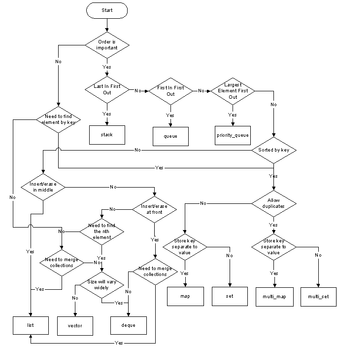

- [Abstract](#abstract)
- [Materials](#materials)
- [Basic](#basic)
  - [virtual function](#virtual-function)
  - [vector vs deque vs list](#vector-vs-deque-vs-list)
  - [vector](#vector)
    - [pros](#pros)
    - [cons](#cons)
  - [deque (double ended queue)](#deque-double-ended-queue)
    - [pros](#pros)
    - [cons](#cons)
  - [list](#list)
    - [pros](#pros)
    - [cons](#cons)
  - [How to choose a container](#how-to-choose-a-container)
- [Advanced](#advanced)
  - [Compiler Generated Code](#compiler-generated-code)
  - [Disallow the use of compiler generated functions](#disallow-the-use-of-compiler-generated-functions)
  - [Declare a destructor virtual in polymorphic base classes](#declare-a-destructor-virtual-in-polymorphic-base-classes)
  - [Never call virtual functions in constructor or destructor](#never-call-virtual-functions-in-constructor-or-destructor)
  - [Named Parameter Idiom](#named-parameter-idiom)
  - [new delete](#new-delete)
  - [casting](#casting)
  - [const](#const)
  - [lvalue and rvalue](#lvalue-and-rvalue)
  - [ADL(Argument Dependent Lookup)](#adlargument-dependent-lookup)
  - [typename vs class in template](#typename-vs-class-in-template)
- [STL](#stl)
  - [Major Headers](#major-headers)
  - [vector](#vector)
  - [deque](#deque)
  - [list](#list)
  - [set, multiset](#set-multiset)
  - [map, multimap](#map-multimap)
- [unordered container](#unordered-container)
  - [Associative Array](#associative-array)
  - [array](#array)
  - [Container Adaptor](#container-adaptor)
  - [Iterators](#iterators)
  - [Functors (Function Object)](#functors-function-object)
  - [Iterator Adaptor (Predefined Iterator)](#iterator-adaptor-predefined-iterator)
  - [Algorithms](#algorithms)
- [C++11](#c11)
  - [auto](#auto)
  - [range based for](#range-based-for)
  - [initializer lists](#initializer-lists)
  - [in-class member initializers](#in-class-member-initializers)
  - [tuple](#tuple)
  - [advanced STL container](#advanced-stl-container)
  - [lambda](#lambda)
  - [move semantics](#move-semantics)
  - [Value Categories](#value-categories)
  - [r-value reference](#r-value-reference)
  - [Perfect Forwarding](#perfect-forwarding)
  - [move constructor](#move-constructor)
  - [array](#array)
  - [timer](#timer)
  - [regex](#regex)
  - [random](#random)
  - [thread](#thread)
  - [to_string](#tostring)
  - [convert string](#convert-string)
- [Concurrent Programming](#concurrent-programming)
- [C++ Unit Test](#c-unit-test)
- [Boost Library](#boost-library)

-----

# Abstract

c++에 대해 정리한다.

# Materials

- [c++ programming](http://boqian.weebly.com/c-programming.html)
  - boqian의 동영상 강좌
- [혼자 연구하는 c/c++](http://soen.kr/)
  - 김상형님의 강좌
- [프로그래밍 대회: C++11 이야기 @ slideshare](https://www.slideshare.net/JongwookChoi/c11-draft?ref=https://www.acmicpc.net/blog/view/46)
- [c++ language](http://en.cppreference.com/w/cpp/language)
- [cplusplus.com](https://www.cplusplus.com)
- [c++11FAQ](http://pl.pusan.ac.kr/~woogyun/cpp11/C++11FAQ_ko.html)

# Basic

## virtual function


virtual function 은 vptr, vtable 에 의해 구현된다. 다음과 같이 `Instrument, Wind, Percussion, Stringed, Brass` 를 정의해 보자.

```cpp
class Instrument {
public:
  virtual void play() {

  }
  virtual void what() {

  }
  virtual void adjust() {

  }
};

class Wind : public Instrument {
public:
  virtual void play() {

  }
  virtual void what() {

  }
  virtual void adjust() {

  }
}

class Percussion : public Instrument {
public:
  virtual void play() {

  }
  virtual void what() {

  }
  virtual void adjust() {

  }
}
class Stringed : public Instrument {
public:
  virtual void play() {

  }
  virtual void what() {

  }
  virtual void adjust() {

  }
}

class Brass : public Instrument {
public:
  virtual void play() {

  }
  virtual void what() {

  }
  virtual void adjust() {

  }
}
```

각각의 child class 들의 object 들은 `vptr, vtable` 을 갖는다.

## vector vs deque vs list

|     | vector | deque | list |
|:---:|:---:|:---:|:---:|
| 인덱스접근 | o | o | x |
| 확장방법 | 전체재할당 | chunk 추가할당 | 불필요 |
| 중간삽입 | O(n) | O(n) | O(1)|

## vector

### pros

- 동적으로 확장 및 축소가 가능하다. dynamic array로 구현되어 있다.
  재할당 방식이다. 메모리가 연속으로 할당되어 있어 포인터 연산이 가능하다.
- index로 접근 가능하다. O(1)

### cons

- 끝이 아닌 위치에 삽입 및 제거시 성능이 떨어진다.
- 동적으로 확장 및 축소할때 전체를 재할당 하므로 비용이 크다.

## deque (double ended queue)

### pros

- index로 접근 가능하다. O(1)
- 끝이 아닌 위치에 삽입 및 제거시 성능이 좋다. O(1)
- 동적으로 확장 될때 일정한 크기만큼 chuck가 하나 더 할당되는 방식이다.
  저장 원소가 많거나 원소의 크기가 클때 즉 메모리 할당이 큰 경우 
  vector에 비해 확장 비용이 적다.

### cons

- 메모리가 연속으로 할당되어 있지 않아 vector와 달리 포인터 연산이 불가능하다.

## list

### pros

- vector, deque와 달리 임의의 위치에 삽입 및 제거시 성능이 좋다. O(1)

### cons

- index로 접근 불가능하다. 

## How to choose a container

[C++ Containers Cheat Sheet](http://homepages.e3.net.nz/~djm/cppcontainers.html)



# Advanced

## Compiler Generated Code

compiler 는 경우에 따라 `Copy constructor, Copy Assignment Operator, Destructor, Default Constructor` 를 생성해 준다.

```cpp
/*
Compiler silently writes 4 functions if they are not explicitly declared:
1. Copy constructor.
2. Copy Assignment Operator.
3. Destructor.
4. Default constructor (only if there is no constructor declared).
*/

class dog {};

/* equivalent to */

class dog {
	public:
		dog(const dog& rhs) {...};   // Member by member initialization

		dog& operator=(const dog& rhs) {...}; // Member by member copying

		dog() {...};  // 1. Call base class's default constructor; 
		              // 2. Call data member's default constructor.

		~dog() {...}; // 1. Call base class's destructor; 
		              // 2. Call data member's destructor.
}
/*
Note:
1. They are public and inline.
2. They are generated only if they are needed.
*/
```

## Disallow the use of compiler generated functions

`delete` 을 이용하여 컴파일러가 코드를 생성하지 못하도록 할 수 있다.

```cpp
class dog {
   public:
   dog(const dog& ) = delete; // Prevent copy constructor from being used.
                              // Useful when dog holds unsharable resource.
}
```

## Declare a destructor virtual in polymorphic base classes

`destructor` 를 `virtual` 로 다형성을 실현할 수 있다. 예를 들어서 `yellowdog` 클래스가 `dog` 을 상속받는다고 하자. `yellowdog` 의 `destructor` 가 호출되게 하려면 어떻게 해야할까? `virtual destructor` 를 사용하거나 `shared_ptr` 을 사용한다.

```cpp
/* Problem */
class yellowdog : public dog {
};

dog* dogFactory::createDog() {
	dog* pd = new yellowdog();
	return pd;
}

int main() {
	dog* pd = dogFactory::createDog();
	...
	delete pd;  // Only dog's destructor is invoked, not yellowdog's.
}

/*
Solution: 
*/
class dog {
      virtual ~dog() {...}
}

/* 
Note: All classes in STL have no virtual destructor, so be careful inheriting 
from them.
*/


/*
When we should use virtual destructor:
Any class with virtual functions should have a virtual destructor.

When not to use virtual destructor:
1. Size of the class needs to be small;
2. Size of the class needs to be precise, e.g. passing an object from C++ to C.
*/


/* Solution 2: 
 *    using shared_prt
 */

class Dog {
public:
   ~Dog() {  cout << "Dog is destroyed"; }
};

class Yellowdog : public Dog {
public:
   ~Yellowdog() {cout << "Yellow dog destroyed." <<endl; }
};


class DogFactory {
public:
   //static Dog* createYellowDog() { return (new Yellowdog()); }
   static shared_ptr<Dog> createYellowDog() { 
      return shared_ptr<Yellowdog>(new Yellowdog()); 
   }
   //static unique_ptr<Dog> createYellowDog() {
   //   return unique_ptr<Yellowdog>(new Yellowdog());
   //}

};

int main() {

   //Dog* pd = DogFactory::createYellowDog();
   shared_ptr<Dog> pd = DogFactory::createYellowDog();
   //unique_ptr<Dog> pd = DogFactory::createYellowDog();
   
   //delete pd;
   
	return 0;
}
/*Note: you cannot use unique_ptr for this purpose */
```

## Never call virtual functions in constructor or destructor

`Constructor` 혹은 `Destructor` 에서 `virtual function` 을 호출하지 말자. 객체의 생명주기에 따라 호출이 안될 수 있기 때문이다.

```cpp
class dog {
 public:
  string m_name;
  dog(string name) {m_name = name;  bark();}
  virtual void bark() { cout<< "Woof, I am just a dog " << m_name << endl;}
};

class yellowdog : public dog {
 public:
  yellowdog(string name) : dog(string name) {...}
  virtual void bark() { cout << "Woof, I am a yellow dog " << m_name << endl; }
};

int main ()
{
  yellowdog mydog("Bob");
}

OUTPUT:
Woof, I am just a dog Bob.

/*
During the construction, all virtual function works like non-virtual function.

Why?
Base class's constructor run before derived class's constructor. So at the 
time of bark(), the yellowlog is not constructed yet.

Why Java behaves differently?

There is a fundamental difference in how Java and C++ defines an object's Life time.
Java: All members are null initialized before constructor runs. Life starts before constructor.
C++: Constructor is supposed to initialize members. Life starts after constructor is finished.

Calling down to parts of an object that haven not yet initialized is inherently dangerous.
*/


/*
solution 1:
*/
class dog {
 public:
  ...
  dog(string name, string color) { 
    m_name = name; 
    bark(color);
  }
  void bark(string str) { 
    cout<< "Woof, I am "<< str << " dog " << m_name << endl;
  }
};

class yellowdog : public dog {
 public:
  yellowdog(string name) : dog(name, "yellow") {}
};

int main ()
{
  yellowdog mydog("Bob");
}

OUTPUT:
Woof, I am yellow dog Bob

/*
solution 2:
*/
class dog {
 public:
  ...
  dog(string name, string woof) {
    m_name = name; 
    bark(woof);
  }
  dog(string name) {
    m_name = name; 
    bark( getMyColor() );
  }
  void bark(string str) { 
    cout<< "Woof, I am "<< str << "private:"; 
  }
 private:
  static string getMyColor() {
    return "just a";
  } 
};

class yellowdog : public dog {
 public:
  yellowdog(string name) : dog(name, getMyColor()) {}
 private:
  static string getMyColor() {
    return "yellow";
  }  //Why static?
};

int main ()
{
  yellowdog mydog("Bob");
}
OUTPUT:
Woof, I am yellow dog Bob
```

## Named Parameter Idiom

python 처럼 named parameter 를 흉내내보자.

```cpp

class OpenFile {
 public:
  OpenFile(
    string filename, 
    bool readonly=true, 
    bool appendWhenWriting=false, 
    int blockSize=256, 
    bool unbuffered=true, 
    bool exclusiveAccess=false);
}

OpenFile pf = OpenFile("foo.txt", true, false, 1024, true, true);
// Inconvenient to use
// Unreadable
// Inflexible

// What's ideal is:
OpenFile pf = OpenFile(.filename("foo.txt"), .blockSize(1024) );

/* Solution */
class OpenFile {
public:
  OpenFile(std::string const& filename);
  OpenFile& readonly()  { readonly_ = true; return *this; }
  OpenFile& createIfNotExist() { createIfNotExist_ = true; return *this; }
  OpenFile& blockSize(unsigned nbytes) { blockSize_ = nbytes; return *this; }
  ...
};

OpenFile f = OpenFile("foo.txt")
           .readonly()
           .createIfNotExist()
           .appendWhenWriting()
           .blockSize(1024)
           .unbuffered()
           .exclusiveAccess();

OpenFile f = OpenFile("foo.txt").blockSize(1024);
```

## new delete

다음은 `new` 와 `delete` 의 underhood 이다.

```cpp
   dog* pd = new dog();
/* 
 * Step 1. operator new is called to allocate memory.
 * Step 2. dog's constructor is called to create dog.
 * Step 3. if step 2 throws an exception, call operator delete to free the 
 *         memory allocated in step 1.
 */
   delete pd;
/* 
 * Step 1. dog's destructor is called.
 * Step 2. operator delete is called to free the memory.
 */
```

다음은 `global` `operator new` 의 구현이다. 

```cpp
/*
 * This is how the operator new may look like if you re-implement it:
 *
 * Note: new handler is a function invoked when operator new failed to allocate 
 * memory.
 *   set_new_handler() installs a new handler and returns current new handler.
 */
void* operator new(std::size_t size) throw(std::bad_alloc) {
   while (true) {
      void* pMem = malloc(size);   // Allocate memory
      if (pMem) 
         return pMem;              // Return the memory if successful

      std::new_handler Handler = std::set_new_handler(0);  // Get new handler
      std::set_new_handler(Handler);

      if (Handler)
         (*Handler)();            // Invoke new handler
      else
         throw bad_alloc();       // If new handler is null, throw exception
   }
}
```

다음은 `class` `operator new` 의 구현이다.

```cpp
/* 
 * Member Operator new
 */
class dog {
   ...
   public:
   static void* operator new(std::size_t size) throw(std::bad_alloc) 
   {
      if (size == sizeof(dog))
         customNewForDog(size);
      else
         ::operator new(size);
   }
   ...
};

class yellowdog : public dog {
   int age;
   static void* operator new(std::size_t size) throw(std::bad_alloc) 
};

int main() {
   yellowdog* py= new yellowdog();
}
```

다음은 `class` `operator delete` 의 구현이다.

```cpp
/* Similarly for operator delete */
class dog {
   static void operator delete(void* pMemory) throw() {
      cout << "Bo is deleting a dog, \n";
      customDeleteForDog();
      free(pMemory);
   }
   ~dog() {};
};

class yellowdog : public dog {
   static void operator delete(void* pMemory) throw() {
      cout << "Bo is deleting a yellowdog, \n";
      customDeleteForYellowDog();
      free(pMemory);
   }
};

int main() {
   dog* pd = new yellowdog();
   delete pd;
}

// See any problem?
//
//
// How about a virtual static operator delete?
//
//
// Solution:
//   virtual ~dog() {}
```

우리는 다음과 같은 이유로 `new, delete` 을 customizing 한다.

```cpp
/*
 * Why do we want to customize new/delete
 *
 * 1. Usage error detection: 
 *    - Memory leak detection/garbage collection. 
 *    - Array index overrun/underrun.
 * 2. Improve efficiency:
 *    a. Clustering related objects to reduce page fault.
 *    b. Fixed size allocation (good for application with many small objects).
 *    c. Align similar size objects to same places to reduce fragmentation.
 * 3. Perform additional tasks:
 *    a. Fill the deallocated memory with 0's - security.
 *    b. Collect usage statistics.
 */

/*
 * Writing a GOOD memory manager is HARD!
 *
 * Before writing your own version of new/delete, consider:
 *
 * 1. Tweak your compiler toward your needs;
 * 2. Search for memory management library, E.g. Pool library from Boost.
 */
```

## casting

type conversion 은  `implicit type conversion` 과 `explicit type conversion` 과 같이 두가지가 있다. 이 중 `explicit type conversion` 이 곧 `casting` 에 해당된다.

`casting` 은 `static_cast, dynamic_cast, const_cast, reinterpret_cast` 와 같이 네가지가 있다.

```cpp
/*
 * 1. static_cast
 */
int i = 9;
float f = static_cast<float>(i);  // convert object from one type to another
dog d1 = static_cast<dog>(string("Bob"));  // Type conversion needs to be defined.
dog* pd = static_cast<dog*>(new yellowdog()); // convert pointer/reference from one type 
                                              // to a related type (down/up cast)

/*
 * 2. dynamic_cast 
 */
dog* pd = new yellowdog();
yellowdog py = dynamic_cast<yellowdog*>(pd); 
// a. It convert pointer/reference from one type to a related type (down cast)
// b. run-time type check.  If succeed, py==pd; if fail, py==0;
// c. It requires the 2 types to be polymorphic (have virtual function).

/*
 * 3. const_cast
 */                                        // only works on pointer/reference
const char* str = "Hello, world.";         // Only works on same type
char* modifiable = const_cast<char*>(str); // cast away constness of the object 
                                           // being pointed to

/*
 * 4. reinterpret_cast
 */
long p = 51110980;                   
dog* dd = reinterpret_cast<dog*>(p);  // re-interpret the bits of the object pointed to
// The ultimate cast that can cast one pointer to any other type of pointer.

/*
 * C-Style Casting:  
 */
short a = 2000;
int i = (int)a;  // c-like cast notation
int j = int(a);   // functional notation
//   A mixture of static_cast, const_cast and reinterpret_cast
```

## const

기본적인 `const` 사용법은 다음과 같다.

```cpp
int i = 1;
const int* p1 = &i; // data is const, pointer is not
int* const p2 = &i; // pointer is const, data is not
const int* const p3; // data and pointer are both const
int const *p4 = &i; // data is const, pointer is not
// left const of *, data is const
// right const of *, pointer is const
```

`const` 를 `parameters, return value, function` 에 사용해 보자.

```cpp
class Dog {
   int age;
   string name;
public:
   Dog() { age = 3; name = "dummy"; }
   
   // const parameters
   void setAge(const int& a) { age = a; }
   void setAge(int& a) { age = a; }
   
   // Const return value
   const string& getName() {return name;}
   
   // const function
   void printDogName() const { cout << name << "const" << endl; }
   void printDogName() { cout << getName() << " non-const" << endl; }
};

int main() {
   Dog d;
   d.printDogName();
   
   const Dog d2;
   d2.printDogName();
   
}
```

`const function` 이라도 `mutable` 이 사용된 멤버변수를 수정할 수 있다.

```cpp
class BigArray {
   vector<int> v; // huge vector
   mutable int accessCounter;
   
   int* v2; // another int array

public:
   int getItem(int index) const {
      accessCounter++;
      return v[index];
   }
   
    void setV2Item(int index, int x)  {
      *(v2+index) = x;
   }
    
   // Quiz:
   const int*const fun(const int*const& p)const;
 };

 int main(){
    BigArray b;
 }
```

## lvalue and rvalue

`lvalue` 는 메모리 위치를 가지고 있는 `expression` 이다. 따라서 다른 `value` 에 의해 가르켜 지거나 수정될 수 있다. `rvalue` 는 `lvalue` 가 아닌 `expression` 이다. 임시적으로 생성된 것이어서 다른 `value` 에 의해 가르켜 질 수 없고 수정될 수도 없다. `c++11` 은 `rvalue reference` 를 새롭게 소개하고 있다. 

다음은 `lvalue` 의 예이다.

```cpp
int i;        // i is a lvalue
int* p = &i;  // i's address is identifiable
i = 2;    // Memory content is modified

class dog;
dog d1;   // lvalue of user defined type (class)

         // Most variables in C++ code are lvalues
```

다음은 `rvalue` 의 예이다.

```cpp
//Rvalue Examples:
int x = 2;        // 2 is an rvalue
int x = i+2;      // (i+2) is an rvalue
int* p = &(i+2);  // Error
i+2 = 4;     // Error
2 = i;       // Error

dog d1;
d1 = dog();  // dog() is rvalue of user defined type (class)

int sum(int x, int y) { return x+y; }
int i = sum(3, 4);  // sum(3, 4) is rvalue

//Rvalues: 2, i+2, dog(), sum(3,4), x+y
//Lvalues: x, i, d1, p
```

`lvalue reference` 는 `lvalue` 만 가르킬 수 있다. 그러나 예외적으로 `const lvalue reference` 의 경우 `rvalue` 를 가르킬 수 있다. 다음은 `lvalue reference` 의 예이다.

```cpp
//Reference (or lvalue reference):
int i;
int& r = i;

int& r = 5;      // Error

//Exception: Constant lvalue reference can be assign a rvalue;
const int& r = 5;   //

int square(int& x) { return x*x; }
square(i);   //  OK
square(40);  //  Error

//Workaround:
int square(const int& x) { return x*x; }  // square(40) and square(i) work
```

`lvalue` 는 `rvalue` 를 만들 때 `rvalue` 는 `lvalue` 를 만들 때 사용될 수 있다.

```cpp
/*
 * lvalue can be used to create an rvalue
 */
int i = 1;
int x = i + 2; 

int x = i;

/*
 * rvalue can be used to create an lvalue
 */
int v[3];
*(v+2) = 4;
```

function 혹은 operator 가 항상 `rvalue` 만을 리턴하지는 않는다.

```cpp
/*
 * Misconception 1: function or operator always yields rvalues.
 */
int x = i + 3;  
int y = sum(3,4);

int myglobal ;
int& foo() {
   return myglobal;
}
foo() = 50;

// A more common example:
array[3] = 50;  // Operator [] almost always generates lvalue
```

`lvalue` 가 항상 수정될 수는 없다.

```cpp
/*
 * Misconception 2: lvalues are modifiable.
 *
 * C language: lvalue means "value suitable for left-hand-side of assignment"
 */
const int c = 1;  // c is a lvalue
c = 2;   // Error, c is not modifiable.
```

`rvalue` 도 수정될 수 있다.

```cpp
/*
 * Misconception 3: rvalues are not modifiable.
 */
i + 3 = 6;    // Error
sum(3,4) = 7; // Error

// It is not true for user defined type (class)
class dog;
dog().bark();  // bark() may change the state of the dog object.
```

## ADL(Argument Dependent Lookup)

함수 `g(x)` 를 호출할 때 인자 `x` 의 타입을 고려하여 적당한 함수 `g` 를 찾는 것을 ADL 이라고 한다.

```cpp
// Example 1:
namespace A
{
   struct X {};
   void g( X ) { cout << " calling A::g() \n"; }
}

void g( X ) { cout << " calling A::g() \n"; }

int main() {
   A::X x1;
   g(x1);   // Koenig Lookup, or Argument Dependent Lookup (ADL)
}

//Notes:
//1. Remove A:: from A::g(x);
//2. Add a global g(A::X);
// Argument Dependent Lookup (ADL)


/*
 *  Name Lookup Sequence
 *
 *  With namespaces:
 *  current scope => next enclosed scope => ... => global scope 
 *
 *  To override the sequence:
 *  1. Qualifier or using declaration
 *  2. Koenig lookup
 *
 *  With classes:
 *  current class scope => parent scope => ... => global scope
 *
 *  To override the sequence:
 *   - Qualifier or using declaration
 *
 *
 *  Name hiding
 */
```

## typename vs class in template

보통은 `typename` 과 `class` 를 교환해서 사용할 수 있다.

```cpp
template<typename T>
T square(T x) {
   return x*x;
}

template<class T>
T square(T x) {
   return x*x;
}
```

`T::A *aObj;` 과 같은 표현을 살펴보자. 컴파일러는 `*` 을 곱연산자로 해석한다. `T::A` 의 `A` 가 static member 가 아닌 type 이라는 것을 컴파일러에게 알려주기 위해 `typename` 이라는 키워드를 만들었다.

```cpp
template <class T>
class Demonstration {
public:
void method() {
  T::A *aObj; // oops …
  // …
};

template <class T>
class Demonstration {
public:
void method() {
  typename T::A* a6; // declare pointer to T’s A
  // …
};

```

# STL

## Major Headers

```cpp
#include <vector>
#include <deque>
#include <list>
#include <set>   // set and multiset
#include <map>   // map and multimap
#include <unordered_set>  // unordered set/multiset
#include <unordered_map>  // unordered map/multimap
#include <iterator>
#include <algorithm>
#include <numeric>    // some numeric algorithm
#include <functional>
```

## vector

```cpp

vector<int> vec;   // vec.size() == 0
vec.push_back(4);
vec.push_back(1);
vec.push_back(8);  // vec: {4, 1, 8};    vec.size() == 3

// Vector specific operations:
cout << vec[2];     // 8  (no range check)
cout << vec.at(2);  // 8  (throw range_error exception of out of range)

for (int i; i < vec.size(); i++) 
   cout << vec[i] << " ";

for (list<int>::iterator itr = vec.begin(); itr!= vec.end(); ++itr)
   cout << *itr << " ";  

for (it : vec)    // C++ 11
   cout << it << " ";

// Vector is a dynamically allocated contiguous array in memory
int* p = &vec[0];   p[2] = 6;

// Common member functions of all containers.
// vec: {4, 1, 8}
if (vec.empty()) { cout << "Not possible.\n"; }

cout << vec.size();   // 3

vector<int> vec2(vec);  // Copy constructor, vec2: {4, 1, 8}

vec.clear();    // Remove all items in vec;   vec.size() == 0

vec2.swap(vec);   // vec2 becomes empty, and vec has 3 items.

// Notes: No penalty of abstraction, very efficient.

/* Properties of Vector:
 * 1. fast insert/remove at the end: O(1)
 * 2. slow insert/remove at the begining or in the middle: O(n)
 * 3. slow search: O(n)
 */

```

## deque

```cpp

deque<int> deq = { 4, 6, 7 };
deq.push_front(2);  // deq: {2, 4, 6, 7}
deq.push_back(3);   // deq: {2, 4, 6, 7, 3}

// Deque has similar interface with vector
cout << deq[1];  // 4


/* Properties:
 * 1. fast insert/remove at the begining and the end;
 * 2. slow insert/remove in the middle: O(n)
 * 3. slow search: O(n)
 */
```

## list

```cpp
list<int> mylist = {5, 2, 9 }; 
mylist.push_back(6);  // mylist: { 5, 2, 9, 6}
mylist.push_front(4); // mylist: { 4, 5, 2, 9, 6}

   
list<int>::iterator itr = find(mylist.begin(), mylist.end(), 2); // itr -> 2
mylist.insert(itr, 8);   // mylist: {4, 5, 8, 2, 9, 6}  
                         // O(1), faster than vector/deque
itr++;                   // itr -> 9
mylist.erase(itr);       // mylist: {4, 8, 5, 2, 6}   O(1)

/* Properties:
 * 1. fast insert/remove at any place: O(1)
 * 2. slow search: O(n)
 * 3. no random access, no [] operator.
 */

mylist1.splice(itr, mylist2, itr_a, itr_b );   // O(1)
```

## set, multiset

```cpp
  set<int> myset;
  myset.insert(3);    // myset: {3}
  myset.insert(1);    // myset: {1, 3}
  myset.insert(7);    // myset: {1, 3, 7},  O(log(n))

  set<int>::iterator it;
  it = myset.find(7);  // O(log(n)), it points to 7
                  // Sequence containers don't even have find() member function
  pair<set<int>::iterator, bool> ret;
  ret = myset.insert(3);  // no new element inserted
  if (ret.second==false) 
     it=ret.first;       // "it" now points to element 3

  myset.insert(it, 9);  // myset:  {1, 3, 7, 9}   O(log(n)) => O(1)
                         // it points to 3
  myset.erase(it);         // myset:  {1, 7, 9}

  myset.erase(7);   // myset:  {1, 9}
     // Note: none of the sequence containers provide this kind of erase.

// multiset is a set that allows duplicated items
multiset<int> myset;

// set/multiset: value of the elements cannot be modified
*it = 10;  // *it is read-only

/* Properties:
 * 1. Fast search: O(log(n))
 * 2. Traversing is slow (compared to vector & deque)
 * 3. No random access, no [] operator.
 */
```

## map, multimap

```cpp
map<char,int> mymap;
mymap.insert ( pair<char,int>('a',100) );
mymap.insert ( make_pair('z',200) );

map<char,int>::iterator it = mymap.begin();
mymap.insert(it, pair<char,int>('b',300));  // "it" is a hint

it = mymap.find('z');  // O(log(n))

// showing contents:
for ( it=mymap.begin() ; it != mymap.end(); it++ )
  cout << (*it).first << " => " << (*it).second << endl;

// multimap is a map that allows duplicated keys
multimap<char,int> mymap;

// map/multimap: 
//  -- keys cannot be modified
//     type of *it:   pair<const char, int>
     (*it).first = 'd';  // Error

// Associative Containers: set, multiset, map, multimap
//
// What does "Associative" mean?
```

# unordered container

```cpp
  unordered_set<string> myset = { "red","green","blue" };
  unordered_set<string>::const_iterator itr = myset.find ("green"); // O(1)
  if (itr != myset.end())   // Important check 
     cout << *itr << endl;
  myset.insert("yellow");  // O(1)

  vector<string> vec = {"purple", "pink"};
  myset.insert(vec.begin(), vec.end());

// Hash table specific APIs:
  cout << "load_factor = " << myset.load_factor() << endl;
  string x = "red";
  cout << x << " is in bucket #" << myset.bucket(x) << endl;
  cout << "Total bucket #" << myset.bucket_count() << endl;

/* Properties of Unordered Containers:
 * 1. Fastest search/insert at any place: O(1)
 *     Associative Container takes O(log(n))
 *     vector, deque takes O(n)
 *     list takes O(1) to insert, O(n) to search
 * 2. Unorderd set/multiset: element value cannot be changed.
 *    Unorderd map/multimap: element key cannot be changed.
 */  
```

## Associative Array

```cpp
unordered_map<char, string> day = {{'S',"Sunday"}, {'M',"Monday"}};

cout << day['S'] << endl;    // No range check
cout << day.at('S') << endl; // Has range check

vector<int> vec = {1, 2, 3};
vec[5] = 5;   // Compile Error

day['W'] = "Wednesday";  // Inserting {'W', "Wednesday}
day.insert(make_pair('F', "Friday"));  // Inserting {'F', "Friday"}

day.insert(make_pair('M', "MONDAY"));  // Fail to modify, it's an unordered_map
day['M'] = "MONDAY";                   // Succeed to modify

void foo(const unordered_map<char, string>& m) {
   //m['S'] = "SUNDAY";
   //cout << m['S'] << endl;
   auto itr = m.find('S');
   if (itr != m.end())
      cout << *itr << endl;
}
foo(day);

//   cout << m['S'] << endl;
//   auto itr = m.find('S');
//   if (itr != m.end() )
//      cout << itr->second << endl;

//Notes about Associative Array: 
//1. Search time: unordered_map, O(1); map, O(log(n));
//2. Unordered_map may degrade to O(n);
//3. Can't use multimap and unordered_multimap, they don't have [] operator.
```

## array

```cpp
int a[3] = {3, 4, 5};
array<int, 3> a = {3, 4, 5};
a.begin();
a.end();
a.size();
a.swap();
array<int, 4> b = {3, 4, 5};
```

## Container Adaptor

```cpp
/*
 * Container Adaptor
 *  - Provide a restricted interface to meet special needs
 *  - Implemented with fundamental container classes
 *
 *  1. stack:  LIFO, push(), pop(), top()
 *
 *  2. queue:  FIFO, push(), pop(), front(), back() 
 *
 *  3. priority queue: first item always has the greatest priority
 *                   push(), pop(), top()
 */
```

## Iterators

```cpp
// 1. Random Access Iterator:  vector, deque, array
vector<int> itr;
itr = itr + 5;  // advance itr by 5
itr = itr - 4;  
if (itr2 > itr1) ...
++itr;   // faster than itr++
--itr;

// 2. Bidirectional Iterator: list, set/multiset, map/multimap
list<int> itr;
++itr;
--itr;

// 3. Forward Iterator: forward_list
forward_list<int> itr;
++itr;

// Unordered containers provide "at least" forward iterators.

// 4. Input Iterator: read and process values while iterating forward.
int x = *itr;

// 5. Output Iterator: output values while iterating forward.
*itr = 100;

// Every container has a iterator and a const_iterator
set<int>::iterator itr;
set<int>::const_iterator citr;  // Read_only access to container elements

set<int> myset = {2,4,5,1,9};
for (citr = myset.begin(); citr != myset.end(); ++citr) {
   cout << *citr << endl;
   //*citr = 3;
}
for_each(myset.cbegin(), myset.cend(), MyFunction);  // Only in C++ 11

// Iterator Functions:
advance(itr, 5);       // Move itr forward 5 spots.   itr += 5;
distance(itr1, itr2);  // Measure the distance between itr1 and itr2

// Two ways to declare a reverse iterator
reverse_iterator<vector<int>::iterator> ritr;
vector<int>::reverse_iterator ritr;


// Traversing with reverse iterator
vector<int> vec = {4,5,6,7};
reverse_iterator<vector<int>::iterator> ritr;
for (ritr = vec.rbegin(); ritr != vec.rend(); ritr++)
   cout << *ritr << endl;   // prints: 7 6 5 4

/*
 * Reverse Iterator and Iterator 
 */   

vector<int>::iterator itr;
vector<int>::reverse_iterator ritr;

ritr = vector<int>::reverse_iterator(itr);

itr = vector<int>::iterator(ritr);  // Compile Error
itr = ritr.base();  

// C++ Standard: base() returns current iterator
// 

vector<int> vec = {1,2,3,4,5};
vector<int>::reverse_iterator ritr = find(vec.rbegin(), vec.rend(), 3);

cout << (*ritr) << endl;   // 3

vector<int>::iterator itr = ritr.base();  

cout << (*itr) << endl;   // 4 

vec = {1,2,3,4,5};
ritr = find(vec.rbegin(), vec.rend(), 3);

//Inserting
vec.insert(ritr, 9);         // vec: {1,2,3,9,4,5}
// or
vec.insert(ritr.base(), 9);  // vec: {1,2,3,9,4,5}

vec = {1,2,3,4,5};
ritr = find(vec.rbegin(), vec.rend(), 3);

// Erasing
vec.erase(ritr);    // vec: {1,2,4,5}  
// or
vec.erase(ritr.base());    // vec: {1,2,3,5}  
```

## Functors (Function Object)

```cpp
```


## Iterator Adaptor (Predefined Iterator)

```cpp

/* Iterator Adaptor (Predefined Iterator)
 *  - A special, more powerful iterator
 * 1. Insert iterator
 * 2. Stream iterator
 * 3. Reverse iterator
 * 4. Move iterator (C++ 11)
 */

// 1. Insert Iterator:
vector<int> vec1 = {4,5};
vector<int> vec2 = {12, 14, 16, 18};
vector<int>::iterator it = find(vec2.begin(), vec2.end(), 16);
insert_iterator< vector<int> > i_itr(vec2,it);
copy(vec1.begin(),vec1.end(),  // source
     i_itr);                   // destination
     //vec2: {12, 14, 4, 5, 16, 18}
// Other insert iterators: back_insert_iterator, front_insert_iterator

// 2. Stream Iterator:
vector<string> vec4;
copy(istream_iterator<string>(cin), istream_iterator<string>(), 
            back_inserter(vec4));

copy(vec4.begin(), vec4.end(), ostream_iterator<string>(cout, " "));

// Make it terse:
copy(istream_iterator<string>(cin), istream_iterator<string>(), 
            ostream_iterator<string>(cout, " "));

// 3. Reverse Iterator:
vector<int> vec = {4,5,6,7};
reverse_iterator<vector<int>::iterator> ritr;
for (ritr = vec.rbegin(); ritr != vec.rend(); ritr++)
   cout << *ritr << endl;   // prints: 7 6 5 4
```

## Algorithms

```cpp
vector<int> vec = { 4, 2, 5, 1, 3, 9};   
vector<int>::iterator itr = min_element(vec.begin(), vec.end()); // itr -> 1

// Note 1: Algorithm always process ranges in a half-open way: [begin, end)
sort(vec.begin(), itr);  // vec: { 2, 4, 5, 1, 3, 9}

reverse(itr, vec.end());  // vec: { 2, 4, 5, 9, 3, 1}   itr => 9

// Note 2:
vector<int> vec2(3);
copy(itr, vec.end(),  // Source
     vec2.begin());   // Destination
     //vec2 needs to have at least space for 3 elements.


// Note 3:
vector<int> vec3;
copy(itr, vec.end(), back_inserter(vec3));  // Inserting instead of overwriting 
                  // back_insert_iterator      Not efficient

vec3.insert(vec3.end(), itr, vec.end());  // Efficient and safe

// Note 4: Algorithm with function
bool isOdd(int i) {
   return i%2;
}

int main() {
   vector<int> vec = {2, 4, 5, 9, 2}
   vector<int>::iterator itr = find_if(vec.begin(), vec.end(), isOdd); 
   	                             // itr -> 5
}

// Note 5: Algorithm with native C++ array
int arr[4] = {6,3,7,4};
sort(arr, arr+4);
```

# C++11

## auto

- 컴파일 타임에 타입을 자동으로 추론한다.

```cpp
  std::map<std::string, std::string> M = { {"FOO", "foo"}, {"BAR", "bar"} };
  for (auto it = M.begin(); it != M.end(); ++it) {
    std::cout << it->first << " : " << it->second << std::endl;
  }
```

## range based for

```cpp
  for (auto& kv : M) {
    std::cout << kv.first << " : " << kv.second << std::endl;
  }
  // iterate 4 times because of null character
  for (char c : "RGB") {...}
  // iterate 3 times
  for (char c : string("RGB") {...}
```

## initializer lists

- container를 간단히 초기화 할 수 있다.

```cpp
//
vector<int> a = {1, 2, 3, 4};
map<string, int> b = { {"a", 1}, {"b", 2} };
pair<int, long long> c = {3, 4LL};
pair<vector<int>, pair<char, char>> d = { {1, 2, 3}, {'A', 'B'} };
tuple<int, string, int> e = {2222, "Yellow", 22};

std::pair<std::string, std::string> get_name() {
  return {"BAZ", "baz"};
}
//
struct vector3 {
  int x, y, z;
  vector3(int x = 0, int y = 0, int z = 0) : x(x), y(y), z(z) {}
};
Vector3 o = Vector3(0, 0, 0);
Vector3 V = {1, 2, 3}; 
// 생성자 없이 explicit type을 주어 값 생성
Vector3_add(Vector3{0, 0, 0}, Vector3{0, 0, 0});
// 함수 파라메터에 따라 자동으로 type추론이 가능
Vector3_add( {0, 0, 0}, {0, 0, 0});
// old
int min_val = min(x, min(y, z));
// new
int min_val = min({x, y, z});
int max_val = max({x, y, z});
tie(min_val, max_val) = minmax({p, q, r, s});
//
for (const auto & x : {2, 3, 5, 7}) {
  std::cout << x << std::endl;
}
```

## in-class member initializers

- struct, class의 field를 초기화 할 수 있다.

```cpp
class Foo {
    int sum = 0;
    int n;
};
```

## tuple

```cpp
  std::tuple<int, int, int> t_1(1, 2, 3);
  auto t_2 = std::make_tuple(1, 2, 3);
  std::cout << std::get<0>(t_1) << " " <<
      std::get<1>(t_1) << " " <<
      std::get<2>(t_1) << " " << std::endl;
  // tuple, tie
  int a = 3, b = 4;
  std::tie(b, a) = std::make_tuple(1, 2);
  std::cout << a << " " << b << std::endl;

  // tuple list sort
  std::vector<std::tuple<int, int, int> > tv;
  tv.push_back(std::make_tuple(1, 2, 3));
  tv.push_back(std::make_tuple(2, 1, 3));
  tv.push_back(std::make_tuple(1, 1, 3));  
  std::sort(tv.begin(), tv.end());
  for (const auto& x : tv) {
    std::cout << std::get<0>(x) << " " << std::get<1>(x) << " " << std::get<2>(x) << std::endl;
  }

  // // tuple example : lexicographical comparison
  // std::sort(a.begin(), a.end(), [&](const Elem& x, const Elem& y) {
  //     return std::make_tuple(x.score, -x.age, x.submission)
  //         < std::make_tuple(y.score, -y.age, y.submission);
  //   }); 
```

## advanced STL container

```cpp
  // advanced STL container
  // argument가 container의 element의 type의 생성자에 전달된다.
  std::vector<std::pair<int, int> > vvv;
  vvv.push_back(std::make_pair(3, 4));
  vvv.emplace_back(3, 4);
  std::queue<std::tuple<int, int, int> > q;
  q.emplace(1, 2, 3);

  // advanced STL container
  // unordered_set, unordered_map
  // red black tree vs hash
  std::unordered_map<long long, int> pows;
  for (int i = 0; i < 63; ++i)
    pows[1LL << i] = i;
```

## lambda

```cpp
  // lambda function
  // [captures](parameters){body}
  auto func = [](){};
  func();

  // lambda function recursive
  std::function<int(int)> f;
  f = [&f](int x) -> int {
    if (x <= 1)
      return x;
    return f(x - 1) + f(x - 2);
  };

  // lambda stl algorithms
  std::vector<int> primes = {2, 3, 5, 7, 11};
  auto is_even = [](int n){return (n & 1) == 0;};
  bool all_even = std::all_of(primes.begin(), primes.end(), is_even);
```

## move semantics

- Matrix클래스를 사용한 나쁜 예.

```cpp
// bad 
typedef vector<vector<int>> Matrix;
void multiply(const Matrix& A, const Matrix& B, Matrix& C);
Matrix C;
multiply(A, B, C);
print(C);
```
- Matrix클래스를 사용한 좋은 예. host부분을 주목하자. 위에서 처럼
  연산의 결과에 해당하는 Matrix를 미리 선언할 필요 없다.

```cpp
Matrix operator* (const Matrix* A, const Matrix& B) {
  size_t n = A.size();
  Matrix C(n, n);
  for (int i = 0; i < n; ++i)
    for (int j = 0; j < n; ++j)
      for (int k = 0; k < n; ++k)
        C[i][j] += A[i][k] + B[k][j];
  return C;
}
Matrix E = (D * D) + I;
E = E * E;
```

- c++11에서 RVO(Return Value Optimization)덕분에 Matrix 값 복사는
  일어나지 않는다. rvalue가 return된다.
  
## Value Categories

- [Value categories @ cppreference](http://en.cppreference.com/w/cpp/language/value_category)
- lvalue
  - `std::cin`, `std::endl`
    - the name of a variable or a function in scope, regarless of type
  - `std::getline(std::cin, str)`, `std::cout << 1`, `str1 = str2`, `++it`
    - a function call or an overloaded operator expression of lvalue reference return type
  - `a = b`, `a += b`, `a %= b`
    - the built-in assignment and compound assignment expressions
  - `++a`, `--a`
    - the built-in pre-increment and pre-decrement expressions
  - `*p`
    - the built-in indirection expression
  - `a[n]`, `p[n]`
    - the built-in subscript expressions
  - `a.m`
    - the member of object expression
  - `p->m`
    - the built-in member of pointer expression
  - `a.*mp`
    - the pointer to member of object expression
  - `p->*mp`
    - the built-in pointer to member of pointer expression
  - `a, b`
    - the built-in comma expression, there b is an lvalue
  - `a ? b : c`
    - the ternary conditional expression for some b and c
  - `"Hello, world"`
    - string literal
  - `static_cast<int&>(x)`
    - a cast expression to lavalue reference type
  - 주소값이 있는 변수
  - same as glvalue
  - address of an lvalue may be taken
    - `&++i`, `&std::endl`
  - a modifiable lvalue may be used as the left-hand operand of the
    built-in assignment and compound assignment operators
  - an lvalue may be used to initialize an lvalue reference; this
    associates a new name with the object identified by the
    expression.
    
- prvalue (pure rvalue)
  - `42`, `true`, `nullptr`
    - a literal except for string literal
  - `str.substr(1, 2)`, `str1 + str2`, `it++`
    - a function call or an overloaded operator expression of non-reference return type
  - `a++`, `a--`
    - the built-in post-increment and post-decrement expressions
  - `a+b`, `a%b`, `a&b`, `a<<b`
    - the built-in arithmetic expressions
  - `a && b`, `a || b`, `!a` 
    - the built-in logical expressions
  - `&a`
    - built-in address-of expression
  - `p->m`
    - built-in member of pointer expression
  - `a.*mp`
    - the pointer to member of object expression
  - `p->*mp`
    - `a, b`
    - the built-in comman expression, where b is an rvalue
  - `a ? b : c`
    - the ternary onditional expression for some b and c
  - `static_cast<double>(x)`, `std::string{}`, `(int)42`
    - a cast expression to non-reference type
  - `this`
  - `[](int x){return x * x;}`
    - a lambda expression
  - same as rvalue
  - a prvalue cannot be polymorphic: the dynamic type of the object it
    identifies is always the type of the expression
  - a non-class non-array prvalue cannot be cv-qualified
  - a prvalue cannot have incomplete type
- xvalue (expiring value)
  - `std::move(x)`
    - a function call or an overloaded operator expression of rvalue
      reference to object return type
  - `a[n]`
    - the built-in subscript expression
  - `a.m`
    - the member of object expression
  - `a.*mp`
    - the pointer to member of object expression
  - `a ? b : c`
    - the ternary conditional expression for some b and c
  - `static_cast<char&&>(x)`
    - a cast expression to rvalue reference to object type
  - same as rvalue
  - same as glvalue
- glvalue (generalized value)
  - lvalue or xvalue
  - a glvalue may be implicitly converted to a prvalue with
    lavalue-to-rvalue, array-to-pointer, or function-to-pointer
    implicit conversion
  - a glvalue may be polymorphic: the dynamic type of the object it
    identifies is not necessarily the static type of the expression
  - a glvalue can have incomplete type, where permitted by the expression
- rvalue 
  - xvalue or prvalue
  - address of an rvalue may not be taken
    - `&int()`, `&i++`, `&42`, `&std::move(x)`
  - an rvalue can't be used as the left-hand operand of the built-in
    assignment or compound assignment operators.
  - an rvalue may be used to initialize a const lvalue reference, in
    which case the lifetime of the object identified by the rvalue is
    extended until the scope of the reference ends.
  
## r-value reference

`rvalue` 는 `move semantics` 혹은 `perfect fowarding` 을 위해 사용된다. 다음은 `rvalue` 의 예이다. `std::move` 는 `lvalue` 를 인자로 받아서 `rvalue` 로 `move semantics` 하여 리턴한다.

```cpp
int a = 5;
int& b = a;   // b is a lvalue reference, originally called reference in C++ 03

int&& c       // c is an rvalue reference

void printInt(int& i) { cout << "lvalue reference: " << i << endl; }
void printInt(int&& i) { cout << "rvalue reference: " << i << endl; } 

int main() {
   int i = 1;
   printInt(i);   // Call the first printInt
   printInt(6);   // Call the second printInt

   printInt(std::move(i));   // Call the second printInt
}
```

`rvalue reference` 는 `move semantics` 를 수행하기 위해 `copy constructor` 혹은 `copy assignment operator` 에서 유용하게 사용된다.

```cpp
/* 
 * Note 1: the most useful place for rvalue reference is overloading copy 
 * constructor and assignment operator, to achieve move semantics.
 */
X& X::operator=(X const & rhs); 
X& X::operator=(X&& rhs);
```

모든 `stl containers` 는 `move semantics` 가 구현되어 있다.

```cpp
/* Note 2: Move semantics is implemented for all STL containers, which means:
 *    a. Move to C++ 11, You code will be faster without changing a thing.
 *    b. You should use passing by value more often.
 */

vector<int> foo() { ...; return myvector; }

void goo(vector<int>& arg);   // Pass by reference if you use arg to carry
                             // data back from goo()
```

## Perfect Forwarding

어떠한 함수가  `rvalue` 를 `rvalue` 로 `lvalue` 를 `lvalue` 로 전달하는 것을 `perfect forwarding` 이라고 한다. 다음의 예에서 `relay` 는 `perfect forwarding` 이 되고 있지 않다.

```cpp
void foo( boVector arg );
// boVector has both move constructor and copy constructor

template< typename T >
void relay(T arg ) {
   foo(arg);  
}

int main() {
   boVector reusable = createBoVector();
   relay(reusable);
   ...
   relay(createBoVector());
}
```

앞서 언급한 예를 다음과 같이 수정하면 `perfect forwarding` 이 가능하다. 

```cpp
// Solution:
template< typename T >
void relay(T&& arg ) {
  foo( std::forward<T>( arg ) );
}

//* Note: this will work because type T is a template type.

/* 
 * Reference Collapsing Rules ( C++ 11 ):
 * 1.  T& &   ==>  T&
 * 2.  T& &&  ==>  T&
 * 3.  T&& &  ==>  T&
 * 4.  T&& && ==>  T&&
 */
```

`remove_reference` 는 `type T` 의 `reference` 를 제거한다.

```cpp
template< classs T >
struct remove_reference;    // It removes reference on type T

// T is int&
remove_refence<int&>::type i;  // int i;

// T is int
remove_refence<int>::type i;   // int i;
```

앞서 언급한 `reference collapsing rules` 에 의해 `relay` 로 전달된 인자가 어떻게 `perfect forwarding` 이 가능해지는지 살펴보자.

```cpp
/*
 * rvalue reference is specified with type&&.
 *
 * type&& is rvalue reference?
 */

// T&& variable is intialized with rvalue => rvalue reference
  relay(9); =>  T = int&& =>  T&& = int&& && = int&&

// T&& variable is intialized with lvalue => lvalue reference
  relay(x); =>  T = int&  =>  T&& = int& && = int&

// T&& is Universal Reference: rvalue, lvalue, const, non-const, etc...
// Conditions:
// 1. T is a template type.
// 2. Type deduction (reference collasing) happens to T.
//    - T is a function template type, not class template type.
//
```

`std:forward` 는 다음과 같이 구현되어 있다.

```cpp
template< typename T >
void relay(T&& arg ) {
  foo( std::forward<T>( arg ) );
}

// Implementation of std::forward()
template<class T>
T&& forward(typename remove_reference<T>::type& arg) {
  return static_cast<T&&>(arg);
} 
```

`std::move` 와 `std::forward` 의 차이는 다음과 같다.

```cpp

// std::move() vs std::forward()
std::move<T>(arg);    // Turn arg into an rvalue type
std::forward<T>(arg); // Turn arg to type of T&&
```

## move constructor

- 값 복사 없이 메모리가 이동하는 형태를 move semantic이라고 한다. move
  semantic이 가능한 생성자를 move constructor라고 한다.

```cpp
template<typename T>
struct vector {
  vector();
  vector(size_t size); // constructor
  vector(vector<T> &a); // copy constructor
  vector(vector<T> &&a); // move constructor
};
```

## array

```cpp
array<int, 6> a = {1, 2, 3};
```

- vector와 다르게 크기가 고정된 배열이다.
- int[]와 다른점은 무엇일까?
  - STL algorithm함수 들에 적용이 가능하다. (ex. begin, end)
  - 값 복사, 사전순 비교 등이 쉽다. 
  - assertive하게 동작 (out-of-index일때 바로 throw)
  
## timer

```cpp
using namespace std::chrono;
auto _start = system_clock::now();
auto _end = system_clock::now();
long millisecs = duration_cast<milliseconds>(_end - _start).count();
```

## regex

```cpp
if (regex_match("ABCD", regex("(A|B)C(.*)D"))) { 
  //... 
}
```

- [a.cpp](library/regex/a.cpp)

## random

```cpp
std::mt19936 eng; // Mersenne Twister
std::uniform_int_distribution<int> U(-100, 100);
for (int i = 0; i < n; ++i)
  cout << U(eng) << std;
```

## thread

```cpp
```

## to_string

```cpp
string s = std::to_string(10);
string s = std::to_string(3.1415926535);
```

## convert string

- stod, stof, stoi, stol, stold, stoll, stoul, stoull

```cpp
int x = stoi("-1");
long long y = stoll("2147483648");
long long z = stoll("1000...0000", 0, 2); // 4294967296
```

# Concurrent Programming


# C++ Unit Test

# Boost Library