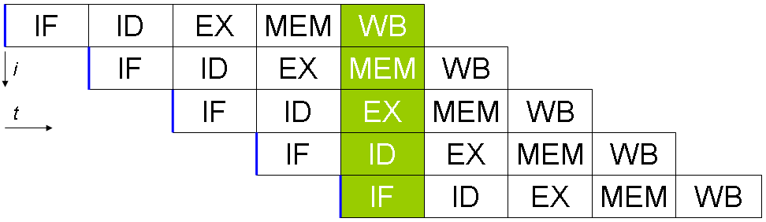

- [Concurrency &amp; parallelism](#concurrency-amp-parallelism)
- [thread](#thread)
- [mutex](#mutex)
- [condition_variable](#conditionvariable)
- [atomic](#atomic)
- [memory_order](#memoryorder)
- [future, promise, async](#future-promise-async)
- [packaged_task](#packagedtask)
- [threads with time constrains](#threads-with-time-constrains)

----

## Concurrency & parallelism

A, B 두개의 일을 동시에 진행하는 것을 parallelism (병행성) 이 있다고 한다. A, B 두개의 일을 조금씩 교대로 할 수 있는 것을 Concurrency (동시성) 이 있다고 한다. concurrency 가 있다면 parallism 이 있을 수도 있고 없을 수도 있다. 

예를 들어 신문을 보는 것을 A, 커피를 마시는 것을 B 라고 했을 때 A, B 는 concurrency 가 있다고 할 수 있다. 또한 신문을 보면서 커피를 마실 수 있기 때문에 parallism 이 있다고 할 수 있다. 그러나 양말을 신는 것을 A, 신발을 신는 것을 B 라고 했을 때 A, B 는 concurrency 가 없다고 할 수 있다. 양말을 신어야 신발을 신을 수 있기 때문이다. concurrency 가 없기 때문에 parallelism 은 존재할 수 없다.

## thread

쓰레드의 기본적인 사용법은 다음과 같다. `join` 은 쓰레드가 종료될 때까지 기다리는 것이고 `detatch` 는 kernel thread 와 연결을 끊는 것이다. `detatch` 되고 나면 이후 thread 는 제어할 방법이 없다.

```cpp
#include <thread>

void thread1() {
  std::cout << "Helldo, Worlds" << std::endl;
}

int main() {
  std::thread t1(thread1);
  t1.join();   // main thread wait for t1 to finish
  //t1.detach();  // main thread let t1 to run on its own: t1 is a daemon process.
                  // C++ runtime library is responsible returning t1's resources
                  // and main thread may finish before t2 prints "Hello"

  return 0;
}
// If neither detach nor join is called, terminate() will be called for the t1.
// A thread can only be joined once or detached once. After it is joined on detached
// it becomes unjoinable ( t.joinable() returns false )
```

다음은 메인 쓰레드와 다른 쓰레드가 한가지 리소스를 두고 경쟁하는 예이다.

```cpp
#include <cstdio>
#include <thread>
#include <fstream>
#include <iostream>

class Fctor {
 private:
  std::ofstream& m_ofs;
 public:
  Fctor(std::ofstream& s) : m_ofs(s) {}
  void operator()() {
    for (int i = 0; i > -100; --i)
      m_ofs << "from t: " << i << std::endl;
  }
};

int main() {
  std::cout << "Hello World" << std::endl;
  std::ofstream f;
  f.open("log.txt");
  Fctor fctor(f);
  std::thread t1(fctor);

  for (int i = 0; i < 100; ++i)
    f << "from main: " << i << std::endl;

  t1.join();
  f.close();
  
  return 0;
}
```

다음은 예외가 발생했을 때 `join` 이 꼭 호출되도록 하기 위해 `try...cath` 와 RAII 를 위한 별도의 클래스 를 사용한 예이다.

```cpp
// If exception happens in the main()'s for loop, t1.join() will not be called.
int main() {
	cout << "Hollo Bo" << endl;
	ofstream f;
	f.open("log.txt");

	Fctor fctor(f);
	std::thread t1(fctor);

	try {
		for (int i=0; i<100; i++)
			cout << "from main: " << i << endl;  // Exception may happen here
	} catch (...) {
		t1.join();
		throw;
	}

	t1.join();
	f.close();

	return 0;
}

// Alternative way: RAII
class ThreadJoiner {
	thread& m_th;
public:
	explicit ThreadJoiner(thread& t):m_th(t) {}
	~ThreadJoiner() {
		if(m_th.joinable()) {
			m_th.join();
		}
	}
};

int main() {
	cout << "Hollo Bo" << endl;
	ofstream f;
	f.open("log.txt");

	Fctor fctor(f);
	std::thread t1(fctor);
	ThreadJoiner tj(t1);

	for (int i=0; i<100; i++)
		cout << "from main: " << i << endl;

	f.close();
	return 0;
}
```

쓰레드 엔트리 함수의 인자는 call by value 이다. 인자를 전달할 때는 포인터 혹은 `std::ref()` 를 사용하자.

```cpp
void call_from_thread(string& msg) {
	msg = "Beauty is only skin-deep";
	cout << "t1 says: " << msg << endl;
}

int main() {
	
	string s = "A friend in need is a friend indeed.";
	std::thread t1(call_from_thread, std::ref(s));
	// Function templates ref and cref are helper functions that generate an object of type std::reference_wrapper

	t1.join();

	cout << "main says: " << s << endl;
	return 0;
}
// Paramters are always passed by value (copied).  why? same reason as bind(): deferred execution means the parmeter objects might not be valid at the time of execution
// To pass by reference:
// 1. use std::ref
// 2. use pointer
```

클래스의 멤버 함수를 쓰레드 엔트리 함수로 이용할 경우는 멤버 함수의 포인터, 클래스의 인스턴스 포인터, 인자의 포인터를 전달하자.

```cpp
// To pass a class method as thread's initial function, use pointers
class A {
public:
	void call_from_thread(string* msg) {
		*msg = "Beauty is only skin-deep";
		cout << "t1 says: " << *msg << endl;
	}
};

int main() {

	string s = "A friend in need is a friend indeed.";
	A a;
	std::thread t1(&A::call_from_thread, &a, &s);
	t1.detach();

	cout << "main says: " << s << endl;
	return 0;
}
```

r-value 로 전달할 때는 `std::move()` 를 이용하자.

```cpp
// Thread with moving parameters
void call_from_thread(string msg) {
	cout << "t1 says: " << msg << endl;
}

int main() {
	string* ps = new string("A friend in need is a friend indeed.");
	std::thread t1(call_from_thread,  std::move(*ps));
	t1.join();

	cout << "main: " << *ps << endl;
	return 0;
}
```

쓰레드 객체는 복사될 수 없고 `unique_ptr` 이나 `fstream` 처럼 이동만 가능하다.

```cpp
// A thread object cannot be copied
// But it can be moved.  Like fstream, unique_ptr, etc.

//Case 1:
std::thread t1(call_from_thread);
std::thread t2 = move(t1);  // t2 become the owner of the thread
t2.join();

//Case 2:
thread f() {
   // ...
   return std::thread(call_from_thread);   // move semantics 
}

//Case 3:
void f(std::thread t);
int main() {
   f(std::thread(call_from_thread));  // move semantics
   //...
}
```

## mutex

하나의 리소스에 대해 동기화를 보장하기 위해 `mutex` 를 사용하자. `mutex` 를 자동으로 해제 시키기 위해 `std::lock_guard` 를 사용한다.

```cpp
/* Using mutex to synchronize threads */
std::mutex m_mutex;

void shared_print(string id, int value) {
	std::lock_guard<std::mutex> locker(m_mutex);
   //m_mutex.lock();
   // if (m_mutex.trylock()) {...}
	cout << "From " << id << ": " << value << endl;
   //m_mutex.unlock();
}

class Fctor {
public:
	void operator()() {
		for (int i=0; i>-100; i--) 
			shared_print("t1", i);
	}
};

int main() {
	Fctor fctor;
	std::thread t1(fctor);

	for (int i=0; i<100; i++)
		shared_print("main", i);

	t1.join();

	return 0;
}
```

`mutex` 는 글로벌로 선언하지 말고 해당 리소스에 포함시키는 것이 좋다.

```cpp
/*
 * 1. Avoid global variables
 * 2. Mutex should bundle together with the resource it is protecting.
 */
class LogFile {
	std::mutex m_mutex;
	ofstream f;
public:
	LogFile() {
		f.open("log.txt");
	} // Need destructor to close file
	void shared_print(string id, int value) {
		std::lock_guard<mutex> locker(m_mutex);
		f << "From " << id << ": " << value << endl;
	}
	// Never leak f to outside world, like this:
	void processf(void fun(ofstream&)) {
		fun(f);
	}

};

class Fctor {
	LogFile& m_log;
public:
	Fctor(LogFile& log):m_log(log) {}
	void operator()() {
		for (int i=0; i>-100; i--) 
			m_log.shared_print("t1", i);
	}
};

int main() {
	LogFile log;
	Fctor fctor(log);
	std::thread t1(fctor);

	for (int i=0; i<100; i++)
		log.shared_print("main", i);

	t1.join();

	return 0;
}
```

다음은 deadlock 이 발생하는 예이다.

```cpp
/* Deadlock */
class LogFile {
	std::mutex _mu;
	std::mutex _mu_2;
	ofstream f;
public:
	LogFile() {
		f.open("log.txt");
	}
	void shared_print(string id, int value) {
		std::lock_guard<mutex> locker(_mu);
		std::lock_guard<mutex> locker1(_mu_2);
		f << "From " << id << ": " << value << endl;
	}
	void shared_print_2(string id, int value) {
		std::lock_guard<mutex> locker1(_mu_2);
		std::lock_guard<mutex> locker(_mu);
		f << "From " << id << ": " << value << endl;
	}
};
```

deadlock 해결하기 위해 `mutex` 의 잠금 순서가 중요하다.

```cpp
/* C++ 11 std::lock */
class LogFile {
	std::mutex m_mutex;
	std::mutex m_mutex_2;
	ofstream f;
public:
	LogFile() {
		f.open("log.txt");
	}
	void shared_print(string id, int value) {
		std::lock(m_mutex, m_mutex_2);
		std::lock_guard<mutex> locker(m_mutex, std::adopt_lock);
		std::lock_guard<mutex> locker1(m_mutex_2, std::adopt_lock);
		f << "From " << id << ": " << value << endl;
	}
	void shared_print_2(string id, int value) {
		std::lock(m_mutex, m_mutex_2);
		std::lock_guard<mutex> locker1(m_mutex_2, std::adopt_lock);
		std::lock_guard<mutex> locker(m_mutex, std::adopt_lock);
		f << "From " << id << ": " << value << endl;
	}
};

/* Avoiding deadlock
1. Prefer locking single mutex.
2. Avoid locking a mutex and then calling a user provided function.
3. Use std::lock() to lock more than one mutex.
4. Lock the mutex in same order.


Locking Granularity:
- Fine-grained lock:  protects small amount of data
- Coarse-grained lock: protects big amount of data
*/
```

`std::unique_lock` 은 `std::lock_guard` 보다 기능이 추가된 것이다. `std::defer_lock` 을 인자로 사용하면 바로 lock 되지 않고 `std::unique_lock::lock()` 을 호출했을 때 lock 이 된다. 즉, 뮤텍스의 잠금을 지연시킬 수 있다.

```cpp
/* Deferred Lock */
class LogFile {
	std::mutex m_mutex;
	ofstream f;
public:
	LogFile() {
		f.open("log.txt");
	}
	void shared_print(string id, int value) {
		//m_mutex.lock();  // lock before lock_guard is created
		//std::lock_guard<mutex> locker(m_mutex, std::adopt_lock);
		std::unique_lock<mutex> locker(m_mutex, std::defer_lock);
		locker.lock();  // Now the mutex is locked
		f << "From " << id << ": " << value << endl;
	}
};
```

쓰레드 엔트리 함수가 한번만 실행되도록 하기 위해 `std::call_once` 를 사용하자.

```cpp
// C++ 11 solution:
class LogFile {
  static int x;
	std::mutex m_mutex;
	ofstream f;
	std::once_flag m_flag;
	void init() { 
      f.open("log.txt"); 
    }
public:
	void shared_print(string id, int value) {
      std::call_once(_flag, &LogFile::init, this); // init() will only be called once by one thread
		//std::call_once(m_flag, [&](){ f.open("log.txt"); });  // Lambda solution
		//std::call_once(_flag, [&](){ _f.open("log.txt"); });  // file will be opened only once by one thread
		f << "From " << id << ": " << value << endl;
	}
};
int LogFile::x = 9;

//Note: once_flag and mutex cannot be copied or moved.
//      LogFile can neither be copy constructed nor copy assigned

// static member data are guaranteed to be initialized only once.
```

## condition_variable

`condition_variable` 은 특정한 조건이 참이 될 때까지 기다리는 것이다. `std::conditional_variable::wait` 은 `std::unique_lock` 과 function 을 인자로 받는다. 

다음의 경우는 `a == 3 || b == 4` 일 때 까지 기다린다는 의미이다.

```cpp
std::unique_lock<std::mutex> lk(*m);
cv->wait(lk,
         [&] { return a == 3 || b == 4; });
```

또한 `notify, notify_all` 을 통해 기다리고 있는 `condition_variable` 을 깨워서 조건을 검사하도록 한다. 조건이 없을 수 도 있다.

```cpp
cv->notify_one();
cv->notify_all();
```

또한 `wait_for, wait_until` 을 통해 특정 시간동안 기다리다가 깨어날 수 있다.

```cpp
    std::unique_lock<std::mutex> lk(cv_m);
    if(cv.wait_for(lk, idx*100ms, []{return i == 1;})) 
        std::cerr << "Thread " << idx << " finished waiting. i == " << i << '\n';
    else
        std::cerr << "Thread " << idx << " timed out. i == " << i << '\n';
...
    std::unique_lock<std::mutex> lk(cv_m);
    auto now = std::chrono::system_clock::now();
    if(cv.wait_until(lk, now + idx*100ms, [](){return i == 1;}))
        std::cerr << "Thread " << idx << " finished waiting. i == " << i << '\n';
    else
        std::cerr << "Thread " << idx << " timed out. i == " << i << '\n';				
```

## atomic

* [C++ memory order 와 atomic 객체](https://modoocode.com/271)

---

다음과 같이 `std::atomic<int> counter` 를 선언하면 thread safe int 를 만들어 낼 수 있다. `coutner++` 는 assembly language ` lock add DWORD PTR [rdi], 1` 와 같다. 단 하나의 instruction 으로 연산하기 때문에 다른 thread 에 의해 방해받을 수 없다. 

```cpp
std::atomic<int> counter(0);
counter++;  //  lock add DWORD PTR [rdi], 1
```

## memory_order

* [C++ memory order 와 atomic 객체](https://modoocode.com/271)
  
----

CPU 는 하나의 instruction 을 fetch, decode, execute, write-back 같이 4 가지 단계로 수행한다. 그리고 다음과 같이 pipelining 을 통해 여러개의 작업을 동시에 실행할 수 있다.



c++ compiler 는 pipelining 을 위해 c++ code 와 다른 순서로 assembly instruction 을 생성한다. 그래야 효율적이다.

memory_order 는 assembly instruction 순서를 조정하는 것이다. 당연히 조정하면 pipelining 을 할 수 없게 되어 performance 가 떨어질 수 있다.

```cpp
typedef enum memory_order {
    memory_order_relaxed,   // relaxed
    memory_order_consume,   // consume
    memory_order_acquire,   // acquire
    memory_order_release,   // release
    memory_order_acq_rel,   // acquire/release
    memory_order_seq_cst    // sequentially consistent
} memory_order;
```

`memory_order_relaxed` 는 가장 느슨한 옵션이다. assembly instruction 의 순서가 바뀌어도 상관없다는 의미이다. `std::atomic::store, std::atomic::load` 를 사용하면 `memory_order` 를 인자로 줄 수 있다.

```cpp
void foo(std::atomic<int>* a, std::atomic<int>* b) {
  b->store(1, memory_order_relaxed);      
	int t = a->load(memory_order_relaxed);  
}
```

`memory_order_release` 는 이전의 instruction 들이 이후로 재배치 되지 말라는 의미이다. `*a = 10` 의 instruction 들은 `b->store` 이후로 재배치 되지 않는다.

```cpp
*a = 10;
b->store(true, std::memory_order_release);
```

`memory_order_acquire` 는 이후의 instruction 들이 이전으로 재배치 되지 말라는 의이다. `*c = 10` 의 instruction 들은 `b.load` 이전으로 재배치 되지 않는다.

```cpp
  while (!b.load(std::memory_order_acquire)) {
  }
*c = 10;
```

`memory_order_acq_rel` 는 `memory_order_acquire` 와 `memory_order_release` 를 함께 적용한다는 의미이다.

`memory_order_seq_cst` 는 sequential consistency 를 보장한다는 의미이다. 즉, instruction 들의 재배치가 없다는 의미이다. `memory_order_seq_cst` multi core 에서 효율적이지 못한다. 특히 AMD 에서 더욱 그렇다.

## future, promise, async

produce, consume model 을 생각해 보자. promise 는 producer 이고 future 는 consumer 이다.

`function_1` 쓰레드가 일을 마치면 `function_2` 가 실행되도록 해보자. 가장 먼저 `sleep_for` 를 도입하여 `function_2` 가 일정 시간후에 실행되도록 해보자.

```cpp
std::deque<int> q;
std::mutex mu;

void function_1() {
	int count = 10;
	while (count > 0) {
		std::unique_lock<mutex> locker(mu);
		q.push_front(count);
		locker.unlock();
		std::this_thread::sleep_for(chrono::seconds(1));
		count--;
	}
}

void function_2() {
	int data = 0;
	while ( data != 1) {
		std::unique_lock<mutex> locker(mu);
		if (!q.empty()) {
			data = q.back();
			q.pop_back();
			locker.unlock();
			cout << "t2 got a value from t1: " << data << endl;
		} else {
			locker.unlock();
		}
		std::this_thread::sleep_for(chrono::milliseconds(10));
	}
}
// It is hard to set the sleep time.
int main() {
	std::thread t1(function_1);
	std::thread t2(function_2);
	t1.join();
	t2.join();
	return 0;
}
```

위의 코드는 지저분 하다. `condition_variable` 을 사용하면 다른 쓰레드의 실행시점을 제어 할 수 있다.

```cpp
// Using conditional variable and mutex
void function_1() {
	int count = 10;
	while (count > 0) {
		std::unique_lock<mutex> locker(mu);
		q.push_front(count);
		locker.unlock();
		cond.notify_one();  // Notify one waiting thread, if there is one.
		std::this_thread::sleep_for(chrono::seconds(1));
		count--;
	}
}

void function_2() {
	int data = 0;
	while ( data != 1) {
		std::unique_lock<mutex> locker(mu);
		cond.wait(locker, [](){ return !q.empty();} );  // Unlock mu and wait to be notified
			// relock mu
		data = q.back();
		q.pop_back();
		locker.unlock();
		cout << "t2 got a value from t1: " << data << endl;
	}
}
```

위의 코드 역시 지저분 하자. golang 처럼 채널을 만들고 쓰레드가 그 채널에 값을 써줄 때까지 다른 쓰레드에서 기다리는 시스템이 있었으면 좋겠다. `std::future` 는 채널을 구현한 것이다. `async` 는 비동기 실행을 가능하게 하고 `future` 를 리턴한다. 

가장 깔끔한 코드가 완성되었다. `async` 는 `std::launch::async` 를 사용하면 반드시 쓰레드가 만들어 져서 실행된다. `std::launch::async | std::launch::deferred` 는 구현체에 따라 다르다.

```cpp
/* For threads to return values: future */
int factorial(int N) {
	int res = 1;
	for (int i=N; i>1; i--)
		res *= i;

	return res;
}

int main() {
	//future<int> fu = std::async(factorial, 4); 
	future<int> fu = std::async(std::launch::deferred | std::launch::async, factorial, 4);
	cout << "Got from child thread #: " << fu.get() << endl;
	// fu.get();  // crash
	return 0;
}
``` 

자식 쓰레드 역시 채널을 통해 다른 쓰레드에서 그 채널에 값을 보낼때 까지 기다리고 싶을 때 `promise` 를 도입한다.

```cpp
/* Asynchronously provide data with promise */
int factorial(future<int>& f) {
	// do something else

	int N = f.get();     // If promise is distroyed, exception: std::future_errc::broken_promise
	cout << "Got from parent: " << N << endl; 
	int res = 1;
	for (int i=N; i>1; i--)
		res *= i;

	return res;
}

int main() {
	promise<int> p;
	future<int> f = p.get_future();

	future<int> fu = std::async(std::launch::async, factorial, std::ref(f));

	// Do something else
	std::this_thread::sleep_for(chrono::milliseconds(20));
	//p.set_value(5);   
	//p.set_value(28);  // It can only be set once
	p.set_exception(std::make_exception_ptr(std::runtime_error("Flat tire")));

	cout << "Got from child thread #: " << fu.get() << endl;
	return 0;
}
```

만약 10개의 자식 쓰레드가 한개의 채널에 대기시키기 위해서는 `std::shaed_future` 를 사용해야 한다.

```cpp
/* shared_future */
int factorial(shared_future<int> f) {
	// do something else

	int N = f.get();     // If promise is distroyed, exception: std::future_errc::broken_promise
	f.get();
	cout << "Got from parent: " << N << endl; 
	int res = 1;
	for (int i=N; i>1; i--)
		res *= i;

	return res;
}

int main() {
	// Both promise and future cannot be copied, they can only be moved.
	promise<int> p;
	future<int> f = p.get_future();
	shared_future<int> sf = f.share();

	future<int> fu = std::async(std::launch::async, factorial, sf);
	future<int> fu2 = std::async(std::launch::async, factorial, sf);

	// Do something else
	std::this_thread::sleep_for(chrono::milliseconds(20));
	p.set_value(5);

	cout << "Got from child thread #: " << fu.get() << endl;
	cout << "Got from child thread #: " << fu2.get() << endl;
	return 0;
}
```

`async` 는 `thread`, `bind` 와 비슷하게 인자들을 전달 할 수 있다.

```cpp
/* async() are used in the same ways as thread(), bind() */
class A {
public:
	string note;
	void f(int x, char c) { }
	long g(double x) { note = "changed"; return 0;}
	int operator()(int N) { return 0;}
};
A a;

int main() {
	a.note = "Original"; 
	std::future<int> fu3 = std::async(A(), 4);    // A tmpA;  tmpA is moved to async(); create a task/thread with tmpA(4);
	std::future<int> fu4 = std::async(a, 7);    
	std::future<int> fu4 = std::async(std::ref(a), 7); // a(7);  Must use reference wrapper
	std::future<int> fu5 = std::async(&a, 7); // Won't compile

	std::future<void> fu1 = std::async(&A::f, a, 56, 'z'); // A copy of a invokes f(56, 'z')
	std::future<long> fu2 = std::async(&A::g, &a, 5.6);    // a.g(5.6);  a is passed by reference
		// note: the parameter of the invocable are always passed by value, but the invokeable itself can be passed by ref.
	cout << a.note << endl;
	return 0;
}
/*
	std::thread t1(a, 6);   
	std::async(a, 6);   
    std::bind(a, 6);
    std::call_once(once_flag, a, 6);

	std::thread t2(a, 6); 
	std::thread t3(std::ref(a), 6); 
	std::thread t4(std::move(a), 6);
	std::thread t4([](int x){return x*x;}, 6);

	std::thread t5(&A::f, a, 56, 'z');  // copy_of_a.f(56, 'z')
	std::thread t6(&A::f, &a, 56, 'z');  // a.f(56, 'z') 
*/
```

## packaged_task

`future` 를 만드는 방법은 세가지가 있다. `async` 는 `future` 를 리턴한다. `promise` 를 통해 `future` 를 만들 수 있다. 마지막으로 `packaged_task` 를 이용하여 `future` 를 만들어낼 수 있다.

```cpp
/* packaged_task */

std::mutex mu;
std::deque<std::packaged_task<int()> > task_q;

int factorial(int N) {
	int res = 1;
	for (int i=N; i>1; i--)
		res *= i;

	return res;
}

void thread_1() {
	for (int i=0; i<10000; i++) {
		std::packaged_task<int()> t;
		{
			std::lock_guard<std::mutex> locker(mu);
			if (task_q.empty()) 
				continue;
			t = std::move(task_q.front());
			task_q.pop_front();
		}
		t();
	}
}

int main() {
	std::thread th(thread_1);

	std::packaged_task<int()> t(bind(factorial, 6));  
	std::future<int> ret = t.get_future();
	std::packaged_task<int()> t2(bind(factorial, 9));
	std::future<int> ret2 = t2.get_future();
	{
		std::lock_guard<std::mutex> locker(mu);
		task_q.push_back(std::move(t));
		task_q.push_back(std::move(t2));
	}
	cout << "I see: " << ret.get() << endl;
	cout << "I see: " << ret2.get() << endl;

	th.join();
	return 0;
}

/* Summary
 * 3 ways to get a future:
 * - promise::get_future()
 * - packaged_task::get_future()
 * - async() returns a future
 */
```

## threads with time constrains

쓰레드 라이브러리의 `thread, mutex, condition_variable, future, async, packaged_task` 등은 다음과 같은 방법으로 시간을 기다릴 수 있다.

```cpp
/* threads with time constrains */

int main() {
    /* thread */
    std::thread t1(factorial, 6);
    std::this_thread::sleep_for(chrono::milliseconds(3));
    chrono::steady_clock::time_point tp = chrono::steady_clock::now() + chrono::microseconds(4);
    std::this_thread::sleep_until(tp);

    /* Mutex */
    std::mutex mu;
    std::lock_guard<mutex> locker(mu);
    std::unique_lock<mutex> ulocker(mu);
    ulocker.try_lock();
    ulocker.try_lock_for(chrono::nanoseconds(500));
    ulocker.try_lock_until(tp);

    /* Condition Variable */
    std:condition_variable cond;
    cond.wait_for(ulocker, chrono::microseconds(2));
    cond.wait_until(ulocker, tp);

    /* Future and Promise */
    std::promise<int> p; 
    std::future<int> f = p.get_future();
    f.get();
    f.wait();
    f.wait_for(chrono::milliseconds(2));
    f.wait_until(tp);

    /* async() */
    std::future<int> fu = async(factorial, 6);

    /* Packaged Task */
    std::packaged_task<int(int)> t(factorial);
    std::future<int> fu2 = t.get_future();
    t(6);
 	
	 return 0;
}

   // Together with thread library 
	std::this_thread::sleep_until(steady_clock::now() + seconds(3));

	std::future<int> fu;
	fu.wait_for(seconds(3));
	fu.wait_until(steady_clock::now() + seconds(3));

	std::condition_variable c;
	std::mutex mu;
	std::unique_lock<std::mutex> locker(mu);
	c.wait_for(locker, seconds(3));
	c.wait_until(locker, steady_clock::now() + seconds(3));
```