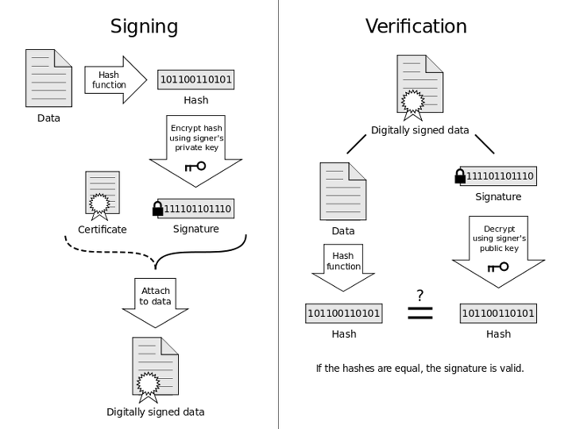

# Abstract

암호화에 대해 적는다.

# Materials

* [RSA 인증서 (Certification) 와 전자서명 (Digital Sign)의 원리](https://rsec.kr/?p=426)
* [HTTPS와 SSL 인증서](https://opentutorials.org/course/228/4894)
* [SSL이란 무엇이며 인증서(Certificate)란 무엇인가?](https://wiki.kldp.org/HOWTO/html/SSL-Certificates-HOWTO/x70.html)
* [[Windows] 디지털서명의 구조와 원리](https://code13.tistory.com/165)
* [네이버 애플리케이션의 전자 서명 원리](https://d2.naver.com/helloworld/744920)

# 대칭키 암호화 (Symmetric-key algorithm)

암호화와 복호화에 같은 암호키를 쓰는 방식이다.

다음과 같은 알고리즘들이 있다.

* DES
* AES (Advanced Encryption Standard)
* ARIA
* Twofish
* SEED

# 비대칭키 암호화 (Asymmetric-key algorithm)

개인키, 공개키 한쌍을 만들어서 개인키로 암호화 하고
공개키로 복호화 한다. 또한 공개키로 암호화 하고
개인키로 복호화 한다.

개인키, 공개키를 사용하여 암호화 복호화 하는 것은 
CPU bound job 이다. 따라서 먼저 대칭키 암호화에 사용할
대칭키를 비대칭키 암호화의 대상으로 하고 이후 대칭키를
이용하여 대칭키 암호화를 한다.

다음과 같은 알고리즘들이 있다.

* RSA
* 타원 곡선 암호화

# RSA 

* [RSA 암호화 - ICPA(인천포스코고등학교) @ youtube](https://www.youtube.com/watch?v=kGUlfVpIfaQ)
* [RSA @ 나무위키](https://namu.wiki/w/RSA%20%EC%95%94%ED%98%B8%ED%99%94)
  
----

1977년 Ron Rivest, Adi Shamir, Leonard Adleman 세 사람이 개발했고 이들의 성을 따서 RSA 라고 이름을 지었다. 큰 정수의 소인수 분해 및 나머지 역연산이 어렵다는 점을 이용한다.

다음은 RSA 알고리즘이다.

* RSA 를 위해서는 public key `(e, n)`, private key `(d, n)` 이 필요하다. `e, d, n` 은 모두 정수이다.
  * 임의의 소수 `p` 를 구한다. `p` 를 2 씩 더하면서 소수 `q` 를 구한다.
  * `n = p * q` 이다.
  * `Φ(n) = (p-1)(q-1)` 이다.
  * `1 < e < Φ(n)` 이고 `Φ(n)` 과 서로소인 `e` 를 선택한다.
  * `(e * d) mod Φ(n) = 1` 인 `d` 를 구한다.
* [페르마의 소정리](/numbertheory/README.md) 에 의해 다음의 두식이 성립한다. `M` 은 평문 `C` 는 암호문이라고 했을 때 다음의 두식으로 암호화 및 복호화가 가능하다.
  * `C = M^e mod n`
  * `M = C^d mod n`

다음은 RSA 알고리즘의 예이다.

```
p    = 2
q    = 7
n    = 14
Φ(n) = 6
e    = 5
d    = 11 ((e * d) mod Φ(n) = 1)

M    = 3
C    = 5 (3^5 mod 14)
M    = 3 (5^11 mod 14)
```

그렇다면 공개키를 획득한 크래커가 private key 를 알아낼 수 있는지 살펴보자.

* 크래커는 public key `(e, n)` 을 알고 있다.
* `n = p * q` 이므로 `p, q` 를 구한다. 그러나 어려울 것이다. `n` 이 `10, 65` 와 같이 작은 수라면 소인수 분해가 쉽다. 그러나 `1921713123` 과 같이 큰 수라면 소인수 분해가 거의 불가능하다.
* `p, q` 를 구하면 `Φ(n) = (p-1)(q-1)` 이므로 `Φ(n)` 을 구할 수 있다.
* `(e * d) mod Φ(n) = 1` 인 `d` 를 구한다. 그러나 어려울 것이다. 예를 들어 `a mod 6 = 1` 인 `a` 를 구해보자. 무수히 많다. 따라서 `d` 를 구하는 것은 거의 불가능하다.

이와 같이 RSA 는 큰 정수의 소인수 분해 및 나머지 역연산이 어렵다는 점을 이용한다.

이제 RSA 는 어떻게 페르마의 소정리를 이용하는지 알아보자. 다음은 페르마의 소정리이다.

```
임의의 정수 a 와 N 에 대해 항상 a ^ φ(N) ≡ 1 (mod N) 이다.

φ(N) 은 오일러-phi 함수로, 1부터 N 까지의 수들 중에서 N 과 서로소인 수들의 개수이다.

따라서 두 소수 p, q 가 있고 N = p * q 라면 φ(N) = (p-1) * (q - 1) 이다.
```

다음은 페르마의 소정리를 이용하여 `M == C` 인 것을 증명한 것이다.

```
ed = b(p-1)(q-1) + 1 (b 는 정수)
   = bΦ(n) + 1

C = M ^ e mod N
  = 
```
     
# 인증서

인증서는 인증기관 (CA, Certificate Authority) 에서 발행한다.

다음은 인증서에 포함된 정보들이다.

* 인증서 소유자의 e-mail 주소
* 소유자의 이름
* 인증서의 용도
* 인증서 유효기간
* 발행 장소
* Distinguished Name (DN)
  * Common Name (CN)
  * 인증서 정보에 대해 서명한 사람의 디지털 ID
* Public Key
* 해쉬(Hash)

https://wiki.kldp.org/HOWTO/html/SSL-Certificates-HOWTO/x70.html

다음은 크롬브라우저에서 구글에 접속했을 때 사용한 인증서이다.


# Digital Signing



다음은 데이터 B1 을 디지털 서명하는 과정이다. C1 은 디지털 서명된 데이터이다. C1 은 원래의 데이터 B1 과 서명 S 그리고 공개키 KeyD 로 구성된다.

```c
Hash(B1) => H1;                 // B1 을 해쉬한 값을 H1 에 저장한다. H1 을 지문이라 하자.
Encrypt(KeyE, H1) => S;         // H1 을 개인키 KeyE 로 암호화하여 서명 S 를 얻는다.  
C1 = {B1, S, KeyD}              // B1, S, 공개키 KeyD 를 묶어서 디지털 서명된 데이터 C1 생성한다.
```

다음은 디지털 서명된 데이터 C1 을 받아서 검증하는 절차이다.

```c
C1 => B1, S, KeyD;                            // C1 에서 B1, S, KeyD 를 추출한다.  
Decrypt(KeyD, S) => H1;                       // 서명 S 를 공개키 KeyD 로 복호화하여 지문 H1 을 얻는다.  
Hash(B1) => H1;                               // B1 을 해시 해쉬한 값 H1 을 얻는다.  
Because H1 == H1, Execute C1 => Very Good!    // 두 지문이 일치하는지 검증한다.
```

과연 `C1` 의 `S` 는 믿을만 한가?

예를 들어 크래커가 다음과 같이 `C1` 을 조작하면 `C2` 를
배포할 수 있다.

```c
C1 => B1, S, KeyD;                  // 해커는 C1을 획득하여 B1, S, KeyD로 분리  
B1 => B2                            // B1을 B2로 변조  
Hash(B2) => H2;                     // B2를 해시 함수에 입력하여 지문 H2를 얻음  
Encrypt(FKeyE, H2) => S2;           // 지문 H2를 개인키 FKeyE로 암호화하여 서명 S2를 얻음  
C2 = {B2, S2, FKeyD}                // B2, S2, 공개키 FKeyD를 묶어서 코드사인 바이너리 C2 생성  
C1 => C2                            // 해커는 네이버 배포 서버의 C1을 C2로 바꿔치기함  
```

다음은 `C2` 를 받아서 검증하는 절차이다.

```c
C2 => B2, S2, FKeyD;                           // 다운로드한 C2를 B2, S2, FKeyD로 분리  
Decrypt(FKeyD, S2) => H2;                      // 서명 S2를 공개키 FKeyD로 복호화하여 지문 H2을 얻음  
Hash(B2) => H2;                                // B2를 해시 함수에 입력하여 지문 H2를 얻음  
Because H2 == H2, Execute C2 => Oh, my god!    // 두 지문이 일치하는 것을 확인 
```

인증서를 이용하여 `C1 = {B1, S, KeyD}` 대신 `C1 = {B1, S, 인증서}` 형태로 C1 을 제작하면
위의 문제를 해결할 수 있다. `KeyD` 는 인증서에 포함된다.