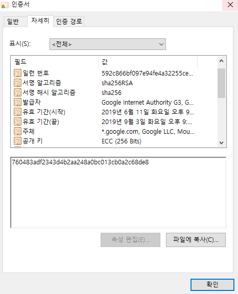

# Abstract

암호화에 대해 적는다.

# Materials

* [RSA 인증서 (Certification) 와 전자서명 (Digital Sign)의 원리](https://rsec.kr/?p=426)
* [HTTPS와 SSL 인증서](https://opentutorials.org/course/228/4894)

# 대칭키 암호화 (Symmetric-key algorithm)

암호화와 복호화에 같은 암호키를 쓰는 방식이다.

다음과 같은 알고리즘들이 있다.

* DES
* AES (Advanced Encryption Standard)
* ARIA
* Twofish
* SEED

# 비대칭키 암호화 (Asymmetric-key algorithm)

개인키, 공개키 한쌍을 만들어서 개인키로 암호화 하고
공개키로 복호화 한다. 또한 공개키로 암호화 하고
개인키로 복호화 한다.

개인키, 공개키를 사용하여 암호화 복호화 하는 것은 
CPU bound job 이다. 따라서 먼저 대칭키 암호화에 사용할
대칭키를 비대칭키 암호화의 대상으로 하고 이후 대칭키를
이용하여 대칭키 암호화를 한다.

다음과 같은 알고리즘들이 있다.

* RSA
* 타원 곡선 암호화

# 인증서

인증서는 인증기관 (CA, Certificate Authority) 에서 발행한다.
인증서에는 서명해시알고리즘, 발급자, 주체, 공개키, 지문 등이 있다.

다음은 크롬브라우저에서 구글에 접속했을 때 사용한 인증서이다.



# Hash and Digital Signing

예를 들어 `foo.com` 에서 공개키를 배포한다고 해보자. 이것을 그냥 배포할 수는 없고 인증기관 (CA) 를 통해 인증서 형태로 배포해야 한다. 그래야 다른 사람들이 `foo.com` 의 공개키를 신뢰할 수 있을 것이다.

CA 는 `foo.com` 의 공개키를 보증하기 위해 서명을 한다. 서명을 한다는 것은 `foo.com` 의 공개키를 SHA256 등으로 해시하고 그 해시된 값을 CA 의 비밀키로 암호화하는 것이다. 그리고 암호화한 결과를 디지털 서명이라고 한다.

```
foo.com 의 공개키 ---------> CA 의 디지털 서명
                      ^
                      |
            CA 의 비밀키로 암호화
```

한편, 인증서는 발급대상 (issued, `foo.com`), 발급대상의 공개키 (`foo.com` 의 공개키), 발급자 (issuer, CA), 발급자의 서명 (issuer signing) 등을 포함한다. 이러한 주요정보를 모아서 다시 SHA256 으로 해시한 것을 Finger Print 라고 한다.

이렇게 얻은 Finger Print 를 발급자인 인증기관은 자신의 비밀키로 암호화한 후 그 결과값을 발급자 서명 (Digital Signing) 으로 등록한다. 이것을 FingerPrintA 라고 하자.

또한 서명값은 상위 인증기관의 공개키로 복호화 하면 `foo.com` 의 Finger Print 값이 나온다. 이것을 FingerPrintB 라고 하자. FingerPrintA 와 FingerPrintB 가 동일하면 무결성이 보장된다.
이런식으로 상위 인증기관이 하위 인증서가 포함하고 있는 공개키 (인증서) 를 상위기관의 비밀키로 암호화하여 보증하는 것을 인증서 체인 (Certificate Chain) 이라고 한다.