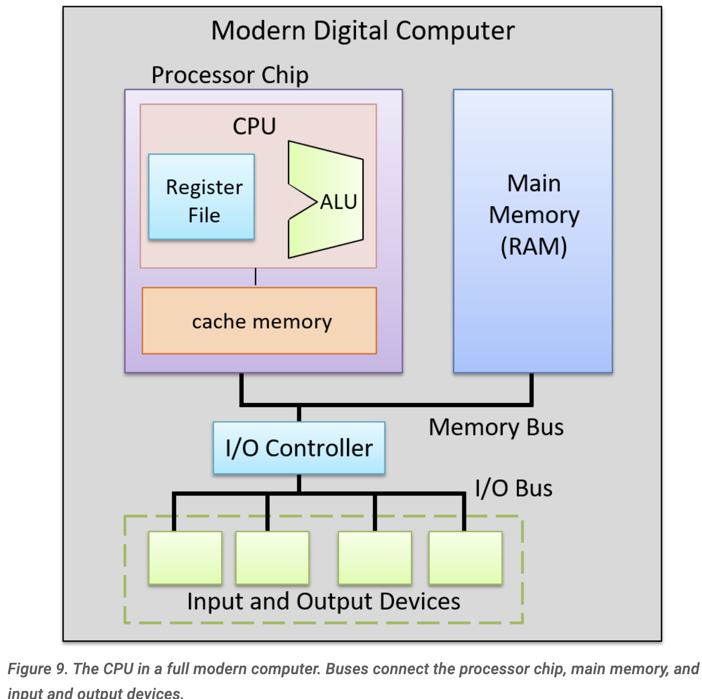
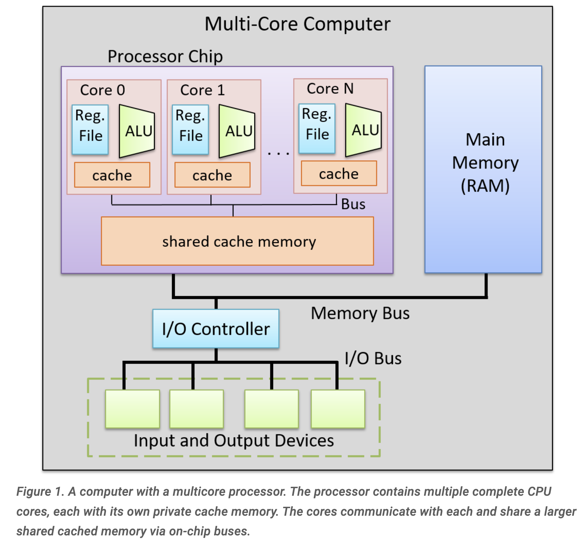
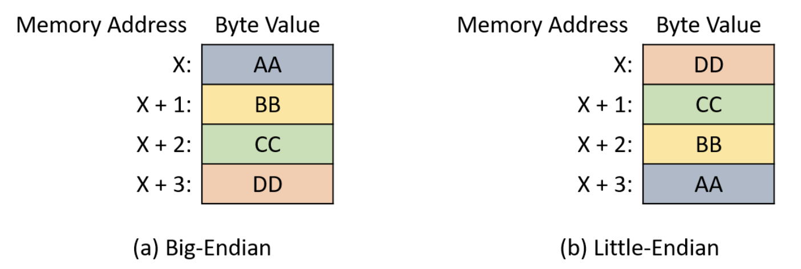
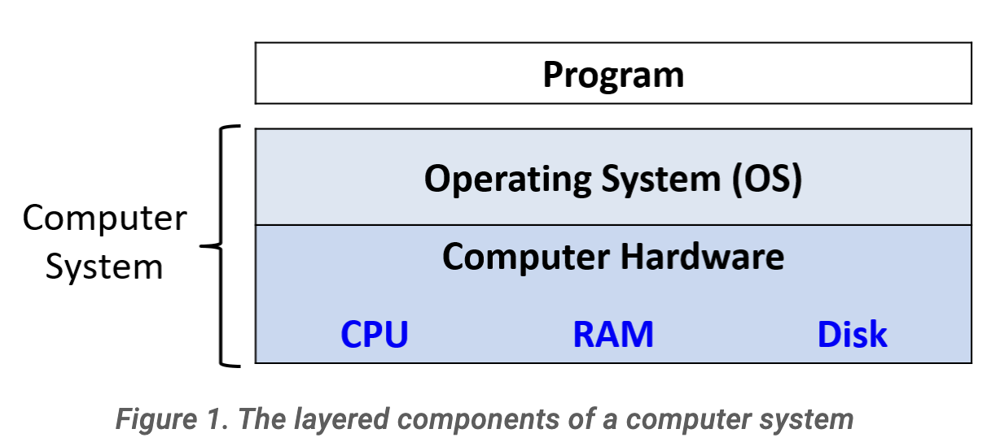
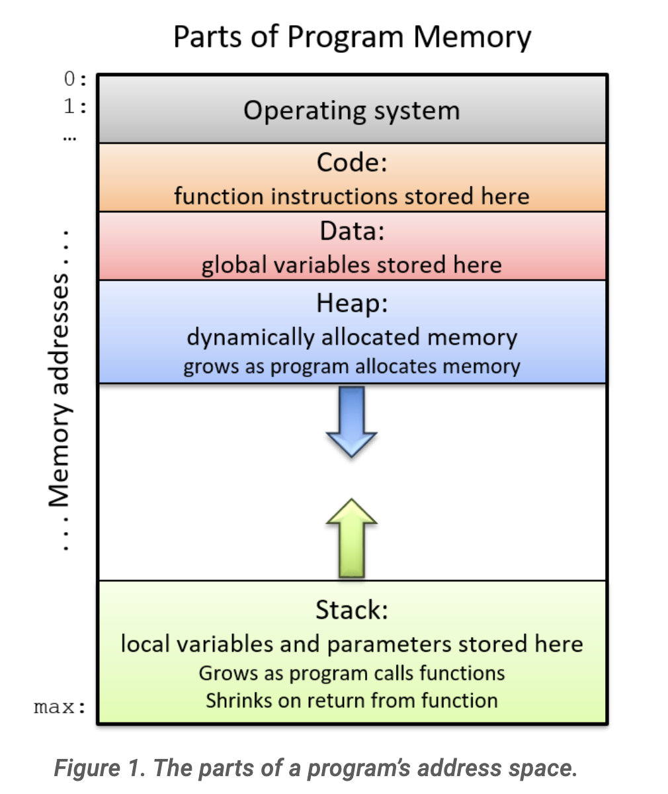
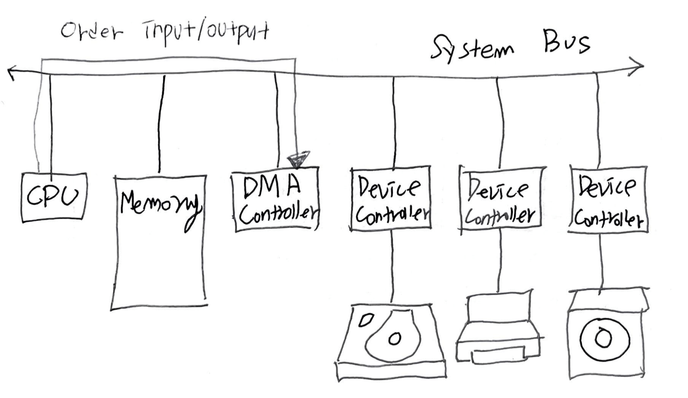
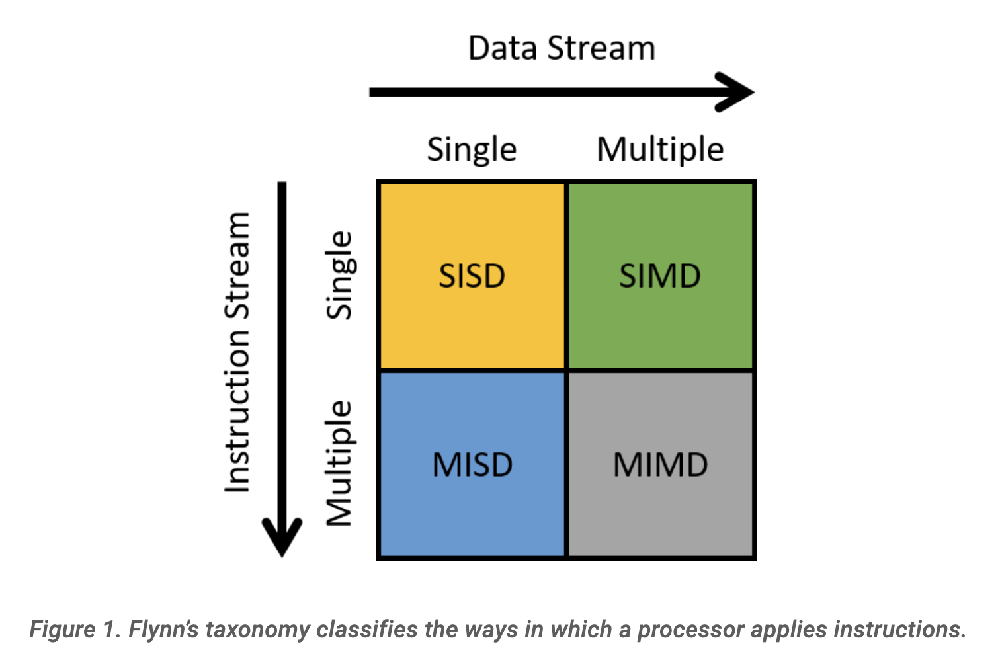
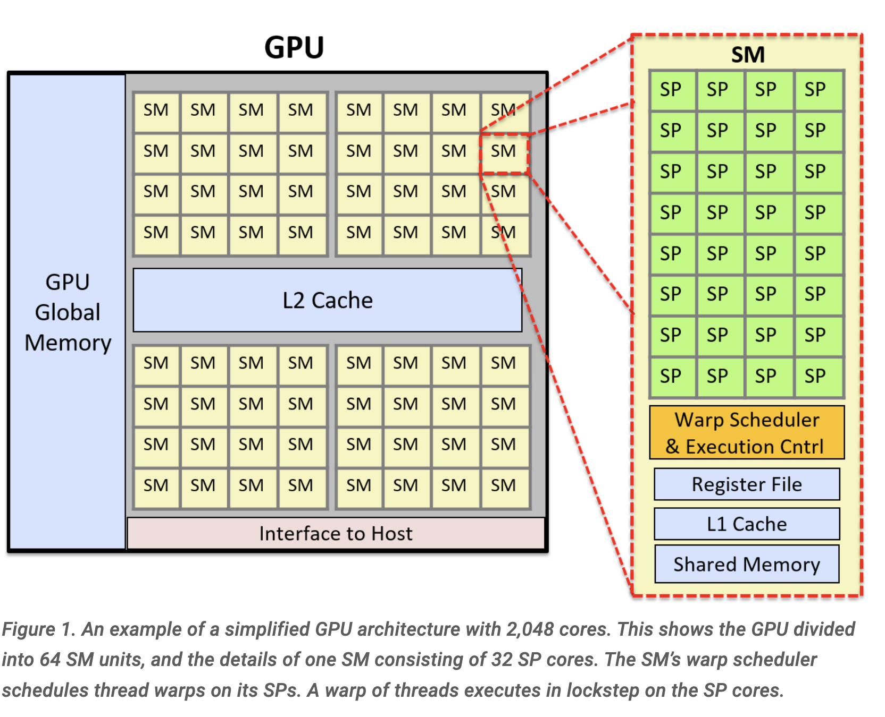

- [Abstract](#abstract)
- [Essentials](#essentials)
- [Materials](#materials)
- [Computer System Architecture History](#computer-system-architecture-history)
  - [ENIAC (Electronic Numerical Integrator And Computer)](#eniac-electronic-numerical-integrator-and-computer)
  - [Von Neumann Architecture](#von-neumann-architecture)
  - [IAS (Institute for Advanced Study) Machine](#ias-institute-for-advanced-study-machine)
  - [8086](#8086)
  - [80286](#80286)
  - [80386](#80386)
  - [80486](#80486)
  - [Pentium](#pentium)
  - [Modern Digital Computer](#modern-digital-computer)
  - [Multi-Core Computer](#multi-core-computer)
- [Data Representation](#data-representation)
  - [Number](#number)
  - [Floating Point](#floating-point)
  - [Byte Order](#byte-order)
- [Computer System Components](#computer-system-components)
- [Parts of Program Memory](#parts-of-program-memory)
- [Machine Language](#machine-language)
- [Interrupt](#interrupt)
- [DMA (Direct Memory Access)](#dma-direct-memory-access)
- [Numa](#numa)
- [Processor and Cache Information on Linux Systems](#processor-and-cache-information-on-linux-systems)
- [Flynn’s Taxonomy of Architecture](#flynns-taxonomy-of-architecture)
- [SIMT](#simt)
- [Hardware Accelerators](#hardware-accelerators)
- [GPU Architecture](#gpu-architecture)
- [CUDA (Compute Unified Device Architecture)](#cuda-compute-unified-device-architecture)

-----

# Abstract 

computer system architecture 에 대해 정리한다.

# Essentials

- [Dive into Systems](https://diveintosystems.org/)
  - 킹왕짱 Computer System Architecture, Operating System 책
* [CPU는 어떻게 작동할까? | youtube](https://www.youtube.com/watch?v=Fg00LN30Ezg)
  * 3D Max 로 CPU 의 구조를 만들고 해설함. 킹왕짱.
* [GPU는 어떻게 작동할까 | youtube](https://www.youtube.com/watch?v=ZdITviTD3VM)
  * 3D Max 로 GPU 의 구조를 만들고 해설함. 킹왕짱.

# Materials

* [혼자 공부하는 컴퓨터구조 + 운영체제 | yes24](http://www.yes24.com/product/goods/111378840)
  * [src](https://github.com/kangtegong/self-learning-cs)
  * [video](https://www.youtube.com/playlist?list=PLVsNizTWUw7FCS83JhC1vflK8OcLRG0Hl)
* [Encoding x86 instructions](https://www-user.tu-chemnitz.de/~heha/viewchm.php/hs/x86.chm/x86.htm) 
  * x86 instructions 인코딩 방법
* [Computer System Architecture, 3e](https://www.amazon.in/Computer-System-Architecture-3e-Mano/dp/8131700704)
  * 굉장히 좋은 책이다.
* [Windows 구조와 원리](http://www.hanbit.co.kr/store/books/look.php?p_code=B6822670083)
  * 오래전에 출간되어 절판되었지만 한글로 된 책들중 최강이다.
* [Write Great Code I](http://www.plantation-productions.com/Webster/www.writegreatcode.com/)
  * 킹왕짱
* [google interview university | github](https://github.com/jwasham/coding-interview-university)
  * operating system 관련된 링크를 참고하자. 쓸만한 비디오가 잘 정리되어 있다.

# Computer System Architecture History 

프로세서의 역사를 다음과 같이 간략히 표현할 수 있다.

| 프로세서 | 도입년도 | 레지스터 크기 | 데이터 버스 | 어드레스 버스 | clock speed |
|:------|:------|:------|:------|:------|:------|
| 8008 | 1972 | 8 | 8 | 8 | |
| 8080 | 1974 | 8 | 8 | 16 | |
| 8086/88 | 1978 | 16/16 | 16/8 | 20 | 8Mhz |
| 80286 | 1982 | 16 | 16 | 24 | 12.5Mhz |
| 80386 | 1985 | 32 | 32 | 32 | 20Mhz |
| 80486 | 1989 | 32 | 32 | 32 | 25Mhz |
| pentium | 1993 | 32 | 64 | 32 | 60Mhz |
| pentium pro | 1995 | 32 | 64 | 36 | 200Mhz |
| pentium II | 1997 | 32 | 64 | 36 | 266Mhz |
| pentium III | 1999 | 32 | 64 | 36 | 500Mhz |

## ENIAC (Electronic Numerical Integrator And Computer)

최초의 디지털 컴퓨터는 1946년 완성된 ENIAC이다. 펜실베니아 대학의 전기 공학 무어
스쿨 (Moore School of Electrical Engineering) 에서 제작되었다. 높이가 18 피트,
길이가 80 피트, 무게가 30 톤 이상이었다. 그러나 프로그래밍을 위해 6,000 여개의
스위치를 조작하고 각종 케이블을 연결해야 했다.

## Von Neumann Architecture

ENIAC 프로젝트의 고문이었던 수학자 폰 노이만 (John Von Neumann) 은 프로그램 내장
방식 (Stored-program Concept) 을 고안했다. 이것을 Von Neumann Machine 이라고
부른다. 

Von Neumann Machine 은 프로그램과 데이터를 실행 되기 전에 메모리에 올려 놓고
프로그램이 실행 될 때에는 프로그램의 명렁어와 데이터들을 메모리로부터 불러들이고
프로그램에 대한 저장 또는 변경 역시 기억장치에 저장되어 있는 프로그램을
변경함으로써 가능하게 한다. 현대의 컴퓨터와 거의 똑같은 모델이다.

## IAS (Institute for Advanced Study) Machine

1952 년 프린스턴 대학에서 Von Neumann Architecture 을 IAS 라는 이름으로
구현한다. Von Neumann Machine 이라고 부르기도 한다.

IAS 의 메모리는 1,000 개의 저장소로 이루어져 있었다. 각 저장소는 40비트로
구성되었다. 저장소는 데이터, 명령어들을 표현할 수 있었다.

```
Data

0 1                                        39
+-------------------------------------------+
| |                                         |
+-------------------------------------------+
 ^
 |
 sign bit

Commands

0        8          19 20     28           39
+-------------------------------------------+
|        |            |        |            |
+-------------------------------------------+
     ^          ^          ^          ^
  opcode     address     opcode     address

```

IAS 는 다읕과 같이 7개의 레지스터를 가지고 있다.

| name | description |
:-----|:------------|
| MBR (Memory Buffer Register) | 메모리로부터 읽어들인 데이터를 저장하고 있다. |
| MAR (Memory Address Register) | MBR 로 읽어들일 메모리 주소를 저장한다. |
| IR (Instruction Register) | 실행될 명령어를 저장한다. |
| IBR (Instruction Buffer Register) | 메모리로부터 읽어들인 명령어의 내용을 임시로 저장한다. |
| PC (Program Counter) | 다음번에 실행될 명렁어를 가져올 메모리 주소를 저장한다. |
| AC (Accumulator) | ALU 로부터 계산된 내용을 임시로 저장한다. |
| MQ (Multiplier Quotient) | ALU 로부터 계산된 내용을 임시로 저장한다. |

IAS 의 명령어 사이클은 **패치 사이클 (Fetch Cycle)**, **실행 사이클 (Execution
Cycle)** 로 구성된다.

다음은 IAS 의 구조를 표현한 그림이다.


IAS 의 명령어 패치, 실행 사이클을 설명하면 다음과 같다. 실행할 명령어가 IBR 에
있는지 검사한다. 없으면 PC 의 내용을 MAR 에 저장하고 메인 메모리에서 저장소를
하나 읽어 들여 MBR 에 저장한다. 이제 MBR 에서 IBR 로 명령어를 읽어들이자. opcode
는 IR 로 address 는 MAR 로 보낸다. PC 를 하나 증가시켜서 다음 실행 위치를
바꾼다. IR 의 opcode 를 해석한다. 산술 처리 명령인 경우 MAR 이 가리키는 메인
메모리의 저장소 내용을 MBR 로 읽어 들인다. MBR 의 내용을 연산하여 결과를 AC 에
저장한다. 만약 흐름 변경 명령인 경우 MAR 의 내용을 PC 에 저장한다.

[이것](https://www.youtube.com/watch?v=mVbxrQE4f90)은 IAS 의 명령어 사이클을 설명한 동영상이다.

## 8086

어드레드 버스의 크기는 20bit 이다. 그래서 1,048,576(1Mb)의 어드레스를 다룰 수 있다. 그러나 레지스터의 크기는 16bit이다. 레지스터 두개를 연산하여 20bit 의 주소를 만들어 내는 세그먼테이션 방법이 고안되었다. 16bit 의 세그먼트 값을 왼쪽으로 4bit 이동시킨 값과 16bit 의 오프셋 값을 더하여 20bit 의 실제 주소값을 만들어 낸다.

8086 의 주요 레지스터들은 다음과 같다.

| name | description |
:-----:|:------------:
| AH, AL | AX : Accumulator register |
| BH, BL | BX : Base register  |
| CH, CL | CX : Count register  |
| DH, DL | DX : Data register  |
| SP | Stack Pointer  |
| BP | Base Pointer  |
| SI | Source Index  |
| DI | Destination Index  |
| IP | Instruction Pointer  |
| Flags | Status Flags  |
| CS | Code Segment  |
| DS | Data Segment |
| SS | Stack Segment |
| ES | Extra Segment  |


## 80286

8086 보다 어드레스 버스의 크기가 24bit 으로 확장되었다. 보호 모드 가 도입되어 멀티태스킹 환경을 지원하게 되었다. 프로그램은 물리적 주소를 바로 사용하지 않고 세그먼테이션 방법을 이용하여 가상 주소를 사용한다. 그러나 제작방식이 불편하여 큰 호응을 얻지는 못했다.

## 80386

어드레스 버스, 데이터 버스, 레지스터 등 대부분의 것들이 32bit로 이루어져 진정한 32bit 프로세서의 출현이었다. MMU (Memory Management Unit) 이 도입되어 os 의 부담을 덜어주었다. 

80386 의 레지스터들은 다음과 같다.


virtual memory 환경에서 페이징 작업을 위해 virtual address 를 physical address 로 변환하는데 시간이 소요된다. TLB (Translation Lookaside Buffer) 를 도입하여 일정 개수 만큼의 변환 내용을 보관하여 캐싱한다. TLB 를 제어하기 위해 테스트 레지스터의 도움이 필요하다. 

## 80486

명령어 파이프 라인이 도입되어 기존의 방법보다 명령어 처리율이 높아졌다. 하나의 명령어를 처리하는데 5단계가 필요하다. 5단계는 다음과 같다. **명령어 패치, 명령어 해석 및 유효 번지 계산, 오퍼랜드 패치, 실행, 기록**.

8Kb 의 L1 cache 가 도입되고 TR3, TR4, TR5 가 추가되었다. 캐시를 제어하기 위해
CR0 레지스터에 CD (Cache Disable), NW (Non-Cache Write-Through) 비트가
추가되었다. 그리고 CR3 레지스터와 PTD (Page Table Directory), PTE (Page Table
Entry) 등을 이용하여 페이징 한다.

## Pentium


두개 이상의 파이프 라인을 1개의 프로세서 클록 사이클에서 수행하는 **Super Scalar
Architecture** 가 도입되었다. 인접한 두개의 파이프라인은 각각 u, v 라고 한다. u
파이프는 어떤 명령도 수행할 수 있는데 v 파이프는 간단한 명령만 수행할 수 있다.
Instruction Paring Rule 이 지켜져야 super scalar architecture 의 장점을 활용할
수 있다. 그러기 위해 코드를 최적화 해야 한다. 좋은 컴파일러는 Instruction Paring
Rule 을 반영한 산출물을 만들어 준다.

## Modern Digital Computer

[5.6. The Processor’s Execution of Program Instructions | DiveIntoSystems](https://diveintosystems.org/book/C5-Arch/instrexec.html)



## Multi-Core Computer

[5.9. Looking Ahead: CPUs Today | DiveIntoSystems]()



# Data Representation

## Number

음수를 표현할 때 2's complement 를 사용한다. 1's complement 에서 1을 더하면 2's complement 가 된다. 1's complement 는 모든 비트를 반대로 설정한다. 

예를 들어 숫자 -8을 1byte 에 2's complement 로 표현해보자. 

```
00001000 : abs value
11110111 : 1's complement
11111000 : 2's complement
```

2's complement 를 사용하면 덧셈 연산만으로 덧셈, 뺄셈을 모두 할 수 있다.
예를 들어 다음과 같이 4 + (-8) 을 해보자.

```
   00000100 : +4
 + 11111000 : -8
----------
   11111100 : -4
```

`char` 의 경우 표현가능한 숫자는 `-128 ~ 127` 이다. `-128` 은 어떻게 표현해야 할까? `128` 의 각 비트를 뒤집고 1를 더하면 될 것 같다. 그러나 `char` 로 표현가능한 최대값은 `127` 이다. `-128 = -127 - 1` 이다.

```
   10000001 : -127
 + 11111111 : -1
------------------
   10000000 : -128 
```

## Floating Point 

- [Real Numbers in Binary | DiveIntoSystems](https://diveintosystems.org/book/C4-Binary/floating_point.html)

부동 소수점을 표현하는 방법은 **IEEE (Institute of Electrical and ElectoronicsEngineers)** 
에서 제시한 single precision, double precision 와 같이 두가지가 있다.
single precision 은 **4byte**, double precision 은 **8byte** 로 표현한다.

single precision 은 다음과 같이 4byte 를 **sign** bit, **exponent** bits,
**mantissa** bits 으로 나눈다.

```
 31   30             23   22                        0
+-----------------------------------------------------+
| s | exponent 8bit     | mantissa 23bit              |
+-----------------------------------------------------+ 
```

예를 들어서 `0.0096875` 를 표현해 보자. 

- `0.0096875` 를 decimal normalized form 으로 변환하면 `9.6875 * 10^-3` 이 된다. 
- `9.6875` 를 이진수로 표현하면 `1001.1011` 이 된다. 다시 binary normalized form
  으로 변환하면 `1.0011011 * 2^3` 이 된다. 
- `s` 에 양수 `0` 이 들어가고 exponent 에는 `130 (3 + 127) = b10000010` 이
  들어가고 mantissa 에 `0011011` 이 들어간다.  
 
최종 결과는 다음과 같다. 

```
31   30    23   22                    0
+---------------------------------------+
| 0 | 1000010 | 00110110000000000000000 |
+---------------------------------------+ 
```

exponent 는 부호가 있는 지수를 표현해야 하기 때문에 `0 ~ 127` 이 가능하다.
mantissa 는 `23bit` 이므로 10진수로 표현하면 **7 자리** 정도이다. 따라서
`9787512.5` 와 `9687512.0` 은 실제로 다른 수 이지만 **single precision** 으로
저장될 경우 메모리에 같은 값으로 저장된다. 

float 는 10진수로 표현하면 일반적으로 약 **6-7 자리 정밀도** 를 갖는다. 

double precision 은 다음과 같이 8byte 를 sign bit, exponent bits, mantissa bits
로 나눈다. 


```
 63   62              52  51                        0
+-----------------------------------------------------+
| s | exponent 11bit     | mantissa 52bit             |
+-----------------------------------------------------+ 
```

double은 10진수로 표현하면 일반적으로 약 **15-17 자리 정밀도** 를 갖는다.

## Byte Order

- [Integer Byte Order | Dive Into Systems](https://diveintosystems.org/book/C4-Binary/byte_order.html)

데이터가 주어지면 그것을 어떠한 바이트 순서로 저장할 것인지에 대한 방법을 endian
이라고 한다. 

little endian 은 주어진 데이터의 LSB (least significant byte) 부터 낮은 주소를
시작으로 저장하는 것을 말한다. 이와는 반대로 big endian 은 MSB (most significant
byte) 부터 낮은 주소를 시작으로 저장하는 것을 말한다.

예를 들어서 다음과 같이 `0x12345678` 데이터가 주어졌다고 해보자. MSB 는 `0x12`
이고 LSB 는 `0x78` 이다.

```
  MSB
  --
0x12345678
        --
        LSB

little endian

0: 78
1: 56
2: 34
3: 12

big endian

0: 12
1: 34
2: 56
3: 78
```

다음은 c code example 이다.

```c
#include <stdio.h>

int main(int argc, char **argv) {
    // Initialize a four-byte integer with easily distinguishable byte values
    int value = 0xAABBCCDD;

    // Initialize a character pointer to the address of the integer.
    char *p = (char *) &value;

    // For each byte in the integer, print its memory address and value.
    int i;
    for (i = 0; i < sizeof(value); i++) {
        printf("Address: %p, Value: %02hhX\n", p, *p);
        p += 1;
    }

    return 0;
}

// Output for Little Endian:
// Address: 0x7ffc0a234928, Value: DD
// Address: 0x7ffc0a234929, Value: CC
// Address: 0x7ffc0a23492a, Value: BB
// Address: 0x7ffc0a23492b, Value: AA
```



# Computer System Components 

- Operating System
- CPU
- RAM
- DISK



# Parts of Program Memory

- [2. A Deeper Dive Into C | DiveIntoSystems](https://diveintosystems.org/book/C2-C_depth/scope_memory.html)



# Machine Language

[Encoding x86 instructions](https://www-user.tu-chemnitz.de/~heha/viewchm.php/hs/x86.chm/x86.htm) 를 기반으로 이해하자. 

하나의 instruction 은 `Prefix Bytes, Opcode, Mod-Reg-r/m, Scaled Indexed Byte, Displacement, Immediate` 와 같이 총 6개의 구성요소로 이루어질 수 있다. 언급한 구성요소는 0byte 일 수 있고 1byte 이상일 수도 있다. 모든 구성요가 존재 한다면 최대 16byte 까지 가능할 것 같지만 실제로는 15byte 까지만 가능하다. 


opcode 는 1byte 혹은 2byte 가 가능한데 2byte 의 경우 MSB 는 Opcode Expansion Prefix Bytes 를 의미하는 0Fh 이고 나머지 한 byte 가 opcode 를 표현한다. 따라서 opcode 의 종류는 512 개 까지 가능하지만 현재 모두를 사용하고 있지는 않다.

general purpose registers 정도는 알아두자.


# Interrupt

**Interrupts**

- Synchronous Interrupt
  - Fault
  - Trap
  - Halt
  - Software Interrupt
- Asynchronous Interrupt (Harware Interrupt)

다음과 같은 흐름으로 Interrupt 가 처리된다.

- 입출력 장치는 CPU 에 인터럽트 요청 신호를 보낸다.
- CPU 는 실행 사이클이 끝나고 명령어를 fetch 하기 전 Flag Register 의 Interrupt Flag 를 확인한다.
- CPU 는 Interrupt Request 를 확인하고 Interrupt Flag 를 통해 현재 Interrupt 를 받아들일 수 있는지 확인한다.
- Interrupt 를 받아들일 수 있다면 CPU 는 context 를 backup 한다.
- CPU 는 Interrupt Vector 를 참조하여 해당 Interrupt Service Routine 을 실행한다.
- Interrupt Service Routine 의 실행이 끝나면 앞서 backup 되었던 context 를 restore 하고 실행을 재개한다.

다음은 Flag Register 의 모양이다.

```
sign Flag | zero Flag | carry flag | overflow flag | interrupt flag | supervisor flag
```

# DMA (Direct Memory Access)

DMA는 **Direct Memory Access**의 줄임말로, 컴퓨터 시스템의 기능 중 하나로서
CPU와 별도로 직접 메모리에 접근하여 데이터를 전송하거나 읽어오는 메커니즘이다.
DMA는 아래와 같은 이유로 유용하다.

- CPU의 부담 감소: DMA를 사용하면 CPU는 데이터 전송 작업을 처리 하지 않아도
  되므로, 다른 작업에 집중할 수 있다. 이로 인해 전체 시스템 성능이 향상된다.
- 빠른 데이터 전송 속도: DMA 방식은 전용 하드웨어를 사용하여 데이터 전송을
  처리하기 때문에, 프로그래밍 I/O 방식이나 인터럽트 기반의 I/O 방식보다 데이터
  전송 속도가 빠르다.
- 효율적인 자원 사용: DMA를 사용하면, 컴퓨터 시스템의 구성 요소들이 동시에
  독립적으로 작동할 수 있어 전체 시스템 자원 사용의 효율성이 높아진다.
- 데이터 정확성: DMA 방식은 CPU와 독립적으로 작동하기 때문에, CPU 성능이나
  상태에 영향을 받지 않아 데이터 오류 확률이 낮다.

다음은 DMA 입출력 과정이다.

- CPU 는 DMA Controller 에 입출력장치의 주소, 수행할 연산(읽기/쓰기), 읽거나 쓸
  메모리의 주소 등과 같은 정보로 입출력 작업을 명령한다.
- DMA Controller 는 CPU 대신 Device Controller 와 상호작용하며 입출력 작업을
  수행한다. 이때 DMA Controller 는 필요한 경우 메모리에 직접 접근하여 정보를
  읽거나 쓴다.
- 입출력 작업이 끝나면 DMA Controller 는 CPU 에 Interrupt 를 걸어 작업이
  끝났음을 알린다.



# Numa

**NUMA(Non-Uniform Memory Access)**는 컴퓨터 시스템의 메모리 접근 및 관리 방식 중
하나로, 멀티프로세서 시스템에서 각 프로세서가 고유한 메모리 영역을 가지도록
설계된 아키텍처입니다. NUMA는 멀티프로세서 및 멀티코어 시스템의 확장성과 성능을
개선하기 위해 사용됩니다.

전통적인 SMP(Symmetric Multi-Processor) 구조에서 프로세서들은 모두 동일한 메모리
영역을 공유하며, 메모리에 대한 접근은 균일한 지연 시간을 갖습니다. 그러나
프로세서의 수가 증가하면 메모리에 대한 동시 접근에 지연이 발생하고 시스템 성능
저하로 이어질 수 있습니다.

NUMA 구조에서는 시스템을 여러 노드로 분할하고 각 노드에 프로세서와 메모리 뱅크를
할당합니다. 각 프로세서는 로컬 메모리 영역에 빠르게 접근할 수 있으며 다른 노드의
메모리에는 약간의 지연 시간이 발생할 수 있습니다(비균일 메모리 액세스). 이로
인해 프로세서와 메모리 간의 대역폭 사용이 효율적이고 프로세서별 메모리 접근
충돌이 감소하여 전체 시스템 성능이 향상됩니다.

NUMA는 큰 규모의 멀티프로세서 시스템에서 장점을 가지며, 데이터 센터, 서버 사이드
애플리케이션 및 고성능 컴퓨팅 환경에서 주로 사용됩니다. NUMA에 대한 지원으로
인해, 운영 체제와 하드웨어 둘 다 메모리 할당 및 스케줄링에 대한 효율성과
확장성을 극대화할 수 있습니다.

MacBook 또는 기타 대부분의 노트북 및 일반 PC 시스템에서는 NUMA 아키텍처가
사용되지 않습니다.

NUMA는 주로 대규모 멀티프로세서 서버, 데이터센터 또는 고성능 컴퓨팅 환경과 같은
복잡한 시스템에서 메모리 및 프로세서 확장성을 개선하기 위해 사용되는
아키텍처이기 때문입니다. 일반적인 노트북이나 PC에서는 한 개 또는 소수의
프로세서와 상대적으로 제한된 메모리 범위를 가지고 있기 때문에, 비교적 단순한
UMA(Uniform Memory Access) 시스템이 사용됩니다.

# Processor and Cache Information on Linux Systems

- [11.6. Looking Ahead: Caching on Multicore Processors | DiveIntoSystems](https://diveintosystems.org/book/C11-MemHierarchy/coherency.html)

`lscpu` command 를 이용하면 processor, cache 정보를 확인할 수 있다.

```bash
$ lscpu
...
CPU(s):                          12
Thread(s) per core:              2
Core(s) per socket:              6
Socket(s):                       1
...
L1d cache:                       192 KiB
L1i cache:                       384 KiB
L2 cache:                        3 MiB
L3 cache:                        16 MiB
```

- 6 개의 core 가 있다.
- Hyperthreding 을 지원하기 때문에 core 1 개당 2 개의 CPU 가 있다. 따라서 12 개의 CPU 가 있다.
- 1 개의 socket 이 있다.
- 1 개의 socket 에 6 개의 core 가 있다.
- L1 cache 는 L1 data cache, L1 instruction cache 가 있다.
- L2, L3 cache 가 있다.

12 의 cpu 별로 cache 정보를 살펴보자.

```bash
$ ls /sys/devices/system/cpu/cpu0/cache
index0/  index1/  index2/  index3/

$ cat /sys/devices/system/cpu/cpu0/cache/index*/type
Data
Instruction
Unified
Unified

$ cat /sys/devices/system/cpu/cpu0/cache/index*/level
1
1
2
3

$ cat /sys/devices/system/cpu/cpu0/cache/index*/shared_cpu_list
0,6
0,6
0,6
0-11
```

- `/sys/devices/system/cpu/cpu0/cache` 에 4 가지 index 가 있다.
  - index0, index1, index2, index3
- 각 index 별로 type 을 확인할 수 있다.
  - Data, Instruction, Unified
- 각 index 별로 level 을 확인할 수 있다.
  - 1, 2, 3
- 각 index 별로 어떤 cpu 가 공유하는지 확인할 수 있다.
  - L1 Data Cache 는 core0(cpu0, cpu6) 가 공유한다.
  - L1 Instruction Cache 는 core0(cpu0, cpu6) 가 공유한다.
  - L2 Unified Cache 는 core0(cpu0, cpu6) 가 공유한다.
  - L3 Unified Cache 는 모든 core 가 공유한다.

# Flynn’s Taxonomy of Architecture

- [15. Looking Ahead: Other Parallel Systems | DiveIntoSystems](https://diveintosystems.org/book/C15-Parallel/index.html)

SISD, SIMD, MISD, MIMD는 Flynn의 분류 체계에서 컴퓨터 아키텍처를 설명하기 위해 사용되는 네 가지 기본 범주입니다. 

- **SISD** (Single Instruction, Single Data): SISD 시스템은 단일 제어 장치가 하나의 명령어 스트림을 처리하므로 한 번에 하나의 명령어만 실행할 수 있습니다. 마찬가지로, 프로세서는 한 번에 하나의 데이터 스트림을 처리하거나 한 번에 하나의 데이터 단위를 처리할 수 있습니다. 2000년대 중반 이전에 상용으로 제공되는 대부분의 프로세서는 SISD 기계였다.
- **SIMD** (Single Instruction, Multiple Data): SIMD 시스템은 동일한 명령어를 동시에 여러 데이터에 실행하며 동기식으로 작동합니다. "동기" 실행 중에는 모든 명령어가 큐에 추가되고 데이터가 여러 계산 단위로 분배됩니다. 실행 중에 각 계산 단위는 큐의 첫 번째 명령어를 동시에 실행하고 그 다음 명령어, 그 다음 명령어 등을 순서대로 동시에 실행합니다. SIMD 아키텍처의 가장 유명한 예는 그래픽 처리 장치(GPU)입니다. 초기 슈퍼컴퓨터도 SIMD 아키텍처를 따랐습니다.
- MISD (Multiple Instruction, Single Data): MISD 시스템은 여러 명령어 처리 장치가 단일 데이터 스트림에 작업합니다. MISD 시스템은 일반적으로 NASA 셔틀 우주선의 비행 제어 프로그램과 같은 비판적인 시스템에서 결함 감수성을 포함시키는 데 사용되었습니다. 그렇지만 현재 MISD 기계는 더 이상 거의 사용되지 않습니다.
- **MIMD** (Multiple Instruction, Multiple Data): MIMD 시스템은 가장 널리 사용되는 아키텍처 계통이며 매우 유연합니다. 또한, 여러 명령어와 여러 데이터 스트림에 작업 할 수 있는 능력을 가지고 있습니다. 거의 모든 현대 컴퓨터는 다중코어 CPU를 사용하므로, 대부분은 MIMD 기계로 분류됩니다. 분산 메모리 시스템과 같은 MIMD 시스템의 또 다른 클래스에 대해서는 15.2 절에서 설명합니다.



# SIMT

SIMT (Single Instruction, Multiple Threads) 는 multithreaded SIMD 와 같다.

**SIMT** 는 하드웨어 아키텍처의 한 종류로, 주로 그래픽 처리 장치(GPU)에서 사용됩니다. SIMT는 병렬 처리 방식 속 하나로, 동일한 명령어(instruction)를 독립적인 여러 스레드에 동시에 적용하되, 각 스레드가 서로 다른 데이터 요소에 작업을 수행합니다. 

**SIMT** 아키텍처는 **SIMD** (Single Instruction, Multiple Data)와 **MIMD** (Multiple Instruction, Multiple Data)의 개념을 결합한 형태로 볼 수 있습니다. 각 처리 요소가 동일한 명령어를 실행하지만, 메모리 위치나 독립적인 레지스터 등 서로 다른 데이터를 가지고 작업하기 때문입니다.

NVIDIA의 CUDA (Compute Unified Device Architecture) 프로그래밍 모델은 SIMT 아키텍처를 활용합니다. CUDA는 그리드, 블록 및 스레드라는 계층 구조를 사용하여 작업을 분할하고, 인접한 스레드간에 공유되는 코호트로 그룹화합니다. 이를 통해 개발자는 효율적이고 유연한 병렬 프로그래밍을 수행할 수 있으며, SIMT 기반 하드웨어에서 자동으로 높은 수준의 병렬 성능을 달성할 수 있습니다. 이러한 아키텍처는 그래픽 처리 외에도 과학, 공학, 금융 등 다양한 분야에서 복잡한 계산이 필요한 작업에 적합합니다.

# Hardware Accelerators

- **GPU** (Graphics Processing Unit):
  - GPU는 특히 그래픽 및 비디오 렌더링을 처리하는 데 특화된 고성능 하드웨어입니다. 고성능 병렬 처리를 위한 수천 개의 작은 코어로 구성되어 큰 데이터 세트를 빠르게 처리할 수 있습니다. 주요 GPU 제조사는 NVIDIA 및 AMD입니다.
- **GPGPU** (General-Purpose Graphics Processing Unit):
  - GPGPU는 GPU를 범용 컴퓨팅 작업에 사용하는 개념입니다. 제품이 아니고 개념이다. 그래픽 처리 기능 외에도 GPGPU는 과학, 교육, 의료, 금융, 데이터 분석, 머신 러닝, 신호 처리 등 다양한 분야에서 발생하는 범용 컴퓨팅 및 병렬 처리 과제를 해결하는 데 활용됩니다. GPGPU 프로그래밍을 위한 주요 라이브러리 및 프레임워크로는 NVIDIA의 CUDA, OpenCL, TensorFlow, PyTorch 등이 있습니다.
- **FPGA** (Field-Programmable Gate Array):
  - FPGA는 사용자가 프로그래밍 가능한 논리 게이트와 연결을 포함하는 반도체 기기로, 새로운 회로 및 기능들을 동적으로 구현하거나 수정할 수 있습니다. 이로 인해 FPGA는 유연하고, 빠르게 프로토타이핑 할 수 있으며, 비교적 낮은 개발 비용이 듭니다. 주요 FPGA 제조사는 Xilinx, Intel (Altera), Lattice Semiconductor 및 Microchip (Microsemi/Actel)입니다.
- **ASIC** (Application-Specific Integrated Circuit):
  - ASIC은 특정 응용 프로그램에 최적화된 회로를 가진 고정된 하드웨어입니다. 논리 회로와 가속기, 메모리 등이 바로 실리콘 칩에 구현되어 있습니다. ASIC은 설계 및 제조하는 데 초기 비용이 많이 들지만, 대량 생산 시 높은 성능과 전력 효율성을 제공합니다. 주요 ASIC 제조사로는 TSMC, Samsung, Qualcomm, NVIDIA, Broadcom 등이 있습니다.
  - Bitcoin Miner: Bitcoin 채굴용 ASIC은 SHA-256 알고리즘을 효율적으로 계산하기 위해 설계된 칩입니다. 비트메인의 Antminer 시리즈는 가장 유명한 ASIC 기반 비트코인 채굴기로 알려져 있습니다.
  - TPU (Tensor Processing Unit): 구글이 개발한 TPU는 인공지능 및 머신 러닝 추론 작업에 특화된 ASIC입니다. 텐서 플로우 및 기타 머신 러닝 프레임워크와 함께 사용할 수 있습니다.
  - 이더넷 스위치 칩: 이더넷 스위치칩은 네트워크 스위치의 핵심 구성 요소로서, 네트워크를 통한 고속 데이터 전송 및 스위칭을 가능하게 하는 맞춤형 ASIC입니다. Broadcom의 Trident 및 Tomahawk 시리즈가 좋은 예입니다.
  - DSP (디지털 신호 프로세서): DSP는 오디오 및 비디오 신호 처리, 필터링, 압축 및 암호화와 같은 신호 처리 작업을 수행하는 데 사용되는 ASIC입니다. 예를 들어 시그널링 및 오디오 처리에 최적화된 퀄컴의 Hexagon DSP가 있습니다.
  - 휴대폰 SoC (System on a Chip): 휴대폰과 같은 스마트폰 환경과 태블릿에 최적화된 ASIC이 있는데, 이를 시스템 온 칩(SoC)이라고 합니다. Apple의 A 시리즈 (예: A14 Bionic), 퀄컴의 스냅드래곤 시리즈 (예: Snapdragon 888) 및 삼성의 엑 시노스 시리즈 (예: Exynos 2100)가 이러한 예입니다.
  - AWS Inferentia는 Amazon Web Services(AWS)에서 개발한 머신 러닝 추론에 특화된 처리장치입니다. 주로 딥러닝 모델의 추론 연산에 대한 빠른 처리 속도와 높은 전력 효율성을 제공하려고 설계되었습니다.

# GPU Architecture

- [15.1. Heterogeneous Computing: Hardware Accelerators, GPGPU Computing, and CUDA | DiveIntoSystems](https://diveintosystems.org/book/C15-Parallel/gpu.html)

다음은 Simplied GPU Architecture 이다.



GPU 아키텍처는 컴퓨터 그래픽 및 이미지 처리를 위해 설계된 하드웨어로, 주로 비디오 게임 산업에 의해 발전되었습니다. GPU는 여러 개의 SM(Streaming Multiprocessor)로 구성되어 있는데, 각 SM은 32개의 SP(Streaming Processor)로 구성되어 있습니다. 하나의 SP는 코어라고도 부릅니다. 이러한 구조를 통해 병렬 처리를 효율적으로 수행할 수 있습니다.

GPU의 하드웨어 실행 모델은 SIMD의 변형인 SIMT(Single Instruction/Multiple Thread)를 구현하는데, 이는 여러 스레드를 처리하는 데 동시에 실행되는 하나의 명령어를 사용하는 다중 스레딩 SIMD와 같다. WARP는 CUDA에서 32 개의 스레드를 묶은 그룹을 의미하며, 하나의 WARP는 하나의 SM에서 실행됩니다. 이러한 WARP를 실행하기 위해 각 SM에는 WARP 스케줄러(Warp Scheduler)가 존재합니다.

WARP 스케줄러는 SM에 포함되어 있으며, 실행해야 할 WARP를 선택하고 각 SP 코어에 할당하는 역할을 합니다. 이를 통해 동시에 여러 WARP가 실행되어 병렬성이 향상되고, 자원이 효율적으로 사용됩니다.

락스텝(Lockstep) 실행을 사용하여 각 스레드는 동일한 주기에 동일한 명령어를 실행하게 되지만 다른 데이터에서 작업하게 됩니다. 이를 통해 병렬로 다수의 픽셀 업데이트가 가능해집니다. 이러한 실행 방식 덕분에 프로세서의 설계가 단순화되어 동일한 명령어 제어 유닛을 공유할 수 있습니다.

SM은 공유 메모리, 레지스터, L1 캐시 등 자체 실행 제어 유닛과 메모리 공간을 갖추고 있어, 각 코어가 효과적으로 동작할 수 있도록 지원합니다. 이런 구조와 실행 방식, WARP 스케줄러 덕분에 GPU 아키텍처는 병렬 처리를 통해 다양한 그래픽 및 이미지 작업에 높은 성능을 발휘할 수 있습니다.

# CUDA (Compute Unified Device Architecture)

[CUDA](/cuda/README.md)
