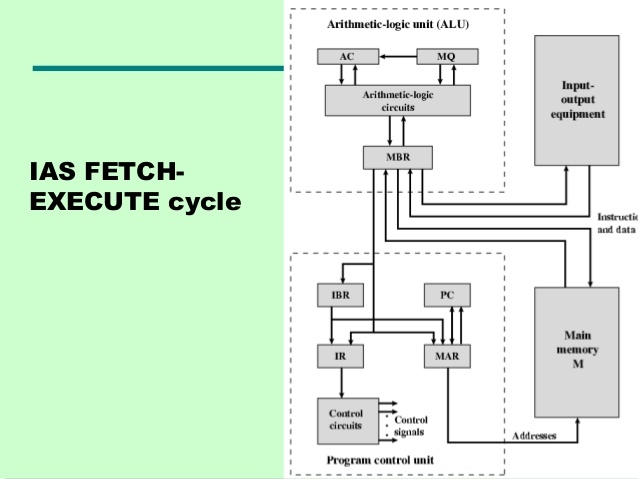
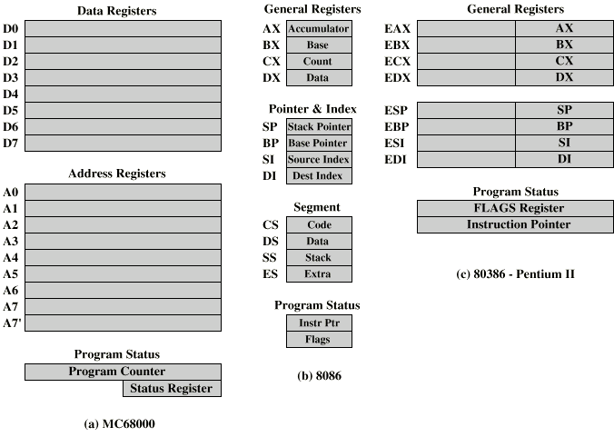
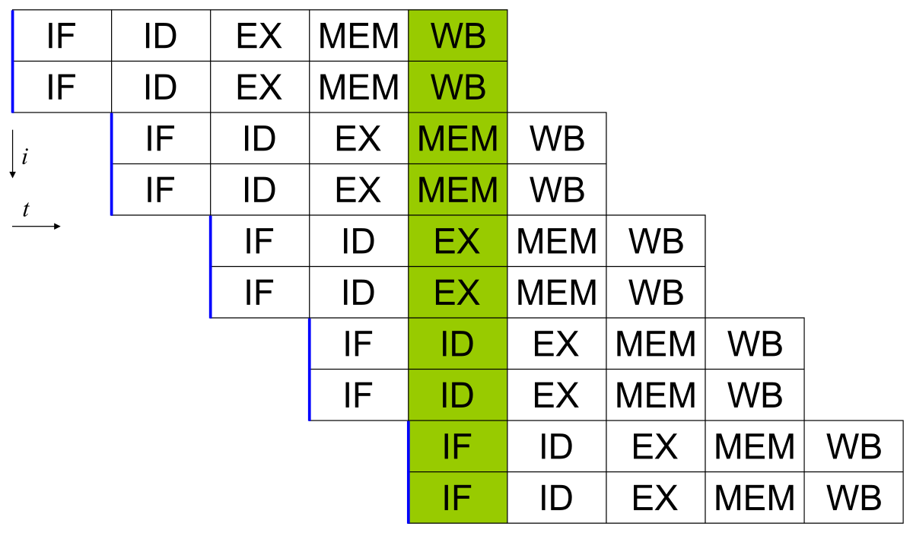
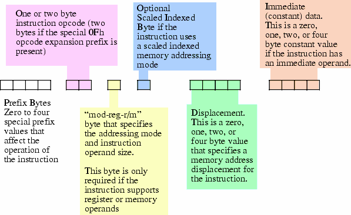
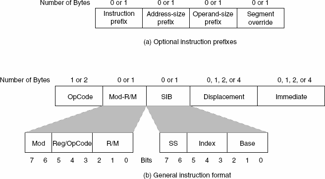
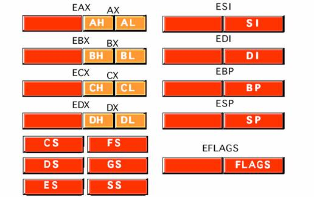

# Abstract 

computer system architecture 에 대해 정리한다.

# Materials


* [Encoding x86 instructions](https://www-user.tu-chemnitz.de/~heha/viewchm.php/hs/x86.chm/x86.htm) 
  * x86 instructions 인코딩 방법
* [Computer System Architecture, 3e](https://www.amazon.in/Computer-System-Architecture-3e-Mano/dp/8131700704)
  * 굉장히 좋은 책이다.
* [Windows 구조와 원리](http://www.hanbit.co.kr/store/books/look.php?p_code=B6822670083)
  * 오래전에 출간되어 절판되었지만 한글로 된 책들중 최강이다.
* [Write Great Code I](http://www.plantation-productions.com/Webster/www.writegreatcode.com/)
  * 킹왕짱
* [google interview university @ github](https://github.com/jwasham/coding-interview-university)
  * operating system 관련된 링크를 참고하자. 쓸만한 비디오가 잘 정리되어 있다.

# Computer System Architecture History 

프로세서의 역사를 다음과 같이 간략히 표현할 수 있다.

| 프로세서 | 도입년도 | 레지스터 크기 | 데이터 버스 | 어드레스 버스 | clock speed |
|:------:|:------:|:------:|:------:|:------:|:------:|
| 8008 | 1972 | 8 | 8 | 8 | |
| 8080 | 1974 | 8 | 8 | 16 | |
| 8086/88 | 1978 | 16/16 | 16/8 | 20 | 8Mhz |
| 80286 | 1982 | 16 | 16 | 24 | 12.5Mhz |
| 80386 | 1985 | 32 | 32 | 32 | 20Mhz |
| 80486 | 1989 | 32 | 32 | 32 | 25Mhz |
| pentium | 1993 | 32 | 64 | 32 | 60Mhz |
| pentium pro | 1995 | 32 | 64 | 36 | 200Mhz |
| pentium II | 1997 | 32 | 64 | 36 | 266Mhz |
| pentium III | 1999 | 32 | 64 | 36 | 500Mhz |

## ENIAC (Electronic Numerical Integrator And Computer)

최초의 디지털 컴퓨터는 1946년 완성된 ENIAC이다. 펜실베니아 대학의 전기 공학 무어 스쿨 (Moore School of Electrical Engineering) 에서 제작되었다. 높이가 18 피트, 길이가 80 피트, 무게가 30 톤 이상이었다. 그러나 프로그래밍을 위해 6,000 여개의 스위치를 조작하고 각종 케이블을 연결해야 했다.

## Von Neumann Architecture

ENIAC 프로젝트의 고문이었던 수학자 폰 노이만 (John Von Neumann) 은 프로그램 내장 방식 (Stored-program Concept) 을 고안했다. 이것을 Von Neumann Machine 이라고 부른다. 

Von Neumann Machine 은 프로그램과 데이터를 실행 되기 전에 메모리에 올려 놓고 프로그램이 실행 될 때에는 프로그램의 명렁어와 데이터들을 메모리로부터 불러들이고 프로그램에 대한 저장 또는 변경 역시 기억장치에 저장되어 있는 프로그램을 변경함으로써 가능하게 한다. 현대의 컴퓨터와 거의 똑같은 모델이다.

## IAS (Institute for Advanced Study) Machine

1952 년 프린스턴 대학에서 Von Neumann Architecture 을 IAS 라는 이름으로 구현한다. Von Neumann Machine 이라고 부르기도 한다.

IAS 의 메모리는 1,000 개의 저장소로 이루어져 있었다. 각 저장소는 40비트로 구성되었다. 저장소는 데이터, 명령어들을 표현할 수 있었다.

```
Data

0 1                                        39
+-------------------------------------------+
| |                                         |
+-------------------------------------------+
 ^
 |
 sign bit

Commands

0        8          19 20     28           39
+-------------------------------------------+
|        |            |        |            |
+-------------------------------------------+
     ^          ^          ^          ^
  opcode     address     opcode     address

```

IAS 는 다읕과 같이 7개의 레지스터를 가지고 있다.

| name | description |
:-----:|:------------:
| MBR (Memory Buffer Register) | 메모리로부터 읽어들인 데이터를 저장하고 있다. |
| MAR (Memory Address Register) | MBR 로 읽어들일 메모리 주소를 저장한다. |
| IR (Instruction Register) | 실행될 명령어를 저장한다. |
| IBR (Instruction Buffer Register) | 메모리로부터 읽어들인 명령어의 내용을 임시로 저장한다. |
| PC (Program Counter) | 다음번에 실행될 명렁어를 가져올 메모리 주소를 저장한다. |
| AC (Accumulator) | ALU 로부터 계산된 내용을 임시로 저장한다. |
| MQ (Multiplier Quotient) | ALU 로부터 계산된 내용을 임시로 저장한다. |

IAS 의 명령어 사이클은 패치 사이클 (Fetch Cycle), 실행 사이클 (Execution Cycle) 로 구성된다.

다음은 IAS 의 구조를 표현한 그림이다.



IAS 의 명령어 패치, 실행 사이클을 설명하면 다음과 같다. 실행할 명령어가 IBR 에 있는지 검사한다. 없으면 PC 의 내용을 MAR 에 저장하고 메인 메모리에서 저장소를 하나 읽어 들여 MBR 에 저장한다. 이제 MBR 에서 IBR 로 명령어를 읽어들이자. opcode 는 IR 로 address 는 MAR 로 보낸다. PC 를 하나 증가시켜서 다음 실행 위치를 바꾼다. IR 의 opcode 를 해석한다. 산술 처리 명령인 경우 MAR 이 가리키는 메인 메모리의 저장소 내용을 MBR 로 읽어 들인다. MBR 의 내용을 연산하여 결과를 AC 에 저장한다. 만약 흐름 변경 명령인 경우 MAR 의 내용을 PC 에 저장한다.

[이것](https://www.youtube.com/watch?v=mVbxrQE4f90)은 IAS 의 명령어 사이클을 설명한 동영상이다.

## 8086

어드레드 버스의 크기는 20bit 이다. 그래서 1,048,576(1Mb)의 어드레스를 다룰 수 있다. 그러나 레지스터의 크기는 16bit이다. 레지스터 두개를 연산하여 20bit 의 주소를 만들어 내는 세그먼테이션 방법이 고안되었다. 16bit 의 세그먼트 값을 왼쪽으로 4bit 이동시킨 값과 16bit 의 오프셋 값을 더하여 20bit 의 실제 주소값을 만들어 낸다.

8086 의 주요 레지스터들은 다음과 같다.

| name | description |
:-----:|:------------:
| AH, AL | AX : Accumulator register |
| BH, BL | BX : Base register  |
| CH, CL | CX : Count register  |
| DH, DL | DX : Data register  |
| SP | Stack Pointer  |
| BP | Base Pointer  |
| SI | Source Index  |
| DI | Destination Index  |
| IP | Instruction Pointer  |
| Flags | Status Flags  |
| CS | Code Segment  |
| DS | Data Segment |
| SS | Stack Segment |
| ES | Extra Segment  |



## 80286

8086 보다 어드레스 버스의 크기가 24bit 으로 확장되었다. 보호 모드 가 도입되어 멀티태스킹 환경을 지원하게 되었다. 프로그램은 물리적 주소를 바로 사용하지 않고 세그먼테이션 방법을 이용하여 가상 주소를 사용한다. 그러나 제작방식이 불편하여 큰 호응을 얻지는 못했다.

## 80386

어드레스 버스, 데이터 버스, 레지스터 등 대부분의 것들이 32bit로 이루어져 진정한 32bit 프로세서의 출현이었다. MMU (Memory Management Unit) 이 도입되어 os 의 부담을 덜어주었다. 

80386 의 레지스터들은 다음과 같다.


virtual memory 환경에서 페이징 작업을 위해 virtual address 를 physical address 로 변환하는데 시간이 소요된다. TLB (Translation Lookaside Buffer) 를 도입하여 일정 개수 만큼의 변환 내용을 보관하여 캐싱한다. TLB 를 제어하기 위해 테스트 레지스터의 도움이 필요하다. 

## 80486

명령어 파이프 라인이 도입되어 기존의 방법보다 명령어 처리율이 높아졌다. 하나의 명령어를 처리하는데 5단계가 필요하다. 5단계는 다음과 같다. 명령어 패치, 명령어 해석 및 유효 번지 계산, 오퍼랜드 패치, 실행, 기록.

8Kb 의 L1 cache 가 도입되고 TR3, TR4, TR5 가 추가되었다. 캐시를 제어하기 위해 CR0 레지스터에 CD (Cache Disable), NW (Non-Cache Write-Through) 비트가 추가되었다. 그리고 CR3 레지스터와 PTD (Page Table Directory), PTE (Page Table Entry) 등을 이용하여 페이징 한다.

## Pentium



두개 이상의 파이프 라인을 1개의 프로세서 클록 사이클에서 수행하는 Super Scalar Architecture 가 도입되었다. 인접한 두개의 파이프라인은 각각 u, v 라고 한다. u 파이프는 어떤 명령도 수행할 수 있는데 v 파이프는 간단한 명령만 수행할 수 있다. Instruction Paring Rule 이 지켜져야 super scalar architecture 의 장점을 활용할 수 있다. 그러기 위해 코드를 최적화 해야 한다. 좋은 컴파일러는 Instruction Paring Rule 을 반영한 산출물을 만들어 준다.

# Data Representation

## Number

음수를 표현할 때 2's complement 를 사용한다. 1's complement 에서 1을 더하면 2's complement 가 된다. 1's complement 는 모든 비트를 반대로 설정한다. 

예를 들어 숫자 -8을 1byte 에 2's complement 로 표현해보자. 

```
00001000 : abs value
11110111 : 1's complement
11111000 : 2's complement
```

2's complement 를 사용하면 덧셈 연산만으로 덧셈, 뺄셈을 모두 할 수 있다.
예를 들어 다음과 같이 4 + (-8) 을 해보자.

```
   00000100 : +4
 + 11111000 : -8
----------
   11111100 : -4
```

## Floating Point 

부동 소수점을 표현하는 방법은 IEEE (Institute of Electrical and Electoronics Engineers) 에서 제시한 single precision, double precision 와 같이 두가지가 있다. single precision 은 4byte, double precision 은 8byte 로 표현한다.

single precision 은 다음과 같이 4byte 를 sign bit, exponent bits, mantissa bits 로 나눈다.

```
 31   30             23   22                        0
+-----------------------------------------------------+
| s | exponent 8bit     | mantissa 23bit              |
+-----------------------------------------------------+ 
```

예를 들어서 `0.0096875` 를 표현해 보자. 첫번째 `0.0096875` 를 normalized form 으로 변환하면 `9.6875 * 10^-3` 이 된다. 두번째 이것을 이진수로 표현하면 `1001.1011` 이 된다. 세번째 다시 normalized form 으로 변환하면 `1.0011011*2^3` 이 된다. s 에 양수 0이 들어가고 exponent 에는 `130 (3 + 127)` 이 들어가고 가수부는 `0011011` 이 들어간다. 최종 결과는 다음과 같다. 

```
31   30    23   22                    0
+---------------------------------------+
| s | 1000010 | 00110110000000000000000 |
+---------------------------------------+ 
```

exponent 는 부호가 있는 지수를 표현해야 하기 때문에 `0 ~ 127` 이 가능하다. mantissa 는 23bit 이므로 10진수로 표현하면 7자리 정도이다. 따라서 `9787512.5` 와 `9687512.0` 은 실제로 다른 수 이지만 single precision 으로 저장될 경우 메모리에 같은 값으로 저장된다.

double precision 은 다음과 같이 8byte 를 sign bit, exponent bits, mantissa bits 로 나눈다.

```
 63   62              52  51                        0
+-----------------------------------------------------+
| s | exponent 11bit     | mantissa 52bit             |
+-----------------------------------------------------+ 
```

## Byte Order

데이터가 주어지면 그것을 어떠한 바이트 순서로 저장할 것인지에 대한 방법을 endian 이라고 한다. 

little endian 은 주어진 데이터의 LSB (least significant byte) 부터 낮은 주소를 시작으로 저장하는 것을 말한다. 이와는 반대로 big endian 은 MSB (most significant byte) 부터 낮은 주소를 시작으로 저장하는 것을 말한다.

예를 들어서 다음과 같이 `0x12345678` 데이터가 주어졌다고 해보자. MSB 는 `0x12` 이고 LSB 는 `0x78` 이다.

```
  MSB
  --
0x12345678
        --
        LSB

little endian

0: 78
1: 56
2: 34
3: 12

big endian

0: 12
1: 34
2: 56
3: 78

```

# machine language

[Encoding x86 instructions](https://www-user.tu-chemnitz.de/~heha/viewchm.php/hs/x86.chm/x86.htm) 를 기반으로 이해하자. 

하나의 instruction 은 `Prefix Bytes, Opcode, Mod-Reg-r/m, Scaled Indexed Byte, Displacement, Immediate" 와 같이 총 6개의 구성요소로 이루어질 수 있다. 언급한 구성요소는 0byte 일 수 있고 1byte 이상일 수도 있다. 모든 구성요가 존재 한다면 최대 16byte 까지 가능할 것 같지만 실제로는 15byte 까지만 가능하다. 





opcode 는 1byte 혹은 2byte 가 가능한데 2byte 의 경우 MSB 는 Opcode Expansion Prefix Bytes 를 의미하는 0Fh 이고 나머지 한 byte 가 opcode 를 표현한다. 따라서 opcode 의 종류는 512 개 까지 가능하지만 현재 모두를 사용하고 있지는 않다.

general purpose registers 정도는 알아두자.

