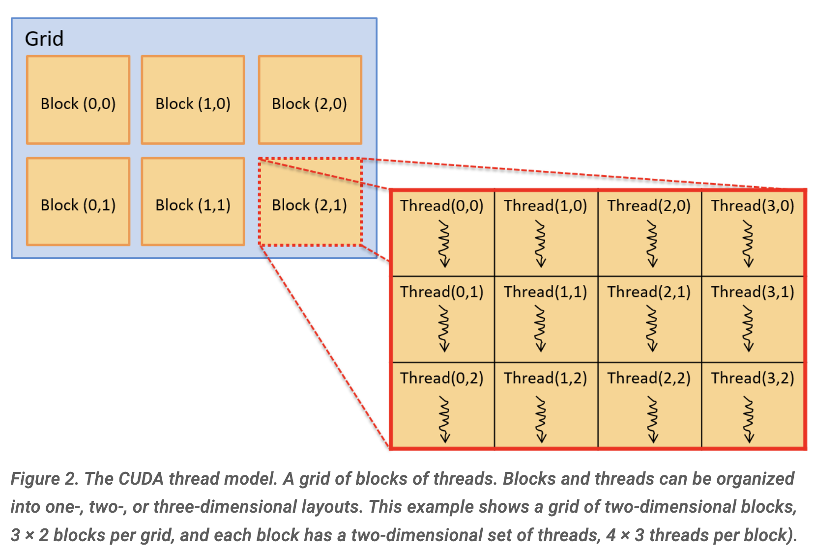

- [Abstract](#abstract)
- [Basic](#basic)
  - [Overview](#overview)
  - [Simple CUDA](#simple-cuda)

-----

# Abstract

**CUDA** (Compute Unified Device Architecture)는 NVIDIA에서 제공하는 GPGPU 컴퓨팅을 위한 프로그래밍 인터페이스입니다. CUDA는 일부 프로그램 기능이 호스트 CPU에서 실행되고 일부 기능이 GPU 디바이스에서 실행되는 이기종 컴퓨팅에 대해 설계되었습니다. 프로그래머들은 일반적으로 CUDA 커널 함수를 지정하는 주석이 달린 C 또는 C++로 CUDA 프로그램을 작성하며, GPU 디바이스 메모리를 관리하기 위해 CUDA 라이브러리 함수를 호출합니다. CUDA 커널 함수는 GPU에서 실행되는 함수이고, CUDA 스레드는 CUDA 프로그램에서 실행 단위의 기본 단위입니다. CUDA 스레드는 GPU의 SM에서 진행단계(발걸음 간격)를 유지하며, GPU 메모리에서 저장된 데이터의 일부에 대해 CUDA 커널 코드를 실행합니다. 커널 함수는 호스트 함수와 구별하기 위해 전역(global) 어노테이션이 있습니다. CUDA 디바이스 함수는 CUDA 커널 함수에서 호출할 수 있는 도우미 함수입니다.

# Basic

## Overview

- [15.1. Hardware Acceleration and CUDA | DiveIntoSystems](https://diveintosystems.org/book/C15-Parallel/gpu.html)

CUDA 를 이용하는 Application 을 제작하려면 Host code 와 CUDA Kernel Function code 를 만들어야 한다. 

```c
__global__ void scalar_multiply(int *array, int scalar) {
  int index;
  index = blockIdx.x * blockDim.x + threadIdx.x;
  array[index] = array[index] * scalar;
}
```

CUDA Kernel Function 은 CUDA Thread 에서 실행된다. 하나의 SP 는 하나의 core 를 의미하고 하나의 CUDA Thread 를 실행한다. CUDA 는 Thread 들의 묶음을 Block 이라 한다. 그리고 Block 들의 묶음을 Grid 라고 한다.

다음은 CUDA 의 Grid, Block, Thread 를 구성하는 방법이다.

```c
dim3 blockDim(16,16);  // 256 threads per block, in a 16x16 2D arrangement
dim3 gridDim(20,20);   // 400 blocks per grid, in a 20x20 2D arrangement

ret = do_something<<<gridDim,blockDim>>>(dev_array, 100);
```

- 하나의 grid 는 `20 x 20` 의 block 들로 구성된다.
- 하나의 block 은 `16 x 16` 의 thread 들로 구성된다.
- dev_array 에 parameter 를 담아서 전달하고 CUDA kernel 을 실행한다.

다음은 앞서 언급한 Grid, Block, Thread 를 그림으로 나타낸 것이다.



다음은 CUDA 의 메모리 할당/해제/복사 방법이다.

```c
/* "returns" through pass-by-pointer param dev_ptr GPU memory of size bytes
 * returns cudaSuccess or a cudaError value on error
 */
cudaMalloc(void **dev_ptr, size_t size);

/* free GPU memory
 * returns cudaSuccess or cudaErrorInvalidValue on error
 */
cudaFree(void *data);

/* copies data from src to dst, direction is based on value of kind
 *   kind: cudaMemcpyHosttoDevice is copy from cpu to gpu memory
 *   kind: cudaMemcpyDevicetoHost is copy from gpu to cpu memory
 * returns cudaSuccess or a cudaError value on error
 */
cudaMemcpy(void *dst, const void *src, size_t count, cudaMemcpyKind kind);
```

## Simple CUDA

- [15.1.4. CUDA | DiveIntoSystems](https://diveintosystems.org/book/C15-Parallel/gpu.html#_cuda)

다음과 같이 scala 와 vector 의 곱을 CUDA 로 구현해 보자.

```c
x = a * x    // where x is a vector and a is a scalar value
```

다음은 주요 business logic 이다.

- Allocate host-side memory for the vector x and initialize it.
- Allocate device-side memory for the vector x and copy it from host memory to GPU memory.
- Invoke a CUDA kernel function to perform vector scalar multiply in parallel, passing as arguments the device address of the vector x and the scalar value a.
- Copy the result from GPU memory to host memory vector x.

다음은 main function 이다.

```c
#include <cuda.h>

#define BLOCK_SIZE       64     /* threads per block */
#define N              10240    /* vector size */

// some host-side init function
void init_array(int *vector, int size, int step);

// host-side function: main
int main(int argc, char **argv) {

  int *vector, *dev_vector, scalar;

  scalar = 3;     // init scalar to some default value
  if(argc == 2) { // get scalar's value from a command line argument
    scalar = atoi(argv[1]);
  }

  // 1. allocate host memory space for the vector (missing error handling)
  vector = (int *)malloc(sizeof(int)*N);

  // initialize vector in host memory
  // (a user-defined initialization function not listed here)
  init_array(vector, N, 7);

  // 2. allocate GPU device memory for vector (missing error handling)
  cudaMalloc(&dev_vector, sizeof(int)*N);

  // 2. copy host vector to device memory (missing error handling)
  cudaMemcpy(dev_vector, vector, sizeof(int)*N, cudaMemcpyHostToDevice);

  // 3. call the CUDA scalar_multiply kernel
  // specify the 1D layout for blocks/grid (N/BLOCK_SIZE)
  //    and the 1D layout for threads/block (BLOCK_SIZE)
  scalar_multiply<<<(N/BLOCK_SIZE), BLOCK_SIZE>>>(dev_vector, scalar);

  // 4. copy device vector to host memory (missing error handling)
  cudaMemcpy(vector, dev_vector, sizeof(int)*N, cudaMemcpyDeviceToHost);

  // ...(do something on the host with the result copied into vector)

  // free allocated memory space on host and GPU
  cudaFree(dev_vector);
  free(vector);

  return 0;
}
```

다음은 CUDA Kernel Function 이다.

```c
/*
 * CUDA kernel function that performs scalar multiply
 * of a vector on the GPU device
 *
 * This assumes that there are enough threads to associate
 * each array[i] element with a signal thread
 * (in general, each thread would be responsible for a set of data elements)
 */
__global__ void scalar_multiply(int *array, int scalar) {

  int index;

  // compute the calling thread's index value based on
  // its position in the enclosing block and grid
  index = blockIdx.x * blockDim.x + threadIdx.x;

  // the thread's uses its index value is to
  // perform scalar multiply on its array element
  array[index] = array[index] * scalar;
}
```
