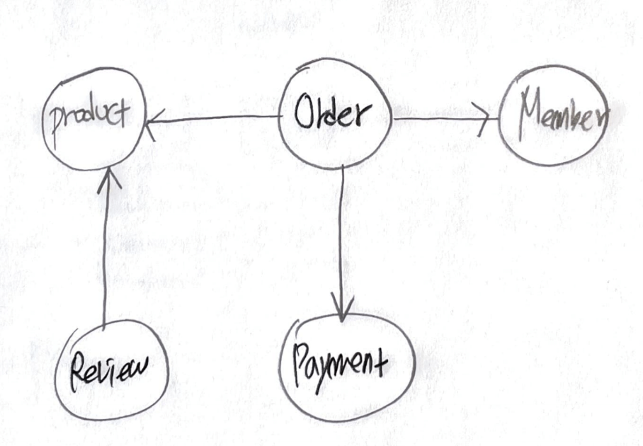
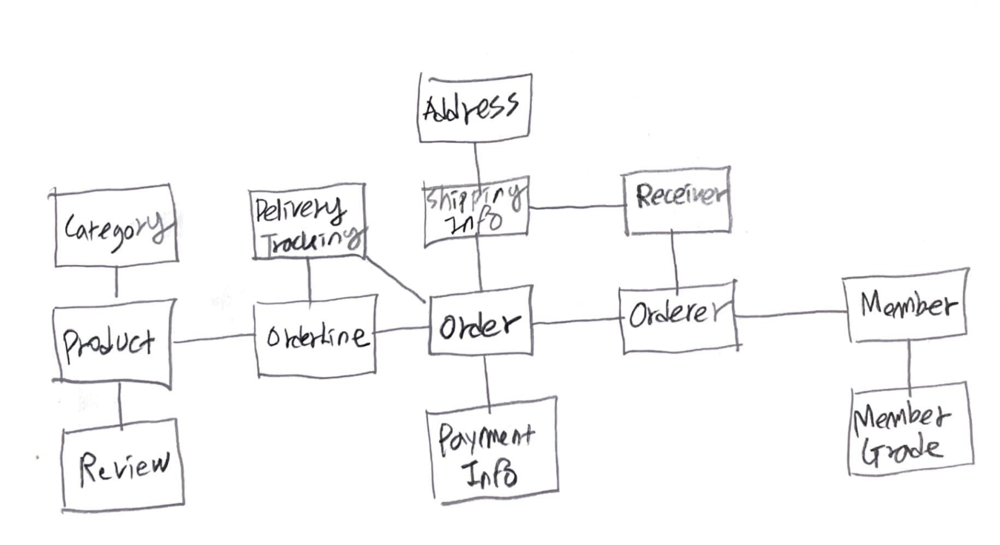
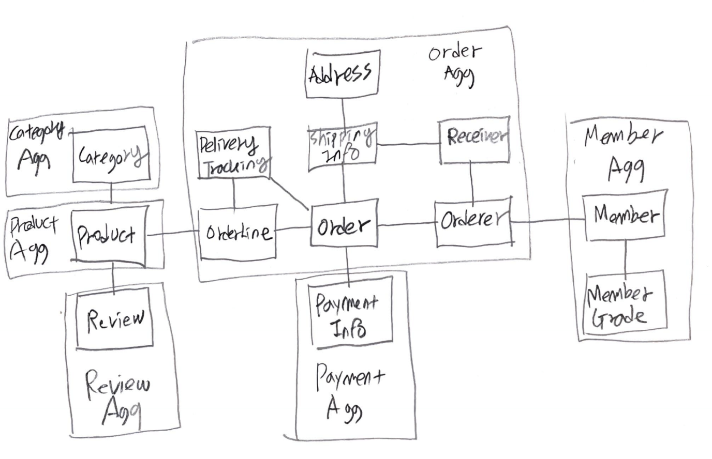
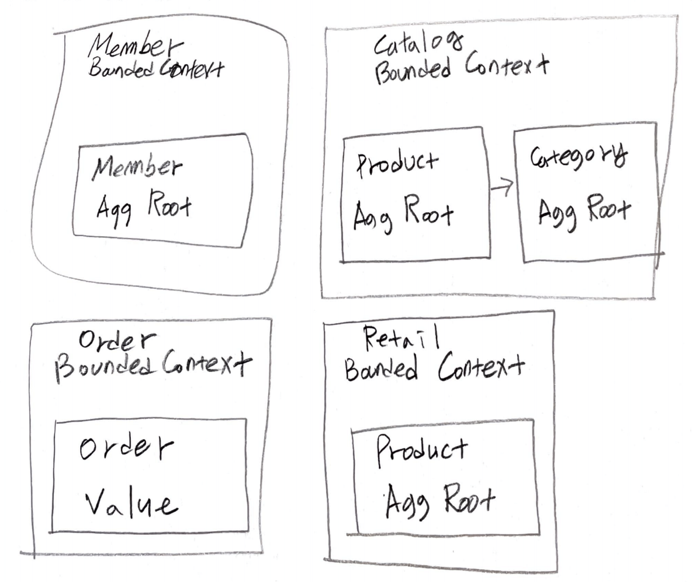
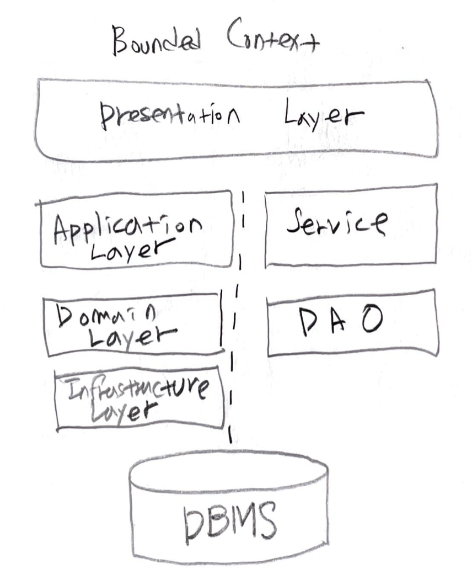

- [Abstract](#abstract)
- [References](#references)
- [Materials](#materials)
- [Basic](#basic)
  - [Terms](#terms)
  - [DDD Tutorial](#ddd-tutorial)
  - [Layered Architecture](#layered-architecture)
  - [Domain Layer](#domain-layer)
  - [DIP (Dependency Inversion Principle)](#dip-dependency-inversion-principle)
  - [Aggregate](#aggregate)
  - [Bounded Context](#bounded-context)
  - [CQRS (Command Query Responsibility Segregation)](#cqrs-command-query-responsibility-segregation)
  - [Event](#event)
  - [SAGAS](#sagas)
- [Advanced](#advanced)
  - [Event Storming](#event-storming)
  - [Boris Diagram](#boris-diagram)
  - [SnapE](#snape)

------

# Abstract

DDD (Domain Driven Design) 은 Domain 을 중심으로 System 을 Design 하는 것이다. 보통 Event storming 을 통해 Bounded Context 들을 구성한다. Boris Diagram, SnapE 의 과정을 거쳐 MSA (Micro Service Architecture) 를 디자인 한다.

# References

* [DDD START! 도메인 주도 설계 구현과 핵심 개념 익히기](http://www.yes24.com/Product/Goods/27750871)
  * [src](https://github.com/madvirus/ddd-start)
  * [DDD START! 수다 #1 @ youtube](https://www.youtube.com/watch?v=N3NSISzolSw)
  * [DDD START! 수다 #2 @ youtube](https://www.youtube.com/watch?v=OjMshMPVx5I)
  * [DDD START! 수다 #3 @ youtube](https://www.youtube.com/watch?v=BE5ysejA2cQ)
* [The Anatomy Of Domain-Driven Design](https://leanpub.com/theanatomyofdomain-drivendesign)
  * DDD introduction by infographic

# Materials

* [Domain Driven Design 이란 무엇인가?](https://frontalnh.github.io/2018/05/17/z_domain-driven-design/)
* [마이크로서비스 개발을 위한 Domain Driven Design @ youtube](https://www.youtube.com/watch?v=QUMERCN3rZs&feature=youtu.be)
* [MSA 전략 1: 마이크로서비스, 어떻게 디자인 할 것인가? @ slideshare](https://www.slideshare.net/PivotalKorea/msa-1-154454835)
* ["마이크로 서비스 어디까지 해봤니?" 정리](https://syundev.tistory.com/125)
* [진화하는 혹은 오래 사는 시스템 만들기](https://brunch.co.kr/@graypool/464)
  * [Domain Storytelling](http://domainstorytelling.org/) 을 설명한다. DDD 의
    실무방법중 하나로 이해하자.
  * [Domain Storytelling Tool](https://www.wps.de/modeler/)

# Basic

## Terms

| Term | Description  |
|--|--|
| Domain | 해결하고자 하는 문제영역 |
| Domain Model | Domain 을 개념적으로 표현한 것. 주로 UML (Class, Activity, Sequence Diagram) 로 표현한다. | |

## DDD Tutorial

* `[Requirement]` 요구사항을 파악한다. 파악한 것을 그림 및 글로 정리한다. 개념모델을 구현모델로 바꾸어 간다.
  * 도메인 규칙을 글로정리해본다. Access pattern 도 정리한다.
  * 도메인 용어 사전을 작성하여 기획자와 sync-up 한다.
  * Context Map 을 그려본다. 하나의 Bounded Context 는 여러 Aggregate 으로 구성된다.
  * 하나의 Aggregate 는 여러 Domain Model 즉 Entity, Value 로 구성된다. Entity, Value 는 Class 로 구현한다. Aggregate 는 하나의 Aggregate Root 즉 Root Entity 를 갖는다.
* `[Design]` Layered Architecture 를 참고하여 설계한다.
  * Class Diagram 을 작성한다. Class 별로 Field, Method, Relation 을 정리한다. 
  * Activity Diagram, Sequence Diagram 을 작성한다.
* `[Development]` 구현한다. 
  * Entity, Value 를 Class 로 구현한다.
  * JPA 를 사용한다면 Entity 는 Interface, Class 로 구현한다. Interface 는 Domain Layer 에 `@Entity` Class 는 Infrastructure Layer 에 구현한다.
* `[Validation]` 통합테스트 및 디버깅한다.

## Layered Architecture

> * [Layered Architecture](/architecture/README.md)

-----

| Layer | Description |
|---|---|
| Presentation | User 에 보여지는 화면 또는 데이터를 구현한다. |
| Application | User 가 원하는 기능을 Domain layer 를 조합하여 구현한다. |
| Domain | Domain model 을 구현한다. | 
| Infrastructure | RDBMS, MQ 와 같은 외부시스템 연동을 구현한다. |

## Domain Layer

Domain Layer 는 Entity, Value, Aggregate, Repository, Domain Service 로 구성된다. Aggregate 가 명사로 쓰일 때는 애그리거트라고 발음한다. 동사로 쓰일때는 애그리게이트이다.

| Component | Description |
|---|----|
| Entity  | 식별자를 갖는 Domain Model 이다. 자신의 라이프사이클을 갖는다. 예를 들어 Order, Member, Product 등이 해당된다. |
| Value | 식별자를 갖지 않는 Domain Model 이다. 주로 Entity 의 속성이다. 예를 들어 Address, Money 가 해당된다. |
| Aggregate | 관련된 Entity, Value 객체를 개념적으로 하나로 묶은 것이다. 예를 들어, 주문 Aggregate 은 Order Entity, OrderLine Value, Orderer Value 를 포함한다. |
| Repository | Domain Model 의 영속성을 제공한다. 예를 들어 DBMS 테이블의 CRUD 를 제공한다. |
| Domain Service | Domain Logic 을 제공한다. 예를 들어 "할인 금액 계산" Domain Service 는 상품, 쿠폰, 회원등급, 구매 금액등 다양한 조건을 이용해서 할인된 금액을 계산한다. |

## DIP (Dependency Inversion Principle)

* [DIP @ learntocode](/solid/README.md#dip)

## Aggregate

Aggregate 는 복잡한 Domain Model 들을 하나로 묶은 것이다. Aggregate 는 여러 Entity, Value 들로 구성된다. 하나의 Aggregate 는 하나의 Repositoty 에 대응된다.

먼저 다음과 같이 대략의 Domain Model 들을 그려본다.



그리고 상위 Domain Model 들을 하위 Domain Model 들로 나누어 본다.



하위 Domain Model 들을 다시 Aggregate 로 묶어 본다. 복잡한 Domain Model 들을 수월하게 파악할 수 있다.



Aggregate Root 는 Aggregate 의 대표 Domain Model 즉 대표 Entity 를 말한다. Aggregate 의 모든 Domain Model 은 직접 혹은 간접적으로 Aggregate Root 와 연관되어 있다. Aggregate 의 상태를 변경하고 싶다면 Aggregate Root 를 통해서 한다. 예를 들어 다음의 그림과 같이 주문 Aggregate 에서 Aggregate Root 는 Order Entity 이다.


하나의 Aggregate 에서 다른 Aggregate 를 참조할 때는 Aggregate Root 를 참조한다. 예를 들어 Order Aggregate 의 Orderer Entity 는 Member Aggregate 의 Member Entity 를 참조한다.

## Bounded Context

Bounded Context 는 Domain Model 의 경계가 되는 문맥을 말한다. 예를 들어 Ctalogue Bounded Context 의 Product 와 Instock (재고) Bounded Context 의 Product 는 의미가 다르다.



하나의 Context 는 여러 Aggregate 로 구성된다. 하나의 Context 가 곧 하나의 micro service 가 될 수 있다. Bounded Context 들 끼리 ACL (Anti Coruption Layer), OHS (Open Host Service) 로 연결된다. 다음과 같이 Bounded Context 의 관계를 그림으로 표현한 것을 Context Map 이라고 한다. Bounded Context 는 대표 Aggregate 와 함께 표기한다.


ACL, OHS 는 Shared Kernel 로 연결된다. Shared Kernel 은 Google ProtoBuf, FlatBuffer, OpenAPI 등을 사용하여 구현한다.

## CQRS (Command Query Responsibility Segregation)

하나의 Bounded Context 를 구현할 때 상태를 변경하는 것 (Command) 과 상태를 읽어오는 것 (Query) 을 나누어서 구현하는 방법이다.

Command 와 Query 는 다른 기술로 구현할 수도 있다. 예를 들어 다음의 그림과 같이 Command 는 DDD (Domain Driven Design) 의 Layered Architecture 로 구현하고 Query 는 Netty, MyBatis 를 포함한 DAO 로 단순하게 구현한다.



## Event

Asynchronous Event 를 사용하면 System 을 Decoupling 시킬 수 있다.

예를 들어 A 라는 microservice 에서 B 라는 microservice 에게 HTTP Request 를 보낼 때를 생각해 보자. B 가 HTTP Response 를 늦게 보내줄때 A micro service 는 Blocking 되어서는 안된다. A micro service 는 상태를 변경해 놓고 비동기로 처리한다.

## SAGAS

* [DDD START! 수다 #3 @ youtube](https://www.youtube.com/watch?v=BE5ysejA2cQ)
* [SAGAS](https://www.cs.cornell.edu/andru/cs711/2002fa/reading/sagas.pdf)
* [Distrivuted Transactions @ TIL](/distributedtransaction/README.md)
  
-----

여러 하위 트랜잭션 집합으로 구성된 LLT (Long Lived Transaction) 을 SAGAS 라고 한다. 다음과 같은 특징이 있다.

* 하위 트랜잭션들은 각각 단독 트랜잭션이다.
* 각 하위 트랜잭션들은 서로 연관되어 있다.
* 임의의 하위 트랜잭션이 실패하면 보상 트랜잭션을 실행한다.
* 일부만 성공한 것은 LLT 의 성공을 의미하지 않는다.

# Advanced

## Event Storming

* [마이크로서비스 개발을 위한 Domain Driven Design @ youtube](https://www.youtube.com/watch?v=QUMERCN3rZs&feature=youtu.be)
* [KCD 2020 [Track 2] 도메인 지식 탐구를 위한 이벤트 스토밍 Event Storming | youtube](https://www.youtube.com/watch?v=hUcpv5fdCIk)

-----

* Orange Sticker : Domain Event, something that happended.
  * `Item Added to Cart`
* Blue Sticker : Command, Request to trigger, source of domain devent.
  * `Item Add to Cart`
* Yellow Sticker : Aggregate, Object which has several attributes
 
  ```java
  @entity
  public class Item {
    private String sku;
    private String name;
    private Int quantity;
    private ProductId productId;
  }
  ```
* Red sticker : External system


## Boris Diagram

Aggreate 들 간에 synchronous, asynchronous event 들을 표기한다.


## SnapE

Aggregate 는 하나의 Micro Service 에 대응된다. API, Data, Stories, Risk, UI 를 기술한다.


