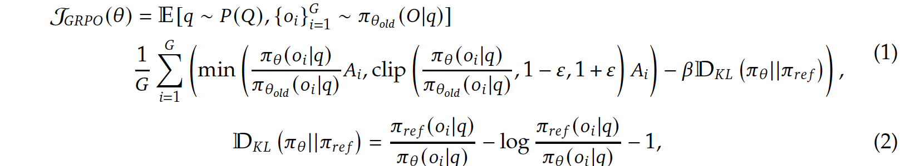

- [References](#references)
- [개요](#개요)
- [왜 이 연구가 중요한가?](#왜-이-연구가-중요한가)
- [DeepSeek-R1 시리즈란 무엇인가?](#deepseek-r1-시리즈란-무엇인가)
  - [DeepSeek-R1-Zero](#deepseek-r1-zero)
  - [DeepSeek-R1](#deepseek-r1)
  - [결과](#결과)
- [GRPO(그룹 상대 정책 최적화, Group Relative Policy Optimization) 공식 해설](#grpo그룹-상대-정책-최적화-group-relative-policy-optimization-공식-해설)
  - [1. 목표함수 ( J\_{\\text{GRPO}}(\\theta) )](#1-목표함수--j_textgrpotheta-)
  - [2. KL 발산 항 ( D\_{\\mathrm{KL}}(\\pi\_\\theta|\\pi\_{\\mathrm{ref}}) )](#2-kl-발산-항--d_mathrmklpi_thetapi_mathrmref-)
  - [3. 이득(Advantage) ( A\_i )](#3-이득advantage--a_i-)
  - [종합 요약](#종합-요약)
- [작은 모델을 위한 ‘증류(Distillation)’](#작은-모델을-위한-증류distillation)
- [결론 및 한계](#결론-및-한계)
  - [결론](#결론)
  - [남은 과제](#남은-과제)

-----

# References

- [DeepSeek-R1 | github](https://github.com/deepseek-ai/DeepSeek-R1)
- [Open-R1: a fully open reproduction of DeepSeek-R1](https://huggingface.co/blog/open-r1)
- [DeepSeek-R1에 대한 모든 기초 설명 | youtube](https://www.youtube.com/watch?v=0WWeq97FD70&t=711s)

# 개요

이 논문은 대형 언어 모델(Large Language Model, LLM)의 ‘추론(Reasoning)’ 능력을 높이기 위해, ‘강화학습(Reinforcement Learning, RL)’ 기법을 활용해 만든 DeepSeek-R1 시리즈에 관한 연구입니다. 기존에는 인간이 만든 문제-정답 데이터를 많이 모아 모델을 학습시키는 방식(지도학습)이 주로 쓰였는데, 여기서는 “순수한 강화학습만으로도 모델이 고도의 추론능력을 획득할 수 있는가?” 하는 점을 실험하고, 실제로 성공적인 결과를 얻었다고 보고합니다. 또한, 조금의 지도 데이터(“콜드 스타트” 데이터)를 섞어주거나, 최종에 다른 데이터들을 활용해 추가 학습하면 더 나은 성능과 가독성 높은 답변을 얻게 됨을 보여줍니다. 마지막으로, 이렇게 학습한 대형 모델의 추론 능력을 **‘증류(distillation)’**해서 더 작은 모델도 강력하게 만드는 방법을 제시합니다.

# 왜 이 연구가 중요한가?

추론(Reasoning) 능력: 단순히 문장을 이어 붙이거나 어휘를 예측하는 것을 넘어, 복잡한 수학 문제나 논리 퍼즐, 코딩 문제 등을 스스로 ‘생각’ 과정을 거쳐 해결할 수 있도록 하는 것이 목표입니다.
강화학습(RL) 활용: 게임 AI나 로봇 제어 등에 주로 사용되던 강화학습을 자연어 모델에 직접 적용하여, 모델이 스스로 어떻게 답해야 보상을 많이 얻을 수 있는지 학습하게 했습니다.
지도학습 한계 극복: 일반적으로 LLM은 사람 손으로 마련한 문제-정답(‘지도 데이터’)을 대량으로 모으는 데에 비용이 많이 들거나, 문제와 해설이 정확한지 판별하기 어려운 경우가 많습니다. 그런데 이 논문에서는 지도 데이터가 없어도 RL로 모델이 스스로 해답을 찾아가는 가능성을 보여주어, 연구 커뮤니티에 의미 있는 방향을 제시합니다.

# DeepSeek-R1 시리즈란 무엇인가?
논문에서는 크게 DeepSeek-R1-Zero와 DeepSeek-R1이라는 두 가지 주요 모델 계열을 제안합니다.

## DeepSeek-R1-Zero
‘콜드 스타트’(초기 지도 데이터)가 전혀 없는 상태에서 시작
문제를 보고 스스로 해답을 여러 번 시도해본 뒤, 정답이면 높은 점수(보상)를 주고, 틀리면 낮은 점수를 줍니다.
모델은 보상을 최대화하려고 스스로 답안 작성 방식을 개선해 나갑니다.
결과
수학∙코딩 문제 등, 정답이 명확히 결정되는 영역에서 점차 긴 풀이 과정을 쓰고(“생각 시간”이 늘어남), 스스로 복기(reflection)하는 모습까지 나타났습니다.
예: 처음엔 정답률이 15% 정도였지만, 많은 RL 스텝을 거치면서 약 70% 이상의 높은 정답률에 도달했습니다.
문제점
답변이 난잡하게 섞인 언어나 불필요한 내용으로 가득 차 가독성이 떨어짐
“결과는 좋지만, 사람이 읽기 어려운” 상태

## DeepSeek-R1
DeepSeek-R1은 읽기 좋은(가독성 높은) 해설을 만들고, 또 다른 종류의 문제에도 잘 대처할 수 있도록 한 단계 더 발전시킨 버전입니다.

콜드 스타트 데이터(조금의 지도 데이터) 사용

먼저 “예시가 되는 문제∙해설”을 수천 개 정도 만들어, 모델이 이 포맷을 학습하도록 합니다.
이렇게 하면 무작정 RL만 했을 때와 달리 초기 단계부터 사람이 이해하기 좋은 형태의 답을 쓰도록 유도할 수 있습니다.
추론 특화 강화학습

이후에는 DeepSeek-R1-Zero처럼 문제를 풀면 정답 여부로 보상을 주어 모델을 강화학습.
하지만 이번에는 “문장을 어느 언어로 쓰는지 일관성 있게 하라” 같은 추가 보상도 줍니다. 예컨대 영어 문제라면 영어로만 풀도록 하여, 언어가 뒤섞이지 않도록 교정했습니다.
재학습(거절 샘플링 + 지도학습)

RL로 어느 정도 실력이 오른 모델을 다시 활용해, 새로운 문제∙정답∙풀이 데이터를 대량으로 뽑습니다.
그중 사람 혹은 다른 모델로 확인해 “읽기 괜찮고, 정답이 맞는” 사례만 뽑아 지도학습 데이터로 삼습니다.
그 밖의 글쓰기∙요약∙사실 질의 등의 일반 태스크 데이터도 섞어 최종 모델을 학습하면, 어느 정도 균형 잡힌 실력과 가독성을 얻을 수 있게 됩니다.
최종 RL

마지막으로, 최종 모델에도 여러 가지 시나리오(안전성, 유해성 방지, 사용자 의도 충족 등)를 고려한 RL을 한 번 더 수행함으로써, 한층 더 다듬은 모델을 완성합니다.

## 결과

수학∙코딩∙논리 등 “정답이 분명한 문제”에서는 거의 최신 최고 수준(OpenAI-o1-1217 모델과 비슷)으로 좋은 성능을 보였습니다.
일반 글쓰기, 요약, 번역 등 다방면에서도 이전 모델(DeepSeek-V3)보다 더 좋은 성능을 보여주었으며, 답변의 가독성도 대폭 개선되었습니다.

# GRPO(그룹 상대 정책 최적화, Group Relative Policy Optimization) 공식 해설

아래에서는 논문에 등장하는 강화학습 공식을 간단한 수식과 설명을 곁들여 정리합니다.




---

## 1. 목표함수 \( J_{\text{GRPO}}(\theta) \)

```
\[
J_{\text{GRPO}}(\theta) 
= \mathbb{E}_{q \sim P(Q),\,\{o_i\}\sim \pi_{\theta_{\mathrm{old}}}}
  \left[
  \frac{1}{G}\sum_{i=1}^G 
  \min\!\biggl(
    \frac{\pi_\theta(o_i\mid q)}{\pi_{\theta_{\mathrm{old}}}(o_i\mid q)}\,A_i,
    \;\text{clip}\!\Bigl(
      \frac{\pi_\theta(o_i\mid q)}{\pi_{\theta_{\mathrm{old}}}(o_i\mid q)},
      \;1-\epsilon,\;1+\epsilon
    \Bigr)A_i
  \biggr)
  \;-\;\beta\,D_{\mathrm{KL}}(\pi_\theta\|\pi_{\mathrm{ref}})
  \right].
\]
```

- **의미 요약**  
  - 이 식은 새 모델(정책) \(\pi_\theta\)를 업데이트할 때 최대화해야 하는 **“목적 함수”**입니다.  
  - \(\pi_\theta(o_i \mid q)\): **“현재(새) 모델이 질문 \(q\)에 대해 답 \(o_i\)를 낼 확률”**  
  - \(\pi_{\theta_{\mathrm{old}}}(o_i \mid q)\): **“이전(옛) 모델이 \(q\)에 대해 \(o_i\)를 낼 확률”**  
  - \(\frac{\pi_\theta(o_i\mid q)}{\pi_{\theta_{\mathrm{old}}}(o_i\mid q)}\): **“옛 모델 대비 얼마나 더(혹은 덜) 그 답을 택하려 하는지”**를 나타내는 비율  
  - \(A_i\): **“해당 답 \(o_i\)가 얼마나 유리한지(advantage)”**를 나타내는 값  
  - \(\min(\cdot,\,\text{clip}(\cdot))\): **업데이트 비율이 과도하게 커지지 않도록 제한**(클리핑)  
  - \(\beta\,D_{\mathrm{KL}}(\cdot)\): **“새 모델이 너무 큰 변화를 일으키지 않도록 억제”**(규제)하는 항  

\(\Rightarrow\) 결과적으로, **“좋은 답안”**(보상이 큰)은 \(\pi_\theta\)에서 확률을 늘리도록, **“나쁜 답안”**은 줄이도록 유도하되, **“극단적으로 확 바뀌지 않도록”** 조정해주는 알고리즘입니다.

---

## 2. KL 발산 항 \( D_{\mathrm{KL}}(\pi_\theta\|\pi_{\mathrm{ref}}) \)

```
\[
D_{\mathrm{KL}}(\pi_\theta\|\pi_{\mathrm{ref}})
= \frac{\pi_{\mathrm{ref}}(o_i \mid q)}{\pi_\theta(o_i \mid q)}
  \;-\;
  \log\!\Bigl[\tfrac{\pi_{\mathrm{ref}}(o_i \mid q)}{\pi_\theta(o_i \mid q)}\Bigr]
  \;-\;1.
\]
```

- **의미 요약**  
  - **KL 발산(Kullback–Leibler Divergence)**: 두 확률 분포(정책)가 얼마나 다른지를 나타내는 지표  
  - \(\pi_{\mathrm{ref}}\): **“참조(기준)가 되는 정책(분포)”**  
  - \(\beta \, D_{\mathrm{KL}}(\pi_\theta\|\pi_{\mathrm{ref}})\)가 커질수록 벌점이 커져, **“새 모델이 기준과 너무 달라지지 않도록”** 제어  
  - 보통 특정 기준 정책(예: ‘초기 모델’이나 ‘안전성을 만족하는 모델’)에서 멀어질수록 규제 항이 커져서 손실(Loss)이 높아집니다.

---

## 3. 이득(Advantage) \( A_i \)

```
\[
A_i 
= \frac{r_i - \mathrm{mean}\{r_1, r_2, \ldots, r_G\}}
       {\mathrm{std}\{r_1, r_2, \ldots, r_G\}}.
\]
```

- **의미 요약**  
  - \(r_i\): 답변 \(o_i\)가 얻은 **보상**(reward)  
  - \(\mathrm{mean}\{r_1,\dots,r_G\}\), \(\mathrm{std}\{r_1,\dots,r_G\}\): 해당 문제에서 나온 **모든 답변의 평균 보상**, **표준편차**  
  - 결국 \(A_i\)는 **“해당 답이 평균보다 몇 표준편차나 더 좋은지(또는 나쁜지)”**를 나타내는 값  
  - \(A_i > 0\)이면 평균보다 좋은(이득 높은) 답변, \(A_i < 0\)이면 평균보다 못한 답변

---

## 종합 요약

1. **목표함수 \( J_{\text{GRPO}}(\theta) \)**  
   - 좋은 답안(보상이 큰)일수록 \(\pi_\theta\)에서 확률을 높이고, 나쁜 답안이면 낮추는 방향으로 학습  
   - 클리핑(\(\epsilon\))과 KL 발산( \(\beta\,D_{\mathrm{KL}}\) )을 통해 **급격한 변화를 방지**  
   - 그룹 단위( \(G\)개 답변 )로 평균을 내어 안정적으로 업데이트

2. **KL 발산 항**  
   - 새 정책이 기준 정책과 지나치게 달라지면(=KL 발산이 커지면) 벌점을 주어, **학습 과정의 폭주**를 막음

3. **이득(Advantage) \(A_i\)**  
   - 그룹 내 다른 답변들과 비교했을 때, **해당 답변의 상대적 성능**을 수치화  
   - 더 좋은 답변이면 업데이트할 때 그 확률을 크게 늘리고, 더 나쁜 답변이면 줄이는 근거로 삼음

**결론적으로** GRPO는 **“상대 우수함(advantage)을 바탕으로 모델을 개선하되,  
너무 급진적으로 변하지 않도록 안정장치를 넣은 강화학습 기법”**이라고 이해할 수 있습니다.


# 작은 모델을 위한 ‘증류(Distillation)’

증류란? 큰 모델이 “어떤 식으로 생각하고 답했는지” 생성한 데이터를, 작은 모델이 그대로 학습해 작은 모델도 큰 모델 수준의 추론 방식을 따라 배우게 하는 기법입니다.
본 논문에서는 DeepSeek-R1을 “선생”으로 삼아, 훨씬 적은 파라미터를 가진 모델(Qwen, Llama 등)에게도 강력한 추론 능력을 물려주었습니다.
그 결과, 예를 들어 7억 파라미터~70억 파라미터대 모델이 기존의 같은 크기의 모델보다 훨씬 높은 수학·코딩 성능을 보이는 모습을 확인했습니다.
즉, 큰 모델 하나에만 의존하지 않고, 훨씬 가벼운 모델에서도 고도의 추론 능력을 발휘할 수 있도록 만든 것이 상당히 의의가 큽니다.

# 결론 및 한계

## 결론

순수 강화학습만으로도 대형 언어 모델이 고수준의 추론 능력을 얻을 수 있다는 것을 처음으로 입증했습니다(DeepSeek-R1-Zero).
거기에 콜드 스타트용 소량의 지도 데이터를 섞어주고, 단계별로 RL-재학습을 반복한 DeepSeek-R1은 더 높은 성능과 좋은 가독성을 확보했습니다.
마지막으로 이러한 추론 능력을 여러 작은 모델에게도 증류해, 가벼운 모델도 훨씬 똑똑해질 수 있음을 보였습니다.

## 남은 과제

다양한 언어가 섞여 들어오는 상황에서 언어가 뒤섞이지 않도록 하는 문제
대화형 태스크(여러 번의 질의응답)나 소프트웨어 엔지니어링처럼 RL로 쉽게 맞추기 어려운 더 복잡한 분야를 어떻게 확장할지
RL을 너무 많이 반복하면, 어떤 경우에는 모델이 답변을 장황하게 늘어놓아버릴 수 있는 “길이 편향” 등을 어떻게 줄일지
모델이 가진 내적 추론 과정을 모두 노출하는 것에 대한 프라이버시∙안전성 문제도 고려해야 함
한눈에 보는 요약
목표: 대형 언어 모델이 복잡한 문제를 스스로 풀고, 생각 과정을 상세히 적어낼 수 있게 만드는 것
핵심 아이디어: 지도학습 대신(또는 최소화하여) 강화학습으로 훈련시키고, 보상을 높이려는 과정을 통해 모델이 단계적 추론을 익히도록 함
DeepSeek-R1-Zero: 전혀 지도 데이터 없이, RL만으로 ‘생각’을 스스로 깨우친 사례
DeepSeek-R1: 콜드 스타트 데이터로 시작하여, RL과 지도학습을 적절히 결합해 높은 성능과 가독성을 동시 달성
증류(Distillation): 큰 모델이 얻은 추론 능력을 작은 모델로 이전, 작은 모델도 강력해짐
결과: 수학∙코딩∙논리 등에서 최고 수준 성능, 다른 언어나 일반 텍스트 작업도 기존 모델보다 향상
