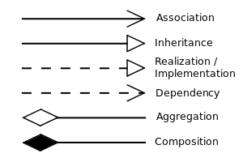

- [Abstract](#abstract)
- [Materials](#materials)
- [References](#references)
- [Class Diagram Relationship](#class-diagram-relationship)
  - [Association](#association)
  - [Dependency](#dependency)
  - [Inheritance](#inheritance)
  - [Realization](#realization)
  - [Composition](#composition)
  - [Aggregation](#aggregation)
  - [Aggregation vs Composition](#aggregation-vs-composition)
- [GOF Pattern](#gof-pattern)
  - [Creational Pattern](#creational-pattern)
    - [Abstract Factory](#abstract-factory)
    - [Builder](#builder)
    - [Factory Method](#factory-method)
    - [Prototype](#prototype)
    - [Singleton](#singleton)
  - [Structural Pattern](#structural-pattern)
    - [Adapter](#adapter)
    - [Bridge](#bridge)
    - [Composite](#composite)
    - [Decorator](#decorator)
    - [Facade](#facade)
    - [Flyweight](#flyweight)
    - [Proxy](#proxy)
  - [Behaviorial Pattern](#behaviorial-pattern)
    - [Chain of Resp.](#chain-of-resp)
    - [Command](#command)
    - [Interpreter](#interpreter)
    - [Iterator](#iterator)
    - [Mediator](#mediator)
    - [Memento](#memento)
    - [Observer](#observer)
    - [State](#state)
    - [Strategy](#strategy)
    - [Template](#template)
    - [Visitor](#visitor)
  - [Examples](#examples)
  - [Q\&A](#qa)
- [Game Programming Pattern](#game-programming-pattern)
  - [Sequencing Pattern](#sequencing-pattern)
    - [Double Buffer](#double-buffer)
    - [Game Loop](#game-loop)
    - [Update Method](#update-method)
  - [Behavioral Pattern](#behavioral-pattern)
    - [Bytecode](#bytecode)
    - [Subclass Sandbox](#subclass-sandbox)
    - [Type Object](#type-object)
  - [Decoupling Pattern](#decoupling-pattern)
    - [Component](#component)
    - [Event Queue](#event-queue)
    - [Service Locator](#service-locator)
  - [Optimization Pattern](#optimization-pattern)
    - [Data Locality](#data-locality)
    - [Dirty Flag](#dirty-flag)
    - [Object Pool](#object-pool)
    - [Spatial Partition](#spatial-partition)
- [Java Design Patterns](#java-design-patterns)
- [Microservice Patterns](#microservice-patterns)
- [Cloud Design Patterns](#cloud-design-patterns)
- [Enterprise Integration Patterns](#enterprise-integration-patterns)

----

# Abstract

디자인 패턴은 간접 경험을 할 수 있어서 좋다. 가끔은 이런 걸 굳이
패턴화 할 필요가 있나 할 정도로 당연한 얘기도 있다. 때로는 이 패턴과
저 패턴의 차이는 뭘까 하는 의문이 생기게 하는 것 들도 많다. 무엇보다
다양한 관점에서 문제를 바라 볼 수 있게 방아쇠를 당겨주는 것은 디자인
패턴의 이유라고 할 수 있다.

# Materials

* [Refactoring.Guru](https://refactoring.guru/design-patterns)
  * Programming Language 별 example 제공
* [Golang Design Patterns in Kubernetes](https://aly.arriqaaq.com/golang-design-patterns/?fbclid=IwAR20DyiTILpa3cMe0wt4JwF_Ll83Dluwnq6QPQpXyA3rkvELGZEmwDxsNoA)
* [자바 디자인 패턴 이해 @ youtube](https://www.youtube.com/playlist?list=PLsoscMhnRc7pPsRHmgN4M8tqUdWZzkpxY)
  * 쉬운 한글 설명
* [A pattern language for microservices](https://microservices.io/patterns/index.html)
  * microservice pattern
* [패턴으로 가는길, 손영수](http://www.devpia.com/MAEUL/Contents/Detail.aspx?BoardID=70&MAEULNO=28&no=187&page=1)
  * 패턴 공부 로드맵
* GOF pattern
* POSA
* [PLoPD, pattern language of program design](http://wiki.c2.com/?PatternLanguagesOfProgramDesign)
  * 패턴에 관련된 컨퍼런스인 PLoP의 논문들을 정리한 책
* [Pattern-Oriented Analysis and Design: Composing Patterns to Design Software Systems](http://www.kangcom.com/sub/view.asp?sku=200309010011)
* [Remoting Patterns: Foundations of Enterprise, Internet and Realtime Distributed Object Middleware](http://www.kangcom.com/sub/view.asp?sku=200410040309)
* [Xunit Test Patterns: Refactoring Test Code](http://www.kangcom.com/sub/view.asp?sku=200612280010)
* [Patterns for Fault Tolerant Software](http://www.kangcom.com/sub/view.asp?sku=200712160009)
* [Patterns of Enterprise Application Architecture, Martin Fowler](http://www.kangcom.com/sub/view.asp?sku=200212100028)
* [Enterprise Integration Patterns : Designing, Building, and Deploying Messaging Solutions](http://www.kangcom.com/sub/view.asp?sku=200310160006)
* [Real-Time Design Patterns: Robust Scalable Architecture for Real-Time Systems](http://www.kangcom.com/sub/view.asp?sku=200403300020)
* [Refactoring to Patterns](http://www.kangcom.com/sub/view.asp?sku=200406140003)
* [Architecting Enterprise Solutions: Patterns for High-Capability Internet-Based Systems](http://www.kangcom.com/sub/view.asp?sku=200410040307)
* [PLoP papers](http://www.hillside.net/index.php/past-plop-conferences)
* [클로저 디자인 패턴](http://clojure.or.kr/docs/clojure-and-gof-design-patterns.html)
  * java 로 표현한 디자인 패턴은 clojure 로 이렇게 간단히 된다.

# References

* [Design patterns implemented in Java](http://java-design-patterns.com/)
* [.NET Design Patterns](http://dofactory.com/net/design-patterns)

---

# Class Diagram Relationship



끝이 빈 화살표이면 Association 혹은 Dependency 이다. 실선은 점선보다 강하다.
실선은 **Association**, 점선은 **Dependency** 이다.

끝이 삼각 화살표이면 Inheritance 혹은 Implementation 이다. 실선은 점선보다
강하다. 실선은 **Inheritance**, 점선으 **Implementation** 이다. 

끝이 다이아 화살표이면 Composition 혹은 Aggregation 이다. 다이가 채워진 것이 빈
것보다 강하다. 다이아가 채워진 것은 **Composition**, 다이아가 비워진 것은
**Aggregation** 이다.

## Association

A 클래스가 B 클래스를 소유할 때 둘의 관계는 Association 이다. (**has-a**)

```cs
public class A {
    private B b;
}
```

## Dependency

A 클래스가 B 클래스를 함수의 인자 혹은 리턴값 으로 사용할 때 둘의 관계는 Dependency 이다.

```cs
public class A {
    public void enroll(B b){}
}
```

## Inheritance

B 클래스가 A 클래스를 상속할 때 둘의 관계는 Inheritance 이다. 

## Realization

B 클래스가 A 인터페이스를 구현할 때 둘의 관계는 Realization 이다.

## Composition

A 클래스가 B 클래스를 소유하고 B 클래스는 A 클래스를 구성하는 부분이며 A 클래스가 파괴되면 B 클래스 역시 파괴될 때 둘의 관계는 Aggregation 이다. (**has-a, whole-part, ownership**)

```cs
public class A {
    private B b;
    public A() {
       b = new B();
    }
}
```

## Aggregation

A 클래스가 B 클래스를 소유하고 B 클래스는 A 클래스를 구성하는 부분일 때 둘의
관계는 Aggregation 이다. (**has-a, whole-part**)

```cs
public class A {
    private List<B> b;
}
```

## Aggregation vs Composition

호수 클래스와 오리 클래스가 있다고 하자. 호수위에 오리가 떠있다. 그리고 오리들은
농부의 소유물이다. 호수가 사라진다고 해서 오리가 사라지지는 않는다. 호수
클래스와 오리 클래스는 Aggregation 관계이다.

자동차와 클래스와 카뷰레터 클래스가 있다고 하자. 카뷰레터는 자동차의 부품이다.
자동차가 파괴되면 카뷰레터 역시 파괴된다. 자동차 클래스와 카뷰레터 클래스는
Composition 관계이다.

# [GOF Pattern](http://www.dofactory.com/net/design-patterns)

## Creational Pattern

### [Abstract Factory](abstractfactory/abstractfactory.md)
### [Builder](builder/builder.md)
### [Factory Method](factorymethod/factorymethod.md)
### [Prototype](prototype/prototype.md)
### [Singleton](singleton/singleton.md)

## Structural Pattern

### [Adapter](adapter/adapter.md)
### [Bridge](bridge/bridge.md)
### [Composite](composite/composite.md)
### [Decorator](decorator/decorator.md)
### [Facade](facade/facade.md)
### [Flyweight](flyweight/flyweight.md)
### [Proxy](proxy/proxy.md)

## Behaviorial Pattern

### [Chain of Resp.](chainofresp/chainofresp.md)
### [Command](command/command.md)
### [Interpreter](interpreter/interpreter.md)
### [Iterator](iterator/iterator.md)
### [Mediator](mediator/mediator.md)
### [Memento](memento/memento.md)
### [Observer](observer/observer.md)
### [State](state/state.md)
### [Strategy](strategy/strategy.md)
### [Template](template/template.md)
### [Visitor](visitor/visitor.md)

## Examples

- [Kotlin GOF Design Pattern](/kotlin/kotlin_design_pattern.md)
- [Swift GOF Design Pattern](/swift/swift_designpattern.md)
- [Python GOF Design Pattern](/python/python_designpattern.md)

## Q&A

- **Factory Method vs Abstract Factory difference???**
  - Factory Method 는 동일한 분류의 객체를 생성할 때 사용한다. Abstract Factory
    는 다양한 분류의 객체를 생성할 때 사용한다. Abstract Factory 는 두개 이상의
    Factory Method 를 소유한다.
- **Proxy vs Adapter difference???**
  - Proxy class 는 wrapping 하고 싶은 class 와 형제관계이다. Adapter class 는
    wrapping 하고 싶은 class 와 형제관계가 아니다.
- **Decorator is better than Subclassing???**
  - [decorator @ TIL](decorator.md)
  - IFruit 를 상속받은 Apple, Orange 가 있다고 해보자. 과일판매기능을 추가하고
    싶다. Subclassing 을 이용한다면 AppleSellable, OrangeSellable 를 각각 구현해
    주어야 한다. 그러나 Decorator 를 이용하면 하나의 ConcreteDecorator Sellable
    를 추가하여 더욱 간단히 구현할 수 있다.
- **Bridge vs Strategy difference???**
  - Strategy 는 behavioral pattern 이다. 인스턴스 교체를 통해서 runtime 에
    동작이 달라진다. Bridge pattern 은 structural pattern 이다. 추상과 구현이
    분리된 구조이다. Strategy 는 추상과 구현이 분리되어 있지 않다. 따라서
    Strategy 의 추상과 구현의 결합도가 Bridge 보다 높다.
- **Strategy vs Visitor difference???**
  - Strategy 는 `1:many` 관계를 추상화한다. Visitor 는 `many:many` 관계를
    추상화한다. 
  - Strategy 는 Single Dispatch 를 이용한 것이고 Visitor 는 Double Dispatch 를
    이용한 것이다.
  - 예를 들어 Strategy class `Video` 를 상속받은 Concrete Strategy class
    `MpegCompression, AviCompression, QuickTimeCompression` 가 있다고 해보자. 
  - 시간이 지나 Audio 압축을 지원하고자 한다. `MpegVideoCompression,
    MpegAudioCompression` 과 같이 중복해서 Concrete Strategy class 를 추가하는
    것보다는 Visitor interface `IVisitor`  를 상속받은 Concrete Visitor
    `MpegCompression` 을 이용하는 것이 더욱 간단하다. 다음은 `MpegCompression`
    의 vistor method 이다.

    ```java
    MpegCompression::compressVideo(Video object)
    MpegCompression::compressAudio(Audio object)
    ```     
- **Strategy vs State difference???**
  - Strategy 와 State 는 매우 비슷하다. State 는 Concrete State 들 끼리 서로
    변신하는 상태전환의 개념을 포함한다. Strategy 는 Concrete Strategy 들 끼리
    서로 관계가 없다.

# [Game Programming Pattern](http://gameprogrammingpatterns.com/contents.html)

## Sequencing Pattern
### Double Buffer
### Game Loop
### Update Method
## Behavioral Pattern
### Bytecode
### Subclass Sandbox
### Type Object
## Decoupling Pattern
### Component
### Event Queue
### Service Locator
## Optimization Pattern
### Data Locality
### Dirty Flag
### Object Pool
### Spatial Partition

# Java Design Patterns

* [Java Design Pattern](/java/java_designpattern.md)
  * 디자인 패턴의 끝판왕임

# Microservice Patterns

* [A pattern language for microservices](https://microservices.io/patterns/index.html)

----

* [msa | TIL](/msa/README.md)

# Cloud Design Patterns

* [클라우드 디자인 패턴 | msdn](https://docs.microsoft.com/ko-kr/azure/architecture/patterns/)

----

* [Cloud Deisgn Patterns | TIL](/systemdesign/clouddesignpattern.md)
  
# Enterprise Integration Patterns

* [Enterprise Integration Patterns | TIL](/eip/README.md)
