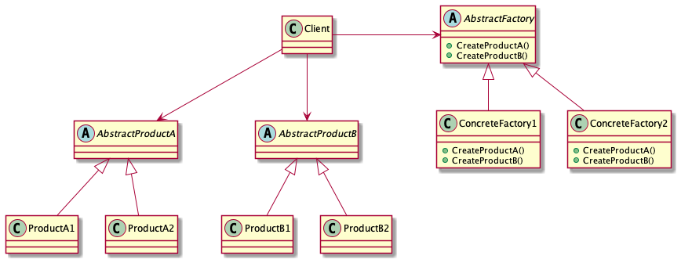

  # Abstract
  
  - [Abstract Factory](https://www.dofactory.com/net/abstract-factory-design-pattern)
    - AbstractFactory, ConcreteFactory1, ConcreteFactory2, AbstractProductA, ConcreteProductA1, ConcreteProductA2, AbstractProductB, ConcreteProductB1, ConcreteProductB2
    - 다양한 분류의 오브젝트 생성방법을 추상화하여 타겟 인스턴스를 생성한다. 예를 들어 LG부품 인터페이스를 상속받는 LG키보드, LG마우스 클래스의 생성방법과 MS부품 인터페이스를 상속받는 MS키보드, MS마우스 클래스의 생성방법을 추상화한다. 
    - Factory Method 는 한가지 분류를 생성하지만 Abstract Factory 는 두가지 이상의 분류를 생성한다. 따라서 Factory Method 가 두개이상이다.

# Class Diagram

