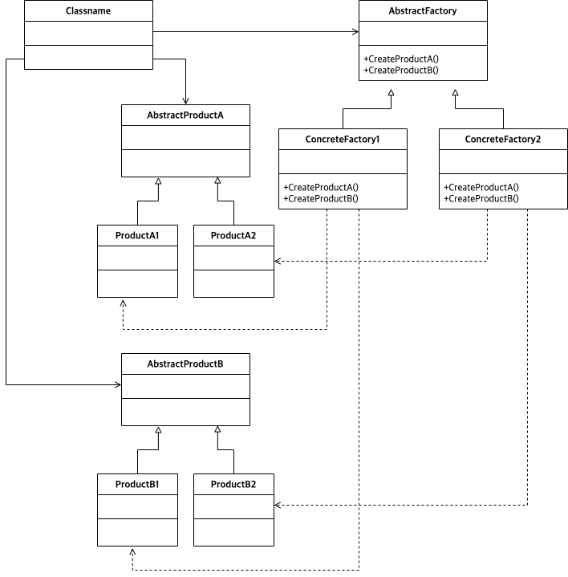

# Abstract
  
Abstract Factory 는 Factory 를 생성하고 그 Factory 는 다시 Product 를 생성한다.

최종 Product 종류의 개수는 `Concrete Factory 개수 * Abstract Product 개수` 이다.
예를 들어 `Concrete Factory` 가 `NikeFactory, AdidasFactory` 와 같이 2 개 있다고
해보자. 그리고 `Abstract Product` 가 `Shoe, Shirt, Ball` 과 같이 3 개 있다고
해보자. 최종 Product 종류의 개수는 `NikeShoe, NikeShirt, NikeBall, AdidasShoe,
AdidasShirt, AdidasBall` 과 같이 6 개이다.

# Materials

* [Abstract Factory @ dofactory](https://www.dofactory.com/net/abstract-factory-design-pattern)
* [Abstract Factory @ refactoring.guru](https://refactoring.guru/design-patterns/abstract-factory)

# UML Class Diagram

# Implements

* [Abstract Factory in go](/golang/go_design_pattern/abstractf_factory.md)
* [Abstract Factory in kotlin](/kotlin/kotlin_design_pattern/abstract_factory.md)
