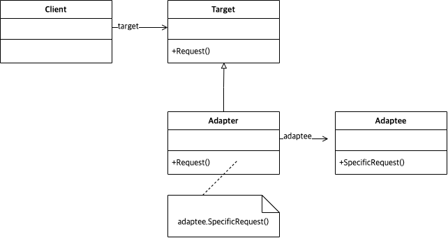

# Abstract

서로 다른 클래스의 인터페이스를 어울릴 수 있도록 맞춘다. 

# Materials

* [Adapter @ dofactory](https://www.dofactory.com/net/adapter-design-pattern)

# UML Class Diagram

# Examples

* [Adapter in kotlin](/kotlin/kotlin_design_pattern/adapter.md)
* [Adapter in go](/golang/go_design_pattern/adapter.md)
