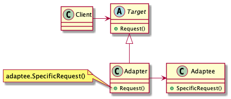

# Abstract

서로 다른 클래스의 인터페이스를 어울릴 수 있도록 맞춘다. 

# Materials

* [Adapter](https://www.dofactory.com/net/adapter-design-pattern)

# Concept Class Diagram

> [src](adapter.puml)

# Examples

* [Adapter by go](/golang/designpattern/adapter.md)

