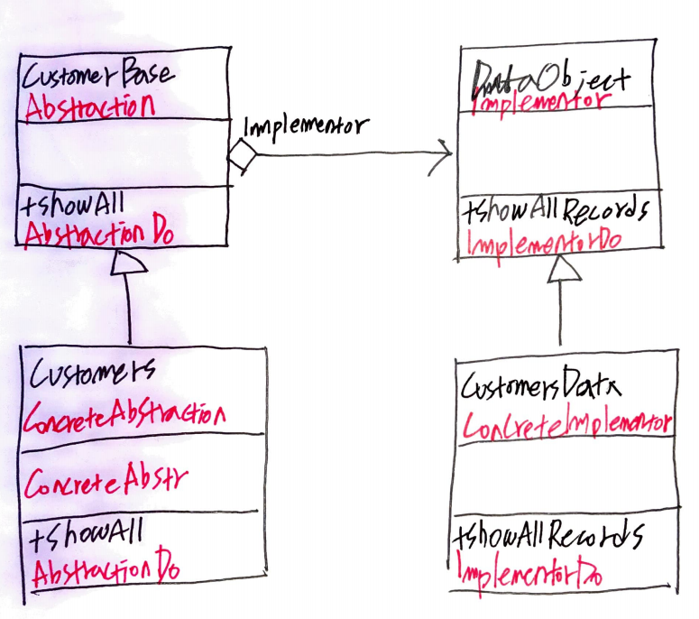

- [Abstract](#abstract)
- [Materials](#materials)
- [Components](#components)
- [Example](#example)

-----

# Abstract

구현과 추상을 분리한다.

# Materials

* [Bridge](https://www.dofactory.com/net/bridge-design-pattern)

# Components

* Abstract
* ConcreteAbstract
* Implementor
* ConcreteImplementor

# Example



```java
```
