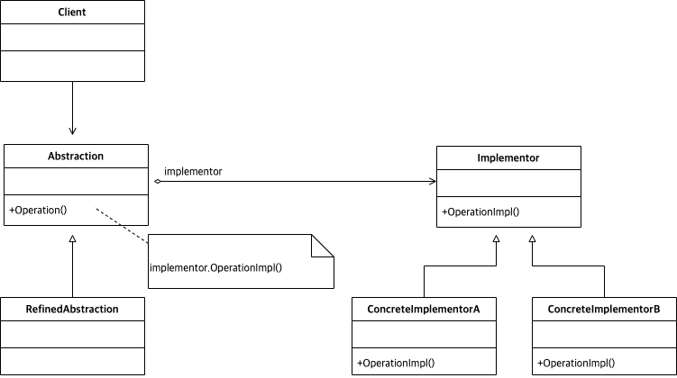

# Abstract

구현과 추상을 분리한다.

# Materials

* [Bridge @ dofactory](https://www.dofactory.com/net/bridge-design-pattern)

# UML Class Diagram

# Examples

* [Bridge in java](/java/java_design_pattern/bridge.md)
* [Bridge in kotlin](/kotlin/kotlin_design_pattern/bridge.md)
* [Bridge in go](/golang/go_design_pattern/bridge.md)
