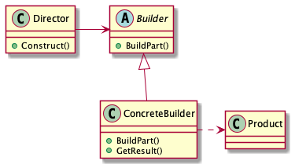

- [Abstract](#abstract)
- [Materials](#materials)
- [Concept Class Diagram](#concept-class-diagram)
- [Real World Examples](#real-world-examples)

---

# Abstract

* 생성 절차를 다양하게 하여 타겟 오브젝트 인스턴스를 생성한다.
* Assembler pattern 이라고도 한다.
* Director 는 생성절차를 다양하게 호출할 수 있다. 생성절차를 Builder 안으로 포함한다면 Factory Method 와 다를게 없다.

constructor 만으로 object 를 생성하는 것은 다음과 같은 이유 때문에 불편하다. 그러나 Builder pattern 을 사용하면 이러한 불편함을 해결할 수 있다. 

* constructor 의 argument 가 너무 많을 때 readibility 가 떨어진다.
* constructor 의 argument 중 일부만 사용할 때 불편하다. 예를 들면 사용을 원치않는 argument 는 null 을 전달해야 한다. 

# Materials

* [Builder @ dofactory](https://www.dofactory.com/net/builder-design-pattern)
* [[Design Pattern] Builder Pattern](https://beomseok95.tistory.com/240)
* [Builder @ refactoringguru](https://refactoring.guru/design-patterns/builder)

# Concept Class Diagram

# Real World Examples

* [Builder in kotlin](/kotlin/kotlin_design_pattern/builder.md)
* [Builder in java](/java/java_designpattern/builder.md)
* [Builder in go](/golang/go_design_pattern/builder.md)
