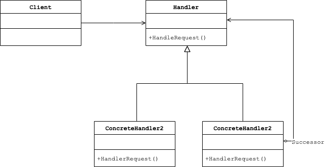

# Abstract

형제 클래스에게 임무를 전달한다.

# Materials

* [Chain of Resp. @ dofactory](https://www.dofactory.com/net/chain-of-responsibility-design-pattern)

# UML Class Diagram

# Examples

* [Chain of Resp. in kotlin](/kotlin/kotlin_design_pattern/chainofresp.md)
* [Chain of Resp. in go](/golang/go_design_pattern/chainofresp.md)
