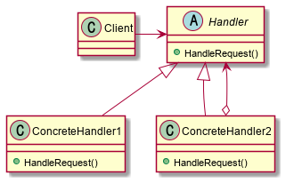

# Abstract

형제 클래스에게 임무를 전달한다.

# Materials

* [Chain of Resp.](https://www.dofactory.com/net/chain-of-responsibility-design-pattern)

# Concept Class Diagram

> [src](chainofresp.puml)

# Examples

* [Chain of Resp. by go](/golang/designpattern/chainofresp.md)

