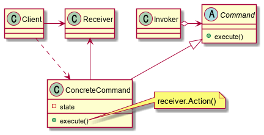

# Abstract

명령을 추상화 한다.

# Materials

* [Command](https://www.dofactory.com/net/command-design-pattern)

# Concept Class Diagram

> [src](command.puml)

# Examples

* [Command by go](/golang/designpattern/command.md)

