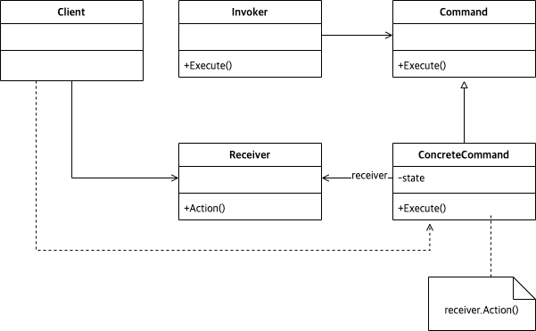

# Abstract

명령을 추상화 한다.

# Materials

* [Command @ dofactory](https://www.dofactory.com/net/command-design-pattern)

# Concept Class Diagram

# Examples

* [Command by kotlin](/kotlin/kotlin_design_pattern/command.md)
