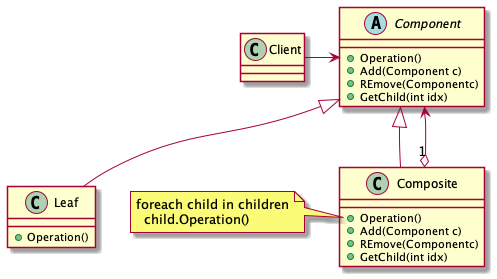

# Abstract

트리형태의 자료구조를 표현한다.

# Materials

* [Composite](https://www.dofactory.com/net/composite-design-pattern)

# Concept Class Diagram

> [src](composite.puml)

# Examples

* [Composite by go](/golang/designpattern/composite.md)
