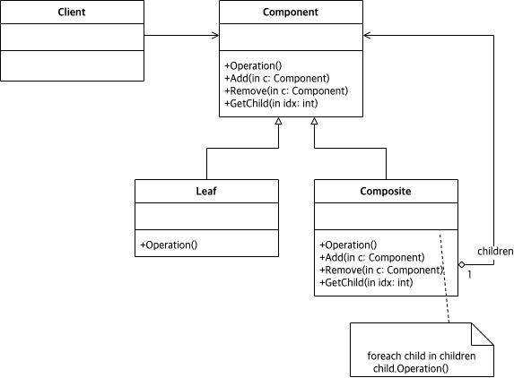

# Abstract

트리형태의 자료구조를 표현한다.

# Materials

* [Composite @ dofactory](https://www.dofactory.com/net/composite-design-pattern)

# Concept Class Diagram

# Examples

* [Composite in kotlin](/kotlin/kotlin_design_pattern/composite.md)
