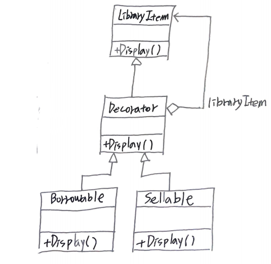
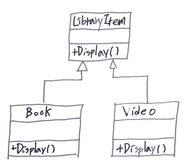

- [Abstract](#abstract)
- [Materials](#materials)
- [UML Class Diagram](#uml-class-diagram)
- [Idea](#idea)
- [Examples](#examples)

----

# Abstract

subclassing 하지 않고 새로운 기능을 추가한다. 새로운 기능을 추가하기 위해
subclassing 을 사용한다면 모든 ConcreteComponent 를 수정해야 한다. 그러나
decorator pattern 을 사용한다면 새로운 기능을 담고 있는 concreteDecorator 하나만
추가하면 된다.

# Materials

* [Decorator @ dofactory](https://www.dofactory.com/net/decorator-design-pattern)

# UML Class Diagram



# Idea

다음과 같이 LibraryItem Class 를 상속받은 Video, Book Class 가 있다. Video, Book Class 에 대여기능을 추가하고 싶다. 



Inheritance 를 이용하여 해결해 보자. VideoBorrowable, BookBorrowable 를 만들어야 한다. Concrete LibraryItem Class 가 늘어나면 매번 대여기능이 추가된 Class 들을 새로 정의해야 한다. 이것은 [SOLID @ TIL](/solid/README.md) 의 OCP (Open Closed Principal) 에 맞지 않는다.

Inheritance 보다는 Composition 을 활용해보자. Decorator 를 도입해서 해결할 수 있다.


Decorator 는 LibraryItem instance 를 가지고 있다(has-a relationship).Borrowable Class 는 Decorator 를 상속받는다. Borrowable Class 하나 만으로 Video, Book instance 에 대해 대여기능을 추가할 수 있다. 만약 판매기능을 추가한다고 해보자. 마찬가지로 Decorator 를 상속한 Sellable Class 를 구현하면 여러 LibraryItem instance 들에 대해 판매기능을 추가할 수 있다. 

이제 Concrete LibraryItem Class 가 늘어나도 대여 및 판매 기능을 추가하기 위해 VideoBorrowable, BookBorrowable, VideoSellable, BookSellable 과 같은 새로운 Class 들을 정의할 필요가 없다.

```java
  /// <summary>
  /// The 'Decorator' abstract class
  /// </summary>
  abstract class Decorator : LibraryItem
  {
    protected LibraryItem libraryItem;
    // Constructor
    public Decorator(LibraryItem libraryItem)
    {
      this.libraryItem = libraryItem;
    }

    public override void Display()
    {
      libraryItem.Display();
    }
  }
 
  /// <summary>
  /// The 'ConcreteDecorator' class
  /// </summary>
  class Borrowable : Decorator
  {
    protected List<string> borrowers = new List<string>();
 
    // Constructor
    public Borrowable(LibraryItem libraryItem)
      : base(libraryItem)
    {
    }
 
    public void BorrowItem(string name)
    {
      borrowers.Add(name);
      libraryItem.NumCopies--;
    }
 
    public void ReturnItem(string name)
    {
      borrowers.Remove(name);
      libraryItem.NumCopies++;
    }
 
    public override void Display()
    {
      base.Display();
 
      foreach (string borrower in borrowers)
      {
        Console.WriteLine(" borrower: " + borrower);
      }
    }
  }
```

# Examples

* [Decorator in kotlin](/kotlin/kotlin_design_pattern/decorator.md)
* [Decorator in go](/golang/go_design_pattern/decorator.md)
