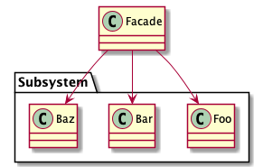

# Abstract

복잡한 기능을 단순한 인터페이스로 추상화한다.

# Materials

* [Facade @ dofactory](https://www.dofactory.com/net/facade-design-pattern)

# UML Class Diagram

# Examples

* [Facade in kotlin](/kotlin/kotlin_design_pattern/facade.md)
