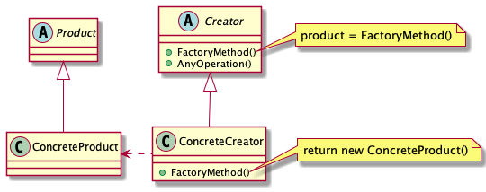

# Abstract

* 생성방법을 추상화한다. 동일한 분류의 오브젝트 생성방법을 추상화하여 타겟 인스턴스를 생성한다. 예를 들어 부품 인터페이스를 상속받는 키보드, 마우스 클래스의 생성방법을 추상화한다.

# Materials

* [Factory Method @ dofactory](https://www.dofactory.com/net/factory-method-design-pattern)
* [Factory Method @ ractoring.guru](https://refactoring.guru/design-patterns/factory-method)

# Concep Class Diagram

> [src](factorymethod.puml)

# Examples

* [Factory Method by go](/golang/designpattern/factorymethod.md)
