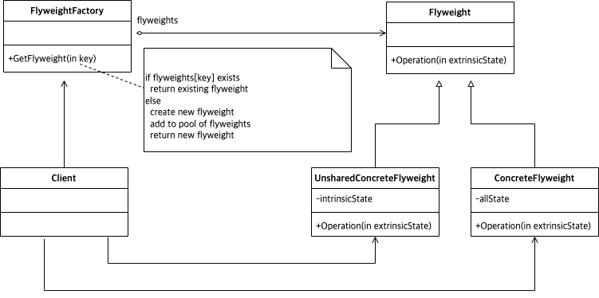

# Abstract

인스턴스 공유를 추상화한다.

# Materials

* [Flyweight @ dofactory](https://www.dofactory.com/net/flyweight-design-pattern)

# UML Class Diagram

# Examples

* [Facade in kotlin](/kotlin/kotlin_design_pattern/flyweight.md)
