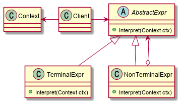

# Abstract

- A way to include language elements in a program
- 해석을 추상화 한다.

# Materials

* [Interpreter](https://www.dofactory.com/net/interpreter-design-pattern)

# Concept Class Diagram

> [src](interpreter.puml)

# Examples

* [Interpreter by go](/golang/designpattern/interpreter.md)
