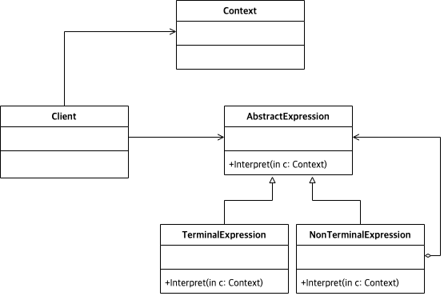

# Abstract

* 해석을 추상화 한다.
* A way to include language elements in a program

# Materials

* [Interpreter @ dofactory](https://www.dofactory.com/net/interpreter-design-pattern)

# UML Class Diagram

# Examples
