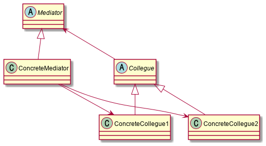

# Abstract

- Defines simplified communication between classes
- 인스턴스 멤버들의 중재를 추상화 한다.
  
# Materials

* [Mediator](https://www.dofactory.com/net/mediator-design-pattern)

# Concept Class Diagram

> [src](mediator.puml)

# Examples

* [Mediator by go](/golang/designpattern/mediator.md)
