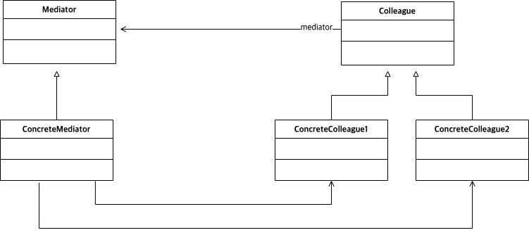

# Abstract

* 인스턴스 멤버들의 중재를 추상화 한다.
* Defines simplified communication between classes
  
# Materials

* [Mediator @ dofactory](https://www.dofactory.com/net/mediator-design-pattern)

# UML Class Diagram

# Examples

* [Mediator in kotlin](/kotlin/kotlin_design_pattern/mediator.md)
* [Mediator in go](/golang/go_design_pattern/mediator.md)
