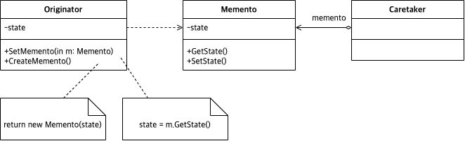

# Abstract

- Capture and restore an object's internal state
- 저장하기 불러오기를 추상화 한다.
  
# Materials

* [Memento @ dofactory](https://www.dofactory.com/net/memento-design-pattern)

# Concept Class Diagram

# Examples

* [Memento in kotlin](/kotlin/kotlin_design_pattern/memento.md)
* [Memento in go](/golang/go_design_pattern/memento.md)
